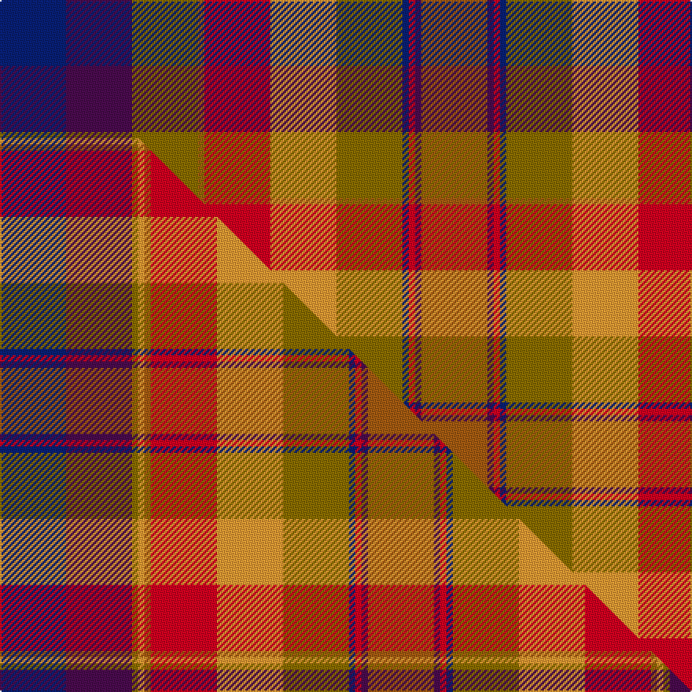

This is one **variant** — a specific cloth: this exact thread count and colourway, with its own
provenance below. It is one weaving of the [sett](/setts/db21dp21y21o2r21lo21y21db2r2dp2o21/) (the scale-free proportion — the
same cloth at any scale or shade), whose colour order is pattern [BBGRRYGBRBR](/stripes/bbgrrygbrbr/).

Part of the [Watret](/tartans/w/wa/watret/) tartan — the named design grouping this sett with its other cloths.

Sourced from tartans-authority.  It is a [11 stripe tartan](/stripes/stripes11/).

Original link [https://www.tartanregister.gov.uk/tartanDetails.aspx?ref=2665](https://www.tartanregister.gov.uk/tartanDetails.aspx?ref=2665)

Dataset <small>— provenance for this record, inherited from the source manifest</small>

<dl class="dataset-prov">
<dt>source</dt><dd><a href="/sources/tartans-authority/">Scottish Tartans Authority</a></dd>
<dt>data captured from</dt><dd><a href="https://github.com/thetartan/tartan-database/blob/master/data/tartans-authority/data.csv">https://github.com/thetartan/tartan-database/blob/master/data/tartans-authority/data.csv</a></dd>
<dt>data date</dt><dd>pre 1850 <small>(this record)</small></dd>
<dt>licence</dt><dd><a href="https://creativecommons.org/licenses/by-nc-nd/4.0/">CC BY-NC-ND 4.0</a></dd>
</dl>

Capture chain <small>— the hands this data passed through, oldest first; each capture carries its own licence</small>

<ol class="capture-chain">
<li><a href="https://www.tartansauthority.com/">Scottish Tartans Authority</a> <small>the heritage body's archive — its tartan-ferret record browser is retired (links repaired to the SRT, above)</small></li>
<li><a href="https://github.com/thetartan/tartan-database">thetartan/tartan-database</a> <small>2016-2017</small> · <a href="https://creativecommons.org/licenses/by-nc-nd/4.0/">CC BY-NC-ND 4.0</a> <small>Levko Kravets's frozen compilation — the capture we vendored, and where its CC licence text came from</small></li>
<li>this dictionary <small>captured 2026-06-10 · commit 5bf86c7566</small> <small>each re-capture is a git commit to data/sources</small></li>
</ol>

## Register references

External register numbers recorded for this tartan.

- Scottish Tartans Authority (ITI): 2665

## Thread count
DB/42 DP42 Y42 O4 R42 LO42 Y42 DB4 R4 DP4 O/42

One full sett is **536 threads**.

## Palette
<table><thead><tr><th>Colour</th><th>Shade</th><th>OKLCh</th></tr></thead><tbody><tr><td>DB</td><td><code style="background-color:#082077;">#082077</code> <small style="color:#888">#082077</small></td><td><small style="color:#888">oklch(30.0% 0.149 265.1)</small></td></tr><tr><td>O</td><td><code style="background-color:#A65C11;">#A65C11</code> <small style="color:#888">#A65C11</small></td><td><small style="color:#888">oklch(55.0% 0.125 58.3)</small></td></tr><tr><td>LO</td><td><code style="background-color:#FF9C34;">#FF9C34</code> <small style="color:#888">#FF9C34</small></td><td><small style="color:#888">oklch(77.9% 0.161 61.8)</small></td></tr><tr><td>DP</td><td><code style="background-color:#4B0B4F;">#4B0B4F</code> <small style="color:#888">#4B0B4F</small></td><td><small style="color:#888">oklch(30.1% 0.125 325.4)</small></td></tr><tr><td>R</td><td><code style="background-color:#D60020;">#D60020</code> <small style="color:#888">#D60020</small></td><td><small style="color:#888">oklch(55.2% 0.224 25.5)</small></td></tr><tr><td>Y</td><td><code style="background-color:#8B6E00;">#8B6E00</code> <small style="color:#888">#8B6E00</small></td><td><small style="color:#888">oklch(55.1% 0.113 90.4)</small></td></tr></tbody></table>

# Sample pattern

## Compared to the master

This cloth is one sett of its design; the master sett (the exemplar the design is anchored on) is below for comparison.

Its **ΔTartan distance** from the master is **1.19** — the same measure the nearest-tartans table ranks by (0 is identical; a re-scale of the same cloth is near 0, a recolour or a different proportion further).

<figure class="master-compare" style="margin:0">

this sett
master sett ★

<figcaption style="color:#888;font-size:smaller">One weave of this sett against the <a href="/setts/db21dp21y2lo2o2r21lo21y21db2r2dp2o21/">master sett ★</a>, split on the diagonal: a shared proportion runs seamlessly across it with only the shades shifting; a different proportion breaks on it.</figcaption>
</figure>

## Nearest tartan variants

The nearest existing variants by ΔTartan distance, with this cloth at the top so the swatches line up against it.

ΔTartan

Threads

Variant

Sett

—

536

<a href="/variants/s11/db21dp21y21o2r21lo21y21db2r2dp2o21~x2/">Watret (Artefact)</a>

<a href="/ttd/edit/#slug=db21dp21y2lo2o2r21lo21y21db2r2dp2o21~x2&amp;base=db21dp21y21o2r21lo21y21db2r2dp2o21~x2" title="compare in the TTD">1.19</a>

468

<a href="/variants/s12/db21dp21y2lo2o2r21lo21y21db2r2dp2o21~x2/">Watret</a>

<a href="/ttd/edit/#slug=o3lr14dy3lr3dy3lr4dy11dt11r11o11lr1dt1~x2&amp;base=db21dp21y21o2r21lo21y21db2r2dp2o21~x2" title="compare in the TTD">2.66</a>

296

<a href="/variants/s12/o3lr14dy3lr3dy3lr4dy11dt11r11o11lr1dt1~x2/">Bridge of Weir Leather Co. (Corp)</a>

<a href="/ttd/edit/#slug=w9o14do11o3oi11y7w1do3w1y7o7do3w2b2w2~x2~o2102055-oi2104058&amp;base=db21dp21y21o2r21lo21y21db2r2dp2o21~x2" title="compare in the TTD">2.90</a>

310

<a href="/variants/s15/w9o14do11o3oi11y7w1do3w1y7o7do3w2b2w2~x2~o2102055-oi2104058/">Hudson Bay Company Artifact</a>

<a href="/ttd/edit/#slug=dp4n10r18ly3r3ly5ri8n9w4~x2~r1807008-ri2806019&amp;base=db21dp21y21o2r21lo21y21db2r2dp2o21~x2" title="compare in the TTD">3.04</a>

240

<a href="/variants/s9/dp4n10r18ly3r3ly5ri8n9w4~x2~r1807008-ri2806019/">Khosla, Sarah and Jatin (Personal)</a>

<a href="/ttd/edit/#slug=dp4n10r18ly3r3ly5ri8n9w4~x2~r1807008-ri2109013&amp;base=db21dp21y21o2r21lo21y21db2r2dp2o21~x2" title="compare in the TTD">3.10</a>

240

<a href="/variants/s9/dp4n10r18ly3r3ly5ri8n9w4~x2~r1807008-ri2109013/">Khosla, Sarah and Justin (Personal)</a>

<a href="/ttd/edit/#slug=lo3do2n18lb3o13lb4k3lb4do18lb3~x2&amp;base=db21dp21y21o2r21lo21y21db2r2dp2o21~x2" title="compare in the TTD">3.13</a>

272

<a href="/variants/s10/lo3do2n18lb3o13lb4k3lb4do18lb3~x2/">Leitrim, County</a>

<a href="/ttd/edit/#slug=y4r24dy19w3g23o13dy3n13dy3~x2~o2500000-n1900000&amp;base=db21dp21y21o2r21lo21y21db2r2dp2o21~x2" title="compare in the TTD">3.20</a>

406

<a href="/variants/s9/y4r24dy19w3g23o13dy3n13dy3~x2~o2500000-n1900000/">Teallach Family Tartan</a>

<a href="/ttd/edit/#slug=y3r10g4y8do2y8dp11do16y4g4r10y3~x2&amp;base=db21dp21y21o2r21lo21y21db2r2dp2o21~x2" title="compare in the TTD">3.21</a>

320

<a href="/variants/s12/y3r10g4y8do2y8dp11do16y4g4r10y3~x2/">Hallowfield Wood</a>

<a href="/ttd/edit/#slug=ly5db2r14do9dg8db3r3db3r3db3dg18lyi3~x2~ly2705081-lyi3103095&amp;base=db21dp21y21o2r21lo21y21db2r2dp2o21~x2" title="compare in the TTD">3.23</a>

280

<a href="/variants/s12/ly5db2r14do9dg8db3r3db3r3db3dg18lyi3~x2~ly2705081-lyi3103095/">Meath, County</a>

<a href="/ttd/edit/#slug=y12lo12o12g2r2y2dp12db12g12dp2r2db1~x2&amp;base=db21dp21y21o2r21lo21y21db2r2dp2o21~x2" title="compare in the TTD">3.26</a>

306

<a href="/variants/s12/y12lo12o12g2r2y2dp12db12g12dp2r2db1~x2/">Rainbow Kilt (Fashion)</a>

## Neighbour map

Every grey dot is one of 13621 variants placed by the first two principal components of the ΔTartan feature space (42% of its variance). Red is this tartan; blue dots are its nearest — click one to open its page.

<svg viewBox="0 0 640 380" role="img" style="max-width:100%;height:auto;border:1px solid #e0e0e0;border-radius:4px;display:block" xmlns="http://www.w3.org/2000/svg"><image href="/nn/cloud.v1.png" width="640" height="380"/><a href="/variants/s12/db21dp21y2lo2o2r21lo21y21db2r2dp2o21~x2/"><circle cx="73.7" cy="165.5" r="4" fill="#3465a4"><title>Watret</title></circle></a><a href="/variants/s12/o3lr14dy3lr3dy3lr4dy11dt11r11o11lr1dt1~x2/"><circle cx="133.6" cy="171.5" r="4" fill="#3465a4"><title>Bridge of Weir Leather Co. (Corp)</title></circle></a><a href="/variants/s15/w9o14do11o3oi11y7w1do3w1y7o7do3w2b2w2~x2~o2102055-oi2104058/"><circle cx="111.8" cy="156.1" r="4" fill="#3465a4"><title>Hudson Bay Company Artifact</title></circle></a><a href="/variants/s9/dp4n10r18ly3r3ly5ri8n9w4~x2~r1807008-ri2806019/"><circle cx="134.8" cy="217.1" r="4" fill="#3465a4"><title>Khosla, Sarah and Jatin (Personal)</title></circle></a><a href="/variants/s9/dp4n10r18ly3r3ly5ri8n9w4~x2~r1807008-ri2109013/"><circle cx="140.9" cy="218.1" r="4" fill="#3465a4"><title>Khosla, Sarah and Justin (Personal)</title></circle></a><a href="/variants/s10/lo3do2n18lb3o13lb4k3lb4do18lb3~x2/"><circle cx="109.8" cy="167.9" r="4" fill="#3465a4"><title>Leitrim, County</title></circle></a><a href="/variants/s9/y4r24dy19w3g23o13dy3n13dy3~x2~o2500000-n1900000/"><circle cx="94.1" cy="195.2" r="4" fill="#3465a4"><title>Teallach Family Tartan</title></circle></a><a href="/variants/s12/y3r10g4y8do2y8dp11do16y4g4r10y3~x2/"><circle cx="167.1" cy="224.0" r="4" fill="#3465a4"><title>Hallowfield Wood</title></circle></a><a href="/variants/s12/ly5db2r14do9dg8db3r3db3r3db3dg18lyi3~x2~ly2705081-lyi3103095/"><circle cx="150.3" cy="175.0" r="4" fill="#3465a4"><title>Meath, County</title></circle></a><a href="/variants/s12/y12lo12o12g2r2y2dp12db12g12dp2r2db1~x2/"><circle cx="46.7" cy="160.4" r="4" fill="#3465a4"><title>Rainbow Kilt (Fashion)</title></circle></a><circle cx="105.3" cy="186.8" r="5" fill="#c00000"/><text x="320" y="376" text-anchor="middle" font-size="11" fill="#999">ground</text><text x="11" y="190" text-anchor="middle" font-size="11" fill="#999" transform="rotate(-90 11 190)">complexity</text></svg>

ID: /variants/s11/db21dp21y21o2r21lo21y21db2r2dp2o21~x2/
