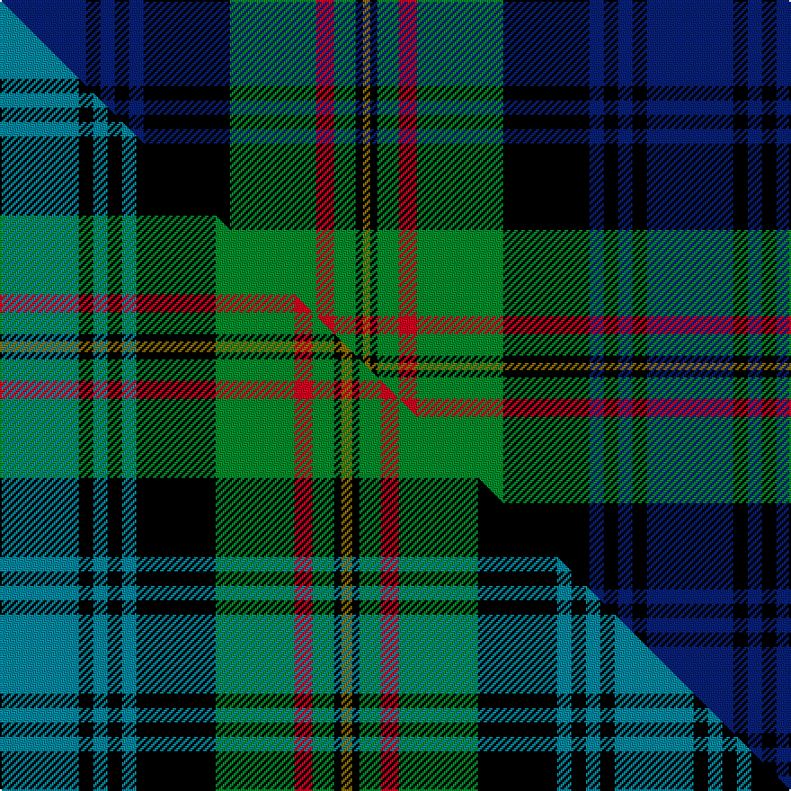

This is one **variant** — a specific cloth: this exact thread count and colourway, with its own
provenance below. It is one weaving of the [sett](/tartans/g/gr/grant-7/) (the scale-free proportion — the
same cloth at any scale or shade), whose colour order is pattern [BKBKBKGRGKG](/stripes/bkbkbkgrgkg/).

Part of the [Grant](/tartans/g/gr/grant-7/) tartan — the named design grouping this sett with its other cloths.

Sourced from weddslist.  It is a [11 stripe tartan](/stripes/stripes11/).

Original link [http://www.weddslist.com/cgi-bin/tartans/pg.pl?source=sts](http://www.weddslist.com/cgi-bin/tartans/pg.pl?source=sts)

Dataset <small>— provenance for this record, inherited from the source manifest</small>

<dl class="dataset-prov">
<dt>source</dt><dd><a href="/sources/weddslist/">Weddslist</a></dd>
<dt>data captured from</dt><dd><a href="https://github.com/thetartan/tartan-database/blob/master/data/weddslist/data.csv">https://github.com/thetartan/tartan-database/blob/master/data/weddslist/data.csv</a></dd>
<dt>data date</dt><dd>2016-11-17 <small>(dataset default)</small></dd>
<dt>licence</dt><dd><a href="https://creativecommons.org/licenses/by-nc-nd/4.0/">CC BY-NC-ND 4.0</a></dd>
</dl>

Capture chain <small>— the hands this data passed through, oldest first; each capture carries its own licence</small>

<ol class="capture-chain">
<li><a href="https://www.weddslist.com/tartans/">Weddslist</a> <small>the living privately compiled reference</small></li>
<li><a href="https://github.com/thetartan/tartan-database">thetartan/tartan-database</a> <small>2016-2017</small> · <a href="https://creativecommons.org/licenses/by-nc-nd/4.0/">CC BY-NC-ND 4.0</a> <small>Levko Kravets's frozen compilation — the capture we vendored, and where its CC licence text came from</small></li>
<li>this dictionary <small>captured 2026-06-10 · commit 5bf86c7566</small> <small>each re-capture is a git commit to data/sources</small></li>
</ol>

## Thread count
DB/48 K8 DB8 K8 DB8 K48 G48 R10 G12 K4 Y/4

One full sett is **360 threads**.

## Palette
<table><thead><tr><th>Colour</th><th>Shade</th><th>OKLCh</th></tr></thead><tbody><tr><td>DB</td><td><code style="background-color:#082077;">#082077</code> <small style="color:#888">#082077</small></td><td><small style="color:#888">oklch(30.0% 0.149 265.1)</small></td></tr><tr><td>G</td><td><code style="background-color:#008B2A;">#008B2A</code> <small style="color:#888">#008B2A</small></td><td><small style="color:#888">oklch(55.4% 0.170 145.9)</small></td></tr><tr><td>K</td><td><code style="background-color:#000000;">#000000</code> <small style="color:#888">#000000</small></td><td><small style="color:#888">oklch(0.0% 0.000 0.0)</small></td></tr><tr><td>R</td><td><code style="background-color:#D60020;">#D60020</code> <small style="color:#888">#D60020</small></td><td><small style="color:#888">oklch(55.2% 0.224 25.5)</small></td></tr><tr><td>Y</td><td><code style="background-color:#8B6E00;">#8B6E00</code> <small style="color:#888">#8B6E00</small></td><td><small style="color:#888">oklch(55.1% 0.113 90.4)</small></td></tr></tbody></table>

# Sample pattern

## Compared to the master

This cloth is one sett of its design; the master sett (the exemplar the design is anchored on) is below for comparison.

Its **ΔTartan distance** from the master is **0.23** — the same measure the nearest-tartans table ranks by (0 is identical; a re-scale of the same cloth is near 0, a recolour or a different proportion further).

<figure class="master-compare" style="margin:0">

this sett
master sett ★

<figcaption style="color:#888;font-size:smaller">One weave of this sett against the <a href="/setts/t22k4t4k4t4k22g22r5g6k2y3/">master sett ★</a>, split on the diagonal: a shared proportion runs seamlessly across it with only the shades shifting; a different proportion breaks on it.</figcaption>
</figure>

## Nearest tartan variants

The nearest existing variants by ΔTartan distance, with this cloth at the top so the swatches line up against it.

ΔTartan

Threads

Variant

Sett

—

360

<a href="/variants/s11/db24k4db4k4db4k24g24r5g6k2y2~x2/">Grant</a>

<a href="/ttd/edit/#slug=db22k4db4k4db4k22g22r6g6k2y3~x2&amp;base=db24k4db4k4db4k24g24r5g6k2y2~x2" title="compare in the TTD">0.11</a>

346

<a href="/variants/s11/db22k4db4k4db4k22g22r6g6k2y3~x2/">MacLaren (labelled)</a>

<a href="/ttd/edit/#slug=db11k2db2k2db2k11g11r2g3k1y3~x2&amp;base=db24k4db4k4db4k24g24r5g6k2y2~x2" title="compare in the TTD">0.15</a>

172

<a href="/variants/s11/db11k2db2k2db2k11g11r2g3k1y3~x2/">Grant Hunting Clan Tartan</a>

<a href="/ttd/edit/#slug=t22k4t4k4t4k22g22r5g6k2y3~x2&amp;base=db24k4db4k4db4k24g24r5g6k2y2~x2" title="compare in the TTD">0.23</a>

342

<a href="/variants/s11/t22k4t4k4t4k22g22r5g6k2y3~x2/">Grant (Wilson's 1819 Key Pattern Book)</a>

<a href="/ttd/edit/#slug=r6db2g5db18g10db2k28db2g10lo3~x2&amp;base=db24k4db4k4db4k24g24r5g6k2y2~x2" title="compare in the TTD">1.15</a>

326

<a href="/variants/s10/r6db2g5db18g10db2k28db2g10lo3~x2/">Ofally, County</a>

<a href="/ttd/edit/#slug=g16k5g4k8g44k40g4db52r10db4r4db10w6&amp;base=db24k4db4k4db4k24g24r5g6k2y2~x2" title="compare in the TTD">1.29</a>

392

<a href="/variants/s13/g16k5g4k8g44k40g4db52r10db4r4db10w6/">MacNeil of Colonsay</a>

<a href="/ttd/edit/#slug=r7db2g5db18g10db2k24db2g10y3~x2&amp;base=db24k4db4k4db4k24g24r5g6k2y2~x2" title="compare in the TTD">1.36</a>

312

<a href="/variants/s10/r7db2g5db18g10db2k24db2g10y3~x2/">Offally</a>

<a href="/ttd/edit/#slug=db16r5db30r2k33g30r5g2r2g7w2~x2&amp;base=db24k4db4k4db4k24g24r5g6k2y2~x2" title="compare in the TTD">1.44</a>

500

<a href="/variants/s11/db16r5db30r2k33g30r5g2r2g7w2~x2/">MacDonell of Glengarry</a>

<a href="/ttd/edit/#slug=db8dr1db2dr3db12dr1k12g12dr3g2dr1g4lb1~x2&amp;base=db24k4db4k4db4k24g24r5g6k2y2~x2" title="compare in the TTD">1.47</a>

230

<a href="/variants/s13/db8dr1db2dr3db12dr1k12g12dr3g2dr1g4lb1~x2/">MacDonell of Glengarry - 1914 (Clan)</a>

<a href="/ttd/edit/#slug=r7db2g5k24db2g10db28g10w3~x2&amp;base=db24k4db4k4db4k24g24r5g6k2y2~x2" title="compare in the TTD">1.49</a>

344

<a href="/variants/s9/r7db2g5k24db2g10db28g10w3~x2/">Colgan (Personal)</a>

<a href="/ttd/edit/#slug=lb3g3k4g14k4g3k14db18r1db4r2~x2&amp;base=db24k4db4k4db4k24g24r5g6k2y2~x2" title="compare in the TTD">1.50</a>

270

<a href="/variants/s11/lb3g3k4g14k4g3k14db18r1db4r2~x2/">Clerke of Ulva</a>

## Neighbour map

Every grey dot is one of 13656 variants placed by the first two principal components of the ΔTartan feature space (42% of its variance). Red is this tartan; blue dots are its nearest — click one to open its page. The map is a flat projection of a many-dimensional space — [how to read it](/posts/neighbourhood-maps/).

<svg viewBox="0 0 640 380" role="img" style="max-width:100%;height:auto;border:1px solid #e0e0e0;border-radius:4px;display:block" xmlns="http://www.w3.org/2000/svg"><image href="/nn/cloud.v1.png" width="640" height="380"/><a href="/variants/s11/db22k4db4k4db4k22g22r6g6k2y3~x2/"><circle cx="117.5" cy="152.2" r="4" fill="#3465a4"><title>MacLaren (labelled)</title></circle></a><a href="/variants/s11/db11k2db2k2db2k11g11r2g3k1y3~x2/"><circle cx="114.4" cy="154.3" r="4" fill="#3465a4"><title>Grant Hunting Clan Tartan</title></circle></a><a href="/variants/s11/t22k4t4k4t4k22g22r5g6k2y3~x2/"><circle cx="112.8" cy="152.2" r="4" fill="#3465a4"><title>Grant (Wilson's 1819 Key Pattern Book)</title></circle></a><a href="/variants/s10/r6db2g5db18g10db2k28db2g10lo3~x2/"><circle cx="127.3" cy="144.1" r="4" fill="#3465a4"><title>Ofally, County</title></circle></a><a href="/variants/s13/g16k5g4k8g44k40g4db52r10db4r4db10w6/"><circle cx="122.6" cy="127.1" r="4" fill="#3465a4"><title>MacNeil of Colonsay</title></circle></a><a href="/variants/s10/r7db2g5db18g10db2k24db2g10y3~x2/"><circle cx="111.9" cy="158.6" r="4" fill="#3465a4"><title>Offally</title></circle></a><a href="/variants/s11/db16r5db30r2k33g30r5g2r2g7w2~x2/"><circle cx="135.9" cy="126.3" r="4" fill="#3465a4"><title>MacDonell of Glengarry</title></circle></a><a href="/variants/s13/db8dr1db2dr3db12dr1k12g12dr3g2dr1g4lb1~x2/"><circle cx="137.9" cy="146.3" r="4" fill="#3465a4"><title>MacDonell of Glengarry - 1914 (Clan)</title></circle></a><a href="/variants/s9/r7db2g5k24db2g10db28g10w3~x2/"><circle cx="132.0" cy="149.5" r="4" fill="#3465a4"><title>Colgan (Personal)</title></circle></a><a href="/variants/s11/lb3g3k4g14k4g3k14db18r1db4r2~x2/"><circle cx="125.5" cy="133.9" r="4" fill="#3465a4"><title>Clerke of Ulva</title></circle></a><circle cx="131.0" cy="143.8" r="5" fill="#c00000"/><text x="320" y="376" text-anchor="middle" font-size="11" fill="#999">ground</text><text x="11" y="190" text-anchor="middle" font-size="11" fill="#999" transform="rotate(-90 11 190)">complexity</text></svg>

ID: /variants/s11/db24k4db4k4db4k24g24r5g6k2y2~x2/
