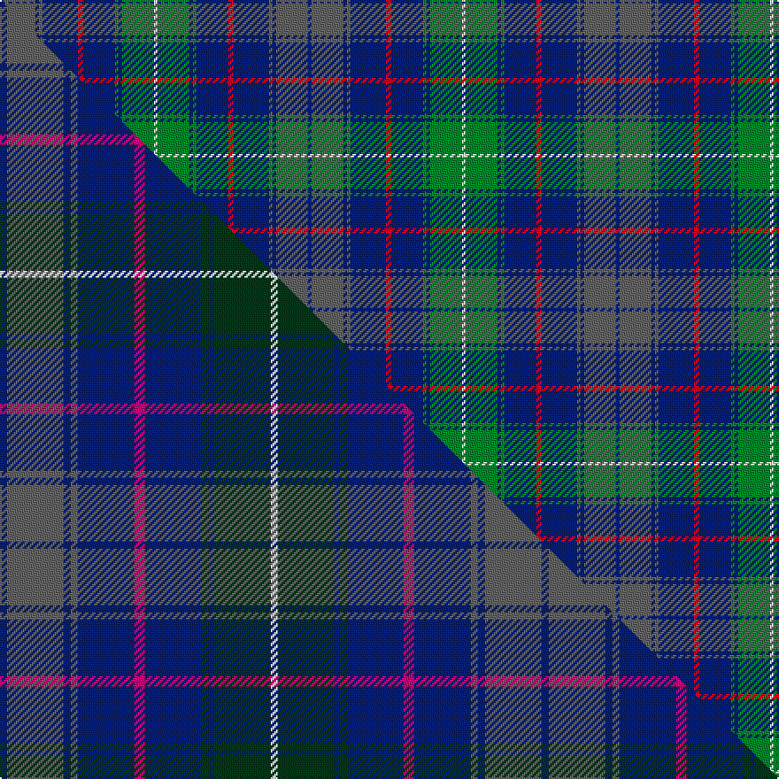

This is one **variant** — a specific cloth: this exact thread count and colourway, with its own
provenance below. It is one weaving of the [sett](/setts/db2n18db2n2db20r3db18g2db2g18w2/) (the scale-free proportion — the
same cloth at any scale or shade), whose colour order is pattern [BBBBBRBGBGW](/stripes/bbbbbrbgbgw/).

Part of the [American Society of Travel Agents, The](/tartans/american-society-of-travel-agents-the/) tartan — the named design grouping this sett with its other cloths.

Sourced from weddslist.  It is a [11 stripe tartan](/stripes/stripes11/).

Original link [http://www.weddslist.com/cgi-bin/tartans/pg.pl?source=sts](http://www.weddslist.com/cgi-bin/tartans/pg.pl?source=sts)

Dataset <small>— provenance for this record, inherited from the source manifest</small>

<dl class="dataset-prov">
<dt>source</dt><dd><a href="/sources/weddslist/">Weddslist</a></dd>
<dt>data captured from</dt><dd><a href="https://github.com/thetartan/tartan-database/blob/master/data/weddslist/data.csv">https://github.com/thetartan/tartan-database/blob/master/data/weddslist/data.csv</a></dd>
<dt>data date</dt><dd>2016-11-17 <small>(dataset default)</small></dd>
<dt>licence</dt><dd><a href="https://creativecommons.org/licenses/by-nc-nd/4.0/">CC BY-NC-ND 4.0</a></dd>
</dl>

Capture chain <small>— the hands this data passed through, oldest first; each capture carries its own licence</small>

<ol class="capture-chain">
<li><a href="https://www.weddslist.com/tartans/">Weddslist</a> <small>the living privately compiled reference</small></li>
<li><a href="https://github.com/thetartan/tartan-database">thetartan/tartan-database</a> <small>2016-2017</small> · <a href="https://creativecommons.org/licenses/by-nc-nd/4.0/">CC BY-NC-ND 4.0</a> <small>Levko Kravets's frozen compilation — the capture we vendored, and where its CC licence text came from</small></li>
<li>this dictionary <small>captured 2026-06-10 · commit 5bf86c7566</small> <small>each re-capture is a git commit to data/sources</small></li>
</ol>

## Thread count
DB/2 N18 DB2 N2 DB20 R3 DB18 G2 DB2 G18 W/2

One full sett is **174 threads**.

## Palette
<table><thead><tr><th>Colour</th><th>Shade</th><th>OKLCh</th></tr></thead><tbody><tr><td>DB</td><td><code style="background-color:#082077;">#082077</code> <small style="color:#888">#082077</small></td><td><small style="color:#888">oklch(30.0% 0.149 265.1)</small></td></tr><tr><td>G</td><td><code style="background-color:#008B2A;">#008B2A</code> <small style="color:#888">#008B2A</small></td><td><small style="color:#888">oklch(55.4% 0.170 145.9)</small></td></tr><tr><td>W</td><td><code style="background-color:#F7F7F7;">#F7F7F7</code> <small style="color:#888">#F7F7F7</small></td><td><small style="color:#888">oklch(97.6% 0.000 89.9)</small></td></tr><tr><td>N</td><td><code style="background-color:#636363;">#636363</code> <small style="color:#888">#636363</small></td><td><small style="color:#888">oklch(50.0% 0.000 89.9)</small></td></tr><tr><td>R</td><td><code style="background-color:#D60020;">#D60020</code> <small style="color:#888">#D60020</small></td><td><small style="color:#888">oklch(55.2% 0.224 25.5)</small></td></tr></tbody></table>

# Sample pattern

## Compared to the master

This cloth is one sett of its design; the master sett (the exemplar the design is anchored on) is below for comparison.

Its **ΔTartan distance** from the master is **0.32** — the same measure the nearest-tartans table ranks by (0 is identical; a re-scale of the same cloth is near 0, a recolour or a different proportion further).

<figure class="master-compare" style="margin:0">

this sett
master sett ★

<figcaption style="color:#888;font-size:smaller">One weave of this sett against the <a href="/setts/db4n32db4n4db32m6db32dg4db3dg32w4/">master sett ★</a>, split on the diagonal: a shared proportion runs seamlessly across it with only the shades shifting; a different proportion breaks on it.</figcaption>
</figure>

## Nearest tartan variants

The nearest existing variants by ΔTartan distance, with this cloth at the top so the swatches line up against it.

ΔTartan

Threads

Variant

Sett

—

174

<a href="/variants/s11/db2n18db2n2db20r3db18g2db2g18w2/">American Society of Travel Agents, The</a>

<a href="/ttd/edit/#slug=db4n32db4n4db32m6db32dg4db3dg32w4&amp;base=db2n18db2n2db20r3db18g2db2g18w2" title="compare in the TTD">0.32</a>

306

<a href="/variants/s11/db4n32db4n4db32m6db32dg4db3dg32w4/">American Society of Travel Agents, The (2001)</a>

<a href="/ttd/edit/#slug=y3g17db3g3db3do5db18r2db8r2~x2&amp;base=db2n18db2n2db20r3db18g2db2g18w2" title="compare in the TTD">1.33</a>

246

<a href="/variants/s10/y3g17db3g3db3do5db18r2db8r2~x2/">Donegal</a>

<a href="/ttd/edit/#slug=r2db12dg2b11dg4db5b2dg24w2~x2&amp;base=db2n18db2n2db20r3db18g2db2g18w2" title="compare in the TTD">1.51</a>

248

<a href="/variants/s9/r2db12dg2b11dg4db5b2dg24w2~x2/">Fraser Gathering, hunting</a>

<a href="/ttd/edit/#slug=g10db10r1db10n1db1n10db2n10db1n1db10r1db10g10w2~x2&amp;base=db2n18db2n2db20r3db18g2db2g18w2" title="compare in the TTD">2.13</a>

336

<a href="/variants/s16/g10db10r1db10n1db1n10db2n10db1n1db10r1db10g10w2~x2/">American Soc of Travel Agents Corporate Tartan</a>

<a href="/ttd/edit/#slug=dg24t7dg7t7dg7db22t7db4dy4db4t40r14&amp;base=db2n18db2n2db20r3db18g2db2g18w2" title="compare in the TTD">2.25</a>

256

<a href="/variants/s12/dg24t7dg7t7dg7db22t7db4dy4db4t40r14/">Powys (District)</a>

<a href="/ttd/edit/#slug=db2n10db1n1db10r1db10g10w2~x2&amp;base=db2n18db2n2db20r3db18g2db2g18w2" title="compare in the TTD">2.29</a>

180

<a href="/variants/s9/db2n10db1n1db10r1db10g10w2~x2/">American Soc.of Travel Agents (Corp)</a>

<a href="/ttd/edit/#slug=dg27o2db25ly5dg3o3dg3ly5db25o2dg27dr4~x2&amp;base=db2n18db2n2db20r3db18g2db2g18w2" title="compare in the TTD">2.30</a>

462

<a href="/variants/s12/dg27o2db25ly5dg3o3dg3ly5db25o2dg27dr4~x2/">Kilkenny, County</a>

<a href="/ttd/edit/#slug=dt3db4dt24db6r3db4g3db8w3~x2&amp;base=db2n18db2n2db20r3db18g2db2g18w2" title="compare in the TTD">2.30</a>

220

<a href="/variants/s9/dt3db4dt24db6r3db4g3db8w3~x2/">Scozia (Fashion)</a>

<a href="/ttd/edit/#slug=dp4db18r2db2r2db9g20db3g4~x2~dp1607327-r1606028&amp;base=db2n18db2n2db20r3db18g2db2g18w2" title="compare in the TTD">2.43</a>

240

<a href="/variants/s9/dp4db18r2db2r2db9g20db3g4~x2~dp1607327-r1606028/">St. Andrews New Golf Club</a>

<a href="/ttd/edit/#slug=db40r4db10dg10g22ly3g4lyi3g4~x2~dg1806142-g1903114-ly2705081-lyi3407090&amp;base=db2n18db2n2db20r3db18g2db2g18w2" title="compare in the TTD">2.47</a>

312

<a href="/variants/s9/db40r4db10dg10g22ly3g4lyi3g4~x2~dg1806142-g1903114-ly2705081-lyi3407090/">Keith Stanhope Society (Commem.)</a>

## Neighbour map

Every grey dot is one of 13621 variants placed by the first two principal components of the ΔTartan feature space (42% of its variance). Red is this tartan; blue dots are its nearest — click one to open its page.

<svg viewBox="0 0 640 380" role="img" style="max-width:100%;height:auto;border:1px solid #e0e0e0;border-radius:4px;display:block" xmlns="http://www.w3.org/2000/svg"><image href="/nn/cloud.v1.png" width="640" height="380"/><a href="/variants/s11/db4n32db4n4db32m6db32dg4db3dg32w4/"><circle cx="289.0" cy="189.0" r="4" fill="#3465a4"><title>American Society of Travel Agents, The (2001)</title></circle></a><a href="/variants/s10/y3g17db3g3db3do5db18r2db8r2~x2/"><circle cx="256.0" cy="187.3" r="4" fill="#3465a4"><title>Donegal</title></circle></a><a href="/variants/s9/r2db12dg2b11dg4db5b2dg24w2~x2/"><circle cx="272.8" cy="182.8" r="4" fill="#3465a4"><title>Fraser Gathering, hunting</title></circle></a><a href="/variants/s16/g10db10r1db10n1db1n10db2n10db1n1db10r1db10g10w2~x2/"><circle cx="246.3" cy="182.5" r="4" fill="#3465a4"><title>American Soc of Travel Agents Corporate Tartan</title></circle></a><a href="/variants/s12/dg24t7dg7t7dg7db22t7db4dy4db4t40r14/"><circle cx="224.7" cy="189.9" r="4" fill="#3465a4"><title>Powys (District)</title></circle></a><a href="/variants/s9/db2n10db1n1db10r1db10g10w2~x2/"><circle cx="248.3" cy="197.0" r="4" fill="#3465a4"><title>American Soc.of Travel Agents (Corp)</title></circle></a><a href="/variants/s12/dg27o2db25ly5dg3o3dg3ly5db25o2dg27dr4~x2/"><circle cx="279.2" cy="167.4" r="4" fill="#3465a4"><title>Kilkenny, County</title></circle></a><a href="/variants/s9/dt3db4dt24db6r3db4g3db8w3~x2/"><circle cx="270.7" cy="196.4" r="4" fill="#3465a4"><title>Scozia (Fashion)</title></circle></a><a href="/variants/s9/dp4db18r2db2r2db9g20db3g4~x2~dp1607327-r1606028/"><circle cx="296.9" cy="200.8" r="4" fill="#3465a4"><title>St. Andrews New Golf Club</title></circle></a><a href="/variants/s9/db40r4db10dg10g22ly3g4lyi3g4~x2~dg1806142-g1903114-ly2705081-lyi3407090/"><circle cx="277.1" cy="157.6" r="4" fill="#3465a4"><title>Keith Stanhope Society (Commem.)</title></circle></a><circle cx="265.5" cy="179.3" r="5" fill="#c00000"/><text x="320" y="376" text-anchor="middle" font-size="11" fill="#999">ground</text><text x="11" y="190" text-anchor="middle" font-size="11" fill="#999" transform="rotate(-90 11 190)">complexity</text></svg>

ID: /variants/s11/db2n18db2n2db20r3db18g2db2g18w2/
