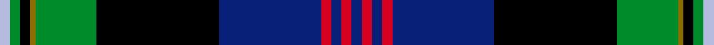

This page is one **sett** — a single exact thread-count. It belongs to the [tartan](/setts/db2r2db2r2db20k24g12y1k2g2lb2/)
(the same proportion at any scale), whose colour order is pattern [BRBRBKGGKGW](/stripes/brbrbkggkgw/).

Sourced from register-of-tartans.  It is a [11 stripe tartan](/stripes/stripes11/).

Original link https://www.tartanregister.gov.uk/tartanDetails.aspx?ref=4208

2 attestations — the source records this cloth was collapsed from (oldest owns this page)

<ul>
<li>undated — Unidentified #7 (register-of-tartans, <a href="https://www.tartanregister.gov.uk/tartanDetails.aspx?ref=4208">record</a>)  <em>Count assumed. Colours only available.</em></li>
<li>undated — Unidentified 26 (weddslist, <a href="http://www.weddslist.com/cgi-bin/tartans/pg.pl?source=sts">record</a>) </li>
</ul>

Dataset <small>— provenance for this record, inherited from the source manifest</small>

<dl class="dataset-prov">
<dt>source</dt><dd><a href="/sources/register-of-tartans/">Scottish Register of Tartans</a></dd>
<dt>data captured from</dt><dd><a href="https://github.com/thetartan/tartan-database/blob/master/data/register-of-tartans/data.csv">https://github.com/thetartan/tartan-database/blob/master/data/register-of-tartans/data.csv</a></dd>
<dt>data date</dt><dd>2017-01-06 <small>(dataset default)</small></dd>
<dt>licence</dt><dd><a href="https://www.tartanregister.gov.uk/copyright">Crown copyright</a></dd>
</dl>

Capture chain <small>— the hands this data passed through, oldest first; each capture carries its own licence</small>

<ol class="capture-chain">
<li><a href="https://www.tartanregister.gov.uk/">Scottish Register of Tartans</a> · <a href="https://www.tartanregister.gov.uk/copyright">Crown copyright</a> <small>the living register — still published by National Records of Scotland</small></li>
<li><a href="https://github.com/thetartan/tartan-database">thetartan/tartan-database</a> <small>2016-2017</small> · <a href="https://creativecommons.org/licenses/by-nc-nd/4.0/">CC BY-NC-ND 4.0</a> <small>Levko Kravets's frozen compilation — the capture we vendored, and where its CC licence text came from</small></li>
<li>this dictionary <small>captured 2026-06-10 · commit 5bf86c7566</small> <small>each re-capture is a git commit to data/sources</small></li>
</ol>

## Register references

External register numbers recorded for this tartan.

- Scottish Register of Tartans: [4208](https://www.tartanregister.gov.uk/tartanDetails.aspx?ref=4208)
- Scottish Tartans World Register: 157

## Thread count
LB/4 G4 K4 Y2 G24 K48 DB40 R4 DB4 R4 DB/4

One full sett is **276 threads**.

## Palette
<table><thead><tr><th>Colour</th><th>Shade</th><th>OKLCh</th></tr></thead><tbody><tr><td>LB</td><td><code style="background-color:#B5BBDE;">#B5BBDE</code> <small style="color:#888">#B5BBDE</small></td><td><small style="color:#888">oklch(79.9% 0.050 277.6)</small></td></tr><tr><td>DB</td><td><code style="background-color:#082077;">#082077</code> <small style="color:#888">#082077</small></td><td><small style="color:#888">oklch(30.0% 0.149 265.1)</small></td></tr><tr><td>G</td><td><code style="background-color:#008B2A;">#008B2A</code> <small style="color:#888">#008B2A</small></td><td><small style="color:#888">oklch(55.4% 0.170 145.9)</small></td></tr><tr><td>K</td><td><code style="background-color:#000000;">#000000</code> <small style="color:#888">#000000</small></td><td><small style="color:#888">oklch(0.0% 0.000 0.0)</small></td></tr><tr><td>R</td><td><code style="background-color:#D60020;">#D60020</code> <small style="color:#888">#D60020</small></td><td><small style="color:#888">oklch(55.2% 0.224 25.5)</small></td></tr><tr><td>Y</td><td><code style="background-color:#8B6E00;">#8B6E00</code> <small style="color:#888">#8B6E00</small></td><td><small style="color:#888">oklch(55.1% 0.113 90.4)</small></td></tr></tbody></table>

# Sample pattern

## Nearest tartan variants

The nearest existing variants by ΔTartan distance, with this cloth at the top so the swatches line up against it.

ΔTartan

Threads

Variant

Sett

—

276

<a href="/variants/s11/db2r2db2r2db20k24g12y1k2g2lb2~x2/">Unidentified #7</a>

<a href="/ttd/edit/#slug=dg2dt24ly1r2dg2r2ly1k24dg24w2dt2~x2~dg1802166-dt1204274-ly3307090&amp;base=db2r2db2r2db20k24g12y1k2g2lb2~x2" title="compare in the TTD">1.51</a>

336

<a href="/variants/s11/dg2db24ly1r2dg2r2ly1k24dg24w2db2~x2~dg1802166-db1204274-ly3307090/">Smithsonian (Corporate) American Corporate Tartan</a>

<a href="/ttd/edit/#slug=db4w1k2db25k12t1k2g16k2r1~x2&amp;base=db2r2db2r2db20k24g12y1k2g2lb2~x2" title="compare in the TTD">1.90</a>

254

<a href="/variants/s10/db4w1k2db25k12t1k2g16k2r1~x2/">Sidey Family Tartan (Name)</a>

<a href="/ttd/edit/#slug=db4w1k2db25k12b1k2g16k2r1~x2&amp;base=db2r2db2r2db20k24g12y1k2g2lb2~x2" title="compare in the TTD">1.90</a>

254

<a href="/variants/s10/db4w1k2db25k12b1k2g16k2r1~x2/">Sidey Family (Dundee) (Personal)</a>

<a href="/ttd/edit/#slug=dr2db24lb6k6g6k4g2k2g2k1~x2&amp;base=db2r2db2r2db20k24g12y1k2g2lb2~x2" title="compare in the TTD">2.01</a>

214

<a href="/variants/s10/dr2db24lb6k6g6k4g2k2g2k1~x2/">Crookdake-Cheng (Personal)</a>

<a href="/ttd/edit/#slug=dg2db24y1r2dg2r2y1k24dg24w2db2~x2&amp;base=db2r2db2r2db20k24g12y1k2g2lb2~x2" title="compare in the TTD">2.02</a>

336

<a href="/variants/s11/dg2db24y1r2dg2r2y1k24dg24w2db2~x2/">Smithsonian (Corporate)</a>

<a href="/ttd/edit/#slug=w3db3k1db3k1db15k1db2g15y1g2k20y1k2y2~x2&amp;base=db2r2db2r2db20k24g12y1k2g2lb2~x2" title="compare in the TTD">2.04</a>

278

<a href="/variants/s15/w3db3k1db3k1db15k1db2g15y1g2k20y1k2y2~x2/">Joseph Linn Family (Monohon) Name Tartan</a>

<a href="/ttd/edit/#slug=dp3g3w1k25db25k2db2g1r3w2~x2&amp;base=db2r2db2r2db20k24g12y1k2g2lb2~x2" title="compare in the TTD">2.08</a>

258

<a href="/variants/s10/dp3g3w1k25db25k2db2g1r3w2~x2/">Heart of Oak</a>

<a href="/ttd/edit/#slug=w3db3r1db3r1db15r1db2g15y1g2k20y1k2y2~x2&amp;base=db2r2db2r2db20k24g12y1k2g2lb2~x2" title="compare in the TTD">2.08</a>

278

<a href="/variants/s15/w3db3r1db3r1db15r1db2g15y1g2k20y1k2y2~x2/">Joseph Linn Family (Monohon 2012) (Personal)</a>

<a href="/ttd/edit/#slug=db38w2db2k10g2y2g22k3r3k3r3~x2&amp;base=db2r2db2r2db20k24g12y1k2g2lb2~x2" title="compare in the TTD">2.19</a>

278

<a href="/variants/s11/db38w2db2k10g2y2g22k3r3k3r3~x2/">Hunnisett, /Edinchip</a>

<a href="/ttd/edit/#slug=db5r2y7r2db42g28k5db10k15g5w3r3&amp;base=db2r2db2r2db20k24g12y1k2g2lb2~x2" title="compare in the TTD">2.22</a>

246

<a href="/variants/s12/db5r2y7r2db42g28k5db10k15g5w3r3/">Héritage Séquane</a>

## Neighbour map

Every grey dot is one of 13620 variants placed by the first two principal components of the ΔTartan feature space (42% of its variance). Red is this tartan; blue dots are its nearest — click one to open its page.

<svg viewBox="0 0 640 380" role="img" style="max-width:100%;height:auto;border:1px solid #e0e0e0;border-radius:4px;display:block" xmlns="http://www.w3.org/2000/svg"><image href="/nn/cloud.v1.png" width="640" height="380"/><a href="/variants/s11/dg2db24ly1r2dg2r2ly1k24dg24w2db2~x2~dg1802166-db1204274-ly3307090/"><circle cx="161.8" cy="87.9" r="4" fill="#3465a4"><title>Smithsonian (Corporate) American Corporate Tartan</title></circle></a><a href="/variants/s10/db4w1k2db25k12t1k2g16k2r1~x2/"><circle cx="198.1" cy="89.9" r="4" fill="#3465a4"><title>Sidey Family Tartan (Name)</title></circle></a><a href="/variants/s10/db4w1k2db25k12b1k2g16k2r1~x2/"><circle cx="198.3" cy="89.8" r="4" fill="#3465a4"><title>Sidey Family (Dundee) (Personal)</title></circle></a><a href="/variants/s10/dr2db24lb6k6g6k4g2k2g2k1~x2/"><circle cx="171.1" cy="91.7" r="4" fill="#3465a4"><title>Crookdake-Cheng (Personal)</title></circle></a><a href="/variants/s11/dg2db24y1r2dg2r2y1k24dg24w2db2~x2/"><circle cx="175.0" cy="93.1" r="4" fill="#3465a4"><title>Smithsonian (Corporate)</title></circle></a><a href="/variants/s15/w3db3k1db3k1db15k1db2g15y1g2k20y1k2y2~x2/"><circle cx="116.1" cy="78.5" r="4" fill="#3465a4"><title>Joseph Linn Family (Monohon) Name Tartan</title></circle></a><a href="/variants/s10/dp3g3w1k25db25k2db2g1r3w2~x2/"><circle cx="202.5" cy="79.1" r="4" fill="#3465a4"><title>Heart of Oak</title></circle></a><a href="/variants/s15/w3db3r1db3r1db15r1db2g15y1g2k20y1k2y2~x2/"><circle cx="115.5" cy="77.4" r="4" fill="#3465a4"><title>Joseph Linn Family (Monohon 2012) (Personal)</title></circle></a><a href="/variants/s11/db38w2db2k10g2y2g22k3r3k3r3~x2/"><circle cx="185.7" cy="85.1" r="4" fill="#3465a4"><title>Hunnisett, /Edinchip</title></circle></a><a href="/variants/s12/db5r2y7r2db42g28k5db10k15g5w3r3/"><circle cx="182.1" cy="95.7" r="4" fill="#3465a4"><title>Héritage Séquane</title></circle></a><circle cx="160.5" cy="85.2" r="5" fill="#c00000"/><text x="320" y="376" text-anchor="middle" font-size="11" fill="#999">ground</text><text x="11" y="190" text-anchor="middle" font-size="11" fill="#999" transform="rotate(-90 11 190)">complexity</text></svg>

ID: /variants/s11/db2r2db2r2db20k24g12y1k2g2lb2~x2/
