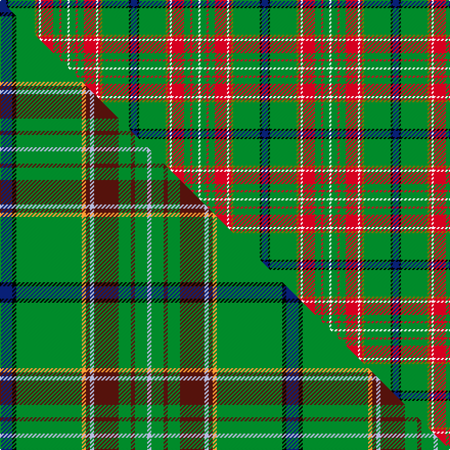

This is one **variant** — a specific cloth: this exact thread count and colourway, with its own
provenance below. It is one weaving of the [sett](/tartans/c/ca/canadian-caledonian-hunting/) (the scale-free proportion — the
same cloth at any scale or shade), whose colour order is pattern [BKGGRWRGRGW](/stripes/bkggrwrgrgw/).

Part of the [Canadian Caledonian Hunting](/tartans/c/ca/canadian-caledonian-hunting/) tartan — the named design grouping this sett with its other cloths.

Sourced from house-of-tartan.  It is a [11 stripe tartan](/stripes/stripes11/).

Original link [http://www.house-of-tartan.scotland.net/house/TartanViewjs.asp?colr=Def&tnam=335](http://www.house-of-tartan.scotland.net/house/TartanViewjs.asp?colr=Def&tnam=335)

## Provenance

Earliest known date: pre 2003 Designed as a District sett by Timely Marketing Promotions, Christchurch, New Zealand

2 attestations — the source records this cloth was collapsed from (oldest owns this page)

<ul>
<li>pre 2003 — Canadian Caledonian Hunting Canadian Tartan (house-of-tartan, <a href="http://www.house-of-tartan.scotland.net/house/TartanViewjs.asp?colr=Def&tnam=335">record</a>) </li>
<li>undated — Canadian Caledonian, hunting (weddslist, <a href="http://www.weddslist.com/cgi-bin/tartans/pg.pl?source=sts">record</a>) </li>
</ul>

Dataset <small>— provenance for this record, inherited from the source manifest</small>

<dl class="dataset-prov">
<dt>source</dt><dd><a href="/sources/house-of-tartan/">House of Tartan</a></dd>
<dt>data captured from</dt><dd><a href="https://github.com/thetartan/tartan-database/blob/master/data/house-of-tartan/data.csv">https://github.com/thetartan/tartan-database/blob/master/data/house-of-tartan/data.csv</a></dd>
<dt>data date</dt><dd>pre 2003 <small>(this record)</small></dd>
<dt>licence</dt><dd><a href="https://creativecommons.org/licenses/by-nc-nd/4.0/">CC BY-NC-ND 4.0</a></dd>
</dl>

Capture chain <small>— the hands this data passed through, oldest first; each capture carries its own licence</small>

<ol class="capture-chain">
<li><a href="http://www.house-of-tartan.scotland.net/">House of Tartan</a> <small>the weaver/retailer's database — the site is now offline; the URL is kept as the ultimate source's identity</small></li>
<li><a href="https://github.com/thetartan/tartan-database">thetartan/tartan-database</a> <small>2016-2017</small> · <a href="https://creativecommons.org/licenses/by-nc-nd/4.0/">CC BY-NC-ND 4.0</a> <small>Levko Kravets's frozen compilation — the capture we vendored, and where its CC licence text came from</small></li>
<li>this dictionary <small>captured 2026-06-10 · commit 5bf86c7566</small> <small>each re-capture is a git commit to data/sources</small></li>
</ol>

## Thread count
DB/6 K2 G26 Y2 R2 W2 R12 G6 R2 G6 W/2

One full sett is **128 threads**.

## Palette
<table><thead><tr><th>Colour</th><th>Shade</th><th>OKLCh</th></tr></thead><tbody><tr><td>DB</td><td><code style="background-color:#082077;">#082077</code> <small style="color:#888">#082077</small></td><td><small style="color:#888">oklch(30.0% 0.149 265.1)</small></td></tr><tr><td>G</td><td><code style="background-color:#008B2A;">#008B2A</code> <small style="color:#888">#008B2A</small></td><td><small style="color:#888">oklch(55.4% 0.170 145.9)</small></td></tr><tr><td>K</td><td><code style="background-color:#000000;">#000000</code> <small style="color:#888">#000000</small></td><td><small style="color:#888">oklch(0.0% 0.000 0.0)</small></td></tr><tr><td>W</td><td><code style="background-color:#F7F7F7;">#F7F7F7</code> <small style="color:#888">#F7F7F7</small></td><td><small style="color:#888">oklch(97.6% 0.000 89.9)</small></td></tr><tr><td>R</td><td><code style="background-color:#D60020;">#D60020</code> <small style="color:#888">#D60020</small></td><td><small style="color:#888">oklch(55.2% 0.224 25.5)</small></td></tr><tr><td>Y</td><td><code style="background-color:#8B6E00;">#8B6E00</code> <small style="color:#888">#8B6E00</small></td><td><small style="color:#888">oklch(55.1% 0.113 90.4)</small></td></tr></tbody></table>

# Sample pattern

## Compared to the master

This cloth is one sett of its design; the master sett (the exemplar the design is anchored on) is below for comparison.

Its **ΔTartan distance** from the master is **1.10** — the same measure the nearest-tartans table ranks by (0 is identical; a re-scale of the same cloth is near 0, a recolour or a different proportion further).

<figure class="master-compare" style="margin:0">

this sett
master sett ★

<figcaption style="color:#888;font-size:smaller">One weave of this sett against the <a href="/setts/db3k1g16lo1dr1lb1dr6g3dr1g3lb1/">master sett ★</a>, split on the diagonal: a shared proportion runs seamlessly across it with only the shades shifting; a different proportion breaks on it.</figcaption>
</figure>

## Nearest tartan variants

The nearest existing variants by ΔTartan distance, with this cloth at the top so the swatches line up against it.

ΔTartan

Threads

Variant

Sett

—

128

<a href="/variants/s11/db3k1g13y1r1w1r6g3r1g3w1~x2/">Canadian Caledonian Hunting Canadian Tartan</a>

<a href="/ttd/edit/#slug=db3k1g16lo1dr1lb1dr6g3dr1g3lb1~x4&amp;base=db3k1g13y1r1w1r6g3r1g3w1~x2" title="compare in the TTD">1.10</a>

280

<a href="/variants/s11/db3k1g16lo1dr1lb1dr6g3dr1g3lb1~x4/">Canadian Caledonian Hunting</a>

<a href="/ttd/edit/#slug=db3g16y1r1w1r6g3r1g3w1~x2&amp;base=db3k1g13y1r1w1r6g3r1g3w1~x2" title="compare in the TTD">1.10</a>

136

<a href="/variants/s10/db3g16y1r1w1r6g3r1g3w1~x2/">Canadian Caledonian District Tartan</a>

<a href="/ttd/edit/#slug=db3g16y1r1w1r6g3r1g3w1~x4&amp;base=db3k1g13y1r1w1r6g3r1g3w1~x2" title="compare in the TTD">1.10</a>

272

<a href="/variants/s10/db3g16y1r1w1r6g3r1g3w1~x4/">Canadian Caledonian (Universal)</a>

<a href="/ttd/edit/#slug=db3g16y1r1w1r6g3r1g3w1~x4~db1406275-r2109032-w4000000&amp;base=db3k1g13y1r1w1r6g3r1g3w1~x2" title="compare in the TTD">1.10</a>

272

<a href="/variants/s10/db3g16y1r1w1r6g3r1g3w1~x4~db1406275-r2109032-w4000000/">Canadian Caledonian</a>

<a href="/ttd/edit/#slug=db6g48k4y4k4w4g20r10k4r6w5&amp;base=db3k1g13y1r1w1r6g3r1g3w1~x2" title="compare in the TTD">2.08</a>

219

<a href="/variants/s11/db6g48k4y4k4w4g20r10k4r6w5/">Steel (Personal)</a>

<a href="/ttd/edit/#slug=r2db2k3g25k2db3g4y2g2w2g6db2r7k2r3w2~x2&amp;base=db3k1g13y1r1w1r6g3r1g3w1~x2" title="compare in the TTD">2.44</a>

268

<a href="/variants/s16/r2db2k3g25k2db3g4y2g2w2g6db2r7k2r3w2~x2/">Hueg (Bavaria) Scottish Thistle (Personal)</a>

<a href="/ttd/edit/#slug=k3g3y2g30k2g3r12g6lp6k3g3~x2&amp;base=db3k1g13y1r1w1r6g3r1g3w1~x2" title="compare in the TTD">2.50</a>

280

<a href="/variants/s11/k3g3y2g30k2g3r12g6lp6k3g3~x2/">McAlifyfe (Personal)</a>

<a href="/ttd/edit/#slug=k2lr1g2dy6g2db4g2k2g15r2g2k1~x4&amp;base=db3k1g13y1r1w1r6g3r1g3w1~x2" title="compare in the TTD">2.61</a>

316

<a href="/variants/s12/k2lr1g2dy6g2db4g2k2g15r2g2k1~x4/">MacClure Hunting Clan/Family Tartan</a>

<a href="/ttd/edit/#slug=db2r1g10r1k6g12r2g1r1g3w2~x4&amp;base=db3k1g13y1r1w1r6g3r1g3w1~x2" title="compare in the TTD">2.62</a>

312

<a href="/variants/s11/db2r1g10r1k6g12r2g1r1g3w2~x4/">Ronald, Clan (Clan)</a>

<a href="/ttd/edit/#slug=k2w1g2dy6g2db4g2k2g15r2g2k1~x4&amp;base=db3k1g13y1r1w1r6g3r1g3w1~x2" title="compare in the TTD">2.67</a>

316

<a href="/variants/s12/k2w1g2dy6g2db4g2k2g15r2g2k1~x4/">MacClure Htg (Name)</a>

## Neighbour map

Every grey dot is one of 13657 variants placed by the first two principal components of the ΔTartan feature space (42% of its variance). Red is this tartan; blue dots are its nearest — click one to open its page. The map is a flat projection of a many-dimensional space — [how to read it](/posts/neighbourhood-maps/).

<svg viewBox="0 0 640 380" role="img" style="max-width:100%;height:auto;border:1px solid #e0e0e0;border-radius:4px;display:block" xmlns="http://www.w3.org/2000/svg"><image href="/nn/cloud.v1.png" width="640" height="380"/><a href="/variants/s11/db3k1g16lo1dr1lb1dr6g3dr1g3lb1~x4/"><circle cx="286.7" cy="108.4" r="4" fill="#3465a4"><title>Canadian Caledonian Hunting</title></circle></a><a href="/variants/s10/db3g16y1r1w1r6g3r1g3w1~x2/"><circle cx="339.8" cy="139.6" r="4" fill="#3465a4"><title>Canadian Caledonian District Tartan</title></circle></a><a href="/variants/s10/db3g16y1r1w1r6g3r1g3w1~x4/"><circle cx="339.8" cy="139.6" r="4" fill="#3465a4"><title>Canadian Caledonian (Universal)</title></circle></a><a href="/variants/s10/db3g16y1r1w1r6g3r1g3w1~x4~db1406275-r2109032-w4000000/"><circle cx="345.7" cy="141.7" r="4" fill="#3465a4"><title>Canadian Caledonian</title></circle></a><a href="/variants/s11/db6g48k4y4k4w4g20r10k4r6w5/"><circle cx="234.8" cy="109.3" r="4" fill="#3465a4"><title>Steel (Personal)</title></circle></a><a href="/variants/s16/r2db2k3g25k2db3g4y2g2w2g6db2r7k2r3w2~x2/"><circle cx="199.4" cy="89.6" r="4" fill="#3465a4"><title>Hueg (Bavaria) Scottish Thistle (Personal)</title></circle></a><a href="/variants/s11/k3g3y2g30k2g3r12g6lp6k3g3~x2/"><circle cx="287.9" cy="118.5" r="4" fill="#3465a4"><title>McAlifyfe (Personal)</title></circle></a><a href="/variants/s12/k2lr1g2dy6g2db4g2k2g15r2g2k1~x4/"><circle cx="223.4" cy="108.3" r="4" fill="#3465a4"><title>MacClure Hunting Clan/Family Tartan</title></circle></a><a href="/variants/s11/db2r1g10r1k6g12r2g1r1g3w2~x4/"><circle cx="266.8" cy="135.2" r="4" fill="#3465a4"><title>Ronald, Clan (Clan)</title></circle></a><a href="/variants/s12/k2w1g2dy6g2db4g2k2g15r2g2k1~x4/"><circle cx="219.3" cy="107.4" r="4" fill="#3465a4"><title>MacClure Htg (Name)</title></circle></a><circle cx="242.1" cy="118.5" r="5" fill="#c00000"/><text x="320" y="376" text-anchor="middle" font-size="11" fill="#999">ground</text><text x="11" y="190" text-anchor="middle" font-size="11" fill="#999" transform="rotate(-90 11 190)">complexity</text></svg>

ID: /variants/s11/db3k1g13y1r1w1r6g3r1g3w1~x2/
