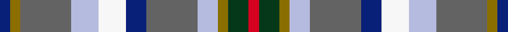

This page is one **sett** — a single exact thread-count. It belongs to the [tartan](/setts/db3y3n15lb8w8db6n15lb6y3dg6r3/)
(the same proportion at any scale), whose colour order is pattern [BGBWWBBWGGR](/stripes/bgbwwbbwggr/).

Part of the [Saltcoats](/tartans/saltcoats/) tartan — the named design grouping this sett with its other cloths.

Sourced from register-of-tartans.  It is a [11 stripe tartan](/stripes/stripes11/).

Original link [https://www.tartanregister.gov.uk/tartanDetails.aspx?ref=5933](https://www.tartanregister.gov.uk/tartanDetails.aspx?ref=5933)

Dataset <small>— provenance for this record, inherited from the source manifest</small>

<dl class="dataset-prov">
<dt>source</dt><dd><a href="/sources/register-of-tartans/">Scottish Register of Tartans</a></dd>
<dt>data captured from</dt><dd><a href="https://github.com/thetartan/tartan-database/blob/master/data/register-of-tartans/data.csv">https://github.com/thetartan/tartan-database/blob/master/data/register-of-tartans/data.csv</a></dd>
<dt>data date</dt><dd>24/06/2006 <small>(this record)</small></dd>
<dt>licence</dt><dd><a href="https://www.tartanregister.gov.uk/copyright">Crown copyright</a></dd>
</dl>

Capture chain <small>— the hands this data passed through, oldest first; each capture carries its own licence</small>

<ol class="capture-chain">
<li><a href="https://www.tartanregister.gov.uk/">Scottish Register of Tartans</a> · <a href="https://www.tartanregister.gov.uk/copyright">Crown copyright</a> <small>the living register — still published by National Records of Scotland</small></li>
<li><a href="https://github.com/thetartan/tartan-database">thetartan/tartan-database</a> <small>2016-2017</small> · <a href="https://creativecommons.org/licenses/by-nc-nd/4.0/">CC BY-NC-ND 4.0</a> <small>Levko Kravets's frozen compilation — the capture we vendored, and where its CC licence text came from</small></li>
<li>this dictionary <small>captured 2026-06-10 · commit 5bf86c7566</small> <small>each re-capture is a git commit to data/sources</small></li>
</ol>

## Register references

External register numbers recorded for this tartan.

- Scottish Register of Tartans: [5933](https://www.tartanregister.gov.uk/tartanDetails.aspx?ref=5933)
- Scottish Tartans Authority (ITI): 7822
- Scottish Tartans World Register: 3157

## Thread count
DB/6 Y6 N30 LB16 W16 DB12 N30 LB12 Y6 DG12 R/6

One full sett is **292 threads**.

## Palette
<table><thead><tr><th>Colour</th><th>Shade</th><th>OKLCh</th></tr></thead><tbody><tr><td>LB</td><td><code style="background-color:#B5BBDE;">#B5BBDE</code> <small style="color:#888">#B5BBDE</small></td><td><small style="color:#888">oklch(79.9% 0.050 277.6)</small></td></tr><tr><td>DB</td><td><code style="background-color:#082077;">#082077</code> <small style="color:#888">#082077</small></td><td><small style="color:#888">oklch(30.0% 0.149 265.1)</small></td></tr><tr><td>DG</td><td><code style="background-color:#053819;">#053819</code> <small style="color:#888">#053819</small></td><td><small style="color:#888">oklch(30.0% 0.075 151.3)</small></td></tr><tr><td>W</td><td><code style="background-color:#F7F7F7;">#F7F7F7</code> <small style="color:#888">#F7F7F7</small></td><td><small style="color:#888">oklch(97.6% 0.000 89.9)</small></td></tr><tr><td>N</td><td><code style="background-color:#636363;">#636363</code> <small style="color:#888">#636363</small></td><td><small style="color:#888">oklch(50.0% 0.000 89.9)</small></td></tr><tr><td>R</td><td><code style="background-color:#D60020;">#D60020</code> <small style="color:#888">#D60020</small></td><td><small style="color:#888">oklch(55.2% 0.224 25.5)</small></td></tr><tr><td>Y</td><td><code style="background-color:#8B6E00;">#8B6E00</code> <small style="color:#888">#8B6E00</small></td><td><small style="color:#888">oklch(55.1% 0.113 90.4)</small></td></tr></tbody></table>

# Sample pattern

## Nearest tartan variants

The nearest existing variants by ΔTartan distance, with this cloth at the top so the swatches line up against it.

ΔTartan

Threads

Variant

Sett

—

292

<a href="/variants/s11/db3y3n15lb8w8db6n15lb6y3dg6r3~x2/">Saltcoats (Saskatchewan)</a>

<a href="/ttd/edit/#slug=db3y3n15lb8w7db6n15lb6y3dg6r3~x2&amp;base=db3y3n15lb8w8db6n15lb6y3dg6r3~x2" title="compare in the TTD">0.02</a>

288

<a href="/variants/s11/db3y3n15lb8w7db6n15lb6y3dg6r3~x2/">Saltcoats (Saskatchewan) (District?)</a>

<a href="/ttd/edit/#slug=g4r1db8w1r1w1lb8w1lb8w1y1~x4&amp;base=db3y3n15lb8w8db6n15lb6y3dg6r3~x2" title="compare in the TTD">2.51</a>

260

<a href="/variants/s11/g4r1db8w1r1w1lb8w1lb8w1y1~x4/">Texas Bluebonnet District Tartan</a>

<a href="/ttd/edit/#slug=g5db3lb3g5w4dy2lb1dy2db1r1~x6~g2203152&amp;base=db3y3n15lb8w8db6n15lb6y3dg6r3~x2" title="compare in the TTD">2.61</a>

288

<a href="/variants/s10/g5db3lb3g5w4dy2lb1dy2db1r1~x6~g2203152/">Northern College (Ontario)</a>

<a href="/ttd/edit/#slug=p5g9r2dy2db6lb14w3~x4&amp;base=db3y3n15lb8w8db6n15lb6y3dg6r3~x2" title="compare in the TTD">2.92</a>

296

<a href="/variants/s7/p5g9r2dy2db6lb14w3~x4/">Manx National</a>

<a href="/ttd/edit/#slug=lp5g9r2dy2db6lb14w3~x4&amp;base=db3y3n15lb8w8db6n15lb6y3dg6r3~x2" title="compare in the TTD">2.95</a>

296

<a href="/variants/s7/lp5g9r2dy2db6lb14w3~x4/">Manx National (District)</a>

<a href="/ttd/edit/#slug=dg2n13dg12w3lb10w3lb12g13r2~x2&amp;base=db3y3n15lb8w8db6n15lb6y3dg6r3~x2" title="compare in the TTD">3.18</a>

272

<a href="/variants/s9/dg2n13dg12w3lb10w3lb12g13r2~x2/">Mounth The.. Corporate Tartan</a>

<a href="/ttd/edit/#slug=db8r2db3r4db13w2o13w2g13r4g4y2g8~x2&amp;base=db3y3n15lb8w8db6n15lb6y3dg6r3~x2" title="compare in the TTD">3.21</a>

280

<a href="/variants/s13/db8r2db3r4db13w2o13w2g13r4g4y2g8~x2/">Bowie</a>

<a href="/ttd/edit/#slug=g10db6lb6g10w8y3lb2y3db2r2&amp;base=db3y3n15lb8w8db6n15lb6y3dg6r3~x2" title="compare in the TTD">3.39</a>

92

<a href="/variants/s10/g10db6lb6g10w8y3lb2y3db2r2/">Northern College</a>

<a href="/ttd/edit/#slug=db8r2db3r4db13w2dr13w2g13r4g4y2g8~x2&amp;base=db3y3n15lb8w8db6n15lb6y3dg6r3~x2" title="compare in the TTD">3.40</a>

280

<a href="/variants/s13/db8r2db3r4db13w2dr13w2g13r4g4y2g8~x2/">Bowie (Dalgety) Family Tartan</a>

<a href="/ttd/edit/#slug=g5db3lb3g5w4dy2lb1dy2db1r1~x6&amp;base=db3y3n15lb8w8db6n15lb6y3dg6r3~x2" title="compare in the TTD">3.44</a>

288

<a href="/variants/s10/g5db3lb3g5w4dy2lb1dy2db1r1~x6/">Northern College (Corporate)</a>

## Neighbour map

Every grey dot is one of 13621 variants placed by the first two principal components of the ΔTartan feature space (42% of its variance). Red is this tartan; blue dots are its nearest — click one to open its page.

<svg viewBox="0 0 640 380" role="img" style="max-width:100%;height:auto;border:1px solid #e0e0e0;border-radius:4px;display:block" xmlns="http://www.w3.org/2000/svg"><image href="/nn/cloud.v1.png" width="640" height="380"/><a href="/variants/s11/db3y3n15lb8w7db6n15lb6y3dg6r3~x2/"><circle cx="98.0" cy="202.4" r="4" fill="#3465a4"><title>Saltcoats (Saskatchewan) (District?)</title></circle></a><a href="/variants/s11/g4r1db8w1r1w1lb8w1lb8w1y1~x4/"><circle cx="168.1" cy="159.4" r="4" fill="#3465a4"><title>Texas Bluebonnet District Tartan</title></circle></a><a href="/variants/s10/g5db3lb3g5w4dy2lb1dy2db1r1~x6~g2203152/"><circle cx="78.8" cy="224.1" r="4" fill="#3465a4"><title>Northern College (Ontario)</title></circle></a><a href="/variants/s7/p5g9r2dy2db6lb14w3~x4/"><circle cx="82.7" cy="195.9" r="4" fill="#3465a4"><title>Manx National</title></circle></a><a href="/variants/s7/lp5g9r2dy2db6lb14w3~x4/"><circle cx="85.7" cy="198.7" r="4" fill="#3465a4"><title>Manx National (District)</title></circle></a><a href="/variants/s9/dg2n13dg12w3lb10w3lb12g13r2~x2/"><circle cx="86.3" cy="217.4" r="4" fill="#3465a4"><title>Mounth The.. Corporate Tartan</title></circle></a><a href="/variants/s13/db8r2db3r4db13w2o13w2g13r4g4y2g8~x2/"><circle cx="100.1" cy="189.6" r="4" fill="#3465a4"><title>Bowie</title></circle></a><a href="/variants/s10/g10db6lb6g10w8y3lb2y3db2r2/"><circle cx="91.0" cy="222.5" r="4" fill="#3465a4"><title>Northern College</title></circle></a><a href="/variants/s13/db8r2db3r4db13w2dr13w2g13r4g4y2g8~x2/"><circle cx="95.0" cy="187.0" r="4" fill="#3465a4"><title>Bowie (Dalgety) Family Tartan</title></circle></a><a href="/variants/s10/g5db3lb3g5w4dy2lb1dy2db1r1~x6/"><circle cx="70.3" cy="223.9" r="4" fill="#3465a4"><title>Northern College (Corporate)</title></circle></a><circle cx="92.3" cy="202.5" r="5" fill="#c00000"/><text x="320" y="376" text-anchor="middle" font-size="11" fill="#999">ground</text><text x="11" y="190" text-anchor="middle" font-size="11" fill="#999" transform="rotate(-90 11 190)">complexity</text></svg>

ID: /variants/s11/db3y3n15lb8w8db6n15lb6y3dg6r3~x2/
