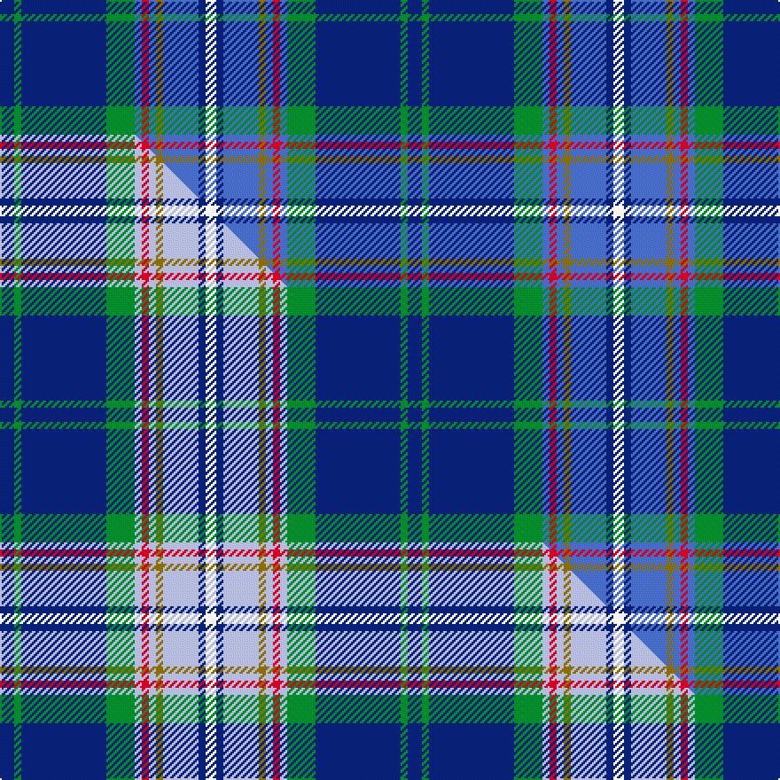

This page is one **sett** — a single exact thread-count. It belongs to the [tartan](/setts/db4g2db24g8b2r2b2y2b10db2w3/)
(the same proportion at any scale), whose colour order is pattern [BGBGBRBGBBW](/stripes/bgbgbrbgbbw/).

Part of the [McCartney](/tartans/mccartney/) tartan — the named design grouping this sett with its other cloths.

Sourced from weddslist.  It is a [11 stripe tartan](/stripes/stripes11/).

Original link http://www.weddslist.com/cgi-bin/tartans/pg.pl?source=sts

## Thread count
DB/8 G4 DB48 G16 B4 R4 B4 Y4 B20 DB4 W/6

One full sett is **230 threads**.

## Palette
<table><thead><tr><th>Colour</th><th>Shade</th><th>OKLCh</th></tr></thead><tbody><tr><td>B</td><td><code style="background-color:#466CC8;">#466CC8</code> <small style="color:#888">#466CC8</small></td><td><small style="color:#888">oklch(55.1% 0.149 265.0)</small></td></tr><tr><td>DB</td><td><code style="background-color:#082077;">#082077</code> <small style="color:#888">#082077</small></td><td><small style="color:#888">oklch(30.0% 0.149 265.1)</small></td></tr><tr><td>G</td><td><code style="background-color:#008B2A;">#008B2A</code> <small style="color:#888">#008B2A</small></td><td><small style="color:#888">oklch(55.4% 0.170 145.9)</small></td></tr><tr><td>W</td><td><code style="background-color:#F7F7F7;">#F7F7F7</code> <small style="color:#888">#F7F7F7</small></td><td><small style="color:#888">oklch(97.6% 0.000 89.9)</small></td></tr><tr><td>R</td><td><code style="background-color:#D60020;">#D60020</code> <small style="color:#888">#D60020</small></td><td><small style="color:#888">oklch(55.2% 0.224 25.5)</small></td></tr><tr><td>Y</td><td><code style="background-color:#8B6E00;">#8B6E00</code> <small style="color:#888">#8B6E00</small></td><td><small style="color:#888">oklch(55.1% 0.113 90.4)</small></td></tr></tbody></table>

# Sample pattern

## Compared to the master

This cloth is one sett of its design; the master sett (the exemplar the design is anchored on) is below for comparison.

Its **ΔTartan distance** from the master is **0.11** — the same measure the nearest-tartans table ranks by (0 is identical; a re-scale of the same cloth is near 0, a recolour or a different proportion further).

<figure class="master-compare" style="margin:0">

this sett
master sett ★

<figcaption style="color:#888;font-size:smaller">One weave of this sett against the <a href="/setts/db4g2db24g8lb2r2lb2y2lb10db2w3/">master sett ★</a>, split on the diagonal: a shared proportion runs seamlessly across it with only the shades shifting; a different proportion breaks on it.</figcaption>
</figure>

## Nearest tartan variants

The nearest existing variants by ΔTartan distance, with this cloth at the top so the swatches line up against it.

ΔTartan

Threads

Variant

Sett

—

230

<a href="/variants/s11/db4g2db24g8b2r2b2y2b10db2w3~x2/">McCartney (Night)</a>

<a href="/ttd/edit/#slug=db4g2db24g8lb2r2lb2y2lb10db2w3~x2&amp;base=db4g2db24g8b2r2b2y2b10db2w3~x2" title="compare in the TTD">0.11</a>

230

<a href="/variants/s11/db4g2db24g8lb2r2lb2y2lb10db2w3~x2/">McCartney (Evening/Night)</a>

<a href="/ttd/edit/#slug=dbi30w2r3w2db14lr3g14dbi18r2dbi3~x2~dbi1605267-db0906265&amp;base=db4g2db24g8b2r2b2y2b10db2w3~x2" title="compare in the TTD">2.10</a>

298

<a href="/variants/s10/dbi30w2r3w2db14lr3g14dbi18r2dbi3~x2~dbi1605267-db0906265/">Kansai St Andrews Society</a>

<a href="/ttd/edit/#slug=g4r1db8w1r1w1b8w1b8w1y1~x4&amp;base=db4g2db24g8b2r2b2y2b10db2w3~x2" title="compare in the TTD">2.54</a>

260

<a href="/variants/s11/g4r1db8w1r1w1b8w1b8w1y1~x4/">Texas, Bluebonnet</a>

<a href="/ttd/edit/#slug=w2db20dg2b2dg2b4dg8y2r1~x2&amp;base=db4g2db24g8b2r2b2y2b10db2w3~x2" title="compare in the TTD">2.54</a>

166

<a href="/variants/s9/w2db20dg2b2dg2b4dg8y2r1~x2/">Nova Scotia</a>

<a href="/ttd/edit/#slug=db30t10lb10db5r3y3g3~x2&amp;base=db4g2db24g8b2r2b2y2b10db2w3~x2" title="compare in the TTD">2.61</a>

190

<a href="/variants/s7/db30t10lb10db5r3y3g3~x2/">Wrigglesworth (Name)</a>

<a href="/ttd/edit/#slug=dg10w2dt3g2o14db26dg2db6~x2&amp;base=db4g2db24g8b2r2b2y2b10db2w3~x2" title="compare in the TTD">2.66</a>

228

<a href="/variants/s8/dg10w2dt3g2o14db26dg2db6~x2/">Spirit of Fife</a>

<a href="/ttd/edit/#slug=lb5y5db12g1db1r1db1w2~x4&amp;base=db4g2db24g8b2r2b2y2b10db2w3~x2" title="compare in the TTD">2.90</a>

196

<a href="/variants/s8/lb5y5db12g1db1r1db1w2~x4/">Hodgkinson</a>

<a href="/ttd/edit/#slug=lb5y5db12g1db1r1db1w2~x2&amp;base=db4g2db24g8b2r2b2y2b10db2w3~x2" title="compare in the TTD">2.90</a>

98

<a href="/variants/s8/lb5y5db12g1db1r1db1w2~x2/">Yorkshire, C.C.C.</a>

<a href="/ttd/edit/#slug=db2n18db2n2db20r3db18g2db2g18w2&amp;base=db4g2db24g8b2r2b2y2b10db2w3~x2" title="compare in the TTD">2.92</a>

174

<a href="/variants/s11/db2n18db2n2db20r3db18g2db2g18w2/">American Society of Travel Agents, The</a>

<a href="/ttd/edit/#slug=dp4db20y1db2y1db4y4g4w4r4~x2&amp;base=db4g2db24g8b2r2b2y2b10db2w3~x2" title="compare in the TTD">2.93</a>

176

<a href="/variants/s10/dp4db20y1db2y1db4y4g4w4r4~x2/">Yukon (asymmetric)</a>

## Neighbour map

Every grey dot is one of 13620 variants placed by the first two principal components of the ΔTartan feature space (42% of its variance). Red is this tartan; blue dots are its nearest — click one to open its page.

<svg viewBox="0 0 640 380" role="img" style="max-width:100%;height:auto;border:1px solid #e0e0e0;border-radius:4px;display:block" xmlns="http://www.w3.org/2000/svg"><image href="/nn/cloud.v1.png" width="640" height="380"/><a href="/variants/s11/db4g2db24g8lb2r2lb2y2lb10db2w3~x2/"><circle cx="218.5" cy="135.9" r="4" fill="#3465a4"><title>McCartney (Evening/Night)</title></circle></a><a href="/variants/s10/dbi30w2r3w2db14lr3g14dbi18r2dbi3~x2~dbi1605267-db0906265/"><circle cx="280.8" cy="145.3" r="4" fill="#3465a4"><title>Kansai St Andrews Society</title></circle></a><a href="/variants/s11/g4r1db8w1r1w1b8w1b8w1y1~x4/"><circle cx="184.3" cy="164.6" r="4" fill="#3465a4"><title>Texas, Bluebonnet</title></circle></a><a href="/variants/s9/w2db20dg2b2dg2b4dg8y2r1~x2/"><circle cx="264.7" cy="130.4" r="4" fill="#3465a4"><title>Nova Scotia</title></circle></a><a href="/variants/s7/db30t10lb10db5r3y3g3~x2/"><circle cx="253.7" cy="170.1" r="4" fill="#3465a4"><title>Wrigglesworth (Name)</title></circle></a><a href="/variants/s8/dg10w2dt3g2o14db26dg2db6~x2/"><circle cx="248.5" cy="135.3" r="4" fill="#3465a4"><title>Spirit of Fife</title></circle></a><a href="/variants/s8/lb5y5db12g1db1r1db1w2~x4/"><circle cx="215.3" cy="150.0" r="4" fill="#3465a4"><title>Hodgkinson</title></circle></a><a href="/variants/s8/lb5y5db12g1db1r1db1w2~x2/"><circle cx="215.3" cy="150.0" r="4" fill="#3465a4"><title>Yorkshire, C.C.C.</title></circle></a><a href="/variants/s11/db2n18db2n2db20r3db18g2db2g18w2/"><circle cx="265.5" cy="179.1" r="4" fill="#3465a4"><title>American Society of Travel Agents, The</title></circle></a><a href="/variants/s10/dp4db20y1db2y1db4y4g4w4r4~x2/"><circle cx="256.9" cy="119.8" r="4" fill="#3465a4"><title>Yukon (asymmetric)</title></circle></a><circle cx="239.3" cy="140.8" r="5" fill="#c00000"/><text x="320" y="376" text-anchor="middle" font-size="11" fill="#999">ground</text><text x="11" y="190" text-anchor="middle" font-size="11" fill="#999" transform="rotate(-90 11 190)">complexity</text></svg>

ID: /variants/s11/db4g2db24g8b2r2b2y2b10db2w3~x2/
