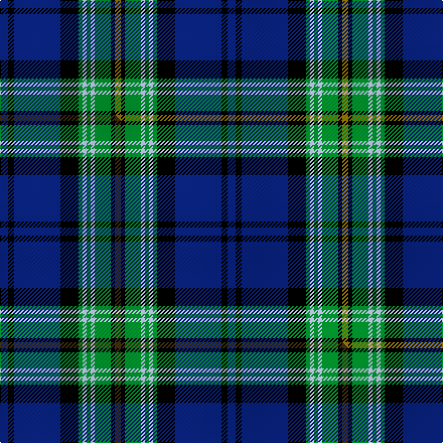

This is one **variant** — a specific cloth: this exact thread count and colourway, with its own
provenance below. It is one weaving of the [sett](/tartans/f/fo/forth/) (the scale-free proportion — the
same cloth at any scale or shade), whose colour order is pattern [BKBKGWGWGKG](/stripes/bkbkgwgwgkg/).

Part of the [Forth](/tartans/f/fo/forth/) tartan — the named design grouping this sett with its other cloths.

Sourced from weddslist.  It is a [11 stripe tartan](/stripes/stripes11/).

Original link [http://www.weddslist.com/cgi-bin/tartans/pg.pl?source=sts](http://www.weddslist.com/cgi-bin/tartans/pg.pl?source=sts)

Dataset <small>— provenance for this record, inherited from the source manifest</small>

<dl class="dataset-prov">
<dt>source</dt><dd><a href="/sources/weddslist/">Weddslist</a></dd>
<dt>data captured from</dt><dd><a href="https://github.com/thetartan/tartan-database/blob/master/data/weddslist/data.csv">https://github.com/thetartan/tartan-database/blob/master/data/weddslist/data.csv</a></dd>
<dt>data date</dt><dd>2016-11-17 <small>(dataset default)</small></dd>
<dt>licence</dt><dd><a href="https://creativecommons.org/licenses/by-nc-nd/4.0/">CC BY-NC-ND 4.0</a></dd>
</dl>

Capture chain <small>— the hands this data passed through, oldest first; each capture carries its own licence</small>

<ol class="capture-chain">
<li><a href="https://www.weddslist.com/tartans/">Weddslist</a> <small>the living privately compiled reference</small></li>
<li><a href="https://github.com/thetartan/tartan-database">thetartan/tartan-database</a> <small>2016-2017</small> · <a href="https://creativecommons.org/licenses/by-nc-nd/4.0/">CC BY-NC-ND 4.0</a> <small>Levko Kravets's frozen compilation — the capture we vendored, and where its CC licence text came from</small></li>
<li>this dictionary <small>captured 2026-06-10 · commit 5bf86c7566</small> <small>each re-capture is a git commit to data/sources</small></li>
</ol>

## Thread count
DB/8 K6 DB46 K18 G4 LB4 G4 LB4 G16 K4 Y/6

One full sett is **226 threads**.

## Palette
<table><thead><tr><th>Colour</th><th>Shade</th><th>OKLCh</th></tr></thead><tbody><tr><td>DB</td><td><code style="background-color:#082077;">#082077</code> <small style="color:#888">#082077</small></td><td><small style="color:#888">oklch(30.0% 0.149 265.1)</small></td></tr><tr><td>LB</td><td><code style="background-color:#B5BBDE;">#B5BBDE</code> <small style="color:#888">#B5BBDE</small></td><td><small style="color:#888">oklch(79.9% 0.050 277.6)</small></td></tr><tr><td>G</td><td><code style="background-color:#008B2A;">#008B2A</code> <small style="color:#888">#008B2A</small></td><td><small style="color:#888">oklch(55.4% 0.170 145.9)</small></td></tr><tr><td>K</td><td><code style="background-color:#000000;">#000000</code> <small style="color:#888">#000000</small></td><td><small style="color:#888">oklch(0.0% 0.000 0.0)</small></td></tr><tr><td>Y</td><td><code style="background-color:#8B6E00;">#8B6E00</code> <small style="color:#888">#8B6E00</small></td><td><small style="color:#888">oklch(55.1% 0.113 90.4)</small></td></tr></tbody></table>

# Sample pattern

[Sample sheet (PDF)](swatch.pdf) — the woven sample, thread count and palette on one printable A4, rendered on demand (the same sheet the TTD print page downloads).

## Compared to the master

This cloth is one sett of its design; the master sett (the exemplar the design is anchored on) is below for comparison.

Its **ΔTartan distance** from the master is **0.03** — the same measure the nearest-tartans table ranks by (0 is identical; a re-scale of the same cloth is near 0, a recolour or a different proportion further).

<figure class="master-compare" style="margin:0">

this sett
master sett ★

<figcaption style="color:#888;font-size:smaller">One weave of this sett against the <a href="/setts/db4k3db23k9g2lb2g2lb2g8k2dy3/">master sett ★</a>, split on the diagonal: a shared proportion runs seamlessly across it with only the shades shifting; a different proportion breaks on it.</figcaption>
</figure>

## Nearest tartan variants

The nearest existing variants by ΔTartan distance, with this cloth at the top so the swatches line up against it.

ΔTartan

Threads

Variant

Sett

—

226

<a href="/variants/s11/db4k3db23k9g2lb2g2lb2g8k2y3~x2/">Forth</a>

<a href="/ttd/edit/#slug=db4k3db23k9g2lb2g2lb2g8k2dy3~x2&amp;base=db4k3db23k9g2lb2g2lb2g8k2y3~x2" title="compare in the TTD">0.03</a>

226

<a href="/variants/s11/db4k3db23k9g2lb2g2lb2g8k2dy3~x2/">Forth</a>

<a href="/ttd/edit/#slug=ki3k2ki22k9g2b2g2b2g8k2w3~x2~ki1410264&amp;base=db4k3db23k9g2lb2g2lb2g8k2y3~x2" title="compare in the TTD">0.48</a>

216

<a href="/variants/s11/ki3k2ki22k9g2b2g2b2g8k2w3~x2~ki1410264/">Scottish Rugby Union</a>

<a href="/ttd/edit/#slug=db3k2db22k9g2lp2g2lp2g8k2w3~x2&amp;base=db4k3db23k9g2lb2g2lb2g8k2y3~x2" title="compare in the TTD">0.98</a>

216

<a href="/variants/s11/db3k2db22k9g2lp2g2lp2g8k2w3~x2/">Scottish Rugby Union Corporate Tartan</a>

<a href="/ttd/edit/#slug=db6k2db24k10g2o2g2o2g10k2lb3~x2&amp;base=db4k3db23k9g2lb2g2lb2g8k2y3~x2" title="compare in the TTD">1.12</a>

242

<a href="/variants/s11/db6k2db24k10g2o2g2o2g10k2lb3~x2/">Scottish Rugby Union</a>

<a href="/ttd/edit/#slug=y2db17k4w2k2y2k2db4g6k2g2w2~x2&amp;base=db4k3db23k9g2lb2g2lb2g8k2y3~x2" title="compare in the TTD">1.44</a>

180

<a href="/variants/s12/y2db17k4w2k2y2k2db4g6k2g2w2~x2/">O'Sheehan</a>

<a href="/ttd/edit/#slug=db8r8db42k4db4k4db4k20g4k10g25w8&amp;base=db4k3db23k9g2lb2g2lb2g8k2y3~x2" title="compare in the TTD">1.54</a>

266

<a href="/variants/s12/db8r8db42k4db4k4db4k20g4k10g25w8/">Bannatyne</a>

<a href="/ttd/edit/#slug=lb3db20k3db2k5db2k3g15r2~x2&amp;base=db4k3db23k9g2lb2g2lb2g8k2y3~x2" title="compare in the TTD">1.79</a>

210

<a href="/variants/s9/lb3db20k3db2k5db2k3g15r2~x2/">Scottish Chamber Orchestra, The</a>

<a href="/ttd/edit/#slug=w4k2db9k3b3k3b3k25g10k2b6w2~x2&amp;base=db4k3db23k9g2lb2g2lb2g8k2y3~x2" title="compare in the TTD">1.86</a>

276

<a href="/variants/s12/w4k2db9k3b3k3b3k25g10k2b6w2~x2/">Auld Lang Syne Blue Fashion Tartan</a>

<a href="/ttd/edit/#slug=w7db10k7db7lb7db45k21g21lb4k4w7~x2&amp;base=db4k3db23k9g2lb2g2lb2g8k2y3~x2" title="compare in the TTD">1.88</a>

532

<a href="/variants/s11/w7db10k7db7lb7db45k21g21lb4k4w7~x2/">Utah State University</a>

<a href="/ttd/edit/#slug=db24k2db2r2db2k20g16y2g2y3~x2&amp;base=db4k3db23k9g2lb2g2lb2g8k2y3~x2" title="compare in the TTD">1.90</a>

246

<a href="/variants/s10/db24k2db2r2db2k20g16y2g2y3~x2/">Watson (Name)</a>

## Neighbour map

Every grey dot is one of 13662 variants placed by the first two principal components of the ΔTartan feature space (42% of its variance). Red is this tartan; blue dots are its nearest — click one to open its page. The map is a flat projection of a many-dimensional space — [how to read it](/posts/neighbourhood-maps/).

<svg viewBox="0 0 640 380" role="img" style="max-width:100%;height:auto;border:1px solid #e0e0e0;border-radius:4px;display:block" xmlns="http://www.w3.org/2000/svg"><image href="/nn/cloud.v1.png" width="640" height="380"/><a href="/variants/s11/db4k3db23k9g2lb2g2lb2g8k2dy3~x2/"><circle cx="183.7" cy="135.3" r="4" fill="#3465a4"><title>Forth</title></circle></a><a href="/variants/s11/ki3k2ki22k9g2b2g2b2g8k2w3~x2~ki1410264/"><circle cx="156.5" cy="125.9" r="4" fill="#3465a4"><title>Scottish Rugby Union</title></circle></a><a href="/variants/s11/db3k2db22k9g2lp2g2lp2g8k2w3~x2/"><circle cx="163.5" cy="131.6" r="4" fill="#3465a4"><title>Scottish Rugby Union Corporate Tartan</title></circle></a><a href="/variants/s11/db6k2db24k10g2o2g2o2g10k2lb3~x2/"><circle cx="173.2" cy="110.0" r="4" fill="#3465a4"><title>Scottish Rugby Union</title></circle></a><a href="/variants/s12/y2db17k4w2k2y2k2db4g6k2g2w2~x2/"><circle cx="147.6" cy="140.9" r="4" fill="#3465a4"><title>O'Sheehan</title></circle></a><a href="/variants/s12/db8r8db42k4db4k4db4k20g4k10g25w8/"><circle cx="139.8" cy="140.6" r="4" fill="#3465a4"><title>Bannatyne</title></circle></a><a href="/variants/s9/lb3db20k3db2k5db2k3g15r2~x2/"><circle cx="172.9" cy="152.9" r="4" fill="#3465a4"><title>Scottish Chamber Orchestra, The</title></circle></a><a href="/variants/s12/w4k2db9k3b3k3b3k25g10k2b6w2~x2/"><circle cx="167.1" cy="121.5" r="4" fill="#3465a4"><title>Auld Lang Syne Blue Fashion Tartan</title></circle></a><a href="/variants/s11/w7db10k7db7lb7db45k21g21lb4k4w7~x2/"><circle cx="144.6" cy="143.6" r="4" fill="#3465a4"><title>Utah State University</title></circle></a><a href="/variants/s10/db24k2db2r2db2k20g16y2g2y3~x2/"><circle cx="158.6" cy="137.8" r="4" fill="#3465a4"><title>Watson (Name)</title></circle></a><circle cx="180.4" cy="134.4" r="5" fill="#c00000"/><text x="320" y="376" text-anchor="middle" font-size="11" fill="#999">ground</text><text x="11" y="190" text-anchor="middle" font-size="11" fill="#999" transform="rotate(-90 11 190)">complexity</text></svg>

ID: /variants/s11/db4k3db23k9g2lb2g2lb2g8k2y3~x2/
