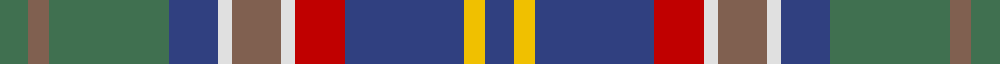

This page is one **sett** — a single exact thread-count. It belongs to the [tartan](/setts/db4ly3db17r7w2o7w2db7g17o3g4/)
(the same proportion at any scale), whose colour order is pattern [BYBRWRWBGRG](/stripes/bybrwrwbgrg/).

Part of the [Asman Hunting](/tartans/asman-hunting/) tartan — the named design grouping this sett with its other cloths.

Sourced from weddslist.  It is a [11 stripe tartan](/stripes/stripes11/).

Original link http://www.weddslist.com/cgi-bin/tartans/pg.pl?source=sts

## Thread count
G/8 LT6 G34 B14 LN4 LT14 LN4 R14 B34 Y6 B/8

One full sett is **276 threads**.

## Palette

Palette: <strong>Tartan Dictionary</strong> <small style="color:#888">(1 of 6 colours)</small>
<table><thead><tr><th>Colour</th><th>Threads</th><th>Shade</th><th>Base</th><th>OKLCh</th></tr></thead><tbody><tr><td>G/</td><td style="text-align:right;font-variant-numeric:tabular-nums">8</td><td><code style="background-color:#407050;">#407050</code> <small style="color:#888">#407050</small></td><td>G <code style="background-color:#006100;">#006100</code></td><td><small style="color:#888">oklch(50.1% 0.074 153.7)</small></td></tr><tr><td>LT</td><td style="text-align:right;font-variant-numeric:tabular-nums">6</td><td><code style="background-color:#806050;">#806050</code> <small style="color:#888">#806050</small></td><td>R <code style="background-color:#CC0000;">#CC0000</code></td><td><small style="color:#888">oklch(51.7% 0.049 47.8)</small></td></tr><tr><td>G</td><td style="text-align:right;font-variant-numeric:tabular-nums">34</td><td><code style="background-color:#407050;">#407050</code> <small style="color:#888">#407050</small></td><td>G <code style="background-color:#006100;">#006100</code></td><td><small style="color:#888">oklch(50.1% 0.074 153.7)</small></td></tr><tr><td>B</td><td style="text-align:right;font-variant-numeric:tabular-nums">14</td><td><code style="background-color:#304080;">#304080</code> <small style="color:#888">#304080</small></td><td>B <code style="background-color:#2A418A;">#2A418A</code></td><td><small style="color:#888">oklch(39.4% 0.109 270.2)</small></td></tr><tr><td>LN</td><td style="text-align:right;font-variant-numeric:tabular-nums">4</td><td><code style="background-color:#E0E0E0;">#E0E0E0</code> <small style="color:#888">#E0E0E0</small></td><td>W <code style="background-color:#F7F7F7;">#F7F7F7</code></td><td><small style="color:#888">oklch(90.7% 0.000 89.9)</small></td></tr><tr><td>LT</td><td style="text-align:right;font-variant-numeric:tabular-nums">14</td><td><code style="background-color:#806050;">#806050</code> <small style="color:#888">#806050</small></td><td>R <code style="background-color:#CC0000;">#CC0000</code></td><td><small style="color:#888">oklch(51.7% 0.049 47.8)</small></td></tr><tr><td>LN</td><td style="text-align:right;font-variant-numeric:tabular-nums">4</td><td><code style="background-color:#E0E0E0;">#E0E0E0</code> <small style="color:#888">#E0E0E0</small></td><td>W <code style="background-color:#F7F7F7;">#F7F7F7</code></td><td><small style="color:#888">oklch(90.7% 0.000 89.9)</small></td></tr><tr><td>R</td><td style="text-align:right;font-variant-numeric:tabular-nums">14</td><td><code style="background-color:#C00000;">#C00000</code> <small style="color:#888">#C00000</small></td><td>R <code style="background-color:#CC0000;">#CC0000</code></td><td><small style="color:#888">oklch(50.7% 0.208 29.2)</small></td></tr><tr><td>B</td><td style="text-align:right;font-variant-numeric:tabular-nums">34</td><td><code style="background-color:#304080;">#304080</code> <small style="color:#888">#304080</small></td><td>B <code style="background-color:#2A418A;">#2A418A</code></td><td><small style="color:#888">oklch(39.4% 0.109 270.2)</small></td></tr><tr><td>Y</td><td style="text-align:right;font-variant-numeric:tabular-nums">6</td><td><code style="background-color:#F0C000;">#F0C000</code> <small style="color:#888">#F0C000</small></td><td>Y <code style="background-color:#F2BF00;">#F2BF00</code></td><td><small style="color:#888">oklch(82.7% 0.169 90.5)</small></td></tr><tr><td>B/</td><td style="text-align:right;font-variant-numeric:tabular-nums">8</td><td><code style="background-color:#304080;">#304080</code> <small style="color:#888">#304080</small></td><td>B <code style="background-color:#2A418A;">#2A418A</code></td><td><small style="color:#888">oklch(39.4% 0.109 270.2)</small></td></tr></tbody></table>

## Compared to the master

This cloth is one sett of its design; the master sett (the exemplar the design is anchored on) is below for comparison.

<figure style="margin:0"><figcaption style="color:#888;font-size:smaller">this sett</figcaption></figure>
<figure style="margin:0"><figcaption style="color:#888;font-size:smaller"><a href="/setts/db4ly3db22r6w2k6w2db6o20k3o4/">master sett →</a></figcaption></figure>

## Nearest tartans

The nearest existing variants by ΔTartan distance, with this tartan at the top so the swatches line up against it.

ΔTartan

Tartan

Sett

—

<a href="/ttd/edit/#slug=db4ly3db17r7w2o7w2db7g17o3g4~x2">Asman Hunting</a> <a class="nn-out" href="/variants/s11/db4ly3db17r7w2o7w2db7g17o3g4~x2/" title="open its dictionary page">↗</a>

0.53

<a href="/ttd/edit/#slug=db9o3db2w2db9o6db3w3db3y18dg8r2~x2&amp;base=db4ly3db17r7w2o7w2db7g17o3g4~x2">Patterson, William J.M. (Personal)</a> <a class="nn-out" href="/variants/s12/db9o3db2w2db9o6db3w3db3y18dg8r2~x2/" title="open its dictionary page">↗</a>

0.56

<a href="/ttd/edit/#slug=g10m2g2mi4g16dp16mi2t18lo2t8mi3~x2&amp;base=db4ly3db17r7w2o7w2db7g17o3g4~x2">Commonwealth Games 1998 (Corporate)</a> <a class="nn-out" href="/variants/s11/g10m2g2mi4g16dp16mi2t18lo2t8mi3~x2/" title="open its dictionary page">↗</a>

0.76

<a href="/ttd/edit/#slug=oi6k3n19k6n4k3o12lr4o12w2oi5~x2&amp;base=db4ly3db17r7w2o7w2db7g17o3g4~x2">Scotland Forever Antique (Fashion)</a> <a class="nn-out" href="/variants/s11/oi6k3n19k6n4k3o12lr4o12w2oi5~x2/" title="open its dictionary page">↗</a>

0.98

<a href="/ttd/edit/#slug=b30r6dy16lp6g10lp14g24ly4dy10lp3dy28&amp;base=db4ly3db17r7w2o7w2db7g17o3g4~x2">Greyfriars (District)</a> <a class="nn-out" href="/variants/s11/b30r6dy16lp6g10lp14g24ly4dy10lp3dy28/" title="open its dictionary page">↗</a>

1.05

<a href="/ttd/edit/#slug=o11db6g6ly1db2ly1g6db6o11k1r3k1g5db5~x2&amp;base=db4ly3db17r7w2o7w2db7g17o3g4~x2">Penman Family Tartan</a> <a class="nn-out" href="/variants/s14/o11db6g6ly1db2ly1g6db6o11k1r3k1g5db5~x2/" title="open its dictionary page">↗</a>

1.06

<a href="/ttd/edit/#slug=db9n3db2lb2db9n6db3lb3db3g18dg8r2~x2&amp;base=db4ly3db17r7w2o7w2db7g17o3g4~x2">Patterson, William John Magee (Personal)</a> <a class="nn-out" href="/variants/s12/db9n3db2lb2db9n6db3lb3db3g18dg8r2~x2/" title="open its dictionary page">↗</a>

1.08

<a href="/ttd/edit/#slug=r2y6t1y1t1y1t3dt8ly1b1~x4&amp;base=db4ly3db17r7w2o7w2db7g17o3g4~x2">Haines Family (Personal)</a> <a class="nn-out" href="/variants/s10/r2y6t1y1t1y1t3dt8ly1b1~x4/" title="open its dictionary page">↗</a>

1.09

<a href="/ttd/edit/#slug=dg3lo2m10dg10b20dg12r3b10w2~x2&amp;base=db4ly3db17r7w2o7w2db7g17o3g4~x2">Patel (2013)</a> <a class="nn-out" href="/variants/s9/dg3lo2m10dg10b20dg12r3b10w2~x2/" title="open its dictionary page">↗</a>

1.10

<a href="/ttd/edit/#slug=o8dt8o4dt28dti12n6dti12r4n8r4n29lb6&amp;base=db4ly3db17r7w2o7w2db7g17o3g4~x2">Kinloch Anderson Granite (Corporate)</a> <a class="nn-out" href="/variants/s12/o8dt8o4dt28dti12n6dti12r4n8r4n29lb6/" title="open its dictionary page">↗</a>

1.14

<a href="/ttd/edit/#slug=y11db6g6ly1db2ly1g6db6y11k1r3k1g5db5~x2&amp;base=db4ly3db17r7w2o7w2db7g17o3g4~x2">Penman</a> <a class="nn-out" href="/variants/s14/y11db6g6ly1db2ly1g6db6y11k1r3k1g5db5~x2/" title="open its dictionary page">↗</a>

## Neighbour map

Every grey dot is one of 14360 variants placed by the first two principal components of the ΔTartan feature space (44% of its variance). Red is this tartan; blue dots are its nearest — click one to open its page.

<svg viewBox="0 0 640 380" role="img" style="max-width:100%;height:auto;border:1px solid #e0e0e0;border-radius:4px;display:block" xmlns="http://www.w3.org/2000/svg"><image href="/nn/cloud.v1.png" width="640" height="380"/><a href="/variants/s12/db9o3db2w2db9o6db3w3db3y18dg8r2~x2/"><circle cx="148.1" cy="167.6" r="4" fill="#3465a4"><title>Patterson, William J.M. (Personal)</title></circle></a><a href="/variants/s11/g10m2g2mi4g16dp16mi2t18lo2t8mi3~x2/"><circle cx="141.9" cy="165.1" r="4" fill="#3465a4"><title>Commonwealth Games 1998 (Corporate)</title></circle></a><a href="/variants/s11/oi6k3n19k6n4k3o12lr4o12w2oi5~x2/"><circle cx="120.6" cy="174.4" r="4" fill="#3465a4"><title>Scotland Forever Antique (Fashion)</title></circle></a><a href="/variants/s11/b30r6dy16lp6g10lp14g24ly4dy10lp3dy28/"><circle cx="128.7" cy="176.2" r="4" fill="#3465a4"><title>Greyfriars (District)</title></circle></a><a href="/variants/s14/o11db6g6ly1db2ly1g6db6o11k1r3k1g5db5~x2/"><circle cx="128.4" cy="159.3" r="4" fill="#3465a4"><title>Penman Family Tartan</title></circle></a><a href="/variants/s12/db9n3db2lb2db9n6db3lb3db3g18dg8r2~x2/"><circle cx="137.5" cy="167.3" r="4" fill="#3465a4"><title>Patterson, William John Magee (Personal)</title></circle></a><a href="/variants/s10/r2y6t1y1t1y1t3dt8ly1b1~x4/"><circle cx="131.5" cy="163.9" r="4" fill="#3465a4"><title>Haines Family (Personal)</title></circle></a><a href="/variants/s9/dg3lo2m10dg10b20dg12r3b10w2~x2/"><circle cx="185.6" cy="190.5" r="4" fill="#3465a4"><title>Patel (2013)</title></circle></a><a href="/variants/s12/o8dt8o4dt28dti12n6dti12r4n8r4n29lb6/"><circle cx="135.5" cy="188.2" r="4" fill="#3465a4"><title>Kinloch Anderson Granite (Corporate)</title></circle></a><a href="/variants/s14/y11db6g6ly1db2ly1g6db6y11k1r3k1g5db5~x2/"><circle cx="130.4" cy="161.4" r="4" fill="#3465a4"><title>Penman</title></circle></a><circle cx="154.5" cy="174.5" r="5" fill="#c00000"/></svg>

ID: /variants/s11/db4ly3db17r7w2o7w2db7g17o3g4~x2/
