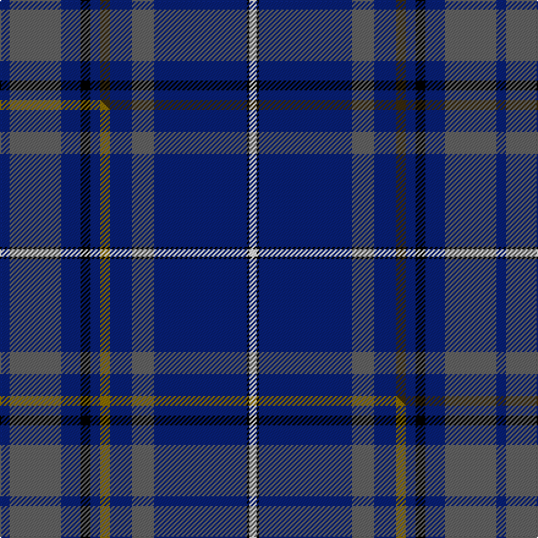

This is one **variant** — a specific cloth: this exact thread count and colourway, with its own
provenance below. It is one weaving of the [sett](/setts/db4n21db8k4db4dy4db9n9db38k1w3/) (the scale-free proportion — the
same cloth at any scale or shade), whose colour order is pattern [BBBKBGBBBKW](/stripes/bbbkbgbbbkw/).

Part of the [Connaught Ancestry](/tartans/connaught-ancestry/) tartan — the named design grouping this sett with its other cloths.

Sourced from tartans-authority.  It is a [11 stripe tartan](/stripes/stripes11/).

Original link [https://www.tartanregister.gov.uk/tartanDetails.aspx?ref=10797](https://www.tartanregister.gov.uk/tartanDetails.aspx?ref=10797)

Dataset <small>— provenance for this record, inherited from the source manifest</small>

<dl class="dataset-prov">
<dt>source</dt><dd><a href="/sources/tartans-authority/">Scottish Tartans Authority</a></dd>
<dt>data captured from</dt><dd><a href="https://github.com/thetartan/tartan-database/blob/master/data/tartans-authority/data.csv">https://github.com/thetartan/tartan-database/blob/master/data/tartans-authority/data.csv</a></dd>
<dt>data date</dt><dd>26/02/2013 <small>(this record)</small></dd>
<dt>licence</dt><dd><a href="https://creativecommons.org/licenses/by-nc-nd/4.0/">CC BY-NC-ND 4.0</a></dd>
</dl>

Capture chain <small>— the hands this data passed through, oldest first; each capture carries its own licence</small>

<ol class="capture-chain">
<li><a href="https://www.tartansauthority.com/">Scottish Tartans Authority</a> <small>the heritage body's archive — its tartan-ferret record browser is retired (links repaired to the SRT, above)</small></li>
<li><a href="https://github.com/thetartan/tartan-database">thetartan/tartan-database</a> <small>2016-2017</small> · <a href="https://creativecommons.org/licenses/by-nc-nd/4.0/">CC BY-NC-ND 4.0</a> <small>Levko Kravets's frozen compilation — the capture we vendored, and where its CC licence text came from</small></li>
<li>this dictionary <small>captured 2026-06-10 · commit 5bf86c7566</small> <small>each re-capture is a git commit to data/sources</small></li>
</ol>

## Register references

External register numbers recorded for this tartan.

- Scottish Register of Tartans: [10797](https://www.tartanregister.gov.uk/tartanDetails?ref=10797)
- Scottish Tartans Authority (ITI): 10797

## Thread count
DB/8 N42 DB16 K8 DB8 DY8 DB18 N18 DB76 K2 W/6

One full sett is **406 threads**.

## Palette
<table><thead><tr><th>Colour</th><th>Shade</th><th>OKLCh</th></tr></thead><tbody><tr><td>DB</td><td><code style="background-color:#082077;">#082077</code> <small style="color:#888">#082077</small></td><td><small style="color:#888">oklch(30.0% 0.149 265.1)</small></td></tr><tr><td>K</td><td><code style="background-color:#000000;">#000000</code> <small style="color:#888">#000000</small></td><td><small style="color:#888">oklch(0.0% 0.000 0.0)</small></td></tr><tr><td>W</td><td><code style="background-color:#F7F7F7;">#F7F7F7</code> <small style="color:#888">#F7F7F7</small></td><td><small style="color:#888">oklch(97.6% 0.000 89.9)</small></td></tr><tr><td>N</td><td><code style="background-color:#636363;">#636363</code> <small style="color:#888">#636363</small></td><td><small style="color:#888">oklch(50.0% 0.000 89.9)</small></td></tr><tr><td>DY</td><td><code style="background-color:#3A2B0D;">#3A2B0D</code> <small style="color:#888">#3A2B0D</small></td><td><small style="color:#888">oklch(30.0% 0.049 82.0)</small></td></tr></tbody></table>

# Sample pattern

## Compared to the master

This cloth is one sett of its design; the master sett (the exemplar the design is anchored on) is below for comparison.

Its **ΔTartan distance** from the master is **0.02** — the same measure the nearest-tartans table ranks by (0 is identical; a re-scale of the same cloth is near 0, a recolour or a different proportion further).

<figure class="master-compare" style="margin:0">

this sett
master sett ★

<figcaption style="color:#888;font-size:smaller">One weave of this sett against the <a href="/setts/db4n21db8k4db4y4db9n9db38k1w3/">master sett ★</a>, split on the diagonal: a shared proportion runs seamlessly across it with only the shades shifting; a different proportion breaks on it.</figcaption>
</figure>

## Nearest tartan variants

The nearest existing variants by ΔTartan distance, with this cloth at the top so the swatches line up against it.

ΔTartan

Threads

Variant

Sett

—

406

<a href="/variants/s11/db4n21db8k4db4dy4db9n9db38k1w3~x2/">Connaught Ancestry (Fashion)</a>

<a href="/ttd/edit/#slug=db4n21db8k4db4y4db9n9db38k1w3~x2&amp;base=db4n21db8k4db4dy4db9n9db38k1w3~x2" title="compare in the TTD">0.02</a>

406

<a href="/variants/s11/db4n21db8k4db4y4db9n9db38k1w3~x2/">Connaught Ancestry</a>

<a href="/ttd/edit/#slug=db4y2db5dr11db4dr2db2g10db28k1dr2~x2&amp;base=db4n21db8k4db4dy4db9n9db38k1w3~x2" title="compare in the TTD">1.71</a>

272

<a href="/variants/s11/db4y2db5dr11db4dr2db2g10db28k1dr2~x2/">Rabbie Burns</a>

<a href="/ttd/edit/#slug=ly4dp2db30k3dp8db5dp1r2~x2&amp;base=db4n21db8k4db4dy4db9n9db38k1w3~x2" title="compare in the TTD">2.51</a>

208

<a href="/variants/s8/ly4dp2db30k3dp8db5dp1r2~x2/">Royal British Legion Scotland (Corp)</a>

<a href="/ttd/edit/#slug=k4n8db54y6db23n4k4r14k4n2db2k4db4&amp;base=db4n21db8k4db4dy4db9n9db38k1w3~x2" title="compare in the TTD">2.89</a>

258

<a href="/variants/s13/k4n8db54y6db23n4k4r14k4n2db2k4db4/">Blue Brough from Orkney</a>

<a href="/ttd/edit/#slug=db5r3db21b5db5b40k2b2w1~x2&amp;base=db4n21db8k4db4dy4db9n9db38k1w3~x2" title="compare in the TTD">3.01</a>

324

<a href="/variants/s9/db5r3db21b5db5b40k2b2w1~x2/">MacNeill</a>

<a href="/ttd/edit/#slug=w4db32k1y2k1db10y18db10k1dr2~x2&amp;base=db4n21db8k4db4dy4db9n9db38k1w3~x2" title="compare in the TTD">3.04</a>

312

<a href="/variants/s10/w4db32k1y2k1db10y18db10k1dr2~x2/">European Union (Fashion)</a>

<a href="/ttd/edit/#slug=dt50dp3k3dt11dp8dt2r6dt2db8dt2w4~x2~dt1204274-db1406275&amp;base=db4n21db8k4db4dy4db9n9db38k1w3~x2" title="compare in the TTD">3.06</a>

288

<a href="/variants/s11/db50dp3k3db11dp8db2r6db2dbi8db2w4~x2~db1204274-dbi1406275/">Scottish American</a>

<a href="/ttd/edit/#slug=k2n4db27ly3db12n2k2r7k2n1db1k2db2~x2&amp;base=db4n21db8k4db4dy4db9n9db38k1w3~x2" title="compare in the TTD">3.13</a>

260

<a href="/variants/s13/k2n4db27ly3db12n2k2r7k2n1db1k2db2~x2/">Brough from Orkney (Name)</a>

<a href="/ttd/edit/#slug=db42dp4db16dg10k2r6k2dg10k3w4~x2&amp;base=db4n21db8k4db4dy4db9n9db38k1w3~x2" title="compare in the TTD">3.35</a>

304

<a href="/variants/s10/db42dp4db16dg10k2r6k2dg10k3w4~x2/">Mount Dora</a>

<a href="/ttd/edit/#slug=w4db52k12db12k12db12k12dg24db8k1~x2&amp;base=db4n21db8k4db4dy4db9n9db38k1w3~x2" title="compare in the TTD">3.37</a>

586

<a href="/variants/s10/w4db52k12db12k12db12k12dg24db8k1~x2/">Dollar Academy, The</a>

## Neighbour map

Every grey dot is one of 13621 variants placed by the first two principal components of the ΔTartan feature space (42% of its variance). Red is this tartan; blue dots are its nearest — click one to open its page.

<svg viewBox="0 0 640 380" role="img" style="max-width:100%;height:auto;border:1px solid #e0e0e0;border-radius:4px;display:block" xmlns="http://www.w3.org/2000/svg"><image href="/nn/cloud.v1.png" width="640" height="380"/><a href="/variants/s11/db4n21db8k4db4y4db9n9db38k1w3~x2/"><circle cx="366.4" cy="105.9" r="4" fill="#3465a4"><title>Connaught Ancestry</title></circle></a><a href="/variants/s11/db4y2db5dr11db4dr2db2g10db28k1dr2~x2/"><circle cx="374.9" cy="117.2" r="4" fill="#3465a4"><title>Rabbie Burns</title></circle></a><a href="/variants/s8/ly4dp2db30k3dp8db5dp1r2~x2/"><circle cx="388.6" cy="108.9" r="4" fill="#3465a4"><title>Royal British Legion Scotland (Corp)</title></circle></a><a href="/variants/s13/k4n8db54y6db23n4k4r14k4n2db2k4db4/"><circle cx="344.3" cy="82.5" r="4" fill="#3465a4"><title>Blue Brough from Orkney</title></circle></a><a href="/variants/s9/db5r3db21b5db5b40k2b2w1~x2/"><circle cx="391.4" cy="106.1" r="4" fill="#3465a4"><title>MacNeill</title></circle></a><a href="/variants/s10/w4db32k1y2k1db10y18db10k1dr2~x2/"><circle cx="353.2" cy="93.9" r="4" fill="#3465a4"><title>European Union (Fashion)</title></circle></a><a href="/variants/s11/db50dp3k3db11dp8db2r6db2dbi8db2w4~x2~db1204274-dbi1406275/"><circle cx="414.3" cy="88.4" r="4" fill="#3465a4"><title>Scottish American</title></circle></a><a href="/variants/s13/k2n4db27ly3db12n2k2r7k2n1db1k2db2~x2/"><circle cx="331.0" cy="77.9" r="4" fill="#3465a4"><title>Brough from Orkney (Name)</title></circle></a><a href="/variants/s10/db42dp4db16dg10k2r6k2dg10k3w4~x2/"><circle cx="295.2" cy="103.0" r="4" fill="#3465a4"><title>Mount Dora</title></circle></a><a href="/variants/s10/w4db52k12db12k12db12k12dg24db8k1~x2/"><circle cx="343.1" cy="119.9" r="4" fill="#3465a4"><title>Dollar Academy, The</title></circle></a><circle cx="372.7" cy="108.0" r="5" fill="#c00000"/><text x="320" y="376" text-anchor="middle" font-size="11" fill="#999">ground</text><text x="11" y="190" text-anchor="middle" font-size="11" fill="#999" transform="rotate(-90 11 190)">complexity</text></svg>

ID: /variants/s11/db4n21db8k4db4dy4db9n9db38k1w3~x2/
