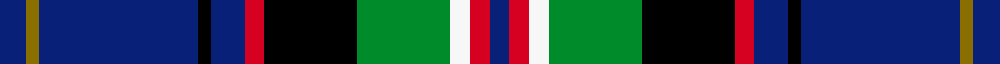

This page is one **sett** — a single exact thread-count. It belongs to the [tartan](/setts/db4y2db24k2db5r3k14g14w3r3db3/)
(the same proportion at any scale), whose colour order is pattern [BGBKBRKGWRB](/stripes/bgbkbrkgwrb/).

Sourced from tartans-authority.  It is a [11 stripe tartan](/stripes/stripes11/).

Original link http://www.tartansauthority.com/tartan-ferret/display/7474/

## Provenance

Earliest known date: 2008 VacLav Rout is the Chairman of the Friends of Scotland CZ and designed this tartan as the Czech National Tartan. Normally the STA requires proof from a national government source that the tartan is indeed accepted by that country. In this case the 'proof' came from the Consulate General of the Czech Republic in Edinburgh and is filed in the STA archives.

3 attestations — the source records this cloth was collapsed from (oldest owns this page)

<ul>
<li>February 2008 — Czech National (District) (tartans-authority, <a href="http://www.tartansauthority.com/tartan-ferret/display/7474/">record</a>)  <em>VacLav Rout is the Chairman of the Friends of Scotland CZ and designed this tartan as the Czech National Tartan. Normally the STA requires proof from a national government source that the tartan is indeed accepted by that country. In this case the 'proof' came from the Consulate General of the Czech Republic in Edinburgh and is filed in the STA archives. Woven sample.</em></li>
<li>undated — Czech National (register-of-tartans, <a href="https://www.tartanregister.gov.uk/tartanDetails.aspx?ref=5516">record</a>)  <em>Vaclav Rout is the Chairman of the Friends of Scotland CZ and designed this tartan as the Czech National Tartan. Normally the Scottish Tartans Authority requires proof from a national government source that the tartan is indeed accepted by that country. In this case the 'proof' came from the Consulate General of the Czech Republic in Edinburgh and is filed in the Scottish Tartans Authority archives. Woven sample.</em></li>
<li>undated — Czech National District Tartan (house-of-tartan, <a href="http://www.house-of-tartan.scotland.net/house/TartanViewjs.asp?colr=Def&tnam=7474">record</a>) </li>
</ul>

## Register references

External register numbers recorded for this tartan.

- Scottish Register of Tartans: [5516](https://www.tartanregister.gov.uk/tartanDetails.aspx?ref=5516)
- Scottish Tartans Authority (ITI): 7474

## Thread count
DB/8 Y4 DB48 K4 DB10 R6 K28 G28 W6 R6 DB/6

One full sett is **294 threads**.

## Palette
<table><thead><tr><th>Colour</th><th>Shade</th><th>OKLCh</th></tr></thead><tbody><tr><td>DB</td><td><code style="background-color:#082077;">#082077</code> <small style="color:#888">#082077</small></td><td><small style="color:#888">oklch(30.0% 0.149 265.1)</small></td></tr><tr><td>G</td><td><code style="background-color:#008B2A;">#008B2A</code> <small style="color:#888">#008B2A</small></td><td><small style="color:#888">oklch(55.4% 0.170 145.9)</small></td></tr><tr><td>K</td><td><code style="background-color:#000000;">#000000</code> <small style="color:#888">#000000</small></td><td><small style="color:#888">oklch(0.0% 0.000 0.0)</small></td></tr><tr><td>W</td><td><code style="background-color:#F7F7F7;">#F7F7F7</code> <small style="color:#888">#F7F7F7</small></td><td><small style="color:#888">oklch(97.6% 0.000 89.9)</small></td></tr><tr><td>R</td><td><code style="background-color:#D60020;">#D60020</code> <small style="color:#888">#D60020</small></td><td><small style="color:#888">oklch(55.2% 0.224 25.5)</small></td></tr><tr><td>Y</td><td><code style="background-color:#8B6E00;">#8B6E00</code> <small style="color:#888">#8B6E00</small></td><td><small style="color:#888">oklch(55.1% 0.113 90.4)</small></td></tr></tbody></table>

# Sample pattern

## Nearest variants

The nearest existing variants by ΔTartan distance, with this cloth at the top so the swatches line up against it.

ΔTartan

Threads

Variant

Sett

—

294

<a href="/variants/s11/db4y2db24k2db5r3k14g14w3r3db3~x2/">Czech National (District)</a>

<a href="/ttd/edit/#slug=lb3db20k3db2k5db2k3g15r2~x2&amp;base=db4y2db24k2db5r3k14g14w3r3db3~x2" title="compare in the TTD">2.80</a>

210

<a href="/variants/s9/lb3db20k3db2k5db2k3g15r2~x2/">Scottish Chamber Orchestra, The</a>

## Neighbour map

Every grey dot is one of 13620 variants placed by the first two principal components of the ΔTartan feature space (42% of its variance). Red is this tartan; blue dots are its nearest — click one to open its page.

<svg viewBox="0 0 640 380" role="img" style="max-width:100%;height:auto;border:1px solid #e0e0e0;border-radius:4px;display:block" xmlns="http://www.w3.org/2000/svg"><image href="/nn/cloud.v1.png" width="640" height="380"/><a href="/variants/s9/lb3db20k3db2k5db2k3g15r2~x2/"><circle cx="173.3" cy="153.0" r="4" fill="#3465a4"><title>Scottish Chamber Orchestra, The</title></circle></a><circle cx="157.6" cy="123.0" r="5" fill="#c00000"/><text x="320" y="376" text-anchor="middle" font-size="11" fill="#999">ground</text><text x="11" y="190" text-anchor="middle" font-size="11" fill="#999" transform="rotate(-90 11 190)">complexity</text></svg>

ID: /variants/s11/db4y2db24k2db5r3k14g14w3r3db3~x2/
