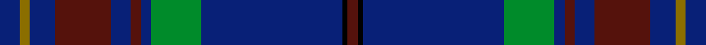

This page is one **sett** — a single exact thread-count. It belongs to the [tartan](/setts/db4y2db5dr11db4dr2db2g10db28k1dr2/)
(the same proportion at any scale), whose colour order is pattern [BGBBBBBGBKB](/stripes/bgbbbbbgbkb/).

Sourced from register-of-tartans.  It is a [11 stripe tartan](/stripes/stripes11/).

Original link https://www.tartanregister.gov.uk/tartanDetails.aspx?ref=3434

2 attestations — the source records this cloth was collapsed from (oldest owns this page)

<ul>
<li>01/07/2004 — Rabbie Burns (register-of-tartans, <a href="https://www.tartanregister.gov.uk/tartanDetails.aspx?ref=3434">record</a>)  <em>Designed by Claire Donaldson of House of Edgar for Robert Nicol of South Methven Street, Perth to commemorate the poet Robert Burns and for use in his dress hire business.</em></li>
<li>July 2004 — Rabbie Burns (Corporate) (tartans-authority, <a href="http://www.tartansauthority.com/tartan-ferret/display/6318/">record</a>)  <em>Designed by Claire Donaldson of House of Edgar for Robert Nicol of South Methven Street, Perth to commemorate the poet Robert Burns and for use in his dress hire business.</em></li>
</ul>

## Register references

External register numbers recorded for this tartan.

- Scottish Register of Tartans: [3434](https://www.tartanregister.gov.uk/tartanDetails.aspx?ref=3434)
- Scottish Tartans Authority (ITI): 6318

## Thread count
DB/8 Y4 DB10 DR22 DB8 DR4 DB4 G20 DB56 K2 DR/4

One full sett is **272 threads**.

## Palette
<table><thead><tr><th>Colour</th><th>Shade</th><th>OKLCh</th></tr></thead><tbody><tr><td>DB</td><td><code style="background-color:#082077;">#082077</code> <small style="color:#888">#082077</small></td><td><small style="color:#888">oklch(30.0% 0.149 265.1)</small></td></tr><tr><td>DR</td><td><code style="background-color:#55120C;">#55120C</code> <small style="color:#888">#55120C</small></td><td><small style="color:#888">oklch(30.0% 0.099 29.3)</small></td></tr><tr><td>G</td><td><code style="background-color:#008B2A;">#008B2A</code> <small style="color:#888">#008B2A</small></td><td><small style="color:#888">oklch(55.4% 0.170 145.9)</small></td></tr><tr><td>K</td><td><code style="background-color:#000000;">#000000</code> <small style="color:#888">#000000</small></td><td><small style="color:#888">oklch(0.0% 0.000 0.0)</small></td></tr><tr><td>Y</td><td><code style="background-color:#8B6E00;">#8B6E00</code> <small style="color:#888">#8B6E00</small></td><td><small style="color:#888">oklch(55.1% 0.113 90.4)</small></td></tr></tbody></table>

# Sample pattern

ID: /variants/s11/db4y2db5dr11db4dr2db2g10db28k1dr2~x2/
