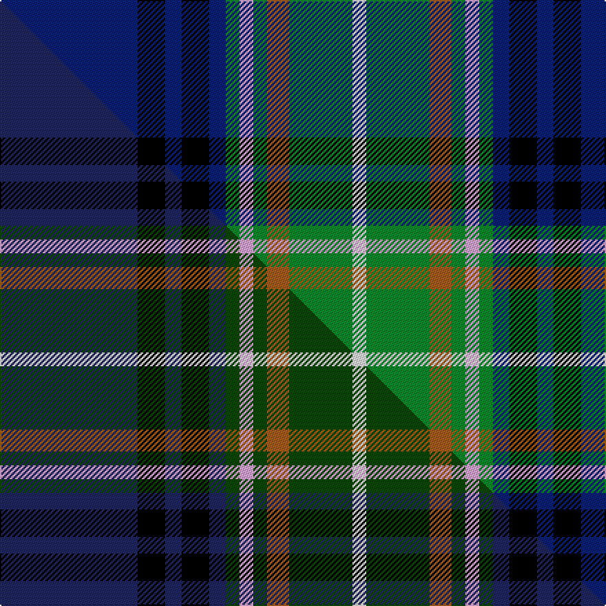

This page is one **sett** — a single exact thread-count. It belongs to the [tartan](/setts/db50k10db6k10db6g5lp5g5o8g23w5/)
(the same proportion at any scale), whose colour order is pattern [BKBKBGWGRGW](/stripes/bkbkbgwgrgw/).

Part of the [Scottish Hockey Union](/tartans/scottish-hockey-union/) tartan — the named design grouping this sett with its other cloths.

Sourced from tartans-authority.  It is a [11 stripe tartan](/stripes/stripes11/).

Original link [https://www.tartanregister.gov.uk/tartanDetails.aspx?ref=5351](https://www.tartanregister.gov.uk/tartanDetails.aspx?ref=5351)

Dataset <small>— provenance for this record, inherited from the source manifest</small>

<dl class="dataset-prov">
<dt>source</dt><dd><a href="/sources/tartans-authority/">Scottish Tartans Authority</a></dd>
<dt>data captured from</dt><dd><a href="https://github.com/thetartan/tartan-database/blob/master/data/tartans-authority/data.csv">https://github.com/thetartan/tartan-database/blob/master/data/tartans-authority/data.csv</a></dd>
<dt>data date</dt><dd>pre 2002 <small>(this record)</small></dd>
<dt>licence</dt><dd><a href="https://creativecommons.org/licenses/by-nc-nd/4.0/">CC BY-NC-ND 4.0</a></dd>
</dl>

Capture chain <small>— the hands this data passed through, oldest first; each capture carries its own licence</small>

<ol class="capture-chain">
<li><a href="https://www.tartansauthority.com/">Scottish Tartans Authority</a> <small>the heritage body's archive — its tartan-ferret record browser is retired (links repaired to the SRT, above)</small></li>
<li><a href="https://github.com/thetartan/tartan-database">thetartan/tartan-database</a> <small>2016-2017</small> · <a href="https://creativecommons.org/licenses/by-nc-nd/4.0/">CC BY-NC-ND 4.0</a> <small>Levko Kravets's frozen compilation — the capture we vendored, and where its CC licence text came from</small></li>
<li>this dictionary <small>captured 2026-06-10 · commit 5bf86c7566</small> <small>each re-capture is a git commit to data/sources</small></li>
</ol>

## Register references

External register numbers recorded for this tartan.

- Scottish Tartans Authority (ITI): 5351

## Thread count
DB/100 K20 DB12 K20 DB12 G10 LP10 G10 O16 G46 W/10

One full sett is **422 threads**.

## Palette
<table><thead><tr><th>Colour</th><th>Shade</th><th>OKLCh</th></tr></thead><tbody><tr><td>DB</td><td><code style="background-color:#082077;">#082077</code> <small style="color:#888">#082077</small></td><td><small style="color:#888">oklch(30.0% 0.149 265.1)</small></td></tr><tr><td>G</td><td><code style="background-color:#008B2A;">#008B2A</code> <small style="color:#888">#008B2A</small></td><td><small style="color:#888">oklch(55.4% 0.170 145.9)</small></td></tr><tr><td>K</td><td><code style="background-color:#000000;">#000000</code> <small style="color:#888">#000000</small></td><td><small style="color:#888">oklch(0.0% 0.000 0.0)</small></td></tr><tr><td>LP</td><td><code style="background-color:#E4A6DB;">#E4A6DB</code> <small style="color:#888">#E4A6DB</small></td><td><small style="color:#888">oklch(80.0% 0.100 331.6)</small></td></tr><tr><td>O</td><td><code style="background-color:#A65C11;">#A65C11</code> <small style="color:#888">#A65C11</small></td><td><small style="color:#888">oklch(55.0% 0.125 58.3)</small></td></tr><tr><td>W</td><td><code style="background-color:#F7F7F7;">#F7F7F7</code> <small style="color:#888">#F7F7F7</small></td><td><small style="color:#888">oklch(97.6% 0.000 89.9)</small></td></tr></tbody></table>

# Sample pattern

## Compared to the master

This cloth is one sett of its design; the master sett (the exemplar the design is anchored on) is below for comparison.

Its **ΔTartan distance** from the master is **0.13** — the same measure the nearest-tartans table ranks by (0 is identical; a re-scale of the same cloth is near 0, a recolour or a different proportion further).

<figure class="master-compare" style="margin:0">

this sett
master sett ★

<figcaption style="color:#888;font-size:smaller">One weave of this sett against the <a href="/setts/db50k10db6k10db6dg5lp5dg5o8dg23w5/">master sett ★</a>, split on the diagonal: a shared proportion runs seamlessly across it with only the shades shifting; a different proportion breaks on it.</figcaption>
</figure>

## Nearest tartan variants

The nearest existing variants by ΔTartan distance, with this cloth at the top so the swatches line up against it.

ΔTartan

Threads

Variant

Sett

—

422

<a href="/variants/s11/db50k10db6k10db6g5lp5g5o8g23w5~x2/">Scottish Hockey Union (Sports)</a>

<a href="/ttd/edit/#slug=db4y2db24k2db5r3k14g14w3r3db3~x2&amp;base=db50k10db6k10db6g5lp5g5o8g23w5~x2" title="compare in the TTD">1.46</a>

294

<a href="/variants/s11/db4y2db24k2db5r3k14g14w3r3db3~x2/">Czech National (District)</a>

<a href="/ttd/edit/#slug=k3dg2k12db4t19dr3t19db4k12dg2lo3~x2&amp;base=db50k10db6k10db6g5lp5g5o8g23w5~x2" title="compare in the TTD">1.71</a>

320

<a href="/variants/s11/k3dg2k12db4t19dr3t19db4k12dg2lo3~x2/">Loch Lomond Millenium</a>

<a href="/ttd/edit/#slug=db37r3k17r3g22k4g22r3k17r3db37w3~x2&amp;base=db50k10db6k10db6g5lp5g5o8g23w5~x2" title="compare in the TTD">1.91</a>

604

<a href="/variants/s12/db37r3k17r3g22k4g22r3k17r3db37w3~x2/">Souza Nery (Personal)</a>

<a href="/ttd/edit/#slug=db6r4db24w3k6g18y4g2y2g4~x2&amp;base=db50k10db6k10db6g5lp5g5o8g23w5~x2" title="compare in the TTD">1.97</a>

272

<a href="/variants/s10/db6r4db24w3k6g18y4g2y2g4~x2/">Greene</a>

<a href="/ttd/edit/#slug=db20k3db3k3db3k16g3lo3g12dr2~x2&amp;base=db50k10db6k10db6g5lp5g5o8g23w5~x2" title="compare in the TTD">2.01</a>

228

<a href="/variants/s10/db20k3db3k3db3k16g3lo3g12dr2~x2/">Barnes Hunting (Personal)</a>

<a href="/ttd/edit/#slug=w1dp3g6k1db12ly1db2ly1~x4&amp;base=db50k10db6k10db6g5lp5g5o8g23w5~x2" title="compare in the TTD">2.08</a>

208

<a href="/variants/s8/w1dp3g6k1db12ly1db2ly1~x4/">Lambert, Patrice (Personal)</a>

<a href="/ttd/edit/#slug=r4dg2y2dg24k2dg3k3dg3k10b10w2b4~x2&amp;base=db50k10db6k10db6g5lp5g5o8g23w5~x2" title="compare in the TTD">2.09</a>

260

<a href="/variants/s12/r4dg2y2dg24k2dg3k3dg3k10b10w2b4~x2/">Kerby, from the Tennessee Cumberland Basin</a>

<a href="/ttd/edit/#slug=y2db17k4w2k2y2k2db4g6k2g2w2~x2&amp;base=db50k10db6k10db6g5lp5g5o8g23w5~x2" title="compare in the TTD">2.11</a>

180

<a href="/variants/s12/y2db17k4w2k2y2k2db4g6k2g2w2~x2/">O'Sheehan</a>

<a href="/ttd/edit/#slug=db10w5db48k35g5k5g35r5g5dp5&amp;base=db50k10db6k10db6g5lp5g5o8g23w5~x2" title="compare in the TTD">2.13</a>

301

<a href="/variants/s10/db10w5db48k35g5k5g35r5g5dp5/">Big Rory (Corporate)</a>

<a href="/ttd/edit/#slug=db4k3db23k9g2lb2g2lb2g8k2y3~x2&amp;base=db50k10db6k10db6g5lp5g5o8g23w5~x2" title="compare in the TTD">2.21</a>

226

<a href="/variants/s11/db4k3db23k9g2lb2g2lb2g8k2y3~x2/">Forth</a>

## Neighbour map

Every grey dot is one of 13621 variants placed by the first two principal components of the ΔTartan feature space (42% of its variance). Red is this tartan; blue dots are its nearest — click one to open its page.

<svg viewBox="0 0 640 380" role="img" style="max-width:100%;height:auto;border:1px solid #e0e0e0;border-radius:4px;display:block" xmlns="http://www.w3.org/2000/svg"><image href="/nn/cloud.v1.png" width="640" height="380"/><a href="/variants/s11/db4y2db24k2db5r3k14g14w3r3db3~x2/"><circle cx="157.5" cy="123.2" r="4" fill="#3465a4"><title>Czech National (District)</title></circle></a><a href="/variants/s11/k3dg2k12db4t19dr3t19db4k12dg2lo3~x2/"><circle cx="145.4" cy="144.5" r="4" fill="#3465a4"><title>Loch Lomond Millenium</title></circle></a><a href="/variants/s12/db37r3k17r3g22k4g22r3k17r3db37w3~x2/"><circle cx="140.6" cy="128.5" r="4" fill="#3465a4"><title>Souza Nery (Personal)</title></circle></a><a href="/variants/s10/db6r4db24w3k6g18y4g2y2g4~x2/"><circle cx="148.9" cy="136.3" r="4" fill="#3465a4"><title>Greene</title></circle></a><a href="/variants/s10/db20k3db3k3db3k16g3lo3g12dr2~x2/"><circle cx="148.0" cy="157.5" r="4" fill="#3465a4"><title>Barnes Hunting (Personal)</title></circle></a><a href="/variants/s8/w1dp3g6k1db12ly1db2ly1~x4/"><circle cx="212.0" cy="135.3" r="4" fill="#3465a4"><title>Lambert, Patrice (Personal)</title></circle></a><a href="/variants/s12/r4dg2y2dg24k2dg3k3dg3k10b10w2b4~x2/"><circle cx="172.7" cy="118.1" r="4" fill="#3465a4"><title>Kerby, from the Tennessee Cumberland Basin</title></circle></a><a href="/variants/s12/y2db17k4w2k2y2k2db4g6k2g2w2~x2/"><circle cx="147.8" cy="141.3" r="4" fill="#3465a4"><title>O'Sheehan</title></circle></a><a href="/variants/s10/db10w5db48k35g5k5g35r5g5dp5/"><circle cx="117.0" cy="138.2" r="4" fill="#3465a4"><title>Big Rory (Corporate)</title></circle></a><a href="/variants/s11/db4k3db23k9g2lb2g2lb2g8k2y3~x2/"><circle cx="180.6" cy="134.7" r="4" fill="#3465a4"><title>Forth</title></circle></a><circle cx="163.4" cy="128.9" r="5" fill="#c00000"/><text x="320" y="376" text-anchor="middle" font-size="11" fill="#999">ground</text><text x="11" y="190" text-anchor="middle" font-size="11" fill="#999" transform="rotate(-90 11 190)">complexity</text></svg>

ID: /variants/s11/db50k10db6k10db6g5lp5g5o8g23w5~x2/
