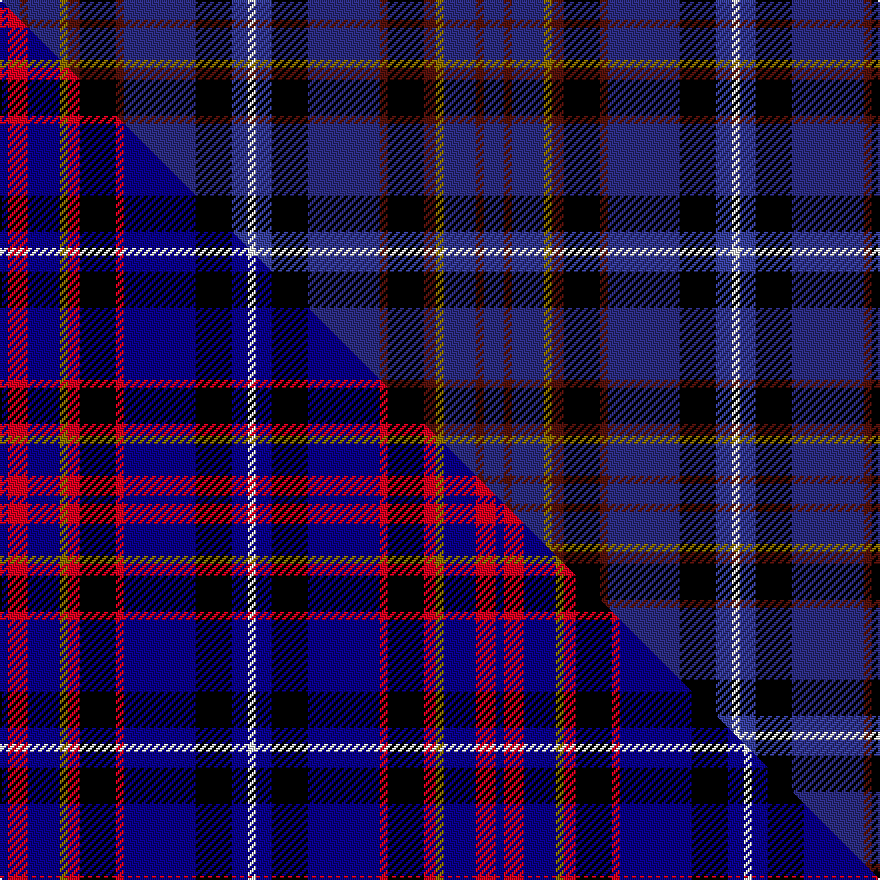

This is one **variant** — a specific cloth: this exact thread count and colourway, with its own
provenance below. It is one weaving of the [sett](/tartans/r/ro/royal-gourock-yacht-club-the/) (the scale-free proportion — the
same cloth at any scale or shade), whose colour order is pattern [BBBGBKBBKBW](/stripes/bbbgbkbbkbw/).

Part of the [Royal Gourock Yacht Club, The](/tartans/r/ro/royal-gourock-yacht-club-the/) tartan — the named design grouping this sett with its other cloths.

Sourced from tartans-authority.  It is a [11 stripe tartan](/stripes/stripes11/).

Original link <code>http://www.tartansauthority.com/tartan-ferret/display/11087/</code> — retired · [Internet Archive copy](https://web.archive.org/web/*/http://www.tartansauthority.com/tartan-ferret/display/11087/*)

Dataset <small>— provenance for this record, inherited from the source manifest</small>

<dl class="dataset-prov">
<dt>source</dt><dd><a href="/sources/tartans-authority/">Scottish Tartans Authority</a></dd>
<dt>data captured from</dt><dd><a href="https://github.com/thetartan/tartan-database/blob/master/data/tartans-authority/data.csv">https://github.com/thetartan/tartan-database/blob/master/data/tartans-authority/data.csv</a></dd>
<dt>data date</dt><dd>2014 <small>(this record)</small></dd>
<dt>licence</dt><dd><a href="https://creativecommons.org/licenses/by-nc-nd/4.0/">CC BY-NC-ND 4.0</a></dd>
</dl>

Capture chain <small>— the hands this data passed through, oldest first; each capture carries its own licence</small>

<ol class="capture-chain">
<li><a href="https://www.tartansauthority.com/">Scottish Tartans Authority</a> <small>the heritage body’s archive — its tartan-ferret record browser is retired; dead record links are shown unlinked, with an Internet Archive copy (ITI numbers are not SRT references)</small></li>
<li><a href="https://github.com/thetartan/tartan-database">thetartan/tartan-database</a> <small>2016-2017</small> · <a href="https://creativecommons.org/licenses/by-nc-nd/4.0/">CC BY-NC-ND 4.0</a> <small>Levko Kravets's frozen compilation — the capture we vendored, and where its CC licence text came from</small></li>
<li>this dictionary <small>captured 2026-06-10 · commit 5bf86c7566</small> <small>each re-capture is a git commit to data/sources</small></li>
</ol>

## Register references

External register numbers recorded for this tartan.

- Scottish Register of Tartans: [11087](https://www.tartanregister.gov.uk/tartanDetails?ref=11087)
- Scottish Tartans Authority (ITI): 11087

## Thread count
DB/10 DR4 DB16 Y4 DR6 K18 DR4 DB36 K18 DBi8 W/4

One full sett is **242 threads**.

## Palette
<table><thead><tr><th>Colour</th><th>Shade</th><th>OKLCh</th></tr></thead><tbody><tr><td>DB</td><td><code style="background-color:#38409C;">#38409C</code> <small style="color:#888">#38409C</small></td><td><small style="color:#888">oklch(42.1% 0.148 274.4)</small></td></tr><tr><td>DB</td><td><code style="background-color:#2C2C80;">#2C2C80</code> <small style="color:#888">#2C2C80</small></td><td><small style="color:#888">oklch(35.0% 0.138 276.6)</small></td></tr><tr><td>K</td><td><code style="background-color:#000000;">#000000</code> <small style="color:#888">#000000</small></td><td><small style="color:#888">oklch(0.0% 0.000 0.0)</small></td></tr><tr><td>DR</td><td><code style="background-color:#55120C;">#55120C</code> <small style="color:#888">#55120C</small></td><td><small style="color:#888">oklch(30.0% 0.099 29.3)</small></td></tr><tr><td>W</td><td><code style="background-color:#F7F7F7;">#F7F7F7</code> <small style="color:#888">#F7F7F7</small></td><td><small style="color:#888">oklch(97.6% 0.000 89.9)</small></td></tr><tr><td>Y</td><td><code style="background-color:#8B6E00;">#8B6E00</code> <small style="color:#888">#8B6E00</small></td><td><small style="color:#888">oklch(55.1% 0.113 90.4)</small></td></tr></tbody></table>

# Sample pattern

## Compared to the master

This cloth is one sett of its design; the master sett (the exemplar the design is anchored on) is below for comparison.

Its **ΔTartan distance** from the master is **0.30** — the same measure the nearest-tartans table ranks by (0 is identical; a re-scale of the same cloth is near 0, a recolour or a different proportion further).

<figure class="master-compare" style="margin:0">

this sett
master sett ★

<figcaption style="color:#888;font-size:smaller">One weave of this sett against the <a href="/setts/db2r5db8y2r3k9r2db18k9dbi4w2/">master sett ★</a>, split on the diagonal: a shared proportion runs seamlessly across it with only the shades shifting; a different proportion breaks on it.</figcaption>
</figure>

## Nearest tartan variants

The nearest existing variants by ΔTartan distance, with this cloth at the top so the swatches line up against it.

ΔTartan

Threads

Variant

Sett

—

242

<a href="/variants/s11/db5dr2db8y2dr3k9dr2db18k9dbi4w2~x2~db1406275-dbi1706275/">Royal Gourock Yacht Club, The</a>

<a href="/ttd/edit/#slug=db2r5db8y2r3k9r2db18k9dbi4w2~x2~db1108266-dbi1208266&amp;base=db5dr2db8y2dr3k9dr2db18k9dbi4w2~x2~db1406275-dbi1706275" title="compare in the TTD">0.31</a>

248

<a href="/variants/s11/db2r5db8y2r3k9r2db18k9dbi4w2~x2~db1108266-dbi1208266/">Royal Gourock Yacht Club, The</a>

<a href="/ttd/edit/#slug=k3b2k12dg4db19r3db19dg4k12b2y3~x2&amp;base=db5dr2db8y2dr3k9dr2db18k9dbi4w2~x2~db1406275-dbi1706275" title="compare in the TTD">1.69</a>

320

<a href="/variants/s11/k3b2k12dg4db19r3db19dg4k12b2y3~x2/">Loch Lomond Millennium</a>

<a href="/ttd/edit/#slug=dp4k3dp20k10db19o2db2o2db25g3db4k6w4~x2&amp;base=db5dr2db8y2dr3k9dr2db18k9dbi4w2~x2~db1406275-dbi1706275" title="compare in the TTD">1.88</a>

400

<a href="/variants/s13/dp4k3dp20k10db19o2db2o2db25g3db4k6w4~x2/">Highland Destiny (Fashion)</a>

<a href="/ttd/edit/#slug=ri1db14k10db10k1db2k1db10k10dr8db2r2w1~x2~ri2806019-r2510029&amp;base=db5dr2db8y2dr3k9dr2db18k9dbi4w2~x2~db1406275-dbi1706275" title="compare in the TTD">2.24</a>

284

<a href="/variants/s13/ri1db14k10db10k1db2k1db10k10dr8db2r2w1~x2~ri2806019-r2510029/">Hynett, William (Personal)</a>

<a href="/ttd/edit/#slug=db20b6k8y2k4w4k4db13r7k4w2~x2&amp;base=db5dr2db8y2dr3k9dr2db18k9dbi4w2~x2~db1406275-dbi1706275" title="compare in the TTD">2.47</a>

252

<a href="/variants/s11/db20b6k8y2k4w4k4db13r7k4w2~x2/">Stewart Black</a>

<a href="/ttd/edit/#slug=db9k30db9lb3db5r3db5y3db5g3~x2&amp;base=db5dr2db8y2dr3k9dr2db18k9dbi4w2~x2~db1406275-dbi1706275" title="compare in the TTD">2.55</a>

276

<a href="/variants/s10/db9k30db9lb3db5r3db5y3db5g3~x2/">Fed. of Circles &amp; Solitaries (Corp.)</a>

<a href="/ttd/edit/#slug=dbi13lb2dbi13k3db13k21dy3k18dbi9k2dbi2~x2~dbi1605267-db1003265&amp;base=db5dr2db8y2dr3k9dr2db18k9dbi4w2~x2~db1406275-dbi1706275" title="compare in the TTD">2.70</a>

366

<a href="/variants/s11/dbi13lb2dbi13k3db13k21dy3k18dbi9k2dbi2~x2~dbi1605267-db1003265/">Haus of RvR</a>

<a href="/ttd/edit/#slug=db18k2lb2db9k4g9r4db9lb2k2y1~x4&amp;base=db5dr2db8y2dr3k9dr2db18k9dbi4w2~x2~db1406275-dbi1706275" title="compare in the TTD">2.71</a>

420

<a href="/variants/s11/db18k2lb2db9k4g9r4db9lb2k2y1~x4/">Amarillo District Tartan</a>

<a href="/ttd/edit/#slug=db10g42dbi8lb8dbi8k24dbi8db71r10~db1106275-dbi1406275&amp;base=db5dr2db8y2dr3k9dr2db18k9dbi4w2~x2~db1406275-dbi1706275" title="compare in the TTD">2.72</a>

358

<a href="/variants/s9/db10g42dbi8lb8dbi8k24dbi8db71r10~db1106275-dbi1406275/">Robert Burns Legacy</a>

<a href="/ttd/edit/#slug=db20g3dy3db3r7g6db3k12db3k3db24w3~x2&amp;base=db5dr2db8y2dr3k9dr2db18k9dbi4w2~x2~db1406275-dbi1706275" title="compare in the TTD">2.79</a>

314

<a href="/variants/s12/db20g3dy3db3r7g6db3k12db3k3db24w3~x2/">Bhoyrub Clan/Family Tartan</a>

## Neighbour map

Every grey dot is one of 13656 variants placed by the first two principal components of the ΔTartan feature space (42% of its variance). Red is this tartan; blue dots are its nearest — click one to open its page. The map is a flat projection of a many-dimensional space — [how to read it](/posts/neighbourhood-maps/).

<svg viewBox="0 0 640 380" role="img" style="max-width:100%;height:auto;border:1px solid #e0e0e0;border-radius:4px;display:block" xmlns="http://www.w3.org/2000/svg"><image href="/nn/cloud.v1.png" width="640" height="380"/><a href="/variants/s11/db2r5db8y2r3k9r2db18k9dbi4w2~x2~db1108266-dbi1208266/"><circle cx="133.2" cy="144.4" r="4" fill="#3465a4"><title>Royal Gourock Yacht Club, The</title></circle></a><a href="/variants/s11/k3b2k12dg4db19r3db19dg4k12b2y3~x2/"><circle cx="187.4" cy="153.9" r="4" fill="#3465a4"><title>Loch Lomond Millennium</title></circle></a><a href="/variants/s13/dp4k3dp20k10db19o2db2o2db25g3db4k6w4~x2/"><circle cx="204.0" cy="127.6" r="4" fill="#3465a4"><title>Highland Destiny (Fashion)</title></circle></a><a href="/variants/s13/ri1db14k10db10k1db2k1db10k10dr8db2r2w1~x2~ri2806019-r2510029/"><circle cx="232.9" cy="130.9" r="4" fill="#3465a4"><title>Hynett, William (Personal)</title></circle></a><a href="/variants/s11/db20b6k8y2k4w4k4db13r7k4w2~x2/"><circle cx="123.4" cy="142.6" r="4" fill="#3465a4"><title>Stewart Black</title></circle></a><a href="/variants/s10/db9k30db9lb3db5r3db5y3db5g3~x2/"><circle cx="187.0" cy="134.7" r="4" fill="#3465a4"><title>Fed. of Circles &amp; Solitaries (Corp.)</title></circle></a><a href="/variants/s11/dbi13lb2dbi13k3db13k21dy3k18dbi9k2dbi2~x2~dbi1605267-db1003265/"><circle cx="202.9" cy="171.6" r="4" fill="#3465a4"><title>Haus of RvR</title></circle></a><a href="/variants/s11/db18k2lb2db9k4g9r4db9lb2k2y1~x4/"><circle cx="239.8" cy="119.3" r="4" fill="#3465a4"><title>Amarillo District Tartan</title></circle></a><a href="/variants/s9/db10g42dbi8lb8dbi8k24dbi8db71r10~db1106275-dbi1406275/"><circle cx="152.4" cy="151.1" r="4" fill="#3465a4"><title>Robert Burns Legacy</title></circle></a><a href="/variants/s12/db20g3dy3db3r7g6db3k12db3k3db24w3~x2/"><circle cx="225.8" cy="140.9" r="4" fill="#3465a4"><title>Bhoyrub Clan/Family Tartan</title></circle></a><circle cx="186.2" cy="155.7" r="5" fill="#c00000"/><text x="320" y="376" text-anchor="middle" font-size="11" fill="#999">ground</text><text x="11" y="190" text-anchor="middle" font-size="11" fill="#999" transform="rotate(-90 11 190)">complexity</text></svg>

ID: /variants/s11/db5dr2db8y2dr3k9dr2db18k9dbi4w2~x2~db1406275-dbi1706275/
