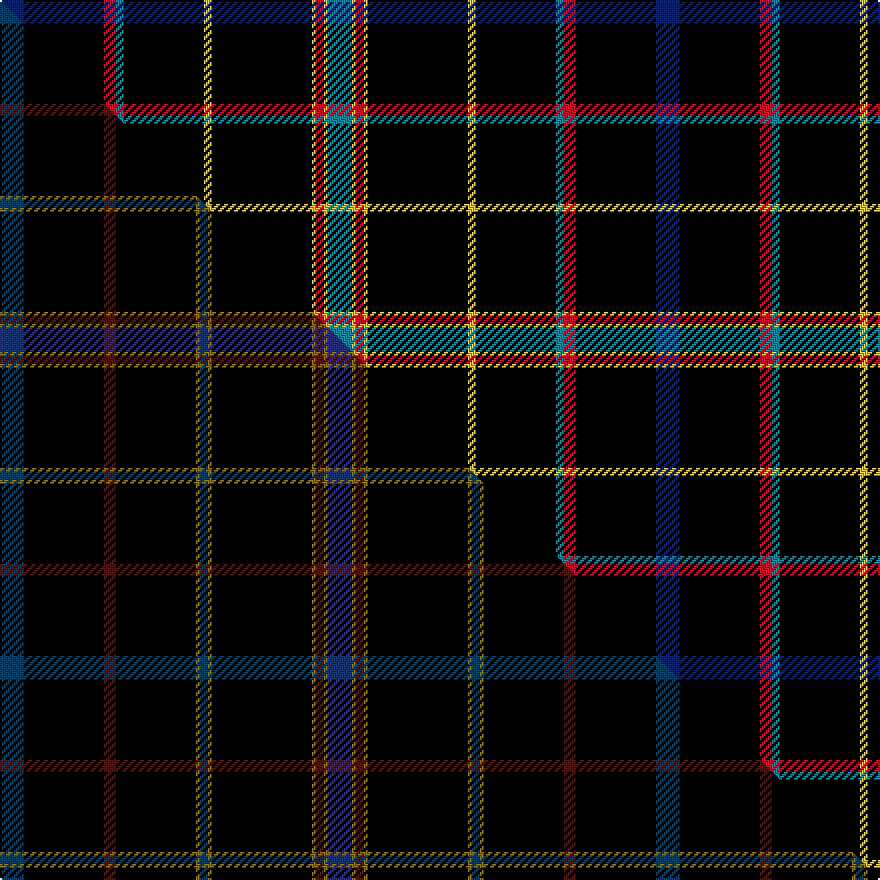

This page is one **sett** — a single exact thread-count. It belongs to the [tartan](/setts/db6k20r3t2k20ly2k25ly1r2ly1t6/)
(the same proportion at any scale), whose colour order is pattern [BKRBKYKYRYB](/stripes/bkrbkykyryb/).

Part of the [Martinez](/tartans/martinez/) tartan — the named design grouping this sett with its other cloths.

Sourced from tartans-authority.  It is a [11 stripe tartan](/stripes/stripes11/).

Original link http://www.tartansauthority.com/tartan-ferret/display/11118/

## Register references

External register numbers recorded for this tartan.

- Scottish Register of Tartans: [11118](https://www.tartanregister.gov.uk/tartanDetails?ref=11118)
- Scottish Tartans Authority (ITI): 11118

## Thread count
DB/12 K40 R6 T4 K40 LY4 K50 LY2 R4 LY2 T/12

One full sett is **328 threads**.

## Palette
<table><thead><tr><th>Colour</th><th>Shade</th><th>OKLCh</th></tr></thead><tbody><tr><td>T</td><td><code style="background-color:#00879F;">#00879F</code> <small style="color:#888">#00879F</small></td><td><small style="color:#888">oklch(57.4% 0.102 216.1)</small></td></tr><tr><td>DB</td><td><code style="background-color:#082077;">#082077</code> <small style="color:#888">#082077</small></td><td><small style="color:#888">oklch(30.0% 0.149 265.1)</small></td></tr><tr><td>R</td><td><code style="background-color:#D60020;">#D60020</code> <small style="color:#888">#D60020</small></td><td><small style="color:#888">oklch(55.2% 0.224 25.5)</small></td></tr><tr><td>K</td><td><code style="background-color:#000000;">#000000</code> <small style="color:#888">#000000</small></td><td><small style="color:#888">oklch(0.0% 0.000 0.0)</small></td></tr><tr><td>LY</td><td><code style="background-color:#DCBC32;">#DCBC32</code> <small style="color:#888">#DCBC32</small></td><td><small style="color:#888">oklch(80.0% 0.150 95.2)</small></td></tr></tbody></table>

# Sample pattern

## Compared to the master

This cloth is one sett of its design; the master sett (the exemplar the design is anchored on) is below for comparison.

Its **ΔTartan distance** from the master is **1.47** — the same measure the nearest-tartans table ranks by (0 is identical; a re-scale of the same cloth is near 0, a recolour or a different proportion further).

<figure class="master-compare" style="margin:0">

this sett
master sett ★

<figcaption style="color:#888;font-size:smaller">One weave of this sett against the <a href="/setts/db6k20dr3k20y1db2y1k25y1dr2y1dbi6/">master sett ★</a>, split on the diagonal: a shared proportion runs seamlessly across it with only the shades shifting; a different proportion breaks on it.</figcaption>
</figure>

## Nearest variants

The nearest existing variants by ΔTartan distance, with this cloth at the top so the swatches line up against it.

ΔTartan

Threads

Variant

Sett

—

328

<a href="/variants/s11/db6k20r3t2k20ly2k25ly1r2ly1t6~x2/">Martinez (2014)</a>

<a href="/ttd/edit/#slug=db6k20dr3k20y1db2y1k25y1dr2y1dbi6~x2~db1404245-dbi1406275&amp;base=db6k20r3t2k20ly2k25ly1r2ly1t6~x2" title="compare in the TTD">0.92</a>

328

<a href="/variants/s12/db6k20dr3k20y1db2y1k25y1dr2y1dbi6~x2~db1404245-dbi1406275/">Martinez (2014)</a>

<a href="/ttd/edit/#slug=lb6k6lb6db3w1k39dy3k3~x2&amp;base=db6k20r3t2k20ly2k25ly1r2ly1t6~x2" title="compare in the TTD">2.05</a>

250

<a href="/variants/s8/lb6k6lb6db3w1k39dy3k3~x2/">Washington County Sheriff’s Office (Oregon)</a>

<a href="/ttd/edit/#slug=lb6k6lb6t3w1k39ly3k3~x2&amp;base=db6k20r3t2k20ly2k25ly1r2ly1t6~x2" title="compare in the TTD">2.05</a>

250

<a href="/variants/s8/lb6k6lb6t3w1k39ly3k3~x2/">Washington County Sheriff's Office</a>

<a href="/ttd/edit/#slug=k50db2k13w1k13db5g15r2~x2&amp;base=db6k20r3t2k20ly2k25ly1r2ly1t6~x2" title="compare in the TTD">2.22</a>

300

<a href="/variants/s8/k50db2k13w1k13db5g15r2~x2/">Center</a>

<a href="/ttd/edit/#slug=k50t2k13w1k13t5g15r2~x2&amp;base=db6k20r3t2k20ly2k25ly1r2ly1t6~x2" title="compare in the TTD">2.22</a>

300

<a href="/variants/s8/k50t2k13w1k13t5g15r2~x2/">Center (Name)</a>

<a href="/ttd/edit/#slug=k20db2k2db4dg4y2k40r2w3~x2&amp;base=db6k20r3t2k20ly2k25ly1r2ly1t6~x2" title="compare in the TTD">2.38</a>

270

<a href="/variants/s9/k20db2k2db4dg4y2k40r2w3~x2/">McCuaig (Glenelg and the Western Isles) Hunting</a>

<a href="/ttd/edit/#slug=k50w1n15w1k40n13k62w4dr21~x2&amp;base=db6k20r3t2k20ly2k25ly1r2ly1t6~x2" title="compare in the TTD">2.63</a>

686

<a href="/variants/s9/k50w1n15w1k40n13k62w4dr21~x2/">Provincewide HOG Chapter</a>

<a href="/ttd/edit/#slug=ly8k7r3k7r3k38w2k3ly6~x2&amp;base=db6k20r3t2k20ly2k25ly1r2ly1t6~x2" title="compare in the TTD">2.79</a>

280

<a href="/variants/s9/ly8k7r3k7r3k38w2k3ly6~x2/">Bunnahabhain</a>

<a href="/ttd/edit/#slug=w2db2k32g9r2w2r2g4k20y1k9db2w2~x2&amp;base=db6k20r3t2k20ly2k25ly1r2ly1t6~x2" title="compare in the TTD">2.86</a>

348

<a href="/variants/s13/w2db2k32g9r2w2r2g4k20y1k9db2w2~x2/">Nova Scotia Medical Examiner Service</a>

<a href="/ttd/edit/#slug=w2k25b2dg6dy2r6b2k25w2~x2&amp;base=db6k20r3t2k20ly2k25ly1r2ly1t6~x2" title="compare in the TTD">2.97</a>

280

<a href="/variants/s9/w2k25b2dg6dy2r6b2k25w2~x2/">Stott (Personal)</a>

## Neighbour map

Every grey dot is one of 13620 variants placed by the first two principal components of the ΔTartan feature space (42% of its variance). Red is this tartan; blue dots are its nearest — click one to open its page.

<svg viewBox="0 0 640 380" role="img" style="max-width:100%;height:auto;border:1px solid #e0e0e0;border-radius:4px;display:block" xmlns="http://www.w3.org/2000/svg"><image href="/nn/cloud.v1.png" width="640" height="380"/><a href="/variants/s12/db6k20dr3k20y1db2y1k25y1dr2y1dbi6~x2~db1404245-dbi1406275/"><circle cx="429.1" cy="100.4" r="4" fill="#3465a4"><title>Martinez (2014)</title></circle></a><a href="/variants/s8/lb6k6lb6db3w1k39dy3k3~x2/"><circle cx="384.9" cy="67.1" r="4" fill="#3465a4"><title>Washington County Sheriff’s Office (Oregon)</title></circle></a><a href="/variants/s8/lb6k6lb6t3w1k39ly3k3~x2/"><circle cx="386.2" cy="70.7" r="4" fill="#3465a4"><title>Washington County Sheriff's Office</title></circle></a><a href="/variants/s8/k50db2k13w1k13db5g15r2~x2/"><circle cx="427.9" cy="74.4" r="4" fill="#3465a4"><title>Center</title></circle></a><a href="/variants/s8/k50t2k13w1k13t5g15r2~x2/"><circle cx="419.5" cy="72.6" r="4" fill="#3465a4"><title>Center (Name)</title></circle></a><a href="/variants/s9/k20db2k2db4dg4y2k40r2w3~x2/"><circle cx="417.1" cy="78.0" r="4" fill="#3465a4"><title>McCuaig (Glenelg and the Western Isles) Hunting</title></circle></a><a href="/variants/s9/k50w1n15w1k40n13k62w4dr21~x2/"><circle cx="424.9" cy="105.5" r="4" fill="#3465a4"><title>Provincewide HOG Chapter</title></circle></a><a href="/variants/s9/ly8k7r3k7r3k38w2k3ly6~x2/"><circle cx="361.2" cy="105.6" r="4" fill="#3465a4"><title>Bunnahabhain</title></circle></a><a href="/variants/s13/w2db2k32g9r2w2r2g4k20y1k9db2w2~x2/"><circle cx="319.3" cy="49.3" r="4" fill="#3465a4"><title>Nova Scotia Medical Examiner Service</title></circle></a><a href="/variants/s9/w2k25b2dg6dy2r6b2k25w2~x2/"><circle cx="309.2" cy="108.4" r="4" fill="#3465a4"><title>Stott (Personal)</title></circle></a><circle cx="373.2" cy="91.6" r="5" fill="#c00000"/><text x="320" y="376" text-anchor="middle" font-size="11" fill="#999">ground</text><text x="11" y="190" text-anchor="middle" font-size="11" fill="#999" transform="rotate(-90 11 190)">complexity</text></svg>

ID: /variants/s11/db6k20r3t2k20ly2k25ly1r2ly1t6~x2/
