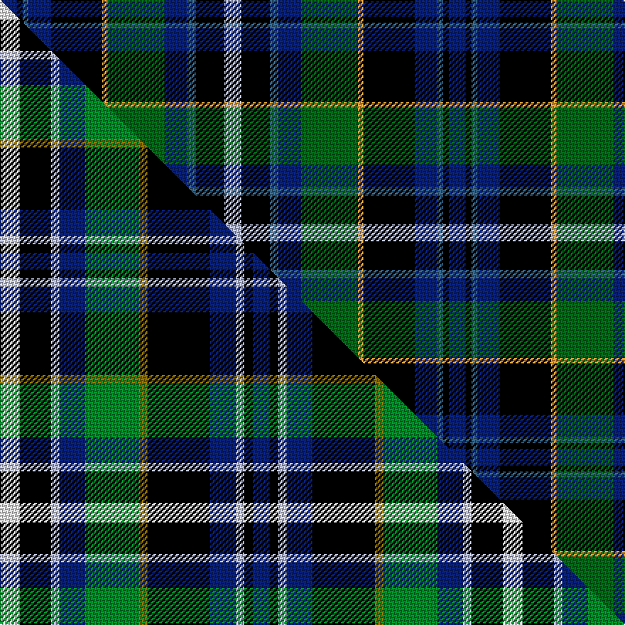

This is one **variant** — a specific cloth: this exact thread count and colourway, with its own
provenance below. It is one weaving of the [sett](/tartans/v/ve/veere/) (the scale-free proportion — the
same cloth at any scale or shade), whose colour order is pattern [BKBBKYGBBKW](/stripes/bkbbkygbbkw/).

Part of the [Veere](/tartans/v/ve/veere/) tartan — the named design grouping this sett with its other cloths.

Sourced from tartans-authority.  It is a [11 stripe tartan](/stripes/stripes11/).

Original link <code>http://www.tartansauthority.com/tartan-ferret/display/2670/</code> — retired · [Internet Archive copy](https://web.archive.org/web/*/http://www.tartansauthority.com/tartan-ferret/display/2670/*)

Dataset <small>— provenance for this record, inherited from the source manifest</small>

<dl class="dataset-prov">
<dt>source</dt><dd><a href="/sources/tartans-authority/">Scottish Tartans Authority</a></dd>
<dt>data captured from</dt><dd><a href="https://github.com/thetartan/tartan-database/blob/master/data/tartans-authority/data.csv">https://github.com/thetartan/tartan-database/blob/master/data/tartans-authority/data.csv</a></dd>
<dt>data date</dt><dd>Oct. 1999 <small>(this record)</small></dd>
<dt>licence</dt><dd><a href="https://creativecommons.org/licenses/by-nc-nd/4.0/">CC BY-NC-ND 4.0</a></dd>
</dl>

Capture chain <small>— the hands this data passed through, oldest first; each capture carries its own licence</small>

<ol class="capture-chain">
<li><a href="https://www.tartansauthority.com/">Scottish Tartans Authority</a> <small>the heritage body’s archive — its tartan-ferret record browser is retired; dead record links are shown unlinked, with an Internet Archive copy (ITI numbers are not SRT references)</small></li>
<li><a href="https://github.com/thetartan/tartan-database">thetartan/tartan-database</a> <small>2016-2017</small> · <a href="https://creativecommons.org/licenses/by-nc-nd/4.0/">CC BY-NC-ND 4.0</a> <small>Levko Kravets's frozen compilation — the capture we vendored, and where its CC licence text came from</small></li>
<li>this dictionary <small>captured 2026-06-10 · commit 5bf86c7566</small> <small>each re-capture is a git commit to data/sources</small></li>
</ol>

## Register references

External register numbers recorded for this tartan.

- Scottish Tartans Authority (ITI): 2670

## Thread count
DB/12 K4 T4 DB16 K36 LO4 DG40 DB16 T6 K20 LB/12

One full sett is **316 threads**.

## Palette
<table><thead><tr><th>Colour</th><th>Shade</th><th>OKLCh</th></tr></thead><tbody><tr><td>T</td><td><code style="background-color:#346488;">#346488</code> <small style="color:#888">#346488</small></td><td><small style="color:#888">oklch(48.6% 0.078 243.0)</small></td></tr><tr><td>DB</td><td><code style="background-color:#082077;">#082077</code> <small style="color:#888">#082077</small></td><td><small style="color:#888">oklch(30.0% 0.149 265.1)</small></td></tr><tr><td>LO</td><td><code style="background-color:#FF9C34;">#FF9C34</code> <small style="color:#888">#FF9C34</small></td><td><small style="color:#888">oklch(77.9% 0.161 61.8)</small></td></tr><tr><td>DG</td><td><code style="background-color:#006818;">#006818</code> <small style="color:#888">#006818</small></td><td><small style="color:#888">oklch(45.0% 0.142 145.0)</small></td></tr><tr><td>K</td><td><code style="background-color:#000000;">#000000</code> <small style="color:#888">#000000</small></td><td><small style="color:#888">oklch(0.0% 0.000 0.0)</small></td></tr><tr><td>LB</td><td><code style="background-color:#B5BBDE;">#B5BBDE</code> <small style="color:#888">#B5BBDE</small></td><td><small style="color:#888">oklch(79.9% 0.050 277.6)</small></td></tr></tbody></table>

# Sample pattern

[Sample sheet (PDF)](swatch.pdf) — the woven sample, thread count and palette on one printable A4, rendered on demand (the same sheet the TTD print page downloads).

## Compared to the master

This cloth is one sett of its design; the master sett (the exemplar the design is anchored on) is below for comparison.

Its **ΔTartan distance** from the master is **0.97** — the same measure the nearest-tartans table ranks by (0 is identical; a re-scale of the same cloth is near 0, a recolour or a different proportion further).

<figure class="master-compare" style="margin:0">

this sett
master sett ★

<figcaption style="color:#888;font-size:smaller">One weave of this sett against the <a href="/setts/w7k11lb3db9g19y3k22db9lb3k3db6/">master sett ★</a>, split on the diagonal: a shared proportion runs seamlessly across it with only the shades shifting; a different proportion breaks on it.</figcaption>
</figure>

## Nearest tartan variants

The nearest existing variants by ΔTartan distance, with this cloth at the top so the swatches line up against it.

ΔTartan

Threads

Variant

Sett

—

316

<a href="/variants/s11/db6k2t2db8k18lo2dg20db8t3k10lb6~x2~t4808243-dg4514144/">Veere (District)</a>

<a href="/ttd/edit/#slug=w7k11lb3db9g19y3k22db9lb3k3db6~x2&amp;base=db6k2t2db8k18lo2dg20db8t3k10lb6~x2~t4808243-dg4514144" title="compare in the TTD">0.97</a>

354

<a href="/variants/s11/w7k11lb3db9g19y3k22db9lb3k3db6~x2/">Veere</a>

<a href="/ttd/edit/#slug=db2r2db2w1db8k8dg8r2dg2ly2~x2&amp;base=db6k2t2db8k18lo2dg20db8t3k10lb6~x2~t4808243-dg4514144" title="compare in the TTD">1.79</a>

140

<a href="/variants/s10/db2r2db2w1db8k8dg8r2dg2ly2~x2/">Logan Rogers (Personal)</a>

<a href="/ttd/edit/#slug=r3k1g12k12dbi12db3dbi12k12g12k1y3~x2~dbi3514276-db2911276&amp;base=db6k2t2db8k18lo2dg20db8t3k10lb6~x2~t4808243-dg4514144" title="compare in the TTD">1.79</a>

320

<a href="/variants/s11/r3k1g12k12dbi12db3dbi12k12g12k1y3~x2~dbi3514276-db2911276/">Gow Hunting (Clan)</a>

<a href="/ttd/edit/#slug=dp2g4k8lo1k1db4lb1db1lb2~x8&amp;base=db6k2t2db8k18lo2dg20db8t3k10lb6~x2~t4808243-dg4514144" title="compare in the TTD">1.80</a>

352

<a href="/variants/s9/dp2g4k8lo1k1db4lb1db1lb2~x8/">Scottish Cultural Society (Corporate</a>

<a href="/ttd/edit/#slug=r3k1g12k12db12lb3db12k12g12k1y3~x2&amp;base=db6k2t2db8k18lo2dg20db8t3k10lb6~x2~t4808243-dg4514144" title="compare in the TTD">1.81</a>

320

<a href="/variants/s11/r3k1g12k12db12lb3db12k12g12k1y3~x2/">Smith Family Tartan</a>

<a href="/ttd/edit/#slug=r3k2g18k18db3k3db3k3db18dy2w3~x2&amp;base=db6k2t2db8k18lo2dg20db8t3k10lb6~x2~t4808243-dg4514144" title="compare in the TTD">1.89</a>

292

<a href="/variants/s11/r3k2g18k18db3k3db3k3db18dy2w3~x2/">Tindal</a>

<a href="/ttd/edit/#slug=r3k2g18k18db3k3db3k3db18y2w3~x2&amp;base=db6k2t2db8k18lo2dg20db8t3k10lb6~x2~t4808243-dg4514144" title="compare in the TTD">1.93</a>

292

<a href="/variants/s11/r3k2g18k18db3k3db3k3db18y2w3~x2/">Tindal</a>

<a href="/ttd/edit/#slug=dp3db13n2db4w2db8k13g10k2g8dp3~x2&amp;base=db6k2t2db8k18lo2dg20db8t3k10lb6~x2~t4808243-dg4514144" title="compare in the TTD">1.93</a>

260

<a href="/variants/s11/dp3db13n2db4w2db8k13g10k2g8dp3~x2/">Smithers</a>

<a href="/ttd/edit/#slug=r3k1g12k12dbi12db3dbi12k12g12k1y3~x2~dbi3912267-db2011270&amp;base=db6k2t2db8k18lo2dg20db8t3k10lb6~x2~t4808243-dg4514144" title="compare in the TTD">1.94</a>

320

<a href="/variants/s11/r3k1g12k12dbi12db3dbi12k12g12k1y3~x2~dbi3912267-db2011270/">Gow Hunting</a>

<a href="/ttd/edit/#slug=k20g18k2y2k5w2k2g18k20dp18t4dp4t4dp18~x2&amp;base=db6k2t2db8k18lo2dg20db8t3k10lb6~x2~t4808243-dg4514144" title="compare in the TTD">1.96</a>

472

<a href="/variants/s14/k20g18k2y2k5w2k2g18k20dp18t4dp4t4dp18~x2/">Shandon (Personal)</a>

## Neighbour map

Every grey dot is one of 13662 variants placed by the first two principal components of the ΔTartan feature space (42% of its variance). Red is this tartan; blue dots are its nearest — click one to open its page. The map is a flat projection of a many-dimensional space — [how to read it](/posts/neighbourhood-maps/).

<svg viewBox="0 0 640 380" role="img" style="max-width:100%;height:auto;border:1px solid #e0e0e0;border-radius:4px;display:block" xmlns="http://www.w3.org/2000/svg"><image href="/nn/cloud.v1.png" width="640" height="380"/><a href="/variants/s11/w7k11lb3db9g19y3k22db9lb3k3db6~x2/"><circle cx="68.1" cy="162.5" r="4" fill="#3465a4"><title>Veere</title></circle></a><a href="/variants/s10/db2r2db2w1db8k8dg8r2dg2ly2~x2/"><circle cx="79.2" cy="164.8" r="4" fill="#3465a4"><title>Logan Rogers (Personal)</title></circle></a><a href="/variants/s11/r3k1g12k12dbi12db3dbi12k12g12k1y3~x2~dbi3514276-db2911276/"><circle cx="79.0" cy="157.1" r="4" fill="#3465a4"><title>Gow Hunting (Clan)</title></circle></a><a href="/variants/s9/dp2g4k8lo1k1db4lb1db1lb2~x8/"><circle cx="81.2" cy="157.4" r="4" fill="#3465a4"><title>Scottish Cultural Society (Corporate</title></circle></a><a href="/variants/s11/r3k1g12k12db12lb3db12k12g12k1y3~x2/"><circle cx="72.1" cy="155.9" r="4" fill="#3465a4"><title>Smith Family Tartan</title></circle></a><a href="/variants/s11/r3k2g18k18db3k3db3k3db18dy2w3~x2/"><circle cx="97.2" cy="135.7" r="4" fill="#3465a4"><title>Tindal</title></circle></a><a href="/variants/s11/r3k2g18k18db3k3db3k3db18y2w3~x2/"><circle cx="96.0" cy="135.4" r="4" fill="#3465a4"><title>Tindal</title></circle></a><a href="/variants/s11/dp3db13n2db4w2db8k13g10k2g8dp3~x2/"><circle cx="80.8" cy="179.2" r="4" fill="#3465a4"><title>Smithers</title></circle></a><a href="/variants/s11/r3k1g12k12dbi12db3dbi12k12g12k1y3~x2~dbi3912267-db2011270/"><circle cx="78.5" cy="157.7" r="4" fill="#3465a4"><title>Gow Hunting</title></circle></a><a href="/variants/s14/k20g18k2y2k5w2k2g18k20dp18t4dp4t4dp18~x2/"><circle cx="96.8" cy="137.7" r="4" fill="#3465a4"><title>Shandon (Personal)</title></circle></a><circle cx="94.2" cy="155.3" r="5" fill="#c00000"/><text x="320" y="376" text-anchor="middle" font-size="11" fill="#999">ground</text><text x="11" y="190" text-anchor="middle" font-size="11" fill="#999" transform="rotate(-90 11 190)">complexity</text></svg>

ID: /variants/s11/db6k2t2db8k18lo2dg20db8t3k10lb6~x2~t4808243-dg4514144/
