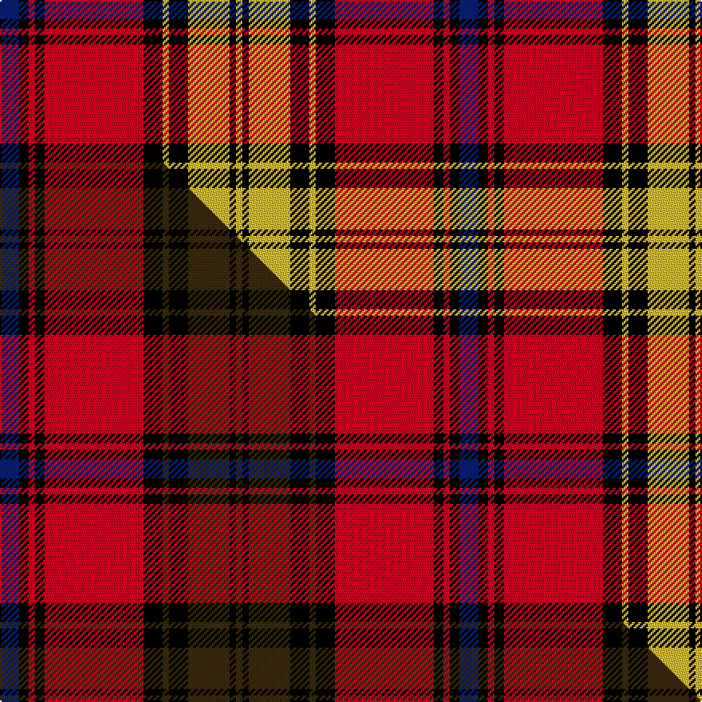

This page is one **sett** — a single exact thread-count. It belongs to the [tartan](/setts/db6k3r2k3r31k6ly2k6ly13k2ly2/)
(the same proportion at any scale), whose colour order is pattern [BKRKRKYKYKY](/stripes/bkrkrkykyky/).

Part of the [Rourke-Frew](/tartans/rourke-frew/) tartan — the named design grouping this sett with its other cloths.

Sourced from tartans-authority.  It is a [11 stripe tartan](/stripes/stripes11/).

Original link https://www.tartanregister.gov.uk/tartanDetails.aspx?ref=10819

Dataset <small>— provenance for this record, inherited from the source manifest</small>

<dl class="dataset-prov">
<dt>source</dt><dd><a href="/sources/tartans-authority/">Scottish Tartans Authority</a></dd>
<dt>data captured from</dt><dd><a href="https://github.com/thetartan/tartan-database/blob/master/data/tartans-authority/data.csv">https://github.com/thetartan/tartan-database/blob/master/data/tartans-authority/data.csv</a></dd>
<dt>data date</dt><dd>23/04/2013 <small>(this record)</small></dd>
<dt>licence</dt><dd><a href="https://creativecommons.org/licenses/by-nc-nd/4.0/">CC BY-NC-ND 4.0</a></dd>
</dl>

Capture chain <small>— the hands this data passed through, oldest first; each capture carries its own licence</small>

<ol class="capture-chain">
<li><a href="https://www.tartansauthority.com/">Scottish Tartans Authority</a> <small>the heritage body's archive — its tartan-ferret record browser is retired (links repaired to the SRT, above)</small></li>
<li><a href="https://github.com/thetartan/tartan-database">thetartan/tartan-database</a> <small>2016-2017</small> · <a href="https://creativecommons.org/licenses/by-nc-nd/4.0/">CC BY-NC-ND 4.0</a> <small>Levko Kravets's frozen compilation — the capture we vendored, and where its CC licence text came from</small></li>
<li>this dictionary <small>captured 2026-06-10 · commit 5bf86c7566</small> <small>each re-capture is a git commit to data/sources</small></li>
</ol>

## Register references

External register numbers recorded for this tartan.

- Scottish Register of Tartans: [10819](https://www.tartanregister.gov.uk/tartanDetails?ref=10819)
- Scottish Tartans Authority (ITI): 10819

## Thread count
DB/12 K6 R4 K6 R62 K12 LY4 K12 LY26 K4 LY/4

One full sett is **288 threads**.

## Palette
<table><thead><tr><th>Colour</th><th>Shade</th><th>OKLCh</th></tr></thead><tbody><tr><td>DB</td><td><code style="background-color:#082077;">#082077</code> <small style="color:#888">#082077</small></td><td><small style="color:#888">oklch(30.0% 0.149 265.1)</small></td></tr><tr><td>LY</td><td><code style="background-color:#DCBC32;">#DCBC32</code> <small style="color:#888">#DCBC32</small></td><td><small style="color:#888">oklch(80.0% 0.150 95.2)</small></td></tr><tr><td>K</td><td><code style="background-color:#000000;">#000000</code> <small style="color:#888">#000000</small></td><td><small style="color:#888">oklch(0.0% 0.000 0.0)</small></td></tr><tr><td>R</td><td><code style="background-color:#D60020;">#D60020</code> <small style="color:#888">#D60020</small></td><td><small style="color:#888">oklch(55.2% 0.224 25.5)</small></td></tr></tbody></table>

# Sample pattern

## Compared to the master

This cloth is one sett of its design; the master sett (the exemplar the design is anchored on) is below for comparison.

Its **ΔTartan distance** from the master is **0.17** — the same measure the nearest-tartans table ranks by (0 is identical; a re-scale of the same cloth is near 0, a recolour or a different proportion further).

<figure class="master-compare" style="margin:0">

this sett
master sett ★

<figcaption style="color:#888;font-size:smaller">One weave of this sett against the <a href="/setts/db6k3r2k3r31k6dy2k6dy13k2dy2/">master sett ★</a>, split on the diagonal: a shared proportion runs seamlessly across it with only the shades shifting; a different proportion breaks on it.</figcaption>
</figure>

## Nearest tartan variants

The nearest existing variants by ΔTartan distance, with this cloth at the top so the swatches line up against it.

ΔTartan

Threads

Variant

Sett

—

288

<a href="/variants/s11/db6k3r2k3r31k6ly2k6ly13k2ly2~x2/">Rourke-Frew (Name)</a>

<a href="/ttd/edit/#slug=db6k3r2k3r31k6dy2k6dy13k2dy2~x2&amp;base=db6k3r2k3r31k6ly2k6ly13k2ly2~x2" title="compare in the TTD">0.17</a>

288

<a href="/variants/s11/db6k3r2k3r31k6dy2k6dy13k2dy2~x2/">Rourke-Frew (Ontario)</a>

<a href="/ttd/edit/#slug=w8k9y9r21y6k6w4k6y6r49k22w4&amp;base=db6k3r2k3r31k6ly2k6ly13k2ly2~x2" title="compare in the TTD">1.60</a>

288

<a href="/variants/s12/w8k9y9r21y6k6w4k6y6r49k22w4/">Normandy (Fashion)</a>

<a href="/ttd/edit/#slug=y20k2y3k2y4k9r18k2r5k2r9~x2&amp;base=db6k3r2k3r31k6ly2k6ly13k2ly2~x2" title="compare in the TTD">1.70</a>

246

<a href="/variants/s11/y20k2y3k2y4k9r18k2r5k2r9~x2/">Aubigny, Auld Alliance</a>

<a href="/ttd/edit/#slug=w20r5w5r81w5r5w20k5w5k60y10k4&amp;base=db6k3r2k3r31k6ly2k6ly13k2ly2~x2" title="compare in the TTD">1.74</a>

426

<a href="/variants/s12/w20r5w5r81w5r5w20k5w5k60y10k4/">Fish Hoek High School</a>

<a href="/ttd/edit/#slug=k9r4k2r4k2r29k9r4lg14y2~x2&amp;base=db6k3r2k3r31k6ly2k6ly13k2ly2~x2" title="compare in the TTD">2.23</a>

294

<a href="/variants/s10/k9r4k2r4k2r29k9r4lg14y2~x2/">Hannay Dress (Dance)</a>

<a href="/ttd/edit/#slug=g4r2k2r20lb1k7r2g10r3k2~x2&amp;base=db6k3r2k3r31k6ly2k6ly13k2ly2~x2" title="compare in the TTD">2.38</a>

200

<a href="/variants/s10/g4r2k2r20lb1k7r2g10r3k2~x2/">MacKillop (Scottish Tartan Society)</a>

<a href="/ttd/edit/#slug=n4ly2n2k5n4k4n8k6n2r32n2w4~x2&amp;base=db6k3r2k3r31k6ly2k6ly13k2ly2~x2" title="compare in the TTD">2.38</a>

284

<a href="/variants/s12/n4ly2n2k5n4k4n8k6n2r32n2w4~x2/">Orr, Gerald William (Personal)</a>

<a href="/ttd/edit/#slug=k6r3k3r24lb4k10r2g4r2g24r6lb2~x2&amp;base=db6k3r2k3r31k6ly2k6ly13k2ly2~x2" title="compare in the TTD">2.40</a>

344

<a href="/variants/s12/k6r3k3r24lb4k10r2g4r2g24r6lb2~x2/">Bates (Name)</a>

<a href="/ttd/edit/#slug=n4y2n2k5n4k4n8k6n2r32n2w4~x2&amp;base=db6k3r2k3r31k6ly2k6ly13k2ly2~x2" title="compare in the TTD">2.45</a>

284

<a href="/variants/s12/n4y2n2k5n4k4n8k6n2r32n2w4~x2/">Orr Senior, Gerald William</a>

<a href="/ttd/edit/#slug=k9r1g1k3g20r5k3r20k5r3y2~x2&amp;base=db6k3r2k3r31k6ly2k6ly13k2ly2~x2" title="compare in the TTD">2.48</a>

266

<a href="/variants/s11/k9r1g1k3g20r5k3r20k5r3y2~x2/">Army Cadet Force (Military)</a>

## Neighbour map

Every grey dot is one of 13620 variants placed by the first two principal components of the ΔTartan feature space (42% of its variance). Red is this tartan; blue dots are its nearest — click one to open its page.

<svg viewBox="0 0 640 380" role="img" style="max-width:100%;height:auto;border:1px solid #e0e0e0;border-radius:4px;display:block" xmlns="http://www.w3.org/2000/svg"><image href="/nn/cloud.v1.png" width="640" height="380"/><a href="/variants/s11/db6k3r2k3r31k6dy2k6dy13k2dy2~x2/"><circle cx="216.2" cy="117.3" r="4" fill="#3465a4"><title>Rourke-Frew (Ontario)</title></circle></a><a href="/variants/s12/w8k9y9r21y6k6w4k6y6r49k22w4/"><circle cx="191.3" cy="129.0" r="4" fill="#3465a4"><title>Normandy (Fashion)</title></circle></a><a href="/variants/s11/y20k2y3k2y4k9r18k2r5k2r9~x2/"><circle cx="213.2" cy="168.9" r="4" fill="#3465a4"><title>Aubigny, Auld Alliance</title></circle></a><a href="/variants/s12/w20r5w5r81w5r5w20k5w5k60y10k4/"><circle cx="192.6" cy="94.4" r="4" fill="#3465a4"><title>Fish Hoek High School</title></circle></a><a href="/variants/s10/k9r4k2r4k2r29k9r4lg14y2~x2/"><circle cx="232.5" cy="128.0" r="4" fill="#3465a4"><title>Hannay Dress (Dance)</title></circle></a><a href="/variants/s10/g4r2k2r20lb1k7r2g10r3k2~x2/"><circle cx="250.7" cy="119.5" r="4" fill="#3465a4"><title>MacKillop (Scottish Tartan Society)</title></circle></a><a href="/variants/s12/n4ly2n2k5n4k4n8k6n2r32n2w4~x2/"><circle cx="198.2" cy="98.5" r="4" fill="#3465a4"><title>Orr, Gerald William (Personal)</title></circle></a><a href="/variants/s12/k6r3k3r24lb4k10r2g4r2g24r6lb2~x2/"><circle cx="174.0" cy="136.2" r="4" fill="#3465a4"><title>Bates (Name)</title></circle></a><a href="/variants/s12/n4y2n2k5n4k4n8k6n2r32n2w4~x2/"><circle cx="200.7" cy="99.3" r="4" fill="#3465a4"><title>Orr Senior, Gerald William</title></circle></a><a href="/variants/s11/k9r1g1k3g20r5k3r20k5r3y2~x2/"><circle cx="192.0" cy="120.5" r="4" fill="#3465a4"><title>Army Cadet Force (Military)</title></circle></a><circle cx="194.0" cy="111.7" r="5" fill="#c00000"/><text x="320" y="376" text-anchor="middle" font-size="11" fill="#999">ground</text><text x="11" y="190" text-anchor="middle" font-size="11" fill="#999" transform="rotate(-90 11 190)">complexity</text></svg>

ID: /variants/s11/db6k3r2k3r31k6ly2k6ly13k2ly2~x2/
