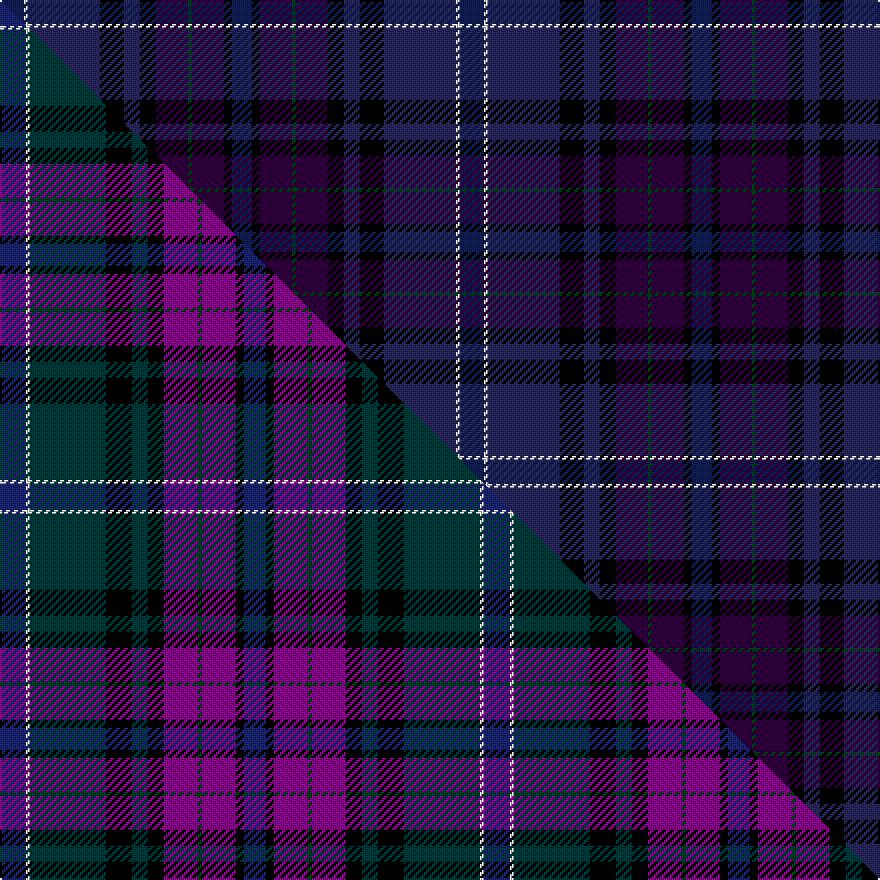

This is one **variant** — a specific cloth: this exact thread count and colourway, with its own
provenance below. It is one weaving of the [sett](/tartans/b/bu/bute-heather-4/) (the scale-free proportion — the
same cloth at any scale or shade), whose colour order is pattern [BKBGBKBKBWB](/stripes/bkbgbkbkbwb/).

Part of the [Bute Heather](/tartans/b/bu/bute-heather-4/) tartan — the named design grouping this sett with its other cloths.

Sourced from register-of-tartans.  It is a [11 stripe tartan](/stripes/stripes11/).

Original link [https://www.tartanregister.gov.uk/tartanDetails.aspx?ref=5821](https://www.tartanregister.gov.uk/tartanDetails.aspx?ref=5821)

Dataset <small>— provenance for this record, inherited from the source manifest</small>

<dl class="dataset-prov">
<dt>source</dt><dd><a href="/sources/register-of-tartans/">Scottish Register of Tartans</a></dd>
<dt>data captured from</dt><dd><a href="https://github.com/thetartan/tartan-database/blob/master/data/register-of-tartans/data.csv">https://github.com/thetartan/tartan-database/blob/master/data/register-of-tartans/data.csv</a></dd>
<dt>data date</dt><dd>01/08/2007 <small>(this record)</small></dd>
<dt>licence</dt><dd><a href="https://www.tartanregister.gov.uk/copyright">Crown copyright</a></dd>
</dl>

Capture chain <small>— the hands this data passed through, oldest first; each capture carries its own licence</small>

<ol class="capture-chain">
<li><a href="https://www.tartanregister.gov.uk/">Scottish Register of Tartans</a> · <a href="https://www.tartanregister.gov.uk/copyright">Crown copyright</a> <small>the living register — still published by National Records of Scotland</small></li>
<li><a href="https://github.com/thetartan/tartan-database">thetartan/tartan-database</a> <small>2016-2017</small> · <a href="https://creativecommons.org/licenses/by-nc-nd/4.0/">CC BY-NC-ND 4.0</a> <small>Levko Kravets's frozen compilation — the capture we vendored, and where its CC licence text came from</small></li>
<li>this dictionary <small>captured 2026-06-10 · commit 5bf86c7566</small> <small>each re-capture is a git commit to data/sources</small></li>
</ol>

## Register references

External register numbers recorded for this tartan.

- Scottish Register of Tartans: [5821](https://www.tartanregister.gov.uk/tartanDetails.aspx?ref=5821)
- Scottish Tartans World Register: 3233

## Thread count
DB/12 W2 DT36 K12 DT8 K8 DP16 DG2 DP16 K4 DB/10

One full sett is **230 threads**.

## Palette
<table><thead><tr><th>Colour</th><th>Shade</th><th>OKLCh</th></tr></thead><tbody><tr><td>DB</td><td><code style="background-color:#141E46;">#141E46</code> <small style="color:#888">#141E46</small></td><td><small style="color:#888">oklch(25.2% 0.076 269.7)</small></td></tr><tr><td>DT</td><td><code style="background-color:#282850;">#282850</code> <small style="color:#888">#282850</small></td><td><small style="color:#888">oklch(29.9% 0.071 281.2)</small></td></tr><tr><td>DG</td><td><code style="background-color:#053819;">#053819</code> <small style="color:#888">#053819</small></td><td><small style="color:#888">oklch(30.0% 0.075 151.3)</small></td></tr><tr><td>DP</td><td><code style="background-color:#280032;">#280032</code> <small style="color:#888">#280032</small></td><td><small style="color:#888">oklch(20.3% 0.098 318.7)</small></td></tr><tr><td>K</td><td><code style="background-color:#000000;">#000000</code> <small style="color:#888">#000000</small></td><td><small style="color:#888">oklch(0.0% 0.000 0.0)</small></td></tr><tr><td>W</td><td><code style="background-color:#F7F7F7;">#F7F7F7</code> <small style="color:#888">#F7F7F7</small></td><td><small style="color:#888">oklch(97.6% 0.000 89.9)</small></td></tr></tbody></table>

# Sample pattern

## Compared to the master

This cloth is one sett of its design; the master sett (the exemplar the design is anchored on) is below for comparison.

Its **ΔTartan distance** from the master is **3.03** — the same measure the nearest-tartans table ranks by (0 is identical; a re-scale of the same cloth is near 0, a recolour or a different proportion further).

<figure class="master-compare" style="margin:0">

this sett
master sett ★

<figcaption style="color:#888;font-size:smaller">One weave of this sett against the <a href="/setts/db13w2dt38k13dt8k8dp17dg2dp17k4db11/">master sett ★</a>, split on the diagonal: a shared proportion runs seamlessly across it with only the shades shifting; a different proportion breaks on it.</figcaption>
</figure>

## Nearest tartan variants

The nearest existing variants by ΔTartan distance, with this cloth at the top so the swatches line up against it.

ΔTartan

Threads

Variant

Sett

—

230

<a href="/variants/s11/db6w1dt18k6dt4k4dp8dg1dp8k2db5~x2~db1003265-dt1203284-dp0804317/">Bute Heather, Modern</a>

<a href="/ttd/edit/#slug=db13w2dt38k13dt8k8dp17dg2dp17k4db11&amp;base=db6w1dt18k6dt4k4dp8dg1dp8k2db5~x2~db1003265-dt1203284-dp0804317" title="compare in the TTD">3.03</a>

242

<a href="/variants/s11/db13w2dt38k13dt8k8dp17dg2dp17k4db11/">Bute Heather (Fashion)</a>

<a href="/ttd/edit/#slug=db45dp6n6dp30dg6dp6dg30k4r4k3&amp;base=db6w1dt18k6dt4k4dp8dg1dp8k2db5~x2~db1003265-dt1203284-dp0804317" title="compare in the TTD">3.05</a>

232

<a href="/variants/s10/db45dp6n6dp30dg6dp6dg30k4r4k3/">Dalgliesh, Ewen (Personal)</a>

<a href="/ttd/edit/#slug=db6ki2dp14ki5dp14ki3k4ki6k24w2dp6~x2~ki0700000-k0504259&amp;base=db6w1dt18k6dt4k4dp8dg1dp8k2db5~x2~db1003265-dt1203284-dp0804317" title="compare in the TTD">3.29</a>

320

<a href="/variants/s11/db6ki2dp14ki5dp14ki3k4ki6k24w2dp6~x2~ki0700000-k0504259/">Dunn (Canada) (Name)</a>

<a href="/ttd/edit/#slug=k15ki4k4ki4k4ki16db16ki2g3ki2db16ki16k18ki1w2~x2~k0504259-ki0700000&amp;base=db6w1dt18k6dt4k4dp8dg1dp8k2db5~x2~db1003265-dt1203284-dp0804317" title="compare in the TTD">3.30</a>

458

<a href="/variants/s15/k15ki4k4ki4k4ki16db16ki2g3ki2db16ki16k18ki1w2~x2~k0504259-ki0700000/">McCruden, Raymond (Personal)</a>

<a href="/ttd/edit/#slug=db6k2dp9lb1dp9k2dt4k6dt24w1db6~x2&amp;base=db6w1dt18k6dt4k4dp8dg1dp8k2db5~x2~db1003265-dt1203284-dp0804317" title="compare in the TTD">3.37</a>

256

<a href="/variants/s11/db6k2dp9lb1dp9k2dt4k6dt24w1db6~x2/">Newlands, Charlie (Personal)</a>

<a href="/ttd/edit/#slug=dti13w2dt38k13dt8k8dp17dg2dp17k4dti11~dti1204274-dp1607327&amp;base=db6w1dt18k6dt4k4dp8dg1dp8k2db5~x2~db1003265-dt1203284-dp0804317" title="compare in the TTD">3.62</a>

242

<a href="/variants/s11/db13w2dt38k13dt8k8dp17dg2dp17k4db11~db1204274-dp1607327/">Bute Heather</a>

<a href="/ttd/edit/#slug=do18k2do2k2do9dg10dy2dg10dp11k9dp2k2dp1r3~x2&amp;base=db6w1dt18k6dt4k4dp8dg1dp8k2db5~x2~db1003265-dt1203284-dp0804317" title="compare in the TTD">3.77</a>

290

<a href="/variants/s14/do18k2do2k2do9dg10dy2dg10dp11k9dp2k2dp1r3~x2/">Hay-Gray (Personal)</a>

<a href="/ttd/edit/#slug=db6dpi10dp4dpi11dg20k4dg8k21dt47db2~db1406275-dpi1607327-dp1105325-dt1204274&amp;base=db6w1dt18k6dt4k4dp8dg1dp8k2db5~x2~db1003265-dt1203284-dp0804317" title="compare in the TTD">3.79</a>

258

<a href="/variants/s10/dbi6dpi10dp4dpi11dg20k4dg8k21db47dbi2~dbi1406275-dpi1607327-dp1105325-db1204274/">Spirit of Alva (Fashion)</a>

<a href="/ttd/edit/#slug=k4db16lb2db16dr4dp7dg21dr3dg4do3~x2&amp;base=db6w1dt18k6dt4k4dp8dg1dp8k2db5~x2~db1003265-dt1203284-dp0804317" title="compare in the TTD">3.87</a>

306

<a href="/variants/s10/k4db16lb2db16dr4dp7dg21dr3dg4do3~x2/">Scottish Lion Name Tartan</a>

## Neighbour map

Every grey dot is one of 13656 variants placed by the first two principal components of the ΔTartan feature space (42% of its variance). Red is this tartan; blue dots are its nearest — click one to open its page. The map is a flat projection of a many-dimensional space — [how to read it](/posts/neighbourhood-maps/).

<svg viewBox="0 0 640 380" role="img" style="max-width:100%;height:auto;border:1px solid #e0e0e0;border-radius:4px;display:block" xmlns="http://www.w3.org/2000/svg"><image href="/nn/cloud.v1.png" width="640" height="380"/><a href="/variants/s11/db13w2dt38k13dt8k8dp17dg2dp17k4db11/"><circle cx="201.3" cy="156.0" r="4" fill="#3465a4"><title>Bute Heather (Fashion)</title></circle></a><a href="/variants/s10/db45dp6n6dp30dg6dp6dg30k4r4k3/"><circle cx="239.6" cy="159.4" r="4" fill="#3465a4"><title>Dalgliesh, Ewen (Personal)</title></circle></a><a href="/variants/s11/db6ki2dp14ki5dp14ki3k4ki6k24w2dp6~x2~ki0700000-k0504259/"><circle cx="258.8" cy="183.8" r="4" fill="#3465a4"><title>Dunn (Canada) (Name)</title></circle></a><a href="/variants/s15/k15ki4k4ki4k4ki16db16ki2g3ki2db16ki16k18ki1w2~x2~k0504259-ki0700000/"><circle cx="264.2" cy="168.6" r="4" fill="#3465a4"><title>McCruden, Raymond (Personal)</title></circle></a><a href="/variants/s11/db6k2dp9lb1dp9k2dt4k6dt24w1db6~x2/"><circle cx="242.0" cy="131.1" r="4" fill="#3465a4"><title>Newlands, Charlie (Personal)</title></circle></a><a href="/variants/s11/db13w2dt38k13dt8k8dp17dg2dp17k4db11~db1204274-dp1607327/"><circle cx="177.0" cy="144.8" r="4" fill="#3465a4"><title>Bute Heather</title></circle></a><a href="/variants/s14/do18k2do2k2do9dg10dy2dg10dp11k9dp2k2dp1r3~x2/"><circle cx="220.8" cy="152.3" r="4" fill="#3465a4"><title>Hay-Gray (Personal)</title></circle></a><a href="/variants/s10/dbi6dpi10dp4dpi11dg20k4dg8k21db47dbi2~dbi1406275-dpi1607327-dp1105325-db1204274/"><circle cx="218.7" cy="135.9" r="4" fill="#3465a4"><title>Spirit of Alva (Fashion)</title></circle></a><a href="/variants/s10/k4db16lb2db16dr4dp7dg21dr3dg4do3~x2/"><circle cx="223.5" cy="177.1" r="4" fill="#3465a4"><title>Scottish Lion Name Tartan</title></circle></a><circle cx="243.8" cy="173.7" r="5" fill="#c00000"/><text x="320" y="376" text-anchor="middle" font-size="11" fill="#999">ground</text><text x="11" y="190" text-anchor="middle" font-size="11" fill="#999" transform="rotate(-90 11 190)">complexity</text></svg>

ID: /variants/s11/db6w1dt18k6dt4k4dp8dg1dp8k2db5~x2~db1003265-dt1203284-dp0804317/
