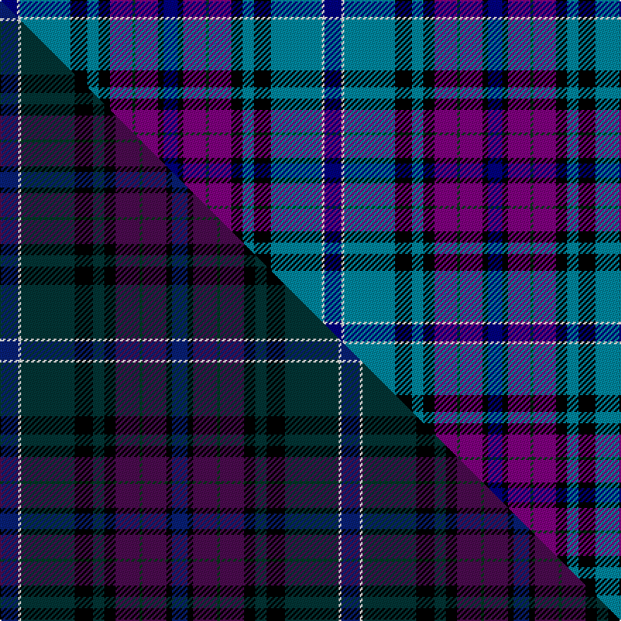

This is one **variant** — a specific cloth: this exact thread count and colourway, with its own
provenance below. It is one weaving of the [sett](/tartans/b/bu/bute-heather-4/) (the scale-free proportion — the
same cloth at any scale or shade), whose colour order is pattern [BKBGBKBKBWB](/stripes/bkbgbkbkbwb/).

Part of the [Bute Heather](/tartans/b/bu/bute-heather-4/) tartan — the named design grouping this sett with its other cloths.

Sourced from register-of-tartans.  It is a [11 stripe tartan](/stripes/stripes11/).

Original link [https://www.tartanregister.gov.uk/tartanDetails.aspx?ref=5939](https://www.tartanregister.gov.uk/tartanDetails.aspx?ref=5939)

Dataset <small>— provenance for this record, inherited from the source manifest</small>

<dl class="dataset-prov">
<dt>source</dt><dd><a href="/sources/register-of-tartans/">Scottish Register of Tartans</a></dd>
<dt>data captured from</dt><dd><a href="https://github.com/thetartan/tartan-database/blob/master/data/register-of-tartans/data.csv">https://github.com/thetartan/tartan-database/blob/master/data/register-of-tartans/data.csv</a></dd>
<dt>data date</dt><dd>01/08/2007 <small>(this record)</small></dd>
<dt>licence</dt><dd><a href="https://www.tartanregister.gov.uk/copyright">Crown copyright</a></dd>
</dl>

Capture chain <small>— the hands this data passed through, oldest first; each capture carries its own licence</small>

<ol class="capture-chain">
<li><a href="https://www.tartanregister.gov.uk/">Scottish Register of Tartans</a> · <a href="https://www.tartanregister.gov.uk/copyright">Crown copyright</a> <small>the living register — still published by National Records of Scotland</small></li>
<li><a href="https://github.com/thetartan/tartan-database">thetartan/tartan-database</a> <small>2016-2017</small> · <a href="https://creativecommons.org/licenses/by-nc-nd/4.0/">CC BY-NC-ND 4.0</a> <small>Levko Kravets's frozen compilation — the capture we vendored, and where its CC licence text came from</small></li>
<li>this dictionary <small>captured 2026-06-10 · commit 5bf86c7566</small> <small>each re-capture is a git commit to data/sources</small></li>
</ol>

## Register references

External register numbers recorded for this tartan.

- Scottish Register of Tartans: [5939](https://www.tartanregister.gov.uk/tartanDetails.aspx?ref=5939)
- Scottish Tartans Authority (ITI): 6885
- Scottish Tartans World Register: 3235

## Thread count
DB/12 W2 T36 K12 T8 K8 DP16 DG2 DP16 K4 DB/10

One full sett is **230 threads**.

## Palette
<table><thead><tr><th>Colour</th><th>Shade</th><th>OKLCh</th></tr></thead><tbody><tr><td>T</td><td><code style="background-color:#00879F;">#00879F</code> <small style="color:#888">#00879F</small></td><td><small style="color:#888">oklch(57.4% 0.102 216.1)</small></td></tr><tr><td>DB</td><td><code style="background-color:#000080;">#000080</code> <small style="color:#888">#000080</small></td><td><small style="color:#888">oklch(27.1% 0.188 264.1)</small></td></tr><tr><td>K</td><td><code style="background-color:#000000;">#000000</code> <small style="color:#888">#000000</small></td><td><small style="color:#888">oklch(0.0% 0.000 0.0)</small></td></tr><tr><td>DG</td><td><code style="background-color:#053819;">#053819</code> <small style="color:#888">#053819</small></td><td><small style="color:#888">oklch(30.0% 0.075 151.3)</small></td></tr><tr><td>W</td><td><code style="background-color:#F7F7F7;">#F7F7F7</code> <small style="color:#888">#F7F7F7</small></td><td><small style="color:#888">oklch(97.6% 0.000 89.9)</small></td></tr><tr><td>DP</td><td><code style="background-color:#800080;">#800080</code> <small style="color:#888">#800080</small></td><td><small style="color:#888">oklch(42.1% 0.193 328.4)</small></td></tr></tbody></table>

# Sample pattern

## Compared to the master

This cloth is one sett of its design; the master sett (the exemplar the design is anchored on) is below for comparison.

Its **ΔTartan distance** from the master is **3.75** — the same measure the nearest-tartans table ranks by (0 is identical; a re-scale of the same cloth is near 0, a recolour or a different proportion further).

<figure class="master-compare" style="margin:0">

this sett
master sett ★

<figcaption style="color:#888;font-size:smaller">One weave of this sett against the <a href="/setts/db13w2dt38k13dt8k8dp17dg2dp17k4db11/">master sett ★</a>, split on the diagonal: a shared proportion runs seamlessly across it with only the shades shifting; a different proportion breaks on it.</figcaption>
</figure>

## Nearest tartan variants

The nearest existing variants by ΔTartan distance, with this cloth at the top so the swatches line up against it.

ΔTartan

Threads

Variant

Sett

—

230

<a href="/variants/s11/db6w1t18k6t4k4dp8dg1dp8k2db5~x2~db1108266-dp1708331/">Bute Heather, Ancient</a>

<a href="/ttd/edit/#slug=b6db22k12dp10g3k1g3dp10b2w2~x2~b1611266-db1108266&amp;base=db6w1t18k6t4k4dp8dg1dp8k2db5~x2~db1108266-dp1708331" title="compare in the TTD">2.41</a>

268

<a href="/variants/s10/b6db22k12dp10g3k1g3dp10b2w2~x2~b1511266-db1108266/">Cowal</a>

<a href="/ttd/edit/#slug=r7db2b5db2k24db2b10db28b10w3~x2&amp;base=db6w1t18k6t4k4dp8dg1dp8k2db5~x2~db1108266-dp1708331" title="compare in the TTD">2.54</a>

352

<a href="/variants/s10/r7db2b5db2k24db2b10db28b10w3~x2/">Colgan, USA, Robert James</a>

<a href="/ttd/edit/#slug=k2db12k8lb10y1lb10k4r1k4db12k2g2~x2&amp;base=db6w1t18k6t4k4dp8dg1dp8k2db5~x2~db1108266-dp1708331" title="compare in the TTD">2.60</a>

264

<a href="/variants/s12/k2db12k8lb10y1lb10k4r1k4db12k2g2~x2/">Auchinachie</a>

<a href="/ttd/edit/#slug=db4dy3db22r6w2k6w2db6n20k3n4~x2&amp;base=db6w1t18k6t4k4dp8dg1dp8k2db5~x2~db1108266-dp1708331" title="compare in the TTD">2.61</a>

296

<a href="/variants/s11/db4dy3db22r6w2k6w2db6n20k3n4~x2/">Asman Hunting (Name)</a>

<a href="/ttd/edit/#slug=w4db8dr3db25k13b4lb29db3lb8db2dr3~x2&amp;base=db6w1t18k6t4k4dp8dg1dp8k2db5~x2~db1108266-dp1708331" title="compare in the TTD">2.68</a>

394

<a href="/variants/s11/w4db8dr3db25k13b4lb29db3lb8db2dr3~x2/">Air Force</a>

<a href="/ttd/edit/#slug=g12db4b54n26k4w8db18n44w3db12w4~db0805267-n1604274&amp;base=db6w1t18k6t4k4dp8dg1dp8k2db5~x2~db1108266-dp1708331" title="compare in the TTD">2.68</a>

362

<a href="/variants/s11/g12db4b54dbi26k4w8db18dbi44w3db12w4~db0805267-dbi1604274/">Scottish Motor Trade Association</a>

<a href="/ttd/edit/#slug=w4dbi8dr3dbi25k13db4lb29dbi3lb8dbi2dr3~x2~dbi1406275-db1106275&amp;base=db6w1t18k6t4k4dp8dg1dp8k2db5~x2~db1108266-dp1708331" title="compare in the TTD">2.70</a>

394

<a href="/variants/s11/w4dbi8dr3dbi25k13db4lb29dbi3lb8dbi2dr3~x2~dbi1406275-db1106275/">Royal Air Force Regimental Tartan</a>

<a href="/ttd/edit/#slug=db1w2t12k2db2k2dp15db2y1~x2&amp;base=db6w1t18k6t4k4dp8dg1dp8k2db5~x2~db1108266-dp1708331" title="compare in the TTD">2.73</a>

152

<a href="/variants/s9/db1w2t12k2db2k2dp15db2y1~x2/">Hek Family (Sunningdale, Berwick on Tweed)</a>

<a href="/ttd/edit/#slug=k5lb5y2lb5k5db25k5lb3dg5r2dg5lb3k5~x2&amp;base=db6w1t18k6t4k4dp8dg1dp8k2db5~x2~db1108266-dp1708331" title="compare in the TTD">2.81</a>

280

<a href="/variants/s13/k5lb5y2lb5k5db25k5lb3dg5r2dg5lb3k5~x2/">Liberton</a>

<a href="/ttd/edit/#slug=db4w3db17lb10k1dp5k1lb6g3~x2&amp;base=db6w1t18k6t4k4dp8dg1dp8k2db5~x2~db1108266-dp1708331" title="compare in the TTD">2.86</a>

186

<a href="/variants/s9/db4w3db17lb10k1dp5k1lb6g3~x2/">Queen Margaret University</a>

## Neighbour map

Every grey dot is one of 13656 variants placed by the first two principal components of the ΔTartan feature space (42% of its variance). Red is this tartan; blue dots are its nearest — click one to open its page. The map is a flat projection of a many-dimensional space — [how to read it](/posts/neighbourhood-maps/).

<svg viewBox="0 0 640 380" role="img" style="max-width:100%;height:auto;border:1px solid #e0e0e0;border-radius:4px;display:block" xmlns="http://www.w3.org/2000/svg"><image href="/nn/cloud.v1.png" width="640" height="380"/><a href="/variants/s10/b6db22k12dp10g3k1g3dp10b2w2~x2~b1511266-db1108266/"><circle cx="132.2" cy="125.9" r="4" fill="#3465a4"><title>Cowal</title></circle></a><a href="/variants/s10/r7db2b5db2k24db2b10db28b10w3~x2/"><circle cx="153.7" cy="142.5" r="4" fill="#3465a4"><title>Colgan, USA, Robert James</title></circle></a><a href="/variants/s12/k2db12k8lb10y1lb10k4r1k4db12k2g2~x2/"><circle cx="88.3" cy="135.5" r="4" fill="#3465a4"><title>Auchinachie</title></circle></a><a href="/variants/s11/db4dy3db22r6w2k6w2db6n20k3n4~x2/"><circle cx="158.0" cy="138.9" r="4" fill="#3465a4"><title>Asman Hunting (Name)</title></circle></a><a href="/variants/s11/w4db8dr3db25k13b4lb29db3lb8db2dr3~x2/"><circle cx="127.5" cy="120.1" r="4" fill="#3465a4"><title>Air Force</title></circle></a><a href="/variants/s11/g12db4b54dbi26k4w8db18dbi44w3db12w4~db0805267-dbi1604274/"><circle cx="164.7" cy="129.3" r="4" fill="#3465a4"><title>Scottish Motor Trade Association</title></circle></a><a href="/variants/s11/w4dbi8dr3dbi25k13db4lb29dbi3lb8dbi2dr3~x2~dbi1406275-db1106275/"><circle cx="130.8" cy="119.8" r="4" fill="#3465a4"><title>Royal Air Force Regimental Tartan</title></circle></a><a href="/variants/s9/db1w2t12k2db2k2dp15db2y1~x2/"><circle cx="167.4" cy="120.4" r="4" fill="#3465a4"><title>Hek Family (Sunningdale, Berwick on Tweed)</title></circle></a><a href="/variants/s13/k5lb5y2lb5k5db25k5lb3dg5r2dg5lb3k5~x2/"><circle cx="87.0" cy="113.2" r="4" fill="#3465a4"><title>Liberton</title></circle></a><a href="/variants/s9/db4w3db17lb10k1dp5k1lb6g3~x2/"><circle cx="151.7" cy="130.6" r="4" fill="#3465a4"><title>Queen Margaret University</title></circle></a><circle cx="122.7" cy="131.4" r="5" fill="#c00000"/><text x="320" y="376" text-anchor="middle" font-size="11" fill="#999">ground</text><text x="11" y="190" text-anchor="middle" font-size="11" fill="#999" transform="rotate(-90 11 190)">complexity</text></svg>

ID: /variants/s11/db6w1t18k6t4k4dp8dg1dp8k2db5~x2~db1108266-dp1708331/
