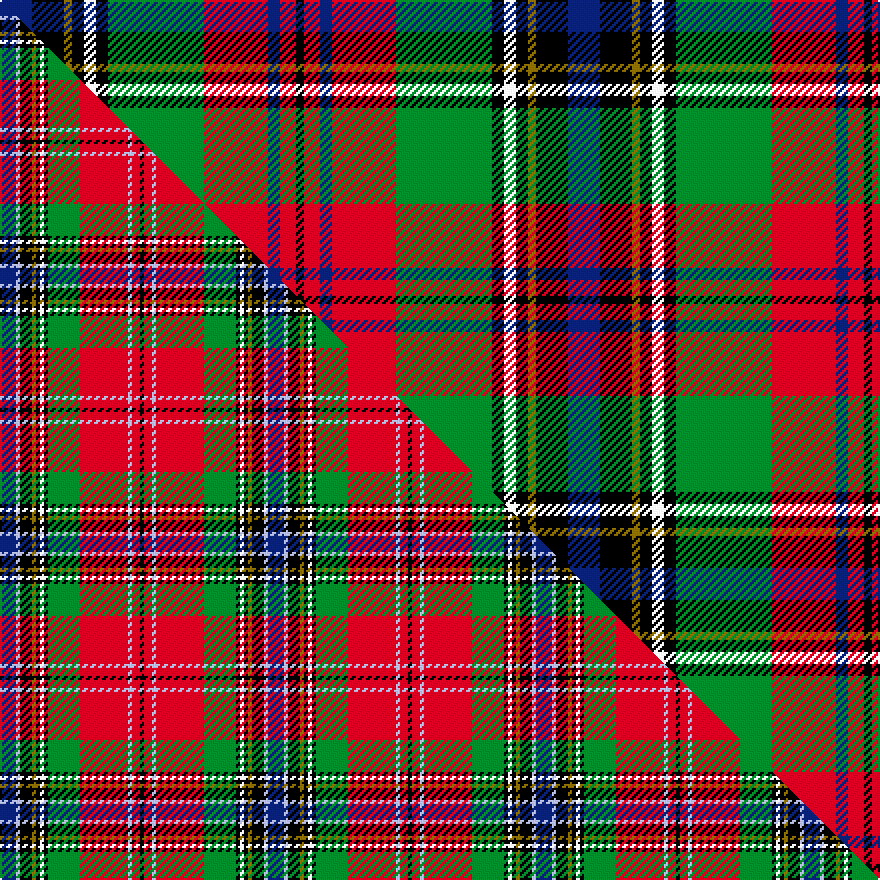

This page is one **sett** — a single exact thread-count. It belongs to the [tartan](/setts/db8k8y2k3w3k3g24r16db3r4k2/)
(the same proportion at any scale), whose colour order is pattern [BKGKWKGRBRK](/stripes/bkgkwkgrbrk/).

Part of the [MacLean](/tartans/maclean/) tartan — the named design grouping this sett with its other cloths.

Sourced from register-of-tartans.  It is a [11 stripe tartan](/stripes/stripes11/).

Original link https://www.tartanregister.gov.uk/tartanDetails.aspx?ref=2601

2 attestations — the source records this cloth was collapsed from (oldest owns this page)

<ul>
<li>undated — MacLean (register-of-tartans, <a href="https://www.tartanregister.gov.uk/tartanDetails.aspx?ref=2601">record</a>)  <em>White and Yellow are in silk.</em></li>
<li>undated — MacLean (weddslist, <a href="http://www.weddslist.com/cgi-bin/tartans/pg.pl?source=sts">record</a>) </li>
</ul>

## Register references

External register numbers recorded for this tartan.

- Scottish Register of Tartans: [2601](https://www.tartanregister.gov.uk/tartanDetails.aspx?ref=2601)
- Scottish Tartans World Register: 374

## Thread count
DB/16 K16 Y4 K6 W6 K6 G48 R32 DB6 R8 K/4

One full sett is **284 threads**.

## Palette
<table><thead><tr><th>Colour</th><th>Shade</th><th>OKLCh</th></tr></thead><tbody><tr><td>DB</td><td><code style="background-color:#082077;">#082077</code> <small style="color:#888">#082077</small></td><td><small style="color:#888">oklch(30.0% 0.149 265.1)</small></td></tr><tr><td>G</td><td><code style="background-color:#008B2A;">#008B2A</code> <small style="color:#888">#008B2A</small></td><td><small style="color:#888">oklch(55.4% 0.170 145.9)</small></td></tr><tr><td>K</td><td><code style="background-color:#000000;">#000000</code> <small style="color:#888">#000000</small></td><td><small style="color:#888">oklch(0.0% 0.000 0.0)</small></td></tr><tr><td>W</td><td><code style="background-color:#F7F7F7;">#F7F7F7</code> <small style="color:#888">#F7F7F7</small></td><td><small style="color:#888">oklch(97.6% 0.000 89.9)</small></td></tr><tr><td>R</td><td><code style="background-color:#D60020;">#D60020</code> <small style="color:#888">#D60020</small></td><td><small style="color:#888">oklch(55.2% 0.224 25.5)</small></td></tr><tr><td>Y</td><td><code style="background-color:#8B6E00;">#8B6E00</code> <small style="color:#888">#8B6E00</small></td><td><small style="color:#888">oklch(55.1% 0.113 90.4)</small></td></tr></tbody></table>

# Sample pattern

## Compared to the master

This cloth is one sett of its design; the master sett (the exemplar the design is anchored on) is below for comparison.

Its **ΔTartan distance** from the master is **1.41** — the same measure the nearest-tartans table ranks by (0 is identical; a re-scale of the same cloth is near 0, a recolour or a different proportion further).

<figure class="master-compare" style="margin:0">

this sett
master sett ★

<figcaption style="color:#888;font-size:smaller">One weave of this sett against the <a href="/setts/db4lb1k3y1k1w1k1g8r12lb1r2k1/">master sett ★</a>, split on the diagonal: a shared proportion runs seamlessly across it with only the shades shifting; a different proportion breaks on it.</figcaption>
</figure>

## Nearest tartan variants

The nearest existing variants by ΔTartan distance, with this cloth at the top so the swatches line up against it.

ΔTartan

Threads

Variant

Sett

—

284

<a href="/variants/s11/db8k8y2k3w3k3g24r16db3r4k2~x2/">MacLean</a>

<a href="/ttd/edit/#slug=db4w1k3y1g1w1k1g8r12w1r2k1~x2&amp;base=db8k8y2k3w3k3g24r16db3r4k2~x2" title="compare in the TTD">2.23</a>

134

<a href="/variants/s12/db4w1k3y1g1w1k1g8r12w1r2k1~x2/">MacLean</a>

<a href="/ttd/edit/#slug=r20lb14k17y2k3w3k3g24r14k4r4w2~x2&amp;base=db8k8y2k3w3k3g24r16db3r4k2~x2" title="compare in the TTD">2.84</a>

396

<a href="/variants/s12/r20lb14k17y2k3w3k3g24r14k4r4w2~x2/">Stuart/Stewart #2</a>

<a href="/ttd/edit/#slug=lb1dg8k1lb2k1y2k1lb2k1r8w1lb1~x4&amp;base=db8k8y2k3w3k3g24r16db3r4k2~x2" title="compare in the TTD">2.87</a>

224

<a href="/variants/s12/lb1dg8k1lb2k1y2k1lb2k1r8w1lb1~x4/">MacWhirter</a>

## Neighbour map

Every grey dot is one of 13620 variants placed by the first two principal components of the ΔTartan feature space (42% of its variance). Red is this tartan; blue dots are its nearest — click one to open its page.

<svg viewBox="0 0 640 380" role="img" style="max-width:100%;height:auto;border:1px solid #e0e0e0;border-radius:4px;display:block" xmlns="http://www.w3.org/2000/svg"><image href="/nn/cloud.v1.png" width="640" height="380"/><a href="/variants/s12/db4w1k3y1g1w1k1g8r12w1r2k1~x2/"><circle cx="120.6" cy="105.2" r="4" fill="#3465a4"><title>MacLean</title></circle></a><a href="/variants/s12/r20lb14k17y2k3w3k3g24r14k4r4w2~x2/"><circle cx="79.4" cy="123.5" r="4" fill="#3465a4"><title>Stuart/Stewart #2</title></circle></a><a href="/variants/s12/lb1dg8k1lb2k1y2k1lb2k1r8w1lb1~x4/"><circle cx="60.1" cy="128.6" r="4" fill="#3465a4"><title>MacWhirter</title></circle></a><circle cx="82.4" cy="122.6" r="5" fill="#c00000"/><text x="320" y="376" text-anchor="middle" font-size="11" fill="#999">ground</text><text x="11" y="190" text-anchor="middle" font-size="11" fill="#999" transform="rotate(-90 11 190)">complexity</text></svg>

ID: /variants/s11/db8k8y2k3w3k3g24r16db3r4k2~x2/
