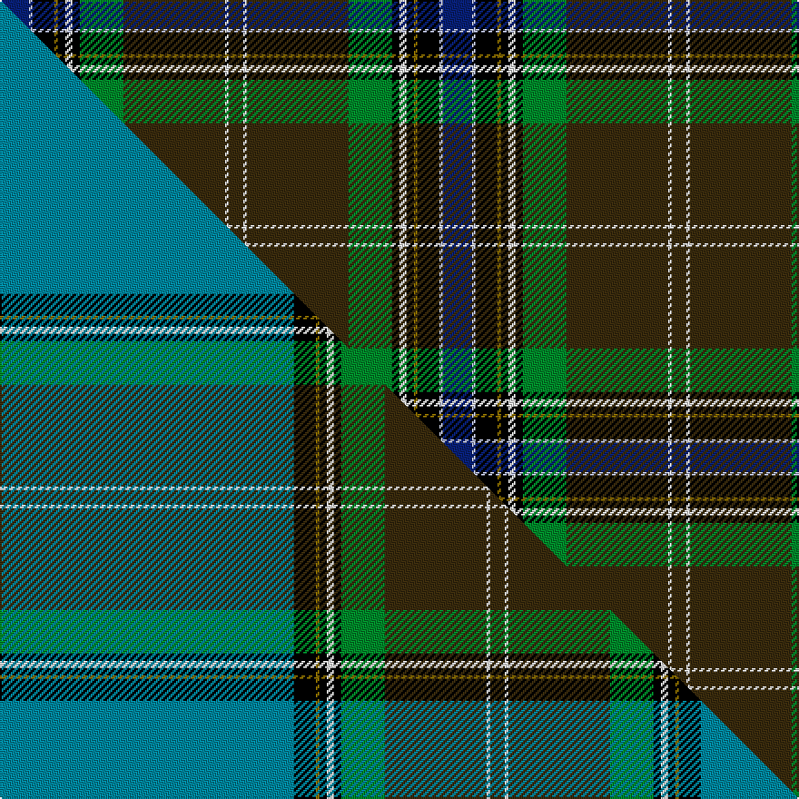

This page is one **sett** — a single exact thread-count. It belongs to the [tartan](/setts/db8lb1k6y1k2w2k2g12dy28w1dy4/)
(the same proportion at any scale), whose colour order is pattern [BWKGKWKGGWG](/stripes/bwkgkwkggwg/).

Part of the [MacLean of Kingairloch](/tartans/maclean-of-kingairloch/) tartan — the named design grouping this sett with its other cloths.

Sourced from house-of-tartan.  It is a [11 stripe tartan](/stripes/stripes11/).

Original link http://www.house-of-tartan.scotland.net/house/TartanViewjs.asp?colr=Def&tnam=61

## Provenance

Earliest known date: pre 2003 Reproduction.

## Thread count
DB/16 LB2 K12 Y2 K4 W4 K4 G24 DY56 W2 DY/8

One full sett is **244 threads**.

## Palette
<table><thead><tr><th>Colour</th><th>Shade</th><th>OKLCh</th></tr></thead><tbody><tr><td>LB</td><td><code style="background-color:#B5BBDE;">#B5BBDE</code> <small style="color:#888">#B5BBDE</small></td><td><small style="color:#888">oklch(79.9% 0.050 277.6)</small></td></tr><tr><td>DB</td><td><code style="background-color:#082077;">#082077</code> <small style="color:#888">#082077</small></td><td><small style="color:#888">oklch(30.0% 0.149 265.1)</small></td></tr><tr><td>G</td><td><code style="background-color:#008B2A;">#008B2A</code> <small style="color:#888">#008B2A</small></td><td><small style="color:#888">oklch(55.4% 0.170 145.9)</small></td></tr><tr><td>K</td><td><code style="background-color:#000000;">#000000</code> <small style="color:#888">#000000</small></td><td><small style="color:#888">oklch(0.0% 0.000 0.0)</small></td></tr><tr><td>W</td><td><code style="background-color:#F7F7F7;">#F7F7F7</code> <small style="color:#888">#F7F7F7</small></td><td><small style="color:#888">oklch(97.6% 0.000 89.9)</small></td></tr><tr><td>DY</td><td><code style="background-color:#3A2B0D;">#3A2B0D</code> <small style="color:#888">#3A2B0D</small></td><td><small style="color:#888">oklch(30.0% 0.049 82.0)</small></td></tr><tr><td>Y</td><td><code style="background-color:#8B6E00;">#8B6E00</code> <small style="color:#888">#8B6E00</small></td><td><small style="color:#888">oklch(55.1% 0.113 90.4)</small></td></tr></tbody></table>

# Sample pattern

## Compared to the master

This cloth is one sett of its design; the master sett (the exemplar the design is anchored on) is below for comparison.

Its **ΔTartan distance** from the master is **0.96** — the same measure the nearest-tartans table ranks by (0 is identical; a re-scale of the same cloth is near 0, a recolour or a different proportion further).

<figure class="master-compare" style="margin:0">

this sett
master sett ★

<figcaption style="color:#888;font-size:smaller">One weave of this sett against the <a href="/setts/t81k6y1k2w2k2g12dy28w1dy4/">master sett ★</a>, split on the diagonal: a shared proportion runs seamlessly across it with only the shades shifting; a different proportion breaks on it.</figcaption>
</figure>

## Nearest tartan variants

The nearest existing variants by ΔTartan distance, with this cloth at the top so the swatches line up against it.

ΔTartan

Threads

Variant

Sett

—

244

<a href="/variants/s11/db8lb1k6y1k2w2k2g12dy28w1dy4~x2/">MacLean of Kingairloch Clan Tartan</a>

<a href="/ttd/edit/#slug=g28r4k3n2k1dg2r3db20y2~x2&amp;base=db8lb1k6y1k2w2k2g12dy28w1dy4~x2" title="compare in the TTD">2.21</a>

200

<a href="/variants/s9/g28r4k3n2k1dg2r3db20y2~x2/">Stirling University</a>

<a href="/ttd/edit/#slug=dr3ti16k12g2k2dg32t2dg2lr3~x2~ti2503227-t2405244&amp;base=db8lb1k6y1k2w2k2g12dy28w1dy4~x2" title="compare in the TTD">2.23</a>

284

<a href="/variants/s9/dr3ti16k12g2k2dg32t2dg2lr3~x2~ti2503227-t2405244/">Scottish Ambulance Service (Corporat</a>

<a href="/ttd/edit/#slug=k48dt12ly3dt3w3dt3n9dy8t2dy10w2~x2~dt1703208-t2503227&amp;base=db8lb1k6y1k2w2k2g12dy28w1dy4~x2" title="compare in the TTD">2.23</a>

312

<a href="/variants/s11/k48dt12ly3dt3w3dt3n9dy8t2dy10w2~x2~dt1703208-t2503227/">Holyrood (Commemorative)</a>

<a href="/ttd/edit/#slug=k8lb1b1do10b16r2k3dt33lb1dt3w2~x2~b2703284-dt1602194&amp;base=db8lb1k6y1k2w2k2g12dy28w1dy4~x2" title="compare in the TTD">2.29</a>

300

<a href="/variants/s11/k8lb1b1do10b16r2k3dt33lb1dt3w2~x2~b2703284-dt1602194/">Lomond Mist</a>

<a href="/ttd/edit/#slug=g32r3do12t3ly3t3k48lb2k4~x2&amp;base=db8lb1k6y1k2w2k2g12dy28w1dy4~x2" title="compare in the TTD">2.39</a>

368

<a href="/variants/s9/g32r3do12t3ly3t3k48lb2k4~x2/">Webster (Name)</a>

<a href="/ttd/edit/#slug=k8lb1y1do10y16lr2k3dt33lb1dt3w2~x2~lb3203246-y2400000-lr3200000-dt1700000&amp;base=db8lb1k6y1k2w2k2g12dy28w1dy4~x2" title="compare in the TTD">2.40</a>

300

<a href="/variants/s11/k8lbi1y1do10y16lb2k3n33lbi1n3w2~x2~lbi3203246-y2400000-lb3200000-n1700000/">Oban Mist</a>

<a href="/ttd/edit/#slug=g32r3do12t3ly3t3k48lb2k4~x2~lb3300000&amp;base=db8lb1k6y1k2w2k2g12dy28w1dy4~x2" title="compare in the TTD">2.55</a>

368

<a href="/variants/s9/g32r3do12t3ly3t3k48lb2k4~x2~lb3300000/">Webster</a>

<a href="/ttd/edit/#slug=k8lb1o1do10o16r2k3n33lb1n3w2~x2~o2500000-n1900000&amp;base=db8lb1k6y1k2w2k2g12dy28w1dy4~x2" title="compare in the TTD">2.56</a>

300

<a href="/variants/s11/k8lb1o1do10o16r2k3n33lb1n3w2~x2~o2500000-n1900000/">Lomond Mist (Fashion)</a>

<a href="/ttd/edit/#slug=k2g30k3dbi4k2db18lb1k3r2~x2~dbi1406275-db1004274&amp;base=db8lb1k6y1k2w2k2g12dy28w1dy4~x2" title="compare in the TTD">2.65</a>

252

<a href="/variants/s9/k2g30k3dbi4k2db18lb1k3r2~x2~dbi1406275-db1004274/">Lusk (Personal)</a>

<a href="/ttd/edit/#slug=lb11k2lb2k2dy2k11dg30r2dg3k1w5~x2&amp;base=db8lb1k6y1k2w2k2g12dy28w1dy4~x2" title="compare in the TTD">2.66</a>

252

<a href="/variants/s11/lb11k2lb2k2dy2k11dg30r2dg3k1w5~x2/">Labrador</a>

## Neighbour map

Every grey dot is one of 13620 variants placed by the first two principal components of the ΔTartan feature space (42% of its variance). Red is this tartan; blue dots are its nearest — click one to open its page.

<svg viewBox="0 0 640 380" role="img" style="max-width:100%;height:auto;border:1px solid #e0e0e0;border-radius:4px;display:block" xmlns="http://www.w3.org/2000/svg"><image href="/nn/cloud.v1.png" width="640" height="380"/><a href="/variants/s9/g28r4k3n2k1dg2r3db20y2~x2/"><circle cx="194.5" cy="78.9" r="4" fill="#3465a4"><title>Stirling University</title></circle></a><a href="/variants/s9/dr3ti16k12g2k2dg32t2dg2lr3~x2~ti2503227-t2405244/"><circle cx="178.2" cy="101.8" r="4" fill="#3465a4"><title>Scottish Ambulance Service (Corporat</title></circle></a><a href="/variants/s11/k48dt12ly3dt3w3dt3n9dy8t2dy10w2~x2~dt1703208-t2503227/"><circle cx="181.1" cy="63.3" r="4" fill="#3465a4"><title>Holyrood (Commemorative)</title></circle></a><a href="/variants/s11/k8lb1b1do10b16r2k3dt33lb1dt3w2~x2~b2703284-dt1602194/"><circle cx="197.2" cy="60.2" r="4" fill="#3465a4"><title>Lomond Mist</title></circle></a><a href="/variants/s9/g32r3do12t3ly3t3k48lb2k4~x2/"><circle cx="182.7" cy="72.1" r="4" fill="#3465a4"><title>Webster (Name)</title></circle></a><a href="/variants/s11/k8lbi1y1do10y16lb2k3n33lbi1n3w2~x2~lbi3203246-y2400000-lb3200000-n1700000/"><circle cx="215.6" cy="68.5" r="4" fill="#3465a4"><title>Oban Mist</title></circle></a><a href="/variants/s9/g32r3do12t3ly3t3k48lb2k4~x2~lb3300000/"><circle cx="182.4" cy="72.1" r="4" fill="#3465a4"><title>Webster</title></circle></a><a href="/variants/s11/k8lb1o1do10o16r2k3n33lb1n3w2~x2~o2500000-n1900000/"><circle cx="205.9" cy="61.7" r="4" fill="#3465a4"><title>Lomond Mist (Fashion)</title></circle></a><a href="/variants/s9/k2g30k3dbi4k2db18lb1k3r2~x2~dbi1406275-db1004274/"><circle cx="215.7" cy="82.4" r="4" fill="#3465a4"><title>Lusk (Personal)</title></circle></a><a href="/variants/s11/lb11k2lb2k2dy2k11dg30r2dg3k1w5~x2/"><circle cx="188.9" cy="68.4" r="4" fill="#3465a4"><title>Labrador</title></circle></a><circle cx="200.4" cy="66.9" r="5" fill="#c00000"/><text x="320" y="376" text-anchor="middle" font-size="11" fill="#999">ground</text><text x="11" y="190" text-anchor="middle" font-size="11" fill="#999" transform="rotate(-90 11 190)">complexity</text></svg>

ID: /variants/s11/db8lb1k6y1k2w2k2g12dy28w1dy4~x2/
