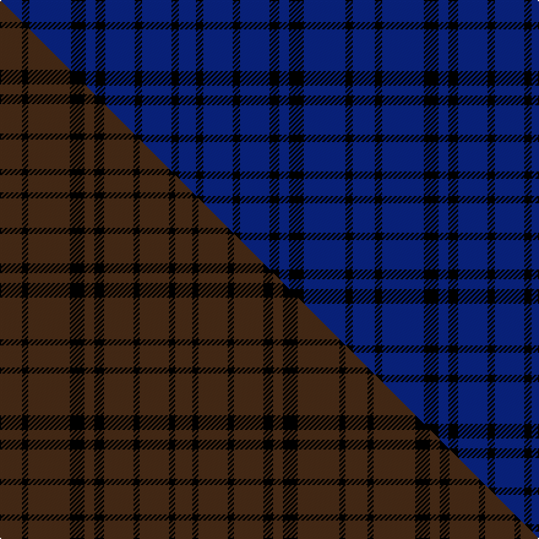

This is one **variant** — a specific cloth: this exact thread count and colourway, with its own
provenance below. It is one weaving of the [sett](/tartans/b/bl/black-shadow-2/) (the scale-free proportion — the
same cloth at any scale or shade), whose colour order is pattern [BKBKBKBKBKB](/stripes/bkbkbkbkbkb/).

Part of the [Black Shadow](/tartans/b/bl/black-shadow-2/) tartan — the named design grouping this sett with its other cloths.

Sourced from house-of-tartan.  It is a [11 stripe tartan](/stripes/stripes11/).

Original link [http://www.house-of-tartan.scotland.net/house/TartanViewjs.asp?colr=Def&tnam=3193](http://www.house-of-tartan.scotland.net/house/TartanViewjs.asp?colr=Def&tnam=3193)

## Provenance

Earliest known date: 01/01/2007 Designed as a combination of two shades of black, shown here as black and dark grey to illustrate the sett.

Dataset <small>— provenance for this record, inherited from the source manifest</small>

<dl class="dataset-prov">
<dt>source</dt><dd><a href="/sources/house-of-tartan/">House of Tartan</a></dd>
<dt>data captured from</dt><dd><a href="https://github.com/thetartan/tartan-database/blob/master/data/house-of-tartan/data.csv">https://github.com/thetartan/tartan-database/blob/master/data/house-of-tartan/data.csv</a></dd>
<dt>data date</dt><dd>01/01/2007 <small>(this record)</small></dd>
<dt>licence</dt><dd><a href="https://creativecommons.org/licenses/by-nc-nd/4.0/">CC BY-NC-ND 4.0</a></dd>
</dl>

Capture chain <small>— the hands this data passed through, oldest first; each capture carries its own licence</small>

<ol class="capture-chain">
<li><a href="http://www.house-of-tartan.scotland.net/">House of Tartan</a> <small>the weaver/retailer's database — the site is now offline; the URL is kept as the ultimate source's identity</small></li>
<li><a href="https://github.com/thetartan/tartan-database">thetartan/tartan-database</a> <small>2016-2017</small> · <a href="https://creativecommons.org/licenses/by-nc-nd/4.0/">CC BY-NC-ND 4.0</a> <small>Levko Kravets's frozen compilation — the capture we vendored, and where its CC licence text came from</small></li>
<li>this dictionary <small>captured 2026-06-10 · commit 5bf86c7566</small> <small>each re-capture is a git commit to data/sources</small></li>
</ol>

## Thread count
DB/18 K6 DB34 K12 DB8 K8 DB24 K6 DB24 K6 DB/14

One full sett is **288 threads**.

## Palette
<table><thead><tr><th>Colour</th><th>Shade</th><th>OKLCh</th></tr></thead><tbody><tr><td>DB</td><td><code style="background-color:#082077;">#082077</code> <small style="color:#888">#082077</small></td><td><small style="color:#888">oklch(30.0% 0.149 265.1)</small></td></tr><tr><td>K</td><td><code style="background-color:#000000;">#000000</code> <small style="color:#888">#000000</small></td><td><small style="color:#888">oklch(0.0% 0.000 0.0)</small></td></tr></tbody></table>

# Sample pattern

## Compared to the master

This cloth is one sett of its design; the master sett (the exemplar the design is anchored on) is below for comparison.

Its **ΔTartan distance** from the master is **6.64** — the same measure the nearest-tartans table ranks by (0 is identical; a re-scale of the same cloth is near 0, a recolour or a different proportion further).

<figure class="master-compare" style="margin:0">

this sett
master sett ★

<figcaption style="color:#888;font-size:smaller">One weave of this sett against the <a href="/setts/do18k5do34k12do8k8do24k5do24k5do14/">master sett ★</a>, split on the diagonal: a shared proportion runs seamlessly across it with only the shades shifting; a different proportion breaks on it.</figcaption>
</figure>

## Nearest tartan variants

The nearest existing variants by ΔTartan distance, with this cloth at the top so the swatches line up against it.

ΔTartan

Threads

Variant

Sett

—

288

<a href="/variants/s11/db9k3db17k6db4k4db12k3db12k3db7~x2/">Black Shadow Fashion Tartan</a>

<a href="/ttd/edit/#slug=k66db155k80db16k8db12k16db12k8db16k12&amp;base=db9k3db17k6db4k4db12k3db12k3db7~x2" title="compare in the TTD">1.96</a>

724

<a href="/variants/s11/k66db155k80db16k8db12k16db12k8db16k12/">Azabu Tailor (Corporate)</a>

<a href="/ttd/edit/#slug=k17db39k20db4k2db3k4db3k2db4k3~x4&amp;base=db9k3db17k6db4k4db12k3db12k3db7~x2" title="compare in the TTD">1.96</a>

728

<a href="/variants/s11/k17db39k20db4k2db3k4db3k2db4k3~x4/">Azabu Tailor</a>

## Neighbour map

Every grey dot is one of 13657 variants placed by the first two principal components of the ΔTartan feature space (42% of its variance). Red is this tartan; blue dots are its nearest — click one to open its page. The map is a flat projection of a many-dimensional space — [how to read it](/posts/neighbourhood-maps/).

<svg viewBox="0 0 640 380" role="img" style="max-width:100%;height:auto;border:1px solid #e0e0e0;border-radius:4px;display:block" xmlns="http://www.w3.org/2000/svg"><image href="/nn/cloud.v1.png" width="640" height="380"/><a href="/variants/s11/k66db155k80db16k8db12k16db12k8db16k12/"><circle cx="395.0" cy="157.1" r="4" fill="#3465a4"><title>Azabu Tailor (Corporate)</title></circle></a><a href="/variants/s11/k17db39k20db4k2db3k4db3k2db4k3~x4/"><circle cx="394.7" cy="156.8" r="4" fill="#3465a4"><title>Azabu Tailor</title></circle></a><circle cx="466.4" cy="258.1" r="5" fill="#c00000"/><text x="320" y="376" text-anchor="middle" font-size="11" fill="#999">ground</text><text x="11" y="190" text-anchor="middle" font-size="11" fill="#999" transform="rotate(-90 11 190)">complexity</text></svg>

ID: /variants/s11/db9k3db17k6db4k4db12k3db12k3db7~x2/
