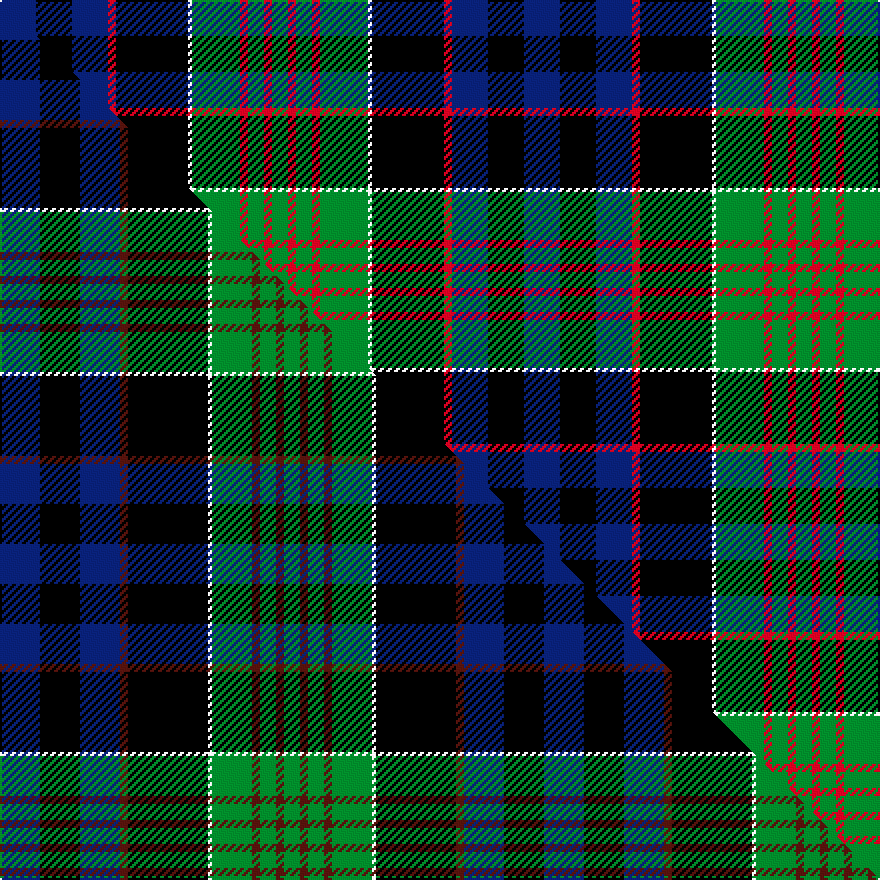

This page is one **sett** — a single exact thread-count. It belongs to the [tartan](/setts/db9k9db9r2k18w1g12r2g4r2g4/)
(the same proportion at any scale), whose colour order is pattern [BKBRKWGRGRG](/stripes/bkbrkwgrgrg/).

Part of the [Newman](/tartans/newman/) tartan — the named design grouping this sett with its other cloths.

Sourced from weddslist.  It is a [11 stripe tartan](/stripes/stripes11/).

Original link http://www.weddslist.com/cgi-bin/tartans/pg.pl?source=sts

## Thread count
DB/18 K18 DB18 R4 K36 W2 G24 R4 G8 R4 G/8

One full sett is **262 threads**.

## Palette
<table><thead><tr><th>Colour</th><th>Shade</th><th>OKLCh</th></tr></thead><tbody><tr><td>DB</td><td><code style="background-color:#082077;">#082077</code> <small style="color:#888">#082077</small></td><td><small style="color:#888">oklch(30.0% 0.149 265.1)</small></td></tr><tr><td>G</td><td><code style="background-color:#008B2A;">#008B2A</code> <small style="color:#888">#008B2A</small></td><td><small style="color:#888">oklch(55.4% 0.170 145.9)</small></td></tr><tr><td>K</td><td><code style="background-color:#000000;">#000000</code> <small style="color:#888">#000000</small></td><td><small style="color:#888">oklch(0.0% 0.000 0.0)</small></td></tr><tr><td>W</td><td><code style="background-color:#F7F7F7;">#F7F7F7</code> <small style="color:#888">#F7F7F7</small></td><td><small style="color:#888">oklch(97.6% 0.000 89.9)</small></td></tr><tr><td>R</td><td><code style="background-color:#D60020;">#D60020</code> <small style="color:#888">#D60020</small></td><td><small style="color:#888">oklch(55.2% 0.224 25.5)</small></td></tr></tbody></table>

# Sample pattern

## Compared to the master

This cloth is one sett of its design; the master sett (the exemplar the design is anchored on) is below for comparison.

Its **ΔTartan distance** from the master is **0.65** — the same measure the nearest-tartans table ranks by (0 is identical; a re-scale of the same cloth is near 0, a recolour or a different proportion further).

<figure class="master-compare" style="margin:0">

this sett
master sett ★

<figcaption style="color:#888;font-size:smaller">One weave of this sett against the <a href="/setts/db10k10db10dr2k20w1g10dr2g4dr2g4/">master sett ★</a>, split on the diagonal: a shared proportion runs seamlessly across it with only the shades shifting; a different proportion breaks on it.</figcaption>
</figure>

## Nearest tartan variants

The nearest existing variants by ΔTartan distance, with this cloth at the top so the swatches line up against it.

ΔTartan

Threads

Variant

Sett

—

262

<a href="/variants/s11/db9k9db9r2k18w1g12r2g4r2g4~x2/">Newman</a>

<a href="/ttd/edit/#slug=db10k10db10dr2k20w1g10dr2g4dr2g4~x2&amp;base=db9k9db9r2k18w1g12r2g4r2g4~x2" title="compare in the TTD">0.23</a>

272

<a href="/variants/s11/db10k10db10dr2k20w1g10dr2g4dr2g4~x2/">Newman</a>

<a href="/ttd/edit/#slug=db16r5db30r2k33g30r5g2r2g7w4&amp;base=db9k9db9r2k18w1g12r2g4r2g4~x2" title="compare in the TTD">2.16</a>

252

<a href="/variants/s11/db16r5db30r2k33g30r5g2r2g7w4/">MacDonell of Glengarry #3</a>

<a href="/ttd/edit/#slug=db16r5db30r2k33g30r5g2r2g7w2~x2&amp;base=db9k9db9r2k18w1g12r2g4r2g4~x2" title="compare in the TTD">2.16</a>

500

<a href="/variants/s11/db16r5db30r2k33g30r5g2r2g7w2~x2/">MacDonell of Glengarry</a>

<a href="/ttd/edit/#slug=db8r4db12r1k12g12r3g2r1g4w1~x2&amp;base=db9k9db9r2k18w1g12r2g4r2g4~x2" title="compare in the TTD">2.25</a>

222

<a href="/variants/s11/db8r4db12r1k12g12r3g2r1g4w1~x2/">MacDonell of Glengarry #2</a>

<a href="/ttd/edit/#slug=g8r1g1r3g16k16r1db16r3db8y2~x2&amp;base=db9k9db9r2k18w1g12r2g4r2g4~x2" title="compare in the TTD">2.34</a>

280

<a href="/variants/s11/g8r1g1r3g16k16r1db16r3db8y2~x2/">Cameron of Erracht (Clan)</a>

<a href="/ttd/edit/#slug=g8r1g1r3g16k16r1db16r3db8y2&amp;base=db9k9db9r2k18w1g12r2g4r2g4~x2" title="compare in the TTD">2.34</a>

140

<a href="/variants/s11/g8r1g1r3g16k16r1db16r3db8y2/">Cameron of Erracht</a>

<a href="/ttd/edit/#slug=db8r1db2r3db12r1k12g12r3g2r1g4w1~x2&amp;base=db9k9db9r2k18w1g12r2g4r2g4~x2" title="compare in the TTD">2.85</a>

230

<a href="/variants/s13/db8r1db2r3db12r1k12g12r3g2r1g4w1~x2/">MacDonell of Glengarry</a>

<a href="/ttd/edit/#slug=db8r1db2r3db12r1k12g12r3g2r1g4w1&amp;base=db9k9db9r2k18w1g12r2g4r2g4~x2" title="compare in the TTD">2.85</a>

115

<a href="/variants/s13/db8r1db2r3db12r1k12g12r3g2r1g4w1/">MacDonell of Glengarry D</a>

## Neighbour map

Every grey dot is one of 13620 variants placed by the first two principal components of the ΔTartan feature space (42% of its variance). Red is this tartan; blue dots are its nearest — click one to open its page.

<svg viewBox="0 0 640 380" role="img" style="max-width:100%;height:auto;border:1px solid #e0e0e0;border-radius:4px;display:block" xmlns="http://www.w3.org/2000/svg"><image href="/nn/cloud.v1.png" width="640" height="380"/><a href="/variants/s11/db10k10db10dr2k20w1g10dr2g4dr2g4~x2/"><circle cx="164.7" cy="138.8" r="4" fill="#3465a4"><title>Newman</title></circle></a><a href="/variants/s11/db16r5db30r2k33g30r5g2r2g7w4/"><circle cx="127.8" cy="127.6" r="4" fill="#3465a4"><title>MacDonell of Glengarry #3</title></circle></a><a href="/variants/s11/db16r5db30r2k33g30r5g2r2g7w2~x2/"><circle cx="136.2" cy="126.4" r="4" fill="#3465a4"><title>MacDonell of Glengarry</title></circle></a><a href="/variants/s11/db8r4db12r1k12g12r3g2r1g4w1~x2/"><circle cx="108.9" cy="152.6" r="4" fill="#3465a4"><title>MacDonell of Glengarry #2</title></circle></a><a href="/variants/s11/g8r1g1r3g16k16r1db16r3db8y2~x2/"><circle cx="128.7" cy="137.7" r="4" fill="#3465a4"><title>Cameron of Erracht (Clan)</title></circle></a><a href="/variants/s11/g8r1g1r3g16k16r1db16r3db8y2/"><circle cx="128.7" cy="137.7" r="4" fill="#3465a4"><title>Cameron of Erracht</title></circle></a><a href="/variants/s13/db8r1db2r3db12r1k12g12r3g2r1g4w1~x2/"><circle cx="120.7" cy="137.7" r="4" fill="#3465a4"><title>MacDonell of Glengarry</title></circle></a><a href="/variants/s13/db8r1db2r3db12r1k12g12r3g2r1g4w1/"><circle cx="120.7" cy="137.7" r="4" fill="#3465a4"><title>MacDonell of Glengarry D</title></circle></a><circle cx="134.0" cy="138.6" r="5" fill="#c00000"/><text x="320" y="376" text-anchor="middle" font-size="11" fill="#999">ground</text><text x="11" y="190" text-anchor="middle" font-size="11" fill="#999" transform="rotate(-90 11 190)">complexity</text></svg>

ID: /variants/s11/db9k9db9r2k18w1g12r2g4r2g4~x2/
