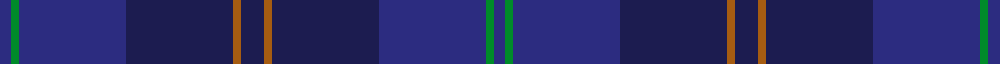

This is one **variant** — a specific cloth: this exact thread count and colourway, with its own
provenance below. It is one weaving of the [sett](/setts/dbi8g5dbi72db72o5db16o5db72dbi72g5dbi8/) (the scale-free proportion — the
same cloth at any scale or shade), whose colour order is pattern [BGBBRBRBBGB](/stripes/bgbbrbrbbgb/).

Part of the [Gravesend Grammar School](/tartans/g/gr/gravesend-grammar-school/) tartan — the named design grouping this sett with its other cloths.

Sourced from tartans-authority.  It is a [11 stripe tartan](/stripes/stripes11/).

Original link [https://www.tartanregister.gov.uk/tartanDetails.aspx?ref=7100](https://www.tartanregister.gov.uk/tartanDetails.aspx?ref=7100)

2 attestations — the source records this cloth was collapsed from (oldest owns this page)

<ul>
<li>May 2002 — Gravesend Grammar School (Corp) (tartans-authority, <a href="https://www.tartanregister.gov.uk/tartanDetails.aspx?ref=7100">record</a>)  <em>Designed by Helen Marshall of Marton Mills for Gravesend Grammar School for Girls. The copyright was initially claimed by Banner Ltd (school uniform suppliers) but in error and it was reassigned in 2008 to Gravesend Grammar.</em></li>
<li>01/02/2007 — Gravesend Grammar School for Girls (register-of-tartans, <a href="https://www.tartanregister.gov.uk/tartanDetails.aspx?ref=1516">record</a>)  <em>Designed by Helen Marshall of Marton Mills for Banner Ltd of Reddish, Stockport for Gravesend Grammar School for Girls.</em></li>
</ul>

Dataset <small>— provenance for this record, inherited from the source manifest</small>

<dl class="dataset-prov">
<dt>source</dt><dd><a href="/sources/tartans-authority/">Scottish Tartans Authority</a></dd>
<dt>data captured from</dt><dd><a href="https://github.com/thetartan/tartan-database/blob/master/data/tartans-authority/data.csv">https://github.com/thetartan/tartan-database/blob/master/data/tartans-authority/data.csv</a></dd>
<dt>data date</dt><dd>May 2002 <small>(this record)</small></dd>
<dt>licence</dt><dd><a href="https://creativecommons.org/licenses/by-nc-nd/4.0/">CC BY-NC-ND 4.0</a></dd>
</dl>

Capture chain <small>— the hands this data passed through, oldest first; each capture carries its own licence</small>

<ol class="capture-chain">
<li><a href="https://www.tartansauthority.com/">Scottish Tartans Authority</a> <small>the heritage body's archive — its tartan-ferret record browser is retired (links repaired to the SRT, above)</small></li>
<li><a href="https://github.com/thetartan/tartan-database">thetartan/tartan-database</a> <small>2016-2017</small> · <a href="https://creativecommons.org/licenses/by-nc-nd/4.0/">CC BY-NC-ND 4.0</a> <small>Levko Kravets's frozen compilation — the capture we vendored, and where its CC licence text came from</small></li>
<li>this dictionary <small>captured 2026-06-10 · commit 5bf86c7566</small> <small>each re-capture is a git commit to data/sources</small></li>
</ol>

## Register references

External register numbers recorded for this tartan.

- Scottish Register of Tartans: [1516](https://www.tartanregister.gov.uk/tartanDetails.aspx?ref=1516)
- Scottish Tartans Authority (ITI): 7100

## Thread count
DBi/8 G5 DBi72 DB72 O5 DB16 O5 DB72 DBi72 G5 DBi/8

One full sett is **664 threads**.

## Palette
<table><thead><tr><th>Colour</th><th>Shade</th><th>OKLCh</th></tr></thead><tbody><tr><td>DB</td><td><code style="background-color:#2C2C80;">#2C2C80</code> <small style="color:#888">#2C2C80</small></td><td><small style="color:#888">oklch(35.0% 0.138 276.6)</small></td></tr><tr><td>DB</td><td><code style="background-color:#1C1C50;">#1C1C50</code> <small style="color:#888">#1C1C50</small></td><td><small style="color:#888">oklch(26.2% 0.093 277.9)</small></td></tr><tr><td>G</td><td><code style="background-color:#008B2A;">#008B2A</code> <small style="color:#888">#008B2A</small></td><td><small style="color:#888">oklch(55.4% 0.170 145.9)</small></td></tr><tr><td>O</td><td><code style="background-color:#A65C11;">#A65C11</code> <small style="color:#888">#A65C11</small></td><td><small style="color:#888">oklch(55.0% 0.125 58.3)</small></td></tr></tbody></table>

# Sample pattern

## Nearest tartan variants

The nearest existing variants by ΔTartan distance, with this cloth at the top so the swatches line up against it.

ΔTartan

Threads

Variant

Sett

—

664

<a href="/variants/s11/dbi8g5dbi72db72o5db16o5db72dbi72g5dbi8~dbi1406275-db1004274/">Gravesend Grammar School (Corp)</a>

<a href="/ttd/edit/#slug=dt34db20dt4db8dt6r2dt5db2dt3g4dt3db2dt5r2dt6db8dt4db20dt34g4~dt1204274-db1404245&amp;base=dbi8g5dbi72db72o5db16o5db72dbi72g5dbi8~dbi1406275-db1004274" title="compare in the TTD">3.58</a>

314

<a href="/variants/s20/db34dbi20db4dbi8db6r2db5dbi2db3g4db3dbi2db5r2db6dbi8db4dbi20db34g4~db1204274-dbi1404245/">Hughes of Wales</a>

## Neighbour map

Every grey dot is one of 13621 variants placed by the first two principal components of the ΔTartan feature space (42% of its variance). Red is this tartan; blue dots are its nearest — click one to open its page.

<svg viewBox="0 0 640 380" role="img" style="max-width:100%;height:auto;border:1px solid #e0e0e0;border-radius:4px;display:block" xmlns="http://www.w3.org/2000/svg"><image href="/nn/cloud.v1.png" width="640" height="380"/><a href="/variants/s20/db34dbi20db4dbi8db6r2db5dbi2db3g4db3dbi2db5r2db6dbi8db4dbi20db34g4~db1204274-dbi1404245/"><circle cx="555.3" cy="206.0" r="4" fill="#3465a4"><title>Hughes of Wales</title></circle></a><circle cx="516.3" cy="242.6" r="5" fill="#c00000"/><text x="320" y="376" text-anchor="middle" font-size="11" fill="#999">ground</text><text x="11" y="190" text-anchor="middle" font-size="11" fill="#999" transform="rotate(-90 11 190)">complexity</text></svg>

ID: /variants/s11/dbi8g5dbi72db72o5db16o5db72dbi72g5dbi8~dbi1406275-db1004274/
