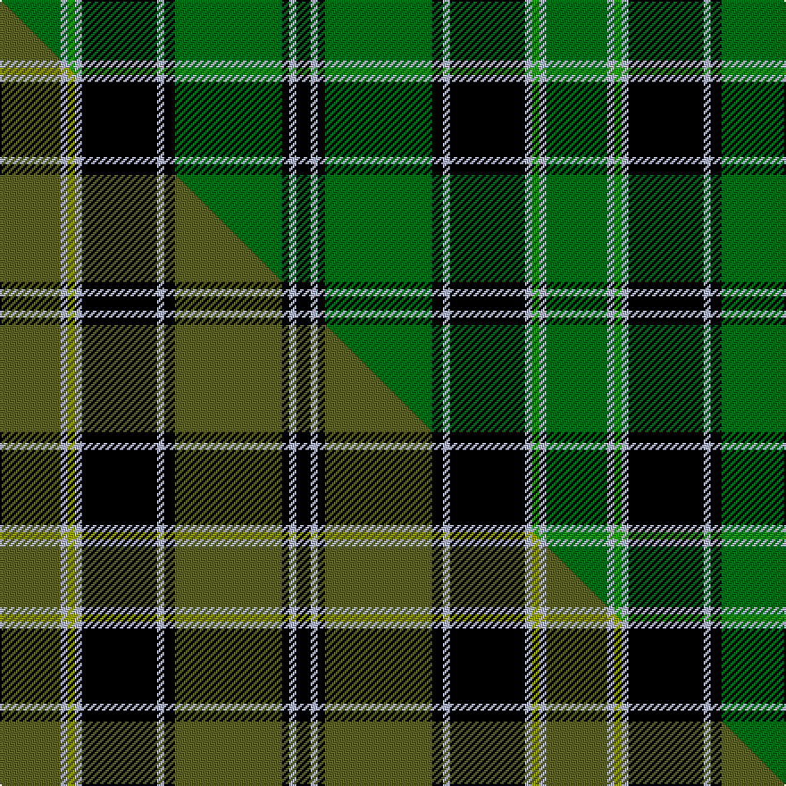

This page is one **sett** — a single exact thread-count. It belongs to the [tartan](/setts/dg17lb2g2lb2k21lb2k3dg30k2lb2k4/)
(the same proportion at any scale), whose colour order is pattern [GWGWKWKGKWK](/stripes/gwgwkwkgkwk/).

Part of the [Fort William](/tartans/fort-william/) tartan — the named design grouping this sett with its other cloths.

Sourced from house-of-tartan.  It is a [11 stripe tartan](/stripes/stripes11/).

Original link http://www.house-of-tartan.scotland.net/house/TartanViewjs.asp?colr=Def&tnam=699

## Provenance

Earliest known date: 1819 The pattern books of the old firm of weavers, Wilson's of Bannockburn, provide a reliable early source for this tartan. Wilson's were in business with a monopoly to supply tartan to the regiments in the second half of the 18th century before this pattern was recorded.

## Thread count
DG/34 LB4 G4 LB4 K42 LB4 K6 DG60 K4 LB4 K/8

One full sett is **306 threads**.

## Palette
<table><thead><tr><th>Colour</th><th>Shade</th><th>OKLCh</th></tr></thead><tbody><tr><td>LB</td><td><code style="background-color:#B5BBDE;">#B5BBDE</code> <small style="color:#888">#B5BBDE</small></td><td><small style="color:#888">oklch(79.9% 0.050 277.6)</small></td></tr><tr><td>DG</td><td><code style="background-color:#006818;">#006818</code> <small style="color:#888">#006818</small></td><td><small style="color:#888">oklch(45.0% 0.142 145.0)</small></td></tr><tr><td>G</td><td><code style="background-color:#289C18;">#289C18</code> <small style="color:#888">#289C18</small></td><td><small style="color:#888">oklch(60.6% 0.191 141.6)</small></td></tr><tr><td>K</td><td><code style="background-color:#000000;">#000000</code> <small style="color:#888">#000000</small></td><td><small style="color:#888">oklch(0.0% 0.000 0.0)</small></td></tr></tbody></table>

# Sample pattern

## Compared to the master

This cloth is one sett of its design; the master sett (the exemplar the design is anchored on) is below for comparison.

Its **ΔTartan distance** from the master is **1.00** — the same measure the nearest-tartans table ranks by (0 is identical; a re-scale of the same cloth is near 0, a recolour or a different proportion further).

<figure class="master-compare" style="margin:0">

this sett
master sett ★

<figcaption style="color:#888;font-size:smaller">One weave of this sett against the <a href="/setts/g17lb2ly2lb2k21lb2k3g30k2lb2k4/">master sett ★</a>, split on the diagonal: a shared proportion runs seamlessly across it with only the shades shifting; a different proportion breaks on it.</figcaption>
</figure>

## Nearest variants

The nearest existing variants by ΔTartan distance, with this cloth at the top so the swatches line up against it.

ΔTartan

Threads

Variant

Sett

—

306

<a href="/variants/s11/dg17lb2g2lb2k21lb2k3dg30k2lb2k4~x2~dg1806142-g2408144/">Fort William District Tartan</a>

<a href="/ttd/edit/#slug=dg17lb2g2lb2k21lb2k3dg30k2lb2k4~x2~dg1806142-g1903114&amp;base=dg17lb2g2lb2k21lb2k3dg30k2lb2k4~x2~dg1806142-g2408144" title="compare in the TTD">0.00</a>

306

<a href="/variants/s11/dg17lb2g2lb2k21lb2k3dg30k2lb2k4~x2~dg1806142-g1903114/">Fort William (District?)</a>

<a href="/ttd/edit/#slug=g17lb2ly2lb2k21lb2k3g30k2lb2k4~x2~g1903114-ly2706114&amp;base=dg17lb2g2lb2k21lb2k3dg30k2lb2k4~x2~dg1806142-g2408144" title="compare in the TTD">0.30</a>

306

<a href="/variants/s11/g17lb2ly2lb2k21lb2k3g30k2lb2k4~x2~g1903114-ly2706114/">Fort William</a>

<a href="/ttd/edit/#slug=g17lb2b2lb2k21lb2k3g30k2lb2k4~x2&amp;base=dg17lb2g2lb2k21lb2k3dg30k2lb2k4~x2~dg1806142-g2408144" title="compare in the TTD">1.50</a>

306

<a href="/variants/s11/g17lb2b2lb2k21lb2k3g30k2lb2k4~x2/">Fort William</a>

<a href="/ttd/edit/#slug=k37g27w2k4r6k4w2g27k37y2~x2&amp;base=dg17lb2g2lb2k21lb2k3dg30k2lb2k4~x2~dg1806142-g2408144" title="compare in the TTD">2.72</a>

514

<a href="/variants/s10/k37g27w2k4r6k4w2g27k37y2~x2/">Highlands of Durham #2</a>

<a href="/ttd/edit/#slug=dr3g32k4g4k11db3k7dr4w3&amp;base=dg17lb2g2lb2k21lb2k3dg30k2lb2k4~x2~dg1806142-g2408144" title="compare in the TTD">2.81</a>

136

<a href="/variants/s9/dr3g32k4g4k11db3k7dr4w3/">Derick Wardrope (Portobello) (Personal)</a>

<a href="/ttd/edit/#slug=k22g5k2g5k11g33k2r4~x2&amp;base=dg17lb2g2lb2k21lb2k3dg30k2lb2k4~x2~dg1806142-g2408144" title="compare in the TTD">2.91</a>

284

<a href="/variants/s8/k22g5k2g5k11g33k2r4~x2/">MacArthur-Fox 1993 (Personal)</a>

<a href="/ttd/edit/#slug=dy2g1k1g26k11db6k1g2~x2&amp;base=dg17lb2g2lb2k21lb2k3dg30k2lb2k4~x2~dg1806142-g2408144" title="compare in the TTD">2.92</a>

192

<a href="/variants/s8/dy2g1k1g26k11db6k1g2~x2/">Mackie (2016)</a>

## Neighbour map

Every grey dot is one of 13620 variants placed by the first two principal components of the ΔTartan feature space (42% of its variance). Red is this tartan; blue dots are its nearest — click one to open its page.

<svg viewBox="0 0 640 380" role="img" style="max-width:100%;height:auto;border:1px solid #e0e0e0;border-radius:4px;display:block" xmlns="http://www.w3.org/2000/svg"><image href="/nn/cloud.v1.png" width="640" height="380"/><a href="/variants/s11/dg17lb2g2lb2k21lb2k3dg30k2lb2k4~x2~dg1806142-g1903114/"><circle cx="266.6" cy="129.4" r="4" fill="#3465a4"><title>Fort William (District?)</title></circle></a><a href="/variants/s11/g17lb2ly2lb2k21lb2k3g30k2lb2k4~x2~g1903114-ly2706114/"><circle cx="268.1" cy="125.0" r="4" fill="#3465a4"><title>Fort William</title></circle></a><a href="/variants/s11/g17lb2b2lb2k21lb2k3g30k2lb2k4~x2/"><circle cx="254.8" cy="127.8" r="4" fill="#3465a4"><title>Fort William</title></circle></a><a href="/variants/s10/k37g27w2k4r6k4w2g27k37y2~x2/"><circle cx="245.4" cy="118.1" r="4" fill="#3465a4"><title>Highlands of Durham #2</title></circle></a><a href="/variants/s9/dr3g32k4g4k11db3k7dr4w3/"><circle cx="204.4" cy="139.4" r="4" fill="#3465a4"><title>Derick Wardrope (Portobello) (Personal)</title></circle></a><a href="/variants/s8/k22g5k2g5k11g33k2r4~x2/"><circle cx="276.2" cy="160.1" r="4" fill="#3465a4"><title>MacArthur-Fox 1993 (Personal)</title></circle></a><a href="/variants/s8/dy2g1k1g26k11db6k1g2~x2/"><circle cx="308.3" cy="117.6" r="4" fill="#3465a4"><title>Mackie (2016)</title></circle></a><circle cx="265.3" cy="129.3" r="5" fill="#c00000"/><text x="320" y="376" text-anchor="middle" font-size="11" fill="#999">ground</text><text x="11" y="190" text-anchor="middle" font-size="11" fill="#999" transform="rotate(-90 11 190)">complexity</text></svg>

ID: /variants/s11/dg17lb2g2lb2k21lb2k3dg30k2lb2k4~x2~dg1806142-g2408144/
