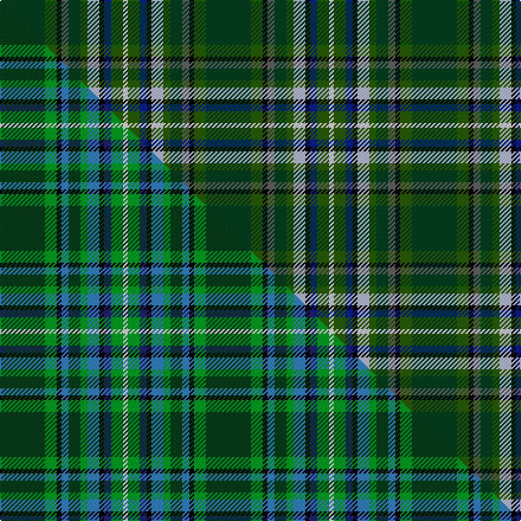

This is one **variant** — a specific cloth: this exact thread count and colourway, with its own
provenance below. It is one weaving of the [sett](/setts/dg19dgi5k2n3dg5dgi3lb5k2db3dgi5w2/) (the scale-free proportion — the
same cloth at any scale or shade), whose colour order is pattern [GGKBGGWKBGW](/stripes/ggkbggwkbgw/).

Part of the [MacLean, Kenneth, baron of Denboig](/tartans/m/ma/maclean-kenneth-baron-of-denboig/) tartan — the named design grouping this sett with its other cloths.

Sourced from tartans-authority.  It is a [11 stripe tartan](/stripes/stripes11/).

Original link [https://www.tartanregister.gov.uk/tartanDetails.aspx?ref=11201](https://www.tartanregister.gov.uk/tartanDetails.aspx?ref=11201)

Dataset <small>— provenance for this record, inherited from the source manifest</small>

<dl class="dataset-prov">
<dt>source</dt><dd><a href="/sources/tartans-authority/">Scottish Tartans Authority</a></dd>
<dt>data captured from</dt><dd><a href="https://github.com/thetartan/tartan-database/blob/master/data/tartans-authority/data.csv">https://github.com/thetartan/tartan-database/blob/master/data/tartans-authority/data.csv</a></dd>
<dt>data date</dt><dd>2015 <small>(this record)</small></dd>
<dt>licence</dt><dd><a href="https://creativecommons.org/licenses/by-nc-nd/4.0/">CC BY-NC-ND 4.0</a></dd>
</dl>

Capture chain <small>— the hands this data passed through, oldest first; each capture carries its own licence</small>

<ol class="capture-chain">
<li><a href="https://www.tartansauthority.com/">Scottish Tartans Authority</a> <small>the heritage body's archive — its tartan-ferret record browser is retired (links repaired to the SRT, above)</small></li>
<li><a href="https://github.com/thetartan/tartan-database">thetartan/tartan-database</a> <small>2016-2017</small> · <a href="https://creativecommons.org/licenses/by-nc-nd/4.0/">CC BY-NC-ND 4.0</a> <small>Levko Kravets's frozen compilation — the capture we vendored, and where its CC licence text came from</small></li>
<li>this dictionary <small>captured 2026-06-10 · commit 5bf86c7566</small> <small>each re-capture is a git commit to data/sources</small></li>
</ol>

## Register references

External register numbers recorded for this tartan.

- Scottish Register of Tartans: [11201](https://www.tartanregister.gov.uk/tartanDetails?ref=11201)
- Scottish Tartans Authority (ITI): 11201

## Thread count
DG/38 DGi10 K4 N6 DG10 DGi6 LB10 K4 DB6 DGi10 W/4

One full sett is **174 threads**.

## Palette
<table><thead><tr><th>Colour</th><th>Shade</th><th>OKLCh</th></tr></thead><tbody><tr><td>LB</td><td><code style="background-color:#B5BBDE;">#B5BBDE</code> <small style="color:#888">#B5BBDE</small></td><td><small style="color:#888">oklch(79.9% 0.050 277.6)</small></td></tr><tr><td>DB</td><td><code style="background-color:#082077;">#082077</code> <small style="color:#888">#082077</small></td><td><small style="color:#888">oklch(30.0% 0.149 265.1)</small></td></tr><tr><td>DG</td><td><code style="background-color:#003820;">#003820</code> <small style="color:#888">#003820</small></td><td><small style="color:#888">oklch(30.0% 0.070 158.3)</small></td></tr><tr><td>DG</td><td><code style="background-color:#285800;">#285800</code> <small style="color:#888">#285800</small></td><td><small style="color:#888">oklch(41.0% 0.122 135.8)</small></td></tr><tr><td>K</td><td><code style="background-color:#000000;">#000000</code> <small style="color:#888">#000000</small></td><td><small style="color:#888">oklch(0.0% 0.000 0.0)</small></td></tr><tr><td>N</td><td><code style="background-color:#636363;">#636363</code> <small style="color:#888">#636363</small></td><td><small style="color:#888">oklch(50.0% 0.000 89.9)</small></td></tr><tr><td>W</td><td><code style="background-color:#F7F7F7;">#F7F7F7</code> <small style="color:#888">#F7F7F7</small></td><td><small style="color:#888">oklch(97.6% 0.000 89.9)</small></td></tr></tbody></table>

# Sample pattern

## Compared to the master

This cloth is one sett of its design; the master sett (the exemplar the design is anchored on) is below for comparison.

Its **ΔTartan distance** from the master is **0.65** — the same measure the nearest-tartans table ranks by (0 is identical; a re-scale of the same cloth is near 0, a recolour or a different proportion further).

<figure class="master-compare" style="margin:0">

this sett
master sett ★

<figcaption style="color:#888;font-size:smaller">One weave of this sett against the <a href="/setts/dg19g5k2t3dg5g3t5k2db3g5w2/">master sett ★</a>, split on the diagonal: a shared proportion runs seamlessly across it with only the shades shifting; a different proportion breaks on it.</figcaption>
</figure>

## Nearest tartan variants

The nearest existing variants by ΔTartan distance, with this cloth at the top so the swatches line up against it.

ΔTartan

Threads

Variant

Sett

—

174

<a href="/variants/s11/dg19dgi5k2n3dg5dgi3lb5k2db3dgi5w2~x2~dgi1605139/">MacLean, Kenneth, Baron of Denboig</a>

<a href="/ttd/edit/#slug=dg19g5k2t3dg5g3t5k2dt3g5w2~x2~t2304245-dt1204274&amp;base=dg19dgi5k2n3dg5dgi3lb5k2db3dgi5w2~x2~dgi1605139" title="compare in the TTD">0.65</a>

174

<a href="/variants/s11/dg19g5k2t3dg5g3t5k2db3g5w2~x2~t2304245-db1204274/">MacLean, Kenneth, baron of Denboig (Personal)</a>

<a href="/ttd/edit/#slug=dy8k3dr6k2g20db4g2db4g5lb4db3w3~x2&amp;base=dg19dgi5k2n3dg5dgi3lb5k2db3dgi5w2~x2~dgi1605139" title="compare in the TTD">2.07</a>

234

<a href="/variants/s12/dy8k3dr6k2g20db4g2db4g5lb4db3w3~x2/">Down County, Crest Range</a>

<a href="/ttd/edit/#slug=db12g24r5do20g4w2g4do21y5g24db12do4k2do4~x2&amp;base=dg19dgi5k2n3dg5dgi3lb5k2db3dgi5w2~x2~dgi1605139" title="compare in the TTD">2.37</a>

540

<a href="/variants/s14/db12g24r5do20g4w2g4do21y5g24db12do4k2do4~x2/">Hyndman (Personal)</a>

<a href="/ttd/edit/#slug=r2dg18g2dg2g2dg2g12db3k13dg10k2ly2~x2&amp;base=dg19dgi5k2n3dg5dgi3lb5k2db3dgi5w2~x2~dgi1605139" title="compare in the TTD">2.63</a>

272

<a href="/variants/s12/r2dg18g2dg2g2dg2g12db3k13dg10k2ly2~x2/">McHeadley Society (Corporate)</a>

<a href="/ttd/edit/#slug=db8k1w5k1r5dg13k2g4k2g11dg20dy7dg5~x2&amp;base=dg19dgi5k2n3dg5dgi3lb5k2db3dgi5w2~x2~dgi1605139" title="compare in the TTD">2.81</a>

310

<a href="/variants/s13/db8k1w5k1r5dg13k2g4k2g11dg20dy7dg5~x2/">Wild Geese</a>

<a href="/ttd/edit/#slug=k3dt20db8dt4g20k2g2r2g3ly3~x2~dt1204274-db1406275&amp;base=dg19dgi5k2n3dg5dgi3lb5k2db3dgi5w2~x2~dgi1605139" title="compare in the TTD">2.81</a>

256

<a href="/variants/s10/k3db20dbi8db4g20k2g2r2g3ly3~x2~db1204274-dbi1406275/">Schmidt (2014)</a>

<a href="/ttd/edit/#slug=dr3ti16k12g2k2dg32t2dg2lr3~x2~ti2503227-t2405244&amp;base=dg19dgi5k2n3dg5dgi3lb5k2db3dgi5w2~x2~dgi1605139" title="compare in the TTD">2.84</a>

284

<a href="/variants/s9/dr3ti16k12g2k2dg32t2dg2lr3~x2~ti2503227-t2405244/">Scottish Ambulance Service (Corporat</a>

<a href="/ttd/edit/#slug=dr3o3dt16k2dt2g16dr3g2w2~x2&amp;base=dg19dgi5k2n3dg5dgi3lb5k2db3dgi5w2~x2~dgi1605139" title="compare in the TTD">2.86</a>

186

<a href="/variants/s9/dr3o3dt16k2dt2g16dr3g2w2~x2/">Chinzei Keiai School</a>

<a href="/ttd/edit/#slug=r2dg18g2dg2g2dg2g12db3k13dg10k2g12y2~x2&amp;base=dg19dgi5k2n3dg5dgi3lb5k2db3dgi5w2~x2~dgi1605139" title="compare in the TTD">2.86</a>

320

<a href="/variants/s13/r2dg18g2dg2g2dg2g12db3k13dg10k2g12y2~x2/">McHeadley Society</a>

<a href="/ttd/edit/#slug=w3db5lb2db9dp10k2dp5k2dg8g29w2~x2&amp;base=dg19dgi5k2n3dg5dgi3lb5k2db3dgi5w2~x2~dgi1605139" title="compare in the TTD">2.88</a>

298

<a href="/variants/s11/w3db5lb2db9dp10k2dp5k2dg8g29w2~x2/">Carnegie of Skibo (Corporate)</a>

## Neighbour map

Every grey dot is one of 13621 variants placed by the first two principal components of the ΔTartan feature space (42% of its variance). Red is this tartan; blue dots are its nearest — click one to open its page.

<svg viewBox="0 0 640 380" role="img" style="max-width:100%;height:auto;border:1px solid #e0e0e0;border-radius:4px;display:block" xmlns="http://www.w3.org/2000/svg"><image href="/nn/cloud.v1.png" width="640" height="380"/><a href="/variants/s11/dg19g5k2t3dg5g3t5k2db3g5w2~x2~t2304245-db1204274/"><circle cx="164.8" cy="152.9" r="4" fill="#3465a4"><title>MacLean, Kenneth, baron of Denboig (Personal)</title></circle></a><a href="/variants/s12/dy8k3dr6k2g20db4g2db4g5lb4db3w3~x2/"><circle cx="101.5" cy="130.4" r="4" fill="#3465a4"><title>Down County, Crest Range</title></circle></a><a href="/variants/s14/db12g24r5do20g4w2g4do21y5g24db12do4k2do4~x2/"><circle cx="151.2" cy="139.1" r="4" fill="#3465a4"><title>Hyndman (Personal)</title></circle></a><a href="/variants/s12/r2dg18g2dg2g2dg2g12db3k13dg10k2ly2~x2/"><circle cx="164.8" cy="144.8" r="4" fill="#3465a4"><title>McHeadley Society (Corporate)</title></circle></a><a href="/variants/s13/db8k1w5k1r5dg13k2g4k2g11dg20dy7dg5~x2/"><circle cx="144.3" cy="108.1" r="4" fill="#3465a4"><title>Wild Geese</title></circle></a><a href="/variants/s10/k3db20dbi8db4g20k2g2r2g3ly3~x2~db1204274-dbi1406275/"><circle cx="146.3" cy="144.2" r="4" fill="#3465a4"><title>Schmidt (2014)</title></circle></a><a href="/variants/s9/dr3ti16k12g2k2dg32t2dg2lr3~x2~ti2503227-t2405244/"><circle cx="178.1" cy="101.8" r="4" fill="#3465a4"><title>Scottish Ambulance Service (Corporat</title></circle></a><a href="/variants/s9/dr3o3dt16k2dt2g16dr3g2w2~x2/"><circle cx="157.6" cy="163.9" r="4" fill="#3465a4"><title>Chinzei Keiai School</title></circle></a><a href="/variants/s13/r2dg18g2dg2g2dg2g12db3k13dg10k2g12y2~x2/"><circle cx="140.8" cy="151.6" r="4" fill="#3465a4"><title>McHeadley Society</title></circle></a><a href="/variants/s11/w3db5lb2db9dp10k2dp5k2dg8g29w2~x2/"><circle cx="110.7" cy="106.7" r="4" fill="#3465a4"><title>Carnegie of Skibo (Corporate)</title></circle></a><circle cx="147.8" cy="138.4" r="5" fill="#c00000"/><text x="320" y="376" text-anchor="middle" font-size="11" fill="#999">ground</text><text x="11" y="190" text-anchor="middle" font-size="11" fill="#999" transform="rotate(-90 11 190)">complexity</text></svg>

ID: /variants/s11/dg19dgi5k2n3dg5dgi3lb5k2db3dgi5w2~x2~dgi1605139/
