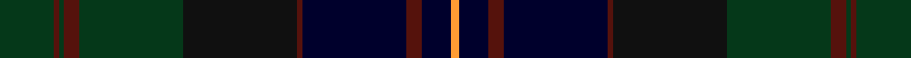

This page is one **sett** — a single exact thread-count. It belongs to the [tartan](/setts/dg22dr2dg2dr6dg42ki46dr2k42dr6k12lo3/)
(the same proportion at any scale), whose colour order is pattern [GBGBGKBKBKY](/stripes/gbgbgkbkbky/).

Sourced from tartans-authority.  It is a [11 stripe tartan](/stripes/stripes11/).

Original link http://www.tartansauthority.com/tartan-ferret/display/3613/

## Register references

External register numbers recorded for this tartan.

- Scottish Tartans Authority (ITI): 3613

## Thread count
DG/22 DR2 DG2 DR6 DG42 Ki46 DR2 K42 DR6 K12 LO/3

One full sett is **345 threads**.

## Palette
<table><thead><tr><th>Colour</th><th>Shade</th><th>OKLCh</th></tr></thead><tbody><tr><td>K</td><td><code style="background-color:#00002C;">#00002C</code> <small style="color:#888">#00002C</small></td><td><small style="color:#888">oklch(13.2% 0.092 264.1)</small></td></tr><tr><td>DR</td><td><code style="background-color:#55120C;">#55120C</code> <small style="color:#888">#55120C</small></td><td><small style="color:#888">oklch(30.0% 0.099 29.3)</small></td></tr><tr><td>LO</td><td><code style="background-color:#FF9C34;">#FF9C34</code> <small style="color:#888">#FF9C34</small></td><td><small style="color:#888">oklch(77.9% 0.161 61.8)</small></td></tr><tr><td>DG</td><td><code style="background-color:#053819;">#053819</code> <small style="color:#888">#053819</small></td><td><small style="color:#888">oklch(30.0% 0.075 151.3)</small></td></tr><tr><td>K</td><td><code style="background-color:#101010;">#101010</code> <small style="color:#888">#101010</small></td><td><small style="color:#888">oklch(17.3% 0.000 89.9)</small></td></tr></tbody></table>

# Sample pattern

ID: /variants/s11/dg22dr2dg2dr6dg42ki46dr2k42dr6k12lo3~ki0700000-k0504259/
