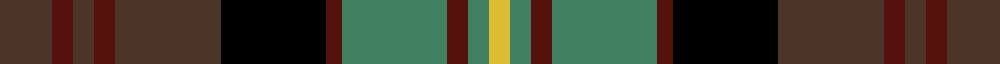

This page is one **sett** — a single exact thread-count. It belongs to the [tartan](/setts/do10dr4do4dr4do20k20dr3g20dr4g4ly4/)
(the same proportion at any scale), whose colour order is pattern [BBBBBKBGBGY](/stripes/bbbbbkbgbgy/).

Sourced from register-of-tartans.  It is a [11 stripe tartan](/stripes/stripes11/).

Original link https://www.tartanregister.gov.uk/tartanDetails.aspx?ref=5258

## Register references

External register numbers recorded for this tartan.

- Scottish Register of Tartans: [5258](https://www.tartanregister.gov.uk/tartanDetails.aspx?ref=5258)
- Scottish Tartans Authority (ITI): 3798

## Thread count
DO/20 DR8 DO8 DR8 DO40 K40 DR6 G40 DR8 G8 LY/8

One full sett is **360 threads**.

## Palette
<table><thead><tr><th>Colour</th><th>Shade</th><th>OKLCh</th></tr></thead><tbody><tr><td>DR</td><td><code style="background-color:#55120C;">#55120C</code> <small style="color:#888">#55120C</small></td><td><small style="color:#888">oklch(30.0% 0.099 29.3)</small></td></tr><tr><td>DY</td><td><code style="background-color:#DCBC32;">#DCBC32</code> <small style="color:#888">#DCBC32</small></td><td><small style="color:#888">oklch(80.0% 0.150 95.2)</small></td></tr><tr><td>G</td><td><code style="background-color:#408060;">#408060</code> <small style="color:#888">#408060</small></td><td><small style="color:#888">oklch(54.8% 0.084 160.1)</small></td></tr><tr><td>K</td><td><code style="background-color:#000000;">#000000</code> <small style="color:#888">#000000</small></td><td><small style="color:#888">oklch(0.0% 0.000 0.0)</small></td></tr><tr><td>T</td><td><code style="background-color:#4C3428;">#4C3428</code> <small style="color:#888">#4C3428</small></td><td><small style="color:#888">oklch(34.9% 0.040 47.5)</small></td></tr></tbody></table>

# Sample pattern

ID: /variants/s11/do10dr4do4dr4do20k20dr3g20dr4g4ly4~x2~do1402055-g2203152/
