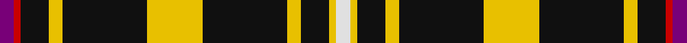

This page is one **sett** — a single exact thread-count. It belongs to the [tartan](/setts/dp2r1k4ly2k12ly8k12ly2k4ly1w2/)
(the same proportion at any scale), whose colour order is pattern [BRKYKYKYKYW](/stripes/brkykykykyw/).

Part of the [Gary](/tartans/gary/) tartan — the named design grouping this sett with its other cloths.

Sourced from house-of-tartan.  It is a [11 stripe tartan](/stripes/stripes11/).

Original link http://www.house-of-tartan.scotland.net/house/TartanViewjs.asp?colr=Def&tnam=564

## Provenance

Earliest known date: 1985 Restricted

## Also known as

This cloth is also recorded under:

- Gary Personal

## Thread count
P/4 R2 K8 Y4 K24 Y16 K24 Y4 K8 Y2 LN/4

One full sett is **192 threads**.

## Palette

Palette: <strong>Tartan Register</strong>
<table><thead><tr><th>Colour</th><th>Threads</th><th>Shade</th><th>Base</th><th>OKLCh</th></tr></thead><tbody><tr><td>P/</td><td style="text-align:right;font-variant-numeric:tabular-nums">4</td><td><code style="background-color:#780078;">#780078</code> <small style="color:#888">#780078</small></td><td>B <code style="background-color:#2A418A;">#2A418A</code></td><td><small style="color:#888">oklch(40.2% 0.185 328.4)</small></td></tr><tr><td>R</td><td style="text-align:right;font-variant-numeric:tabular-nums">2</td><td><code style="background-color:#C80000;">#C80000</code> <small style="color:#888">#C80000</small></td><td>R <code style="background-color:#CC0000;">#CC0000</code></td><td><small style="color:#888">oklch(52.3% 0.215 29.2)</small></td></tr><tr><td>K</td><td style="text-align:right;font-variant-numeric:tabular-nums">8</td><td><code style="background-color:#101010;">#101010</code> <small style="color:#888">#101010</small></td><td>K <code style="background-color:#000000;">#000000</code></td><td><small style="color:#888">oklch(17.3% 0.000 89.9)</small></td></tr><tr><td>Y</td><td style="text-align:right;font-variant-numeric:tabular-nums">4</td><td><code style="background-color:#E8C000;">#E8C000</code> <small style="color:#888">#E8C000</small></td><td>Y <code style="background-color:#F2BF00;">#F2BF00</code></td><td><small style="color:#888">oklch(81.9% 0.168 93.7)</small></td></tr><tr><td>K</td><td style="text-align:right;font-variant-numeric:tabular-nums">24</td><td><code style="background-color:#101010;">#101010</code> <small style="color:#888">#101010</small></td><td>K <code style="background-color:#000000;">#000000</code></td><td><small style="color:#888">oklch(17.3% 0.000 89.9)</small></td></tr><tr><td>Y</td><td style="text-align:right;font-variant-numeric:tabular-nums">16</td><td><code style="background-color:#E8C000;">#E8C000</code> <small style="color:#888">#E8C000</small></td><td>Y <code style="background-color:#F2BF00;">#F2BF00</code></td><td><small style="color:#888">oklch(81.9% 0.168 93.7)</small></td></tr><tr><td>K</td><td style="text-align:right;font-variant-numeric:tabular-nums">24</td><td><code style="background-color:#101010;">#101010</code> <small style="color:#888">#101010</small></td><td>K <code style="background-color:#000000;">#000000</code></td><td><small style="color:#888">oklch(17.3% 0.000 89.9)</small></td></tr><tr><td>Y</td><td style="text-align:right;font-variant-numeric:tabular-nums">4</td><td><code style="background-color:#E8C000;">#E8C000</code> <small style="color:#888">#E8C000</small></td><td>Y <code style="background-color:#F2BF00;">#F2BF00</code></td><td><small style="color:#888">oklch(81.9% 0.168 93.7)</small></td></tr><tr><td>K</td><td style="text-align:right;font-variant-numeric:tabular-nums">8</td><td><code style="background-color:#101010;">#101010</code> <small style="color:#888">#101010</small></td><td>K <code style="background-color:#000000;">#000000</code></td><td><small style="color:#888">oklch(17.3% 0.000 89.9)</small></td></tr><tr><td>Y</td><td style="text-align:right;font-variant-numeric:tabular-nums">2</td><td><code style="background-color:#E8C000;">#E8C000</code> <small style="color:#888">#E8C000</small></td><td>Y <code style="background-color:#F2BF00;">#F2BF00</code></td><td><small style="color:#888">oklch(81.9% 0.168 93.7)</small></td></tr><tr><td>LN/</td><td style="text-align:right;font-variant-numeric:tabular-nums">4</td><td><code style="background-color:#E0E0E0;">#E0E0E0</code> <small style="color:#888">#E0E0E0</small></td><td>W <code style="background-color:#F7F7F7;">#F7F7F7</code></td><td><small style="color:#888">oklch(90.7% 0.000 89.9)</small></td></tr></tbody></table>

## Compared to the master

This cloth is one sett of its design; the master sett (the exemplar the design is anchored on) is below for comparison.

<figure style="margin:0"><figcaption style="color:#888;font-size:smaller">this sett</figcaption></figure>
<figure style="margin:0"><figcaption style="color:#888;font-size:smaller"><a href="/setts/dp2r1k4lo2k12lo8k12lo2k4lo1w2/">master sett →</a></figcaption></figure>

## Nearest tartans

The nearest existing variants by ΔTartan distance, with this tartan at the top so the swatches line up against it.

ΔTartan

Tartan

Sett

—

<a href="/ttd/edit/#slug=dp2r1k4ly2k12ly8k12ly2k4ly1w2~x2">Gary Personal Tartan</a> <a class="nn-out" href="/variants/s11/dp2r1k4ly2k12ly8k12ly2k4ly1w2~x2/" title="open its dictionary page">↗</a>

0.66

<a href="/ttd/edit/#slug=dp2r1k4lo2k12lo8k12lo2k4lo1w2~x4&amp;base=dp2r1k4ly2k12ly8k12ly2k4ly1w2~x2">Gary (Personal)</a> <a class="nn-out" href="/variants/s11/dp2r1k4lo2k12lo8k12lo2k4lo1w2~x4/" title="open its dictionary page">↗</a>

0.97

<a href="/ttd/edit/#slug=p2r1k4ly2k12ly8k12ly2k4ly1w2~x2&amp;base=dp2r1k4ly2k12ly8k12ly2k4ly1w2~x2">Gary</a> <a class="nn-out" href="/variants/s11/p2r1k4ly2k12ly8k12ly2k4ly1w2~x2/" title="open its dictionary page">↗</a>

1.12

<a href="/ttd/edit/#slug=ly11k4m2k3lyi2k4ly15k32ly2k5w2~x2&amp;base=dp2r1k4ly2k12ly8k12ly2k4ly1w2~x2">Livingston Football Club</a> <a class="nn-out" href="/variants/s11/ly11k4m2k3lyi2k4ly15k32ly2k5w2~x2/" title="open its dictionary page">↗</a>

1.17

<a href="/ttd/edit/#slug=dg50r5dg8w10dg8db8dg8lo21~x2&amp;base=dp2r1k4ly2k12ly8k12ly2k4ly1w2~x2">St Patrick's Krewe</a> <a class="nn-out" href="/variants/s8/dg50r5dg8w10dg8db8dg8lo21~x2/" title="open its dictionary page">↗</a>

1.28

<a href="/ttd/edit/#slug=k5r1ly1k1ly1r1k8b1w1~x6&amp;base=dp2r1k4ly2k12ly8k12ly2k4ly1w2~x2">Muylle, Jelle (Personal)</a> <a class="nn-out" href="/variants/s9/k5r1ly1k1ly1r1k8b1w1~x6/" title="open its dictionary page">↗</a>

1.38

<a href="/ttd/edit/#slug=lo4k3w3k44lo4k22lb22w3k3lo4&amp;base=dp2r1k4ly2k12ly8k12ly2k4ly1w2~x2">Ashers of Nairn</a> <a class="nn-out" href="/variants/s10/lo4k3w3k44lo4k22lb22w3k3lo4/" title="open its dictionary page">↗</a>

1.44

<a href="/ttd/edit/#slug=k4lo8k26o6g15o6k26w2~x2&amp;base=dp2r1k4ly2k12ly8k12ly2k4ly1w2~x2">Holestone (Corporate)</a> <a class="nn-out" href="/variants/s8/k4lo8k26o6g15o6k26w2~x2/" title="open its dictionary page">↗</a>

1.48

<a href="/ttd/edit/#slug=k10n2lb5k5r1k5lb5n2k10r1~x4&amp;base=dp2r1k4ly2k12ly8k12ly2k4ly1w2~x2">Callaway Corporate Tartan</a> <a class="nn-out" href="/variants/s10/k10n2lb5k5r1k5lb5n2k10r1~x4/" title="open its dictionary page">↗</a>

1.49

<a href="/ttd/edit/#slug=r6k3w3k3w3k34r6g5r6k5~x2&amp;base=dp2r1k4ly2k12ly8k12ly2k4ly1w2~x2">Woodberry Forest School (Corporate)</a> <a class="nn-out" href="/variants/s10/r6k3w3k3w3k34r6g5r6k5~x2/" title="open its dictionary page">↗</a>

1.56

<a href="/ttd/edit/#slug=w5k4db2k5ly2r2ly2k30g3w7k4~x2&amp;base=dp2r1k4ly2k12ly8k12ly2k4ly1w2~x2">Braddock Family (Northumberland) (Personal)</a> <a class="nn-out" href="/variants/s11/w5k4db2k5ly2r2ly2k30g3w7k4~x2/" title="open its dictionary page">↗</a>

## Neighbour map

Every grey dot is one of 14360 variants placed by the first two principal components of the ΔTartan feature space (44% of its variance). Red is this tartan; blue dots are its nearest — click one to open its page.

<svg viewBox="0 0 640 380" role="img" style="max-width:100%;height:auto;border:1px solid #e0e0e0;border-radius:4px;display:block" xmlns="http://www.w3.org/2000/svg"><image href="/nn/cloud.v1.png" width="640" height="380"/><a href="/variants/s11/dp2r1k4lo2k12lo8k12lo2k4lo1w2~x4/"><circle cx="310.7" cy="152.3" r="4" fill="#3465a4"><title>Gary (Personal)</title></circle></a><a href="/variants/s11/p2r1k4ly2k12ly8k12ly2k4ly1w2~x2/"><circle cx="293.8" cy="151.0" r="4" fill="#3465a4"><title>Gary</title></circle></a><a href="/variants/s11/ly11k4m2k3lyi2k4ly15k32ly2k5w2~x2/"><circle cx="303.3" cy="117.1" r="4" fill="#3465a4"><title>Livingston Football Club</title></circle></a><a href="/variants/s8/dg50r5dg8w10dg8db8dg8lo21~x2/"><circle cx="293.5" cy="165.6" r="4" fill="#3465a4"><title>St Patrick's Krewe</title></circle></a><a href="/variants/s9/k5r1ly1k1ly1r1k8b1w1~x6/"><circle cx="337.7" cy="161.1" r="4" fill="#3465a4"><title>Muylle, Jelle (Personal)</title></circle></a><a href="/variants/s10/lo4k3w3k44lo4k22lb22w3k3lo4/"><circle cx="334.9" cy="138.1" r="4" fill="#3465a4"><title>Ashers of Nairn</title></circle></a><a href="/variants/s8/k4lo8k26o6g15o6k26w2~x2/"><circle cx="287.0" cy="181.7" r="4" fill="#3465a4"><title>Holestone (Corporate)</title></circle></a><a href="/variants/s10/k10n2lb5k5r1k5lb5n2k10r1~x4/"><circle cx="307.9" cy="200.3" r="4" fill="#3465a4"><title>Callaway Corporate Tartan</title></circle></a><a href="/variants/s10/r6k3w3k3w3k34r6g5r6k5~x2/"><circle cx="324.7" cy="150.8" r="4" fill="#3465a4"><title>Woodberry Forest School (Corporate)</title></circle></a><a href="/variants/s11/w5k4db2k5ly2r2ly2k30g3w7k4~x2/"><circle cx="311.2" cy="99.1" r="4" fill="#3465a4"><title>Braddock Family (Northumberland) (Personal)</title></circle></a><circle cx="297.2" cy="148.0" r="5" fill="#c00000"/></svg>

ID: /variants/s11/dp2r1k4ly2k12ly8k12ly2k4ly1w2~x2/
