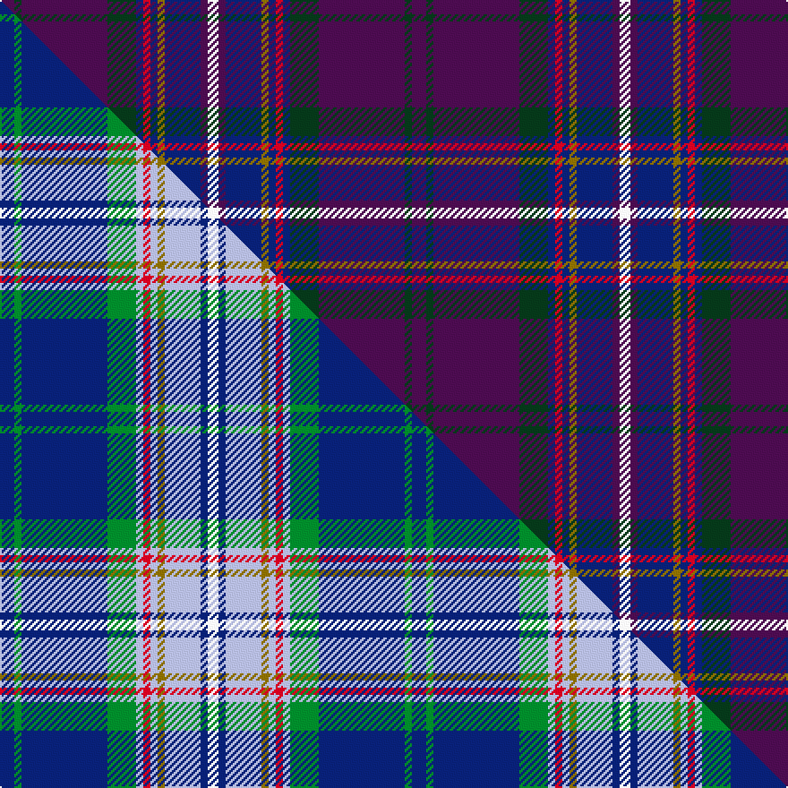

This page is one **sett** — a single exact thread-count. It belongs to the [tartan](/setts/dp4dg2dp24dg8db2r2db2y2db10dp2w3/)
(the same proportion at any scale), whose colour order is pattern [BGBGBRBGBBW](/stripes/bgbgbrbgbbw/).

Part of the [McCartney](/tartans/mccartney/) tartan — the named design grouping this sett with its other cloths.

Sourced from register-of-tartans.  It is a [11 stripe tartan](/stripes/stripes11/).

Original link [https://www.tartanregister.gov.uk/tartanDetails.aspx?ref=2875](https://www.tartanregister.gov.uk/tartanDetails.aspx?ref=2875)

2 attestations — the source records this cloth was collapsed from (oldest owns this page)

<ul>
<li>01/06/1997 — McCartney (Day) (register-of-tartans, <a href="https://www.tartanregister.gov.uk/tartanDetails.aspx?ref=2875">record</a>)  <em>From Scottish Tartans Society records: Designed by Lady McCartney for MPL Household for fashion and furnishing use. Produced after her death. Meaning of MPL not known.</em></li>
<li>June 1997 — McCartney (Day) (Corporate) (tartans-authority, <a href="https://www.tartanregister.gov.uk/tartanDetails.aspx?ref=2593">record</a>)  <em>From STS records: Designed by Lady McCartney for MPL Household for fashion and furnishing use. Produced after her death. Meaning of MPL not known.</em></li>
</ul>

Dataset <small>— provenance for this record, inherited from the source manifest</small>

<dl class="dataset-prov">
<dt>source</dt><dd><a href="/sources/register-of-tartans/">Scottish Register of Tartans</a></dd>
<dt>data captured from</dt><dd><a href="https://github.com/thetartan/tartan-database/blob/master/data/register-of-tartans/data.csv">https://github.com/thetartan/tartan-database/blob/master/data/register-of-tartans/data.csv</a></dd>
<dt>data date</dt><dd>01/06/1997 <small>(this record)</small></dd>
<dt>licence</dt><dd><a href="https://www.tartanregister.gov.uk/copyright">Crown copyright</a></dd>
</dl>

Capture chain <small>— the hands this data passed through, oldest first; each capture carries its own licence</small>

<ol class="capture-chain">
<li><a href="https://www.tartanregister.gov.uk/">Scottish Register of Tartans</a> · <a href="https://www.tartanregister.gov.uk/copyright">Crown copyright</a> <small>the living register — still published by National Records of Scotland</small></li>
<li><a href="https://github.com/thetartan/tartan-database">thetartan/tartan-database</a> <small>2016-2017</small> · <a href="https://creativecommons.org/licenses/by-nc-nd/4.0/">CC BY-NC-ND 4.0</a> <small>Levko Kravets's frozen compilation — the capture we vendored, and where its CC licence text came from</small></li>
<li>this dictionary <small>captured 2026-06-10 · commit 5bf86c7566</small> <small>each re-capture is a git commit to data/sources</small></li>
</ol>

## Register references

External register numbers recorded for this tartan.

- Scottish Register of Tartans: [2875](https://www.tartanregister.gov.uk/tartanDetails.aspx?ref=2875)
- Scottish Tartans Authority (ITI): 2593
- Scottish Tartans World Register: 2593

## Thread count
DP/8 DG4 DP48 DG16 DB4 R4 DB4 Y4 DB20 DP4 W/6

One full sett is **230 threads**.

## Palette
<table><thead><tr><th>Colour</th><th>Shade</th><th>OKLCh</th></tr></thead><tbody><tr><td>DB</td><td><code style="background-color:#082077;">#082077</code> <small style="color:#888">#082077</small></td><td><small style="color:#888">oklch(30.0% 0.149 265.1)</small></td></tr><tr><td>DG</td><td><code style="background-color:#053819;">#053819</code> <small style="color:#888">#053819</small></td><td><small style="color:#888">oklch(30.0% 0.075 151.3)</small></td></tr><tr><td>W</td><td><code style="background-color:#F7F7F7;">#F7F7F7</code> <small style="color:#888">#F7F7F7</small></td><td><small style="color:#888">oklch(97.6% 0.000 89.9)</small></td></tr><tr><td>DP</td><td><code style="background-color:#4B0B4F;">#4B0B4F</code> <small style="color:#888">#4B0B4F</small></td><td><small style="color:#888">oklch(30.1% 0.125 325.4)</small></td></tr><tr><td>R</td><td><code style="background-color:#D60020;">#D60020</code> <small style="color:#888">#D60020</small></td><td><small style="color:#888">oklch(55.2% 0.224 25.5)</small></td></tr><tr><td>Y</td><td><code style="background-color:#8B6E00;">#8B6E00</code> <small style="color:#888">#8B6E00</small></td><td><small style="color:#888">oklch(55.1% 0.113 90.4)</small></td></tr></tbody></table>

# Sample pattern

## Compared to the master

This cloth is one sett of its design; the master sett (the exemplar the design is anchored on) is below for comparison.

Its **ΔTartan distance** from the master is **5.49** — the same measure the nearest-tartans table ranks by (0 is identical; a re-scale of the same cloth is near 0, a recolour or a different proportion further).

<figure class="master-compare" style="margin:0">

this sett
master sett ★

<figcaption style="color:#888;font-size:smaller">One weave of this sett against the <a href="/setts/db4g2db24g8lb2r2lb2y2lb10db2w3/">master sett ★</a>, split on the diagonal: a shared proportion runs seamlessly across it with only the shades shifting; a different proportion breaks on it.</figcaption>
</figure>

## Nearest tartan variants

The nearest existing variants by ΔTartan distance, with this cloth at the top so the swatches line up against it.

ΔTartan

Threads

Variant

Sett

—

230

<a href="/variants/s11/dp4dg2dp24dg8db2r2db2y2db10dp2w3~x2/">McCartney (Day)</a>

<a href="/ttd/edit/#slug=dy1db11dy1dr2n1dr2r2w1r2dr2n1dr2dy1db11w1~x8&amp;base=dp4dg2dp24dg8db2r2db2y2db10dp2w3~x2" title="compare in the TTD">2.35</a>

640

<a href="/variants/s15/dy1db11dy1dr2n1dr2r2w1r2dr2n1dr2dy1db11w1~x8/">Wisconsin in Scotland (Corporate)</a>

<a href="/ttd/edit/#slug=ri3r23db2r2dp2r3db28y2db2g3~x2~ri2806019-r1807008&amp;base=dp4dg2dp24dg8db2r2db2y2db10dp2w3~x2" title="compare in the TTD">2.59</a>

268

<a href="/variants/s10/ri3r23db2r2dp2r3db28y2db2g3~x2~ri2806019-r1807008/">Yarns to Yearn For</a>

<a href="/ttd/edit/#slug=n45g3db7r2db7g3n4w2dp36w2n11db4&amp;base=dp4dg2dp24dg8db2r2db2y2db10dp2w3~x2" title="compare in the TTD">3.00</a>

203

<a href="/variants/s12/n45g3db7r2db7g3n4w2dp36w2n11db4/">Scottish Parliament (Official)</a>

<a href="/ttd/edit/#slug=g4y3db35r13dp8w3~x2&amp;base=dp4dg2dp24dg8db2r2db2y2db10dp2w3~x2" title="compare in the TTD">3.03</a>

250

<a href="/variants/s6/g4y3db35r13dp8w3~x2/">Kilsyth</a>

<a href="/ttd/edit/#slug=w3dp2ly2dp38db28o2db2r2~x2&amp;base=dp4dg2dp24dg8db2r2db2y2db10dp2w3~x2" title="compare in the TTD">3.04</a>

306

<a href="/variants/s8/w3dp2ly2dp38db28o2db2r2~x2/">Gretna Gold (Fashion)</a>

<a href="/ttd/edit/#slug=dg10w2dt3g2o14db26dg2db6~x2&amp;base=dp4dg2dp24dg8db2r2db2y2db10dp2w3~x2" title="compare in the TTD">3.21</a>

228

<a href="/variants/s8/dg10w2dt3g2o14db26dg2db6~x2/">Spirit of Fife</a>

<a href="/ttd/edit/#slug=dg12dp3r3dp3r3dp12db3dp3db2dp2db14g1w3~x2&amp;base=dp4dg2dp24dg8db2r2db2y2db10dp2w3~x2" title="compare in the TTD">3.23</a>

226

<a href="/variants/s13/dg12dp3r3dp3r3dp12db3dp3db2dp2db14g1w3~x2/">Scottish Tourist Guides Association</a>

<a href="/ttd/edit/#slug=y2dbi3r3dbi28db3dbi3db12r3w2~x2~dbi1406275-db1004274&amp;base=dp4dg2dp24dg8db2r2db2y2db10dp2w3~x2" title="compare in the TTD">3.47</a>

228

<a href="/variants/s9/y2dbi3r3dbi28db3dbi3db12r3w2~x2~dbi1406275-db1004274/">Royal Scottish Corporation</a>

<a href="/ttd/edit/#slug=w4db19r4dp2r4dp23y4dp2~x2&amp;base=dp4dg2dp24dg8db2r2db2y2db10dp2w3~x2" title="compare in the TTD">3.47</a>

236

<a href="/variants/s8/w4db19r4dp2r4dp23y4dp2~x2/">Brigadoon</a>

<a href="/ttd/edit/#slug=r6dt3r3dt54g6dt3g6dt4lb24db4lb4db50dt6db4dt12dy4~dt1204274-db1605267&amp;base=dp4dg2dp24dg8db2r2db2y2db10dp2w3~x2" title="compare in the TTD">3.49</a>

376

<a href="/variants/s16/r6db3r3db54g6db3g6db4lb24dbi4lb4dbi50db6dbi4db12dy4~db1204274-dbi1605267/">St Margaret's School for Girls, Aberdeen</a>

## Neighbour map

Every grey dot is one of 13621 variants placed by the first two principal components of the ΔTartan feature space (42% of its variance). Red is this tartan; blue dots are its nearest — click one to open its page.

<svg viewBox="0 0 640 380" role="img" style="max-width:100%;height:auto;border:1px solid #e0e0e0;border-radius:4px;display:block" xmlns="http://www.w3.org/2000/svg"><image href="/nn/cloud.v1.png" width="640" height="380"/><a href="/variants/s15/dy1db11dy1dr2n1dr2r2w1r2dr2n1dr2dy1db11w1~x8/"><circle cx="267.8" cy="126.7" r="4" fill="#3465a4"><title>Wisconsin in Scotland (Corporate)</title></circle></a><a href="/variants/s10/ri3r23db2r2dp2r3db28y2db2g3~x2~ri2806019-r1807008/"><circle cx="293.6" cy="126.0" r="4" fill="#3465a4"><title>Yarns to Yearn For</title></circle></a><a href="/variants/s12/n45g3db7r2db7g3n4w2dp36w2n11db4/"><circle cx="312.5" cy="117.3" r="4" fill="#3465a4"><title>Scottish Parliament (Official)</title></circle></a><a href="/variants/s6/g4y3db35r13dp8w3~x2/"><circle cx="277.5" cy="152.9" r="4" fill="#3465a4"><title>Kilsyth</title></circle></a><a href="/variants/s8/w3dp2ly2dp38db28o2db2r2~x2/"><circle cx="345.2" cy="128.6" r="4" fill="#3465a4"><title>Gretna Gold (Fashion)</title></circle></a><a href="/variants/s8/dg10w2dt3g2o14db26dg2db6~x2/"><circle cx="248.5" cy="135.5" r="4" fill="#3465a4"><title>Spirit of Fife</title></circle></a><a href="/variants/s13/dg12dp3r3dp3r3dp12db3dp3db2dp2db14g1w3~x2/"><circle cx="190.2" cy="153.6" r="4" fill="#3465a4"><title>Scottish Tourist Guides Association</title></circle></a><a href="/variants/s9/y2dbi3r3dbi28db3dbi3db12r3w2~x2~dbi1406275-db1004274/"><circle cx="374.0" cy="160.1" r="4" fill="#3465a4"><title>Royal Scottish Corporation</title></circle></a><a href="/variants/s8/w4db19r4dp2r4dp23y4dp2~x2/"><circle cx="241.7" cy="172.2" r="4" fill="#3465a4"><title>Brigadoon</title></circle></a><a href="/variants/s16/r6db3r3db54g6db3g6db4lb24dbi4lb4dbi50db6dbi4db12dy4~db1204274-dbi1605267/"><circle cx="240.4" cy="105.8" r="4" fill="#3465a4"><title>St Margaret's School for Girls, Aberdeen</title></circle></a><circle cx="277.5" cy="145.6" r="5" fill="#c00000"/><text x="320" y="376" text-anchor="middle" font-size="11" fill="#999">ground</text><text x="11" y="190" text-anchor="middle" font-size="11" fill="#999" transform="rotate(-90 11 190)">complexity</text></svg>

ID: /variants/s11/dp4dg2dp24dg8db2r2db2y2db10dp2w3~x2/
