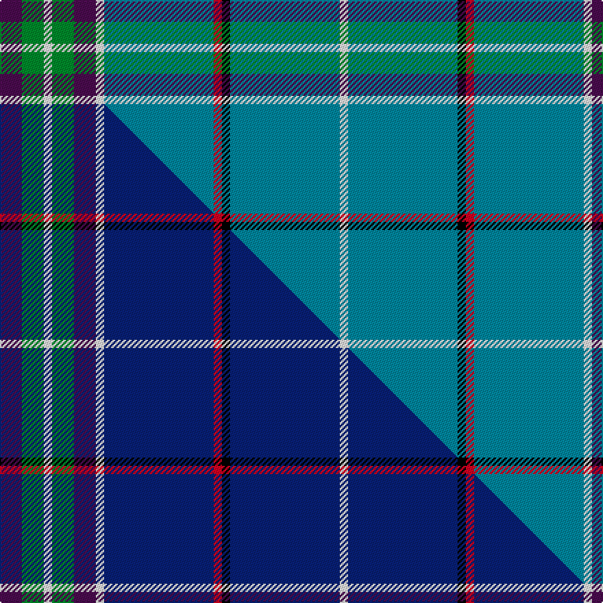

This is one **variant** — a specific cloth: this exact thread count and colourway, with its own
provenance below. It is one weaving of the [sett](/tartans/w/wo/world-peace/) (the scale-free proportion — the
same cloth at any scale or shade), whose colour order is pattern [BGWGBWBRKBW](/stripes/bgwgbwbrkbw/).

Part of the [World Peace](/tartans/w/wo/world-peace/) tartan — the named design grouping this sett with its other cloths.

Sourced from tartans-authority.  It is a [11 stripe tartan](/stripes/stripes11/).

Original link <code>http://www.tartansauthority.com/tartan-ferret/display/10424/</code> — retired · [Internet Archive copy](https://web.archive.org/web/*/http://www.tartansauthority.com/tartan-ferret/display/10424/*)

Dataset <small>— provenance for this record, inherited from the source manifest</small>

<dl class="dataset-prov">
<dt>source</dt><dd><a href="/sources/tartans-authority/">Scottish Tartans Authority</a></dd>
<dt>data captured from</dt><dd><a href="https://github.com/thetartan/tartan-database/blob/master/data/tartans-authority/data.csv">https://github.com/thetartan/tartan-database/blob/master/data/tartans-authority/data.csv</a></dd>
<dt>data date</dt><dd>24th May 2011 <small>(this record)</small></dd>
<dt>licence</dt><dd><a href="https://creativecommons.org/licenses/by-nc-nd/4.0/">CC BY-NC-ND 4.0</a></dd>
</dl>

Capture chain <small>— the hands this data passed through, oldest first; each capture carries its own licence</small>

<ol class="capture-chain">
<li><a href="https://www.tartansauthority.com/">Scottish Tartans Authority</a> <small>the heritage body’s archive — its tartan-ferret record browser is retired; dead record links are shown unlinked, with an Internet Archive copy (ITI numbers are not SRT references)</small></li>
<li><a href="https://github.com/thetartan/tartan-database">thetartan/tartan-database</a> <small>2016-2017</small> · <a href="https://creativecommons.org/licenses/by-nc-nd/4.0/">CC BY-NC-ND 4.0</a> <small>Levko Kravets's frozen compilation — the capture we vendored, and where its CC licence text came from</small></li>
<li>this dictionary <small>captured 2026-06-10 · commit 5bf86c7566</small> <small>each re-capture is a git commit to data/sources</small></li>
</ol>

## Register references

External register numbers recorded for this tartan.

- Scottish Register of Tartans: [10424](https://www.tartanregister.gov.uk/tartanDetails?ref=10424)
- Scottish Tartans Authority (ITI): 10424

## Thread count
DP/16 G16 W6 G16 DP16 W6 T80 R6 K6 T80 W/6

One full sett is **486 threads**.

## Palette
<table><thead><tr><th>Colour</th><th>Shade</th><th>OKLCh</th></tr></thead><tbody><tr><td>T</td><td><code style="background-color:#00879F;">#00879F</code> <small style="color:#888">#00879F</small></td><td><small style="color:#888">oklch(57.4% 0.102 216.1)</small></td></tr><tr><td>G</td><td><code style="background-color:#008B2A;">#008B2A</code> <small style="color:#888">#008B2A</small></td><td><small style="color:#888">oklch(55.4% 0.170 145.9)</small></td></tr><tr><td>K</td><td><code style="background-color:#000000;">#000000</code> <small style="color:#888">#000000</small></td><td><small style="color:#888">oklch(0.0% 0.000 0.0)</small></td></tr><tr><td>DP</td><td><code style="background-color:#4B0B4F;">#4B0B4F</code> <small style="color:#888">#4B0B4F</small></td><td><small style="color:#888">oklch(30.1% 0.125 325.4)</small></td></tr><tr><td>R</td><td><code style="background-color:#D60020;">#D60020</code> <small style="color:#888">#D60020</small></td><td><small style="color:#888">oklch(55.2% 0.224 25.5)</small></td></tr><tr><td>W</td><td><code style="background-color:#F7F7F7;">#F7F7F7</code> <small style="color:#888">#F7F7F7</small></td><td><small style="color:#888">oklch(97.6% 0.000 89.9)</small></td></tr></tbody></table>

# Sample pattern

## Compared to the master

This cloth is one sett of its design; the master sett (the exemplar the design is anchored on) is below for comparison.

Its **ΔTartan distance** from the master is **0.21** — the same measure the nearest-tartans table ranks by (0 is identical; a re-scale of the same cloth is near 0, a recolour or a different proportion further).

<figure class="master-compare" style="margin:0">

this sett
master sett ★

<figcaption style="color:#888;font-size:smaller">One weave of this sett against the <a href="/setts/dp8g8w3g8dp8w3db40r3k3db40w3/">master sett ★</a>, split on the diagonal: a shared proportion runs seamlessly across it with only the shades shifting; a different proportion breaks on it.</figcaption>
</figure>

## Nearest tartan variants

The nearest existing variants by ΔTartan distance, with this cloth at the top so the swatches line up against it.

ΔTartan

Threads

Variant

Sett

—

486

<a href="/variants/s11/dp8g8w3g8dp8w3t40r3k3t40w3~x2/">World Peace (Fashion)</a>

<a href="/ttd/edit/#slug=dp8g8w3g8dp8w3db40r3k3db40w3~x2&amp;base=dp8g8w3g8dp8w3t40r3k3t40w3~x2" title="compare in the TTD">0.21</a>

486

<a href="/variants/s11/dp8g8w3g8dp8w3db40r3k3db40w3~x2/">World Peace</a>

<a href="/ttd/edit/#slug=t2w1t12ly3t7dy2ly1t2k1g4w1t2~x4&amp;base=dp8g8w3g8dp8w3t40r3k3t40w3~x2" title="compare in the TTD">2.06</a>

288

<a href="/variants/s12/t2w1t12ly3t7dy2ly1t2k1g4w1t2~x4/">Fife (Mann)</a>

<a href="/ttd/edit/#slug=b32w1k3w1g14b7k3dr3w1~x2&amp;base=dp8g8w3g8dp8w3t40r3k3t40w3~x2" title="compare in the TTD">2.23</a>

194

<a href="/variants/s9/b32w1k3w1g14b7k3dr3w1~x2/">Leach, Leech, Leitch, hunting</a>

<a href="/ttd/edit/#slug=k3t2g13w2t24dr3~x4~t2405244-g2408144&amp;base=dp8g8w3g8dp8w3t40r3k3t40w3~x2" title="compare in the TTD">2.23</a>

352

<a href="/variants/s6/k3t2g13w2t24dr3~x4~t2405244-g2408144/">Vance</a>

<a href="/ttd/edit/#slug=n55t8w8t8g5n8ly4w4k4~x2&amp;base=dp8g8w3g8dp8w3t40r3k3t40w3~x2" title="compare in the TTD">2.77</a>

298

<a href="/variants/s9/n55t8w8t8g5n8ly4w4k4~x2/">Ofsharick, Matthew (Personal)</a>

<a href="/ttd/edit/#slug=t34g10t5r2k8dy2w3dy2k8r2t5g10t28k3~x2&amp;base=dp8g8w3g8dp8w3t40r3k3t40w3~x2" title="compare in the TTD">2.81</a>

414

<a href="/variants/s14/t34g10t5r2k8dy2w3dy2k8r2t5g10t28k3~x2/">Lambert Dress (Personal)</a>

<a href="/ttd/edit/#slug=n55db8w8db8g5n8y4w4k4~x2&amp;base=dp8g8w3g8dp8w3t40r3k3t40w3~x2" title="compare in the TTD">2.86</a>

298

<a href="/variants/s9/n55db8w8db8g5n8y4w4k4~x2/">Ofsharick, Matthew (Personal)</a>

<a href="/ttd/edit/#slug=b19k1lyi1b10k4y9dp4b9lyi1k1ly2~x4~b2206256-lyi2602166&amp;base=dp8g8w3g8dp8w3t40r3k3t40w3~x2" title="compare in the TTD">3.04</a>

404

<a href="/variants/s11/b19k1yi1b10k4y9dp4b9yi1k1ly2~x4~b2206256-yi2602166/">Cian of Ely (Clan)</a>

<a href="/ttd/edit/#slug=y1db2y1db12k1g6dp3w1~x4&amp;base=dp8g8w3g8dp8w3t40r3k3t40w3~x2" title="compare in the TTD">3.27</a>

208

<a href="/variants/s8/y1db2y1db12k1g6dp3w1~x4/">Lambert, Patrice (Personal)</a>

<a href="/ttd/edit/#slug=w1dp3g6k1db12ly1db2ly1~x4&amp;base=dp8g8w3g8dp8w3t40r3k3t40w3~x2" title="compare in the TTD">3.30</a>

208

<a href="/variants/s8/w1dp3g6k1db12ly1db2ly1~x4/">Lambert, Patrice (Personal)</a>

## Neighbour map

Every grey dot is one of 13656 variants placed by the first two principal components of the ΔTartan feature space (42% of its variance). Red is this tartan; blue dots are its nearest — click one to open its page. The map is a flat projection of a many-dimensional space — [how to read it](/posts/neighbourhood-maps/).

<svg viewBox="0 0 640 380" role="img" style="max-width:100%;height:auto;border:1px solid #e0e0e0;border-radius:4px;display:block" xmlns="http://www.w3.org/2000/svg"><image href="/nn/cloud.v1.png" width="640" height="380"/><a href="/variants/s11/dp8g8w3g8dp8w3db40r3k3db40w3~x2/"><circle cx="286.5" cy="108.9" r="4" fill="#3465a4"><title>World Peace</title></circle></a><a href="/variants/s12/t2w1t12ly3t7dy2ly1t2k1g4w1t2~x4/"><circle cx="316.7" cy="141.4" r="4" fill="#3465a4"><title>Fife (Mann)</title></circle></a><a href="/variants/s9/b32w1k3w1g14b7k3dr3w1~x2/"><circle cx="327.3" cy="96.3" r="4" fill="#3465a4"><title>Leach, Leech, Leitch, hunting</title></circle></a><a href="/variants/s6/k3t2g13w2t24dr3~x4~t2405244-g2408144/"><circle cx="274.8" cy="172.5" r="4" fill="#3465a4"><title>Vance</title></circle></a><a href="/variants/s9/n55t8w8t8g5n8ly4w4k4~x2/"><circle cx="309.7" cy="121.1" r="4" fill="#3465a4"><title>Ofsharick, Matthew (Personal)</title></circle></a><a href="/variants/s14/t34g10t5r2k8dy2w3dy2k8r2t5g10t28k3~x2/"><circle cx="247.5" cy="99.4" r="4" fill="#3465a4"><title>Lambert Dress (Personal)</title></circle></a><a href="/variants/s9/n55db8w8db8g5n8y4w4k4~x2/"><circle cx="295.3" cy="114.0" r="4" fill="#3465a4"><title>Ofsharick, Matthew (Personal)</title></circle></a><a href="/variants/s11/b19k1yi1b10k4y9dp4b9yi1k1ly2~x4~b2206256-yi2602166/"><circle cx="292.3" cy="115.8" r="4" fill="#3465a4"><title>Cian of Ely (Clan)</title></circle></a><a href="/variants/s8/y1db2y1db12k1g6dp3w1~x4/"><circle cx="226.5" cy="139.7" r="4" fill="#3465a4"><title>Lambert, Patrice (Personal)</title></circle></a><a href="/variants/s8/w1dp3g6k1db12ly1db2ly1~x4/"><circle cx="211.7" cy="135.0" r="4" fill="#3465a4"><title>Lambert, Patrice (Personal)</title></circle></a><circle cx="303.1" cy="121.2" r="5" fill="#c00000"/><text x="320" y="376" text-anchor="middle" font-size="11" fill="#999">ground</text><text x="11" y="190" text-anchor="middle" font-size="11" fill="#999" transform="rotate(-90 11 190)">complexity</text></svg>

ID: /variants/s11/dp8g8w3g8dp8w3t40r3k3t40w3~x2/
