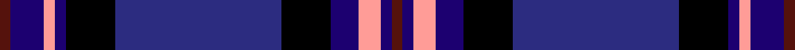

This page is one **sett** — a single exact thread-count. It belongs to the [tartan](/setts/dr2db6lr2db2k9dbi30k9db5lr4db2dr2/)
(the same proportion at any scale), whose colour order is pattern [BBYBKBKBYBB](/stripes/bbybkbkbybb/).

Sourced from register-of-tartans.  It is a [11 stripe tartan](/stripes/stripes11/).

Original link https://www.tartanregister.gov.uk/tartanDetails.aspx?ref=3458

## Register references

External register numbers recorded for this tartan.

- Scottish Register of Tartans: [3458](https://www.tartanregister.gov.uk/tartanDetails.aspx?ref=3458)
- Scottish Tartans Authority (ITI): 2171
- Scottish Tartans World Register: 2171

## Thread count
DR/4 DB12 LR4 DB4 K18 DBi60 K18 DB10 LR8 DB4 DR/4

One full sett is **284 threads**.

## Palette
<table><thead><tr><th>Colour</th><th>Shade</th><th>OKLCh</th></tr></thead><tbody><tr><td>DB</td><td><code style="background-color:#1C0070;">#1C0070</code> <small style="color:#888">#1C0070</small></td><td><small style="color:#888">oklch(26.3% 0.162 277.1)</small></td></tr><tr><td>DBa</td><td><code style="background-color:#2C2C80;">#2C2C80</code> <small style="color:#888">#2C2C80</small></td><td><small style="color:#888">oklch(35.0% 0.138 276.6)</small></td></tr><tr><td>DR</td><td><code style="background-color:#55120C;">#55120C</code> <small style="color:#888">#55120C</small></td><td><small style="color:#888">oklch(30.0% 0.099 29.3)</small></td></tr><tr><td>K</td><td><code style="background-color:#000000;">#000000</code> <small style="color:#888">#000000</small></td><td><small style="color:#888">oklch(0.0% 0.000 0.0)</small></td></tr><tr><td>N</td><td><code style="background-color:#FF9C97;">#FF9C97</code> <small style="color:#888">#FF9C97</small></td><td><small style="color:#888">oklch(79.3% 0.119 23.2)</small></td></tr></tbody></table>

# Sample pattern

ID: /variants/s11/dr2db6lr2db2k9dbi30k9db5lr4db2dr2~x2~db1106275-dbi1406275/
