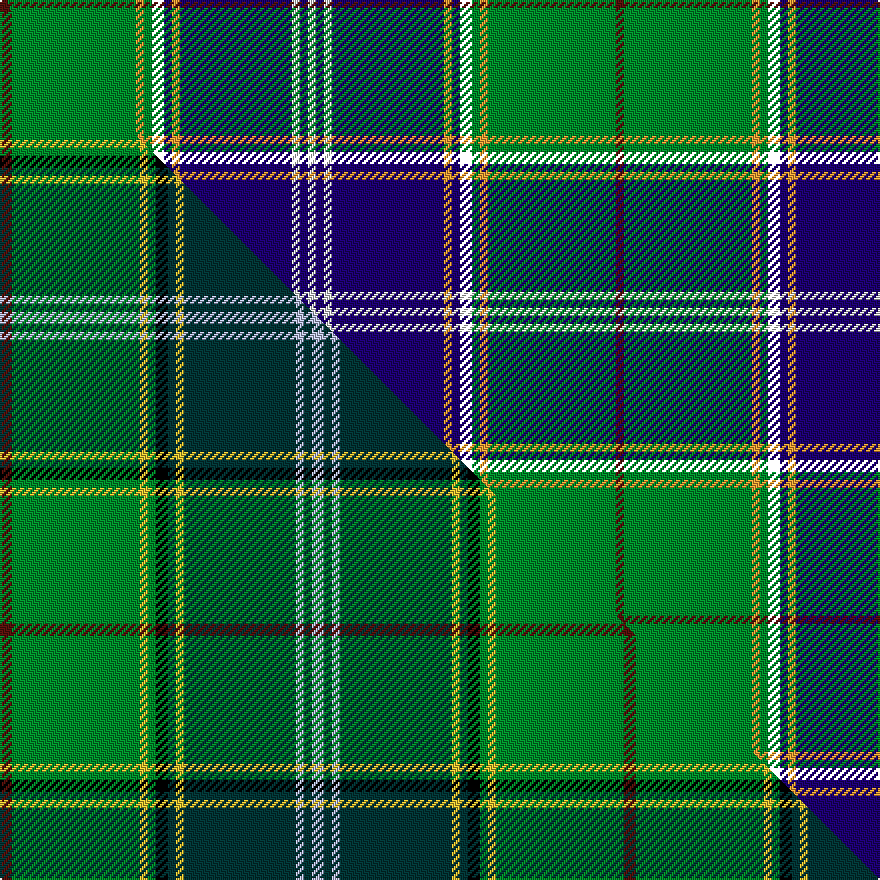

This is one **variant** — a specific cloth: this exact thread count and colourway, with its own
provenance below. It is one weaving of the [sett](/setts/dr2g32lo2g2k3db2lo2db28w2db2w2/) (the scale-free proportion — the
same cloth at any scale or shade), whose colour order is pattern [BGYGKBYBWBW](/stripes/bgygkbybwbw/).

Part of the [Pringle](/tartans/pringle/) tartan — the named design grouping this sett with its other cloths.

Sourced from house-of-tartan.  It is a [11 stripe tartan](/stripes/stripes11/).

Original link [http://www.house-of-tartan.scotland.net/house/TartanViewjs.asp?colr=Def&tnam=5447](http://www.house-of-tartan.scotland.net/house/TartanViewjs.asp?colr=Def&tnam=5447)

## Provenance

Earliest known date: c.1998 Dalgleish of Selkirk designed and wove this circa 1998 as a personal tartan for someone of the name, Pringle.

Dataset <small>— provenance for this record, inherited from the source manifest</small>

<dl class="dataset-prov">
<dt>source</dt><dd><a href="/sources/house-of-tartan/">House of Tartan</a></dd>
<dt>data captured from</dt><dd><a href="https://github.com/thetartan/tartan-database/blob/master/data/house-of-tartan/data.csv">https://github.com/thetartan/tartan-database/blob/master/data/house-of-tartan/data.csv</a></dd>
<dt>data date</dt><dd>c.1998 <small>(this record)</small></dd>
<dt>licence</dt><dd><a href="https://creativecommons.org/licenses/by-nc-nd/4.0/">CC BY-NC-ND 4.0</a></dd>
</dl>

Capture chain <small>— the hands this data passed through, oldest first; each capture carries its own licence</small>

<ol class="capture-chain">
<li><a href="http://www.house-of-tartan.scotland.net/">House of Tartan</a> <small>the weaver/retailer's database — the site is now offline; the URL is kept as the ultimate source's identity</small></li>
<li><a href="https://github.com/thetartan/tartan-database">thetartan/tartan-database</a> <small>2016-2017</small> · <a href="https://creativecommons.org/licenses/by-nc-nd/4.0/">CC BY-NC-ND 4.0</a> <small>Levko Kravets's frozen compilation — the capture we vendored, and where its CC licence text came from</small></li>
<li>this dictionary <small>captured 2026-06-10 · commit 5bf86c7566</small> <small>each re-capture is a git commit to data/sources</small></li>
</ol>

## Thread count
DR/4 G64 LO4 G4 K6 DB4 LO4 DB56 W4 DB4 W/4

One full sett is **308 threads**.

## Palette
<table><thead><tr><th>Colour</th><th>Shade</th><th>OKLCh</th></tr></thead><tbody><tr><td>DB</td><td><code style="background-color:#003C64;">#003C64</code> <small style="color:#888">#003C64</small></td><td><small style="color:#888">oklch(34.5% 0.089 246.0)</small></td></tr><tr><td>DB</td><td><code style="background-color:#1C0070;">#1C0070</code> <small style="color:#888">#1C0070</small></td><td><small style="color:#888">oklch(26.3% 0.162 277.1)</small></td></tr><tr><td>DO</td><td><code style="background-color:#412714;">#412714</code> <small style="color:#888">#412714</small></td><td><small style="color:#888">oklch(30.1% 0.050 55.7)</small></td></tr><tr><td>DR</td><td><code style="background-color:#55120C;">#55120C</code> <small style="color:#888">#55120C</small></td><td><small style="color:#888">oklch(30.0% 0.099 29.3)</small></td></tr><tr><td>G</td><td><code style="background-color:#008B2A;">#008B2A</code> <small style="color:#888">#008B2A</small></td><td><small style="color:#888">oklch(55.4% 0.170 145.9)</small></td></tr><tr><td>W</td><td><code style="background-color:#E0E0E0;">#E0E0E0</code> <small style="color:#888">#E0E0E0</small></td><td><small style="color:#888">oklch(90.7% 0.000 89.9)</small></td></tr><tr><td>W</td><td><code style="background-color:#D8D8D8;">#D8D8D8</code> <small style="color:#888">#D8D8D8</small></td><td><small style="color:#888">oklch(88.2% 0.000 89.9)</small></td></tr><tr><td>LO</td><td><code style="background-color:#FF9C34;">#FF9C34</code> <small style="color:#888">#FF9C34</small></td><td><small style="color:#888">oklch(77.9% 0.161 61.8)</small></td></tr></tbody></table>

# Sample pattern

## Compared to the master

This cloth is one sett of its design; the master sett (the exemplar the design is anchored on) is below for comparison.

Its **ΔTartan distance** from the master is **3.35** — the same measure the nearest-tartans table ranks by (0 is identical; a re-scale of the same cloth is near 0, a recolour or a different proportion further).

<figure class="master-compare" style="margin:0">

this sett
master sett ★

<figcaption style="color:#888;font-size:smaller">One weave of this sett against the <a href="/setts/dr3g32ly2g2k3dt2ly2dt28lb2dt2lb3/">master sett ★</a>, split on the diagonal: a shared proportion runs seamlessly across it with only the shades shifting; a different proportion breaks on it.</figcaption>
</figure>

## Nearest tartan variants

The nearest existing variants by ΔTartan distance, with this cloth at the top so the swatches line up against it.

ΔTartan

Threads

Variant

Sett

—

308

<a href="/variants/s11/dr2g32lo2g2k3db2lo2db28w2db2w2~x2~db1106275-w3600000/">Pringle Personal Tartan</a>

<a href="/ttd/edit/#slug=dr2dg20y1dg1k2lb1y1lb22w1lb1w1~x4&amp;base=dr2g32lo2g2k3db2lo2db28w2db2w2~x2~db1106275-w3600000" title="compare in the TTD">1.02</a>

412

<a href="/variants/s11/dr2dg20y1dg1k2lb1y1lb22w1lb1w1~x4/">Unidentified (Tony Murray Collection</a>

<a href="/ttd/edit/#slug=w2dg2r2dg16t2k13r2t2r2t32lb2k2t2w2~x2&amp;base=dr2g32lo2g2k3db2lo2db28w2db2w2~x2~db1106275-w3600000" title="compare in the TTD">1.81</a>

324

<a href="/variants/s14/w2dg2r2dg16t2k13r2t2r2t32lb2k2t2w2~x2/">Aberfeldy</a>

<a href="/ttd/edit/#slug=r3w6r2g32db36k2db4y2~x2&amp;base=dr2g32lo2g2k3db2lo2db28w2db2w2~x2~db1106275-w3600000" title="compare in the TTD">2.01</a>

338

<a href="/variants/s8/r3w6r2g32db36k2db4y2~x2/">Canadian Centennial District Tartan</a>

<a href="/ttd/edit/#slug=r8g2k2ly2k2y2k2g18db2g2db29k3~x2&amp;base=dr2g32lo2g2k3db2lo2db28w2db2w2~x2~db1106275-w3600000" title="compare in the TTD">2.07</a>

274

<a href="/variants/s12/r8g2k2ly2k2y2k2g18db2g2db29k3~x2/">Cats Winter (Fashion)</a>

<a href="/ttd/edit/#slug=db38w2db2k10g2y2g22k3r3k3r3~x2&amp;base=dr2g32lo2g2k3db2lo2db28w2db2w2~x2~db1106275-w3600000" title="compare in the TTD">2.25</a>

278

<a href="/variants/s11/db38w2db2k10g2y2g22k3r3k3r3~x2/">Hunnisett /Edinchip Corporate Tartan</a>

<a href="/ttd/edit/#slug=db18w1db1w1db4r4k1g12dy1g1dy1g1dy1~x4&amp;base=dr2g32lo2g2k3db2lo2db28w2db2w2~x2~db1106275-w3600000" title="compare in the TTD">2.27</a>

300

<a href="/variants/s13/db18w1db1w1db4r4k1g12dy1g1dy1g1dy1~x4/">Roach (2015)</a>

<a href="/ttd/edit/#slug=db6r3g3r3g36b6g6db40g3k3g3k3g8y6~x2&amp;base=dr2g32lo2g2k3db2lo2db28w2db2w2~x2~db1106275-w3600000" title="compare in the TTD">2.32</a>

492

<a href="/variants/s14/db6r3g3r3g36b6g6db40g3k3g3k3g8y6~x2/">Princess Beatrice Hunting (MacKinlay strip)</a>

<a href="/ttd/edit/#slug=db10g6dp4dr2dp4k10db6k4db28g55w4&amp;base=dr2g32lo2g2k3db2lo2db28w2db2w2~x2~db1106275-w3600000" title="compare in the TTD">2.33</a>

252

<a href="/variants/s11/db10g6dp4dr2dp4k10db6k4db28g55w4/">1314 (Corporate)</a>

<a href="/ttd/edit/#slug=r7g20ly2g4k5db4k2db20k3w1~x2&amp;base=dr2g32lo2g2k3db2lo2db28w2db2w2~x2~db1106275-w3600000" title="compare in the TTD">2.47</a>

256

<a href="/variants/s10/r7g20ly2g4k5db4k2db20k3w1~x2/">McMeeken (Name)</a>

<a href="/ttd/edit/#slug=r7g20y2g4k5db4k2db20k3w1~x2&amp;base=dr2g32lo2g2k3db2lo2db28w2db2w2~x2~db1106275-w3600000" title="compare in the TTD">2.47</a>

256

<a href="/variants/s10/r7g20y2g4k5db4k2db20k3w1~x2/">McMeeken</a>

## Neighbour map

Every grey dot is one of 13621 variants placed by the first two principal components of the ΔTartan feature space (42% of its variance). Red is this tartan; blue dots are its nearest — click one to open its page.

<svg viewBox="0 0 640 380" role="img" style="max-width:100%;height:auto;border:1px solid #e0e0e0;border-radius:4px;display:block" xmlns="http://www.w3.org/2000/svg"><image href="/nn/cloud.v1.png" width="640" height="380"/><a href="/variants/s11/dr2dg20y1dg1k2lb1y1lb22w1lb1w1~x4/"><circle cx="219.0" cy="69.3" r="4" fill="#3465a4"><title>Unidentified (Tony Murray Collection</title></circle></a><a href="/variants/s14/w2dg2r2dg16t2k13r2t2r2t32lb2k2t2w2~x2/"><circle cx="174.2" cy="78.7" r="4" fill="#3465a4"><title>Aberfeldy</title></circle></a><a href="/variants/s8/r3w6r2g32db36k2db4y2~x2/"><circle cx="218.7" cy="114.4" r="4" fill="#3465a4"><title>Canadian Centennial District Tartan</title></circle></a><a href="/variants/s12/r8g2k2ly2k2y2k2g18db2g2db29k3~x2/"><circle cx="167.4" cy="94.9" r="4" fill="#3465a4"><title>Cats Winter (Fashion)</title></circle></a><a href="/variants/s11/db38w2db2k10g2y2g22k3r3k3r3~x2/"><circle cx="185.5" cy="85.0" r="4" fill="#3465a4"><title>Hunnisett /Edinchip Corporate Tartan</title></circle></a><a href="/variants/s13/db18w1db1w1db4r4k1g12dy1g1dy1g1dy1~x4/"><circle cx="221.8" cy="82.3" r="4" fill="#3465a4"><title>Roach (2015)</title></circle></a><a href="/variants/s14/db6r3g3r3g36b6g6db40g3k3g3k3g8y6~x2/"><circle cx="208.0" cy="105.3" r="4" fill="#3465a4"><title>Princess Beatrice Hunting (MacKinlay strip)</title></circle></a><a href="/variants/s11/db10g6dp4dr2dp4k10db6k4db28g55w4/"><circle cx="216.7" cy="86.0" r="4" fill="#3465a4"><title>1314 (Corporate)</title></circle></a><a href="/variants/s10/r7g20ly2g4k5db4k2db20k3w1~x2/"><circle cx="139.0" cy="114.3" r="4" fill="#3465a4"><title>McMeeken (Name)</title></circle></a><a href="/variants/s10/r7g20y2g4k5db4k2db20k3w1~x2/"><circle cx="141.6" cy="114.7" r="4" fill="#3465a4"><title>McMeeken</title></circle></a><circle cx="203.0" cy="90.0" r="5" fill="#c00000"/><text x="320" y="376" text-anchor="middle" font-size="11" fill="#999">ground</text><text x="11" y="190" text-anchor="middle" font-size="11" fill="#999" transform="rotate(-90 11 190)">complexity</text></svg>

ID: /variants/s11/dr2g32lo2g2k3db2lo2db28w2db2w2~x2~db1106275-w3600000/
