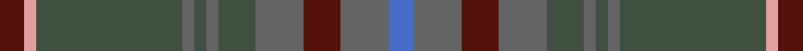

This is one **variant** — a specific cloth: this exact thread count and colourway, with its own
provenance below. It is one weaving of the [sett](/tartans/t/ta/tasmanian/) (the scale-free proportion — the
same cloth at any scale or shade), whose colour order is pattern [BBBBGBGBGYB](/stripes/bbbbgbgbgyb/).

Part of the [Tasmanian](/tartans/t/ta/tasmanian/) tartan — the named design grouping this sett with its other cloths.

Sourced from weddslist.  It is a [11 stripe tartan](/stripes/stripes11/).

Original link [http://www.weddslist.com/cgi-bin/tartans/pg.pl?source=sts](http://www.weddslist.com/cgi-bin/tartans/pg.pl?source=sts)

Dataset <small>— provenance for this record, inherited from the source manifest</small>

<dl class="dataset-prov">
<dt>source</dt><dd><a href="/sources/weddslist/">Weddslist</a></dd>
<dt>data captured from</dt><dd><a href="https://github.com/thetartan/tartan-database/blob/master/data/weddslist/data.csv">https://github.com/thetartan/tartan-database/blob/master/data/weddslist/data.csv</a></dd>
<dt>data date</dt><dd>2016-11-17 <small>(dataset default)</small></dd>
<dt>licence</dt><dd><a href="https://creativecommons.org/licenses/by-nc-nd/4.0/">CC BY-NC-ND 4.0</a></dd>
</dl>

Capture chain <small>— the hands this data passed through, oldest first; each capture carries its own licence</small>

<ol class="capture-chain">
<li><a href="https://www.weddslist.com/tartans/">Weddslist</a> <small>the living privately compiled reference</small></li>
<li><a href="https://github.com/thetartan/tartan-database">thetartan/tartan-database</a> <small>2016-2017</small> · <a href="https://creativecommons.org/licenses/by-nc-nd/4.0/">CC BY-NC-ND 4.0</a> <small>Levko Kravets's frozen compilation — the capture we vendored, and where its CC licence text came from</small></li>
<li>this dictionary <small>captured 2026-06-10 · commit 5bf86c7566</small> <small>each re-capture is a git commit to data/sources</small></li>
</ol>

## Thread count
DR/8 LR4 DG48 N4 DG4 N4 DG12 N16 DR12 N16 B/8

One full sett is **256 threads**.

## Palette
<table><thead><tr><th>Colour</th><th>Shade</th><th>OKLCh</th></tr></thead><tbody><tr><td>DR</td><td><code style="background-color:#55120C;">#55120C</code> <small style="color:#888">#55120C</small></td><td><small style="color:#888">oklch(30.0% 0.099 29.3)</small></td></tr><tr><td>LR</td><td><code style="background-color:#E0A0A0;">#E0A0A0</code> <small style="color:#888">#E0A0A0</small></td><td><small style="color:#888">oklch(76.7% 0.077 19.0)</small></td></tr><tr><td>DG</td><td><code style="background-color:#405040;">#405040</code> <small style="color:#888">#405040</small></td><td><small style="color:#888">oklch(41.2% 0.033 144.9)</small></td></tr><tr><td>N</td><td><code style="background-color:#636363;">#636363</code> <small style="color:#888">#636363</small></td><td><small style="color:#888">oklch(50.0% 0.000 89.9)</small></td></tr><tr><td>B</td><td><code style="background-color:#466CC8;">#466CC8</code> <small style="color:#888">#466CC8</small></td><td><small style="color:#888">oklch(55.1% 0.149 265.0)</small></td></tr></tbody></table>

# Sample pattern

[Sample sheet (PDF)](swatch.pdf) — the woven sample, thread count and palette on one printable A4, rendered on demand (the same sheet the TTD print page downloads).

## Nearest tartan variants

The nearest existing variants by ΔTartan distance, with this cloth at the top so the swatches line up against it.

ΔTartan

Threads

Variant

Sett

—

256

<a href="/variants/s11/dr2lr1dg12n1dg1n1dg3n4dr3n4b2~x4~lr7608018-dg4103144/">Tasmanian</a>

<a href="/ttd/edit/#slug=db5dg2db2dg2db2dbi5dg2dbi1lb1dbi1dg10dr3~x4~db2911276-dg3007159-dbi3409246&amp;base=dr2lr1dg12n1dg1n1dg3n4dr3n4b2~x4~lr7608018-dg4103144" title="compare in the TTD">3.15</a>

256

<a href="/variants/s12/db5dg2db2dg2db2dbi5dg2dbi1lb1dbi1dg10dr3~x4~db2911276-dg3007159-dbi3409246/">Richard of Wales</a>

<a href="/ttd/edit/#slug=do6lg3do18dy2do2dy10g28dr2g4~x2~lg7504150-g4808117&amp;base=dr2lr1dg12n1dg1n1dg3n4dr3n4b2~x4~lr7608018-dg4103144" title="compare in the TTD">3.33</a>

280

<a href="/variants/s9/do6lg3do18dy2do2dy10g28dr2g4~x2~lg7504150-g4808117/">Scottish Crofting Foundation</a>

<a href="/ttd/edit/#slug=dgi5dg2db2dg2db2dbi5dg2dbi1ly1dbi1dg10db3~x4~dgi4112135-dg3007159-db2911276-dbi3409246&amp;base=dr2lr1dg12n1dg1n1dg3n4dr3n4b2~x4~lr7608018-dg4103144" title="compare in the TTD">3.38</a>

256

<a href="/variants/s12/dgi5dg2db2dg2db2dbi5dg2dbi1ly1dbi1dg10db3~x4~dgi4112135-dg3007159-db2911276-dbi3409246/">Protheroe (Welsh Name)</a>

<a href="/ttd/edit/#slug=dp3ni24n10ni2g11ni8lb3~x2~ni47-n43&amp;base=dr2lr1dg12n1dg1n1dg3n4dr3n4b2~x4~lr7608018-dg4103144" title="compare in the TTD">3.40</a>

232

<a href="/variants/s7/dp3ni24n10ni2g11ni8lb3~x2~ni47-n43/">Hesco</a>

<a href="/ttd/edit/#slug=dy1dr5dp1dg2dr1dg12dp1dg2dp6db5b1~x4&amp;base=dr2lr1dg12n1dg1n1dg3n4dr3n4b2~x4~lr7608018-dg4103144" title="compare in the TTD">3.49</a>

288

<a href="/variants/s11/dy1dr5dp1dg2dr1dg12dp1dg2dp6db5b1~x4/">Telfer, Jamie of the Fair Dodhead</a>

<a href="/ttd/edit/#slug=y3n3dg2n3lyi2n2lyi2n13t4y3t3y3t3y3t4n20ly3~x2~lyi8212087-ly6708078&amp;base=dr2lr1dg12n1dg1n1dg3n4dr3n4b2~x4~lr7608018-dg4103144" title="compare in the TTD">3.70</a>

292

<a href="/variants/s17/y3n3dg2n3lyi2n2lyi2n13t4y3t3y3t3y3t4n20ly3~x2~lyi8212087-ly6708078/">Fermanagh Irish County Tartan</a>

<a href="/ttd/edit/#slug=y5dg14dy4db4dy27dg3dy4y5&amp;base=dr2lr1dg12n1dg1n1dg3n4dr3n4b2~x4~lr7608018-dg4103144" title="compare in the TTD">3.70</a>

122

<a href="/variants/s8/y5dg14dy4db4dy27dg3dy4y5/">Invertere Corporate Tartan</a>

<a href="/ttd/edit/#slug=do9dy9n9r1db1dy9db1r1~x4&amp;base=dr2lr1dg12n1dg1n1dg3n4dr3n4b2~x4~lr7608018-dg4103144" title="compare in the TTD">3.78</a>

280

<a href="/variants/s8/do9dy9n9r1db1dy9db1r1~x4/">Jardine of Castlemilk Family Tartan</a>

<a href="/ttd/edit/#slug=do2n4dg12n3do6t2n24do2n2dg2~x2&amp;base=dr2lr1dg12n1dg1n1dg3n4dr3n4b2~x4~lr7608018-dg4103144" title="compare in the TTD">3.94</a>

228

<a href="/variants/s10/do2n4dg12n3do6t2n24do2n2dg2~x2/">Wicklow Irish County Tartan</a>

## Neighbour map

Every grey dot is one of 13662 variants placed by the first two principal components of the ΔTartan feature space (42% of its variance). Red is this tartan; blue dots are its nearest — click one to open its page. The map is a flat projection of a many-dimensional space — [how to read it](/posts/neighbourhood-maps/).

<svg viewBox="0 0 640 380" role="img" style="max-width:100%;height:auto;border:1px solid #e0e0e0;border-radius:4px;display:block" xmlns="http://www.w3.org/2000/svg"><image href="/nn/cloud.v1.png" width="640" height="380"/><a href="/variants/s12/db5dg2db2dg2db2dbi5dg2dbi1lb1dbi1dg10dr3~x4~db2911276-dg3007159-dbi3409246/"><circle cx="388.9" cy="254.8" r="4" fill="#3465a4"><title>Richard of Wales</title></circle></a><a href="/variants/s9/do6lg3do18dy2do2dy10g28dr2g4~x2~lg7504150-g4808117/"><circle cx="396.3" cy="225.2" r="4" fill="#3465a4"><title>Scottish Crofting Foundation</title></circle></a><a href="/variants/s12/dgi5dg2db2dg2db2dbi5dg2dbi1ly1dbi1dg10db3~x4~dgi4112135-dg3007159-db2911276-dbi3409246/"><circle cx="368.0" cy="250.6" r="4" fill="#3465a4"><title>Protheroe (Welsh Name)</title></circle></a><a href="/variants/s7/dp3ni24n10ni2g11ni8lb3~x2~ni47-n43/"><circle cx="450.8" cy="262.8" r="4" fill="#3465a4"><title>Hesco</title></circle></a><a href="/variants/s11/dy1dr5dp1dg2dr1dg12dp1dg2dp6db5b1~x4/"><circle cx="370.2" cy="218.2" r="4" fill="#3465a4"><title>Telfer, Jamie of the Fair Dodhead</title></circle></a><a href="/variants/s17/y3n3dg2n3lyi2n2lyi2n13t4y3t3y3t3y3t4n20ly3~x2~lyi8212087-ly6708078/"><circle cx="414.1" cy="206.6" r="4" fill="#3465a4"><title>Fermanagh Irish County Tartan</title></circle></a><a href="/variants/s8/y5dg14dy4db4dy27dg3dy4y5/"><circle cx="464.9" cy="270.6" r="4" fill="#3465a4"><title>Invertere Corporate Tartan</title></circle></a><a href="/variants/s8/do9dy9n9r1db1dy9db1r1~x4/"><circle cx="380.1" cy="258.9" r="4" fill="#3465a4"><title>Jardine of Castlemilk Family Tartan</title></circle></a><a href="/variants/s10/do2n4dg12n3do6t2n24do2n2dg2~x2/"><circle cx="485.1" cy="233.7" r="4" fill="#3465a4"><title>Wicklow Irish County Tartan</title></circle></a><circle cx="434.4" cy="239.3" r="5" fill="#c00000"/><text x="320" y="376" text-anchor="middle" font-size="11" fill="#999">ground</text><text x="11" y="190" text-anchor="middle" font-size="11" fill="#999" transform="rotate(-90 11 190)">complexity</text></svg>

ID: /variants/s11/dr2lr1dg12n1dg1n1dg3n4dr3n4b2~x4~lr7608018-dg4103144/
