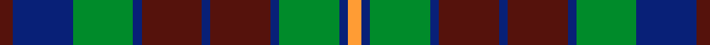

This page is one **sett** — a single exact thread-count. It belongs to the [tartan](/setts/dr3db14g14db2dr14db2dr14db2g14db2lo3/)
(the same proportion at any scale), whose colour order is pattern [BBGBBBBBGBY](/stripes/bbgbbbbbgby/).

Sourced from house-of-tartan.  It is a [11 stripe tartan](/stripes/stripes11/).

Original link http://www.house-of-tartan.scotland.net/house/TartanViewjs.asp?colr=Def&tnam=2248

## Provenance

Earliest known date: 1995 One of a series of Irish District tartans designed by Polly Wittering of the House of Edgar, with colours reminiscent of the Country with soft warm colours dominating.

## Thread count
DR/6 DB28 G28 DB4 DR28 DB4 DR28 DB4 G28 DB4 LO/6

One full sett is **324 threads**.

## Palette
<table><thead><tr><th>Colour</th><th>Shade</th><th>OKLCh</th></tr></thead><tbody><tr><td>DB</td><td><code style="background-color:#082077;">#082077</code> <small style="color:#888">#082077</small></td><td><small style="color:#888">oklch(30.0% 0.149 265.1)</small></td></tr><tr><td>DR</td><td><code style="background-color:#55120C;">#55120C</code> <small style="color:#888">#55120C</small></td><td><small style="color:#888">oklch(30.0% 0.099 29.3)</small></td></tr><tr><td>DY</td><td><code style="background-color:#FF9C34;">#FF9C34</code> <small style="color:#888">#FF9C34</small></td><td><small style="color:#888">oklch(77.9% 0.161 61.8)</small></td></tr><tr><td>G</td><td><code style="background-color:#008B2A;">#008B2A</code> <small style="color:#888">#008B2A</small></td><td><small style="color:#888">oklch(55.4% 0.170 145.9)</small></td></tr></tbody></table>

# Sample pattern

## Nearest variants

The nearest existing variants by ΔTartan distance, with this cloth at the top so the swatches line up against it.

ΔTartan

Threads

Variant

Sett

—

324

<a href="/variants/s11/dr3db14g14db2dr14db2dr14db2g14db2lo3~x2/">Clare Irish County Tartan</a>

<a href="/ttd/edit/#slug=dr3db14b14db2dr14db2dr14db2g14db2y3~x2&amp;base=dr3db14g14db2dr14db2dr14db2g14db2lo3~x2" title="compare in the TTD">1.65</a>

324

<a href="/variants/s11/dr3db14b14db2dr14db2dr14db2g14db2y3~x2/">Clare</a>

<a href="/ttd/edit/#slug=dr17db2dr2db13dr2db2g17db2~x2&amp;base=dr3db14g14db2dr14db2dr14db2g14db2lo3~x2" title="compare in the TTD">2.93</a>

190

<a href="/variants/s8/dr17db2dr2db13dr2db2g17db2~x2/">Remony (Red)</a>

## Neighbour map

Every grey dot is one of 13620 variants placed by the first two principal components of the ΔTartan feature space (42% of its variance). Red is this tartan; blue dots are its nearest — click one to open its page.

<svg viewBox="0 0 640 380" role="img" style="max-width:100%;height:auto;border:1px solid #e0e0e0;border-radius:4px;display:block" xmlns="http://www.w3.org/2000/svg"><image href="/nn/cloud.v1.png" width="640" height="380"/><a href="/variants/s11/dr3db14b14db2dr14db2dr14db2g14db2y3~x2/"><circle cx="208.0" cy="226.6" r="4" fill="#3465a4"><title>Clare</title></circle></a><a href="/variants/s8/dr17db2dr2db13dr2db2g17db2~x2/"><circle cx="286.6" cy="243.3" r="4" fill="#3465a4"><title>Remony (Red)</title></circle></a><circle cx="223.9" cy="235.4" r="5" fill="#c00000"/><text x="320" y="376" text-anchor="middle" font-size="11" fill="#999">ground</text><text x="11" y="190" text-anchor="middle" font-size="11" fill="#999" transform="rotate(-90 11 190)">complexity</text></svg>

ID: /variants/s11/dr3db14g14db2dr14db2dr14db2g14db2lo3~x2/
