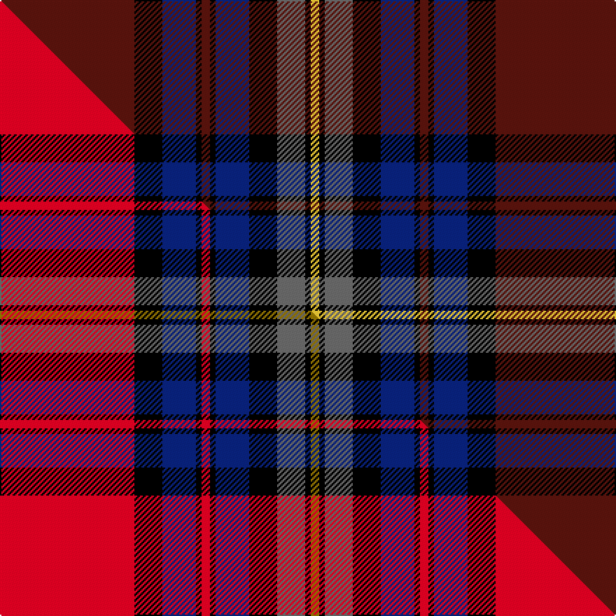

This is one **variant** — a specific cloth: this exact thread count and colourway, with its own
provenance below. It is one weaving of the [sett](/tartans/b/br/brooks-brothers/) (the scale-free proportion — the
same cloth at any scale or shade), whose colour order is pattern [BKBKBKBKBKY](/stripes/bkbkbkbkbky/).

Part of the [Brooks Brothers](/tartans/b/br/brooks-brothers/) tartan — the named design grouping this sett with its other cloths.

Sourced from tartans-authority.  It is a [11 stripe tartan](/stripes/stripes11/).

Original link <code>http://www.tartansauthority.com/tartan-ferret/display/3735/</code> — retired · [Internet Archive copy](https://web.archive.org/web/*/http://www.tartansauthority.com/tartan-ferret/display/3735/*)

Dataset <small>— provenance for this record, inherited from the source manifest</small>

<dl class="dataset-prov">
<dt>source</dt><dd><a href="/sources/tartans-authority/">Scottish Tartans Authority</a></dd>
<dt>data captured from</dt><dd><a href="https://github.com/thetartan/tartan-database/blob/master/data/tartans-authority/data.csv">https://github.com/thetartan/tartan-database/blob/master/data/tartans-authority/data.csv</a></dd>
<dt>data date</dt><dd>pre 1996 <small>(this record)</small></dd>
<dt>licence</dt><dd><a href="https://creativecommons.org/licenses/by-nc-nd/4.0/">CC BY-NC-ND 4.0</a></dd>
</dl>

Capture chain <small>— the hands this data passed through, oldest first; each capture carries its own licence</small>

<ol class="capture-chain">
<li><a href="https://www.tartansauthority.com/">Scottish Tartans Authority</a> <small>the heritage body’s archive — its tartan-ferret record browser is retired; dead record links are shown unlinked, with an Internet Archive copy (ITI numbers are not SRT references)</small></li>
<li><a href="https://github.com/thetartan/tartan-database">thetartan/tartan-database</a> <small>2016-2017</small> · <a href="https://creativecommons.org/licenses/by-nc-nd/4.0/">CC BY-NC-ND 4.0</a> <small>Levko Kravets's frozen compilation — the capture we vendored, and where its CC licence text came from</small></li>
<li>this dictionary <small>captured 2026-06-10 · commit 5bf86c7566</small> <small>each re-capture is a git commit to data/sources</small></li>
</ol>

## Register references

External register numbers recorded for this tartan.

- Scottish Tartans Authority (ITI): 3735

## Thread count
DR/96 K20 DB24 K4 DR6 K4 DB24 K20 N20 K4 LY/6

One full sett is **354 threads**.

## Palette
<table><thead><tr><th>Colour</th><th>Shade</th><th>OKLCh</th></tr></thead><tbody><tr><td>DB</td><td><code style="background-color:#082077;">#082077</code> <small style="color:#888">#082077</small></td><td><small style="color:#888">oklch(30.0% 0.149 265.1)</small></td></tr><tr><td>DR</td><td><code style="background-color:#55120C;">#55120C</code> <small style="color:#888">#55120C</small></td><td><small style="color:#888">oklch(30.0% 0.099 29.3)</small></td></tr><tr><td>K</td><td><code style="background-color:#000000;">#000000</code> <small style="color:#888">#000000</small></td><td><small style="color:#888">oklch(0.0% 0.000 0.0)</small></td></tr><tr><td>LY</td><td><code style="background-color:#DCBC32;">#DCBC32</code> <small style="color:#888">#DCBC32</small></td><td><small style="color:#888">oklch(80.0% 0.150 95.2)</small></td></tr><tr><td>N</td><td><code style="background-color:#636363;">#636363</code> <small style="color:#888">#636363</small></td><td><small style="color:#888">oklch(50.0% 0.000 89.9)</small></td></tr></tbody></table>

# Sample pattern

## Compared to the master

This cloth is one sett of its design; the master sett (the exemplar the design is anchored on) is below for comparison.

Its **ΔTartan distance** from the master is **0.18** — the same measure the nearest-tartans table ranks by (0 is identical; a re-scale of the same cloth is near 0, a recolour or a different proportion further).

<figure class="master-compare" style="margin:0">

this sett
master sett ★

<figcaption style="color:#888;font-size:smaller">One weave of this sett against the <a href="/setts/r48k10db12k2r3k2db12k10n10k2y3/">master sett ★</a>, split on the diagonal: a shared proportion runs seamlessly across it with only the shades shifting; a different proportion breaks on it.</figcaption>
</figure>

## Nearest tartan variants

The nearest existing variants by ΔTartan distance, with this cloth at the top so the swatches line up against it.

ΔTartan

Threads

Variant

Sett

—

354

<a href="/variants/s11/dr48k10db12k2dr3k2db12k10n10k2ly3~x2/">Brooks Brothers (Corporate)</a>

<a href="/ttd/edit/#slug=dr4k2dr24y2k12db3k2db2k2db12w1db1w3~x2&amp;base=dr48k10db12k2dr3k2db12k10n10k2ly3~x2" title="compare in the TTD">2.32</a>

266

<a href="/variants/s13/dr4k2dr24y2k12db3k2db2k2db12w1db1w3~x2/">Baron of Greencastle Dress #2 (Personal)</a>

<a href="/ttd/edit/#slug=w2k35db30k3dr30k2dr4k2dr30k3w2&amp;base=dr48k10db12k2dr3k2db12k10n10k2ly3~x2" title="compare in the TTD">2.33</a>

282

<a href="/variants/s11/w2k35db30k3dr30k2dr4k2dr30k3w2/">Gwyn (Welsh Name)</a>

<a href="/ttd/edit/#slug=dr4k4dr28dp4g4k10g4dp4g4dp8k1w3~x2&amp;base=dr48k10db12k2dr3k2db12k10n10k2ly3~x2" title="compare in the TTD">2.50</a>

298

<a href="/variants/s12/dr4k4dr28dp4g4k10g4dp4g4dp8k1w3~x2/">Kelly of Sleat (Name)</a>

<a href="/ttd/edit/#slug=db22r2db2r6db2r2db38k46r2dy42n2dy2n2dy15~x2&amp;base=dr48k10db12k2dr3k2db12k10n10k2ly3~x2" title="compare in the TTD">2.64</a>

666

<a href="/variants/s14/db22r2db2r6db2r2db38k46r2dy42n2dy2n2dy15~x2/">Applestone</a>

<a href="/ttd/edit/#slug=k37dp2k2dp3k13dp10w2dp10dg1dp2dg2dp2dg9dp13~x2&amp;base=dr48k10db12k2dr3k2db12k10n10k2ly3~x2" title="compare in the TTD">2.64</a>

332

<a href="/variants/s14/k37dp2k2dp3k13dp10w2dp10dg1dp2dg2dp2dg9dp13~x2/">Strathtummel District Tartan</a>

<a href="/ttd/edit/#slug=dr4k1db8k1dy3k2db4dy6db4w3k2db20k4dr21k1dy3~x2&amp;base=dr48k10db12k2dr3k2db12k10n10k2ly3~x2" title="compare in the TTD">2.74</a>

334

<a href="/variants/s16/dr4k1db8k1dy3k2db4dy6db4w3k2db20k4dr21k1dy3~x2/">Westmeath County, Crest Range</a>

<a href="/ttd/edit/#slug=r2k3db30k2db4k2db30k36dr30k2lb2&amp;base=dr48k10db12k2dr3k2db12k10n10k2ly3~x2" title="compare in the TTD">2.77</a>

282

<a href="/variants/s11/r2k3db30k2db4k2db30k36dr30k2lb2/">Evans (Welsh Name)</a>

<a href="/ttd/edit/#slug=k4dp30k3dp2db2r2g12k3db18r3~x2&amp;base=dr48k10db12k2dr3k2db12k10n10k2ly3~x2" title="compare in the TTD">2.82</a>

302

<a href="/variants/s10/k4dp30k3dp2db2r2g12k3db18r3~x2/">Wardlaw</a>

<a href="/ttd/edit/#slug=ri2k3db30k2db4k2db30k36r30k2lb2~ri2109032-r1706009&amp;base=dr48k10db12k2dr3k2db12k10n10k2ly3~x2" title="compare in the TTD">2.83</a>

282

<a href="/variants/s11/ri2k3db30k2db4k2db30k36r30k2lb2~ri2109032-r1706009/">Evans Welsh Name Tartan</a>

<a href="/ttd/edit/#slug=y6k2r8k4dr64dg14k63r4k4r8k2y6&amp;base=dr48k10db12k2dr3k2db12k10n10k2ly3~x2" title="compare in the TTD">2.95</a>

358

<a href="/variants/s12/y6k2r8k4dr64dg14k63r4k4r8k2y6/">Integrated Landscape Management (ILM)</a>

## Neighbour map

Every grey dot is one of 13657 variants placed by the first two principal components of the ΔTartan feature space (42% of its variance). Red is this tartan; blue dots are its nearest — click one to open its page. The map is a flat projection of a many-dimensional space — [how to read it](/posts/neighbourhood-maps/).

<svg viewBox="0 0 640 380" role="img" style="max-width:100%;height:auto;border:1px solid #e0e0e0;border-radius:4px;display:block" xmlns="http://www.w3.org/2000/svg"><image href="/nn/cloud.v1.png" width="640" height="380"/><a href="/variants/s13/dr4k2dr24y2k12db3k2db2k2db12w1db1w3~x2/"><circle cx="202.8" cy="93.5" r="4" fill="#3465a4"><title>Baron of Greencastle Dress #2 (Personal)</title></circle></a><a href="/variants/s11/w2k35db30k3dr30k2dr4k2dr30k3w2/"><circle cx="260.4" cy="139.4" r="4" fill="#3465a4"><title>Gwyn (Welsh Name)</title></circle></a><a href="/variants/s12/dr4k4dr28dp4g4k10g4dp4g4dp8k1w3~x2/"><circle cx="202.9" cy="102.0" r="4" fill="#3465a4"><title>Kelly of Sleat (Name)</title></circle></a><a href="/variants/s14/db22r2db2r6db2r2db38k46r2dy42n2dy2n2dy15~x2/"><circle cx="215.0" cy="104.7" r="4" fill="#3465a4"><title>Applestone</title></circle></a><a href="/variants/s14/k37dp2k2dp3k13dp10w2dp10dg1dp2dg2dp2dg9dp13~x2/"><circle cx="251.2" cy="87.8" r="4" fill="#3465a4"><title>Strathtummel District Tartan</title></circle></a><a href="/variants/s16/dr4k1db8k1dy3k2db4dy6db4w3k2db20k4dr21k1dy3~x2/"><circle cx="229.0" cy="111.7" r="4" fill="#3465a4"><title>Westmeath County, Crest Range</title></circle></a><a href="/variants/s11/r2k3db30k2db4k2db30k36dr30k2lb2/"><circle cx="254.6" cy="128.2" r="4" fill="#3465a4"><title>Evans (Welsh Name)</title></circle></a><a href="/variants/s10/k4dp30k3dp2db2r2g12k3db18r3~x2/"><circle cx="206.3" cy="132.3" r="4" fill="#3465a4"><title>Wardlaw</title></circle></a><a href="/variants/s11/ri2k3db30k2db4k2db30k36r30k2lb2~ri2109032-r1706009/"><circle cx="233.0" cy="118.6" r="4" fill="#3465a4"><title>Evans Welsh Name Tartan</title></circle></a><a href="/variants/s12/y6k2r8k4dr64dg14k63r4k4r8k2y6/"><circle cx="235.7" cy="72.6" r="4" fill="#3465a4"><title>Integrated Landscape Management (ILM)</title></circle></a><circle cx="258.9" cy="109.5" r="5" fill="#c00000"/><text x="320" y="376" text-anchor="middle" font-size="11" fill="#999">ground</text><text x="11" y="190" text-anchor="middle" font-size="11" fill="#999" transform="rotate(-90 11 190)">complexity</text></svg>

ID: /variants/s11/dr48k10db12k2dr3k2db12k10n10k2ly3~x2/
