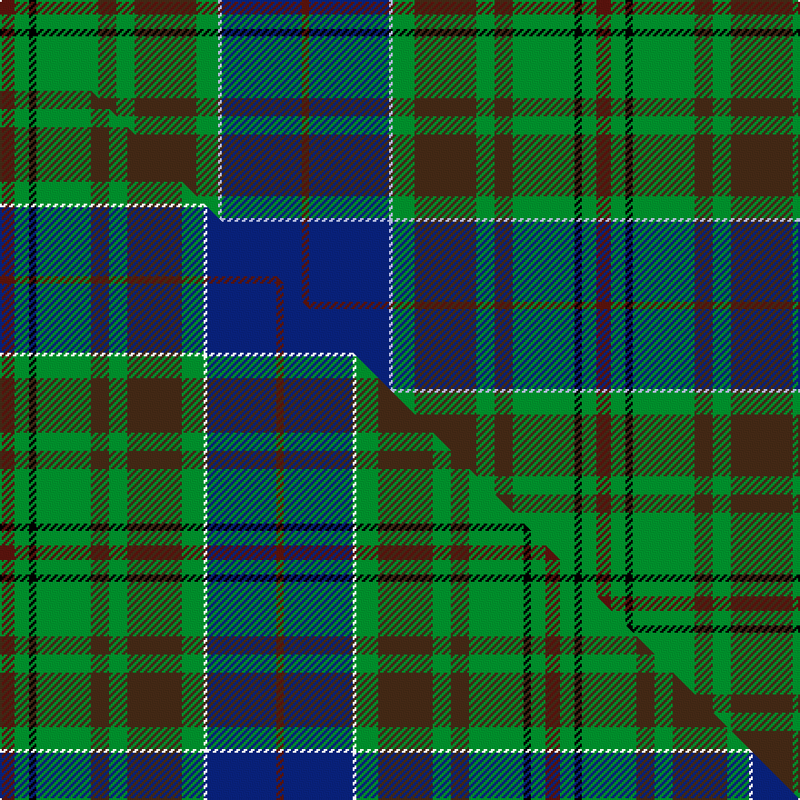

This page is one **sett** — a single exact thread-count. It belongs to the [tartan](/setts/dr4g4k2g17do5g5do17g6lb1db22dr2/)
(the same proportion at any scale), whose colour order is pattern [BBWGBGBGKGB](/stripes/bbwgbgbgkgb/).

Part of the [Adams](/tartans/adams/) tartan — the named design grouping this sett with its other cloths.

Sourced from tartans-authority.  It is a [11 stripe tartan](/stripes/stripes11/).

Original link http://www.tartansauthority.com/tartan-ferret/display/3022/

## Provenance

Earliest known date: 1994 Peter MacDonald swatch collection, Stone Mountain Games, in 1994. Designed by a Mr Adams in London in 1994

2 attestations — the source records this cloth was collapsed from (oldest owns this page)

<ul>
<li>1994 — Adams (Name) (tartans-authority, <a href="http://www.tartansauthority.com/tartan-ferret/display/3022/">record</a>)  <em>From Peter MacDonald swatch collection. Designed by a Mr Adams in London in 1994. Assumed to be for all of the name.</em></li>
<li>undated — Adams Clan/Family Tartan (house-of-tartan, <a href="http://www.house-of-tartan.scotland.net/house/TartanViewjs.asp?colr=Def&tnam=3022">record</a>) </li>
</ul>

## Register references

External register numbers recorded for this tartan.

- Scottish Tartans Authority (ITI): 3022

## Thread count
DR/8 G8 K4 G34 DO10 G10 DO34 G12 LB2 DB44 DR/4

One full sett is **328 threads**.

## Palette
<table><thead><tr><th>Colour</th><th>Shade</th><th>OKLCh</th></tr></thead><tbody><tr><td>DB</td><td><code style="background-color:#082077;">#082077</code> <small style="color:#888">#082077</small></td><td><small style="color:#888">oklch(30.0% 0.149 265.1)</small></td></tr><tr><td>DR</td><td><code style="background-color:#55120C;">#55120C</code> <small style="color:#888">#55120C</small></td><td><small style="color:#888">oklch(30.0% 0.099 29.3)</small></td></tr><tr><td>DO</td><td><code style="background-color:#412714;">#412714</code> <small style="color:#888">#412714</small></td><td><small style="color:#888">oklch(30.1% 0.050 55.7)</small></td></tr><tr><td>G</td><td><code style="background-color:#008B2A;">#008B2A</code> <small style="color:#888">#008B2A</small></td><td><small style="color:#888">oklch(55.4% 0.170 145.9)</small></td></tr><tr><td>K</td><td><code style="background-color:#000000;">#000000</code> <small style="color:#888">#000000</small></td><td><small style="color:#888">oklch(0.0% 0.000 0.0)</small></td></tr><tr><td>LB</td><td><code style="background-color:#B5BBDE;">#B5BBDE</code> <small style="color:#888">#B5BBDE</small></td><td><small style="color:#888">oklch(79.9% 0.050 277.6)</small></td></tr></tbody></table>

# Sample pattern

## Compared to the master

This cloth is one sett of its design; the master sett (the exemplar the design is anchored on) is below for comparison.

Its **ΔTartan distance** from the master is **0.43** — the same measure the nearest-tartans table ranks by (0 is identical; a re-scale of the same cloth is near 0, a recolour or a different proportion further).

<figure class="master-compare" style="margin:0">

this sett
master sett ★

<figcaption style="color:#888;font-size:smaller">One weave of this sett against the <a href="/setts/dr4g4k2g15do5g5do15g6w1db19dr2/">master sett ★</a>, split on the diagonal: a shared proportion runs seamlessly across it with only the shades shifting; a different proportion breaks on it.</figcaption>
</figure>

## Nearest tartan variants

The nearest existing variants by ΔTartan distance, with this cloth at the top so the swatches line up against it.

ΔTartan

Threads

Variant

Sett

—

328

<a href="/variants/s11/dr4g4k2g17do5g5do17g6lb1db22dr2~x2/">Adams (Name)</a>

<a href="/ttd/edit/#slug=dr4g4k2g15do5g5do15g6w1db19dr2~x2&amp;base=dr4g4k2g17do5g5do17g6lb1db22dr2~x2" title="compare in the TTD">0.43</a>

300

<a href="/variants/s11/dr4g4k2g15do5g5do15g6w1db19dr2~x2/">Adams</a>

<a href="/ttd/edit/#slug=y9k1dy31g30db36g3db3g3db36g30dy31k1w9~x2&amp;base=dr4g4k2g17do5g5do17g6lb1db22dr2~x2" title="compare in the TTD">2.24</a>

856

<a href="/variants/s13/y9k1dy31g30db36g3db3g3db36g30dy31k1w9~x2/">Campbell, Brown (Personal)</a>

<a href="/ttd/edit/#slug=o8k2dy10dp30dy30g55k4lo6&amp;base=dr4g4k2g17do5g5do17g6lb1db22dr2~x2" title="compare in the TTD">2.54</a>

276

<a href="/variants/s8/o8k2dy10dp30dy30g55k4lo6/">Aberuchill</a>

<a href="/ttd/edit/#slug=r4lb1g6dg25k8db15lb2~x2~g1903114-dg1806142-db1406275&amp;base=dr4g4k2g17do5g5do17g6lb1db22dr2~x2" title="compare in the TTD">2.55</a>

232

<a href="/variants/s7/r4lb1g6dg25k8db15lb2~x2~g1903114-dg1806142-db1406275/">Jones</a>

<a href="/ttd/edit/#slug=dg19w2dg5k4db21k4w2dg5w1y1w1do14~x2&amp;base=dr4g4k2g17do5g5do17g6lb1db22dr2~x2" title="compare in the TTD">2.57</a>

250

<a href="/variants/s12/dg19w2dg5k4db21k4w2dg5w1y1w1do14~x2/">Womack (2014)</a>

<a href="/ttd/edit/#slug=y9k1dr31g30db36g3db3g3db36g30dr31k1w9~x2&amp;base=dr4g4k2g17do5g5do17g6lb1db22dr2~x2" title="compare in the TTD">2.63</a>

856

<a href="/variants/s13/y9k1dr31g30db36g3db3g3db36g30dr31k1w9~x2/">Campbell Brown Personal Tartan</a>

<a href="/ttd/edit/#slug=dg17r2dg2r5dg29r2dt31k2g29r5g2r2g17~x2~dt1204274&amp;base=dr4g4k2g17do5g5do17g6lb1db22dr2~x2" title="compare in the TTD">2.63</a>

512

<a href="/variants/s13/dg17r2dg2r5dg29r2db31k2g29r5g2r2g17~x2~db1204274/">Barbecue Presbyterian Church</a>

<a href="/ttd/edit/#slug=r4lb1g6dg25k8db15lb2~x2~g1903114-dg1806142&amp;base=dr4g4k2g17do5g5do17g6lb1db22dr2~x2" title="compare in the TTD">2.64</a>

232

<a href="/variants/s7/r4lb1g6dg25k8db15lb2~x2~g1903114-dg1806142/">Jones (Name)</a>

<a href="/ttd/edit/#slug=g20dg14db9y2db9k1w2~x4&amp;base=dr4g4k2g17do5g5do17g6lb1db22dr2~x2" title="compare in the TTD">2.67</a>

368

<a href="/variants/s7/g20dg14db9y2db9k1w2~x4/">Hughes</a>

<a href="/ttd/edit/#slug=dy3y3dy12y1k1db12k1db12k1g12k1dy12lb3db2~x2&amp;base=dr4g4k2g17do5g5do17g6lb1db22dr2~x2" title="compare in the TTD">2.70</a>

294

<a href="/variants/s14/dy3y3dy12y1k1db12k1db12k1g12k1dy12lb3db2~x2/">Balmaha</a>

## Neighbour map

Every grey dot is one of 13620 variants placed by the first two principal components of the ΔTartan feature space (42% of its variance). Red is this tartan; blue dots are its nearest — click one to open its page.

<svg viewBox="0 0 640 380" role="img" style="max-width:100%;height:auto;border:1px solid #e0e0e0;border-radius:4px;display:block" xmlns="http://www.w3.org/2000/svg"><image href="/nn/cloud.v1.png" width="640" height="380"/><a href="/variants/s11/dr4g4k2g15do5g5do15g6w1db19dr2~x2/"><circle cx="175.3" cy="140.1" r="4" fill="#3465a4"><title>Adams</title></circle></a><a href="/variants/s13/y9k1dy31g30db36g3db3g3db36g30dy31k1w9~x2/"><circle cx="167.0" cy="107.9" r="4" fill="#3465a4"><title>Campbell, Brown (Personal)</title></circle></a><a href="/variants/s8/o8k2dy10dp30dy30g55k4lo6/"><circle cx="190.3" cy="123.2" r="4" fill="#3465a4"><title>Aberuchill</title></circle></a><a href="/variants/s7/r4lb1g6dg25k8db15lb2~x2~g1903114-dg1806142-db1406275/"><circle cx="184.3" cy="133.7" r="4" fill="#3465a4"><title>Jones</title></circle></a><a href="/variants/s12/dg19w2dg5k4db21k4w2dg5w1y1w1do14~x2/"><circle cx="164.5" cy="111.6" r="4" fill="#3465a4"><title>Womack (2014)</title></circle></a><a href="/variants/s13/y9k1dr31g30db36g3db3g3db36g30dr31k1w9~x2/"><circle cx="163.5" cy="104.3" r="4" fill="#3465a4"><title>Campbell Brown Personal Tartan</title></circle></a><a href="/variants/s13/dg17r2dg2r5dg29r2db31k2g29r5g2r2g17~x2~db1204274/"><circle cx="182.8" cy="143.1" r="4" fill="#3465a4"><title>Barbecue Presbyterian Church</title></circle></a><a href="/variants/s7/r4lb1g6dg25k8db15lb2~x2~g1903114-dg1806142/"><circle cx="180.5" cy="133.1" r="4" fill="#3465a4"><title>Jones (Name)</title></circle></a><a href="/variants/s7/g20dg14db9y2db9k1w2~x4/"><circle cx="170.3" cy="160.7" r="4" fill="#3465a4"><title>Hughes</title></circle></a><a href="/variants/s14/dy3y3dy12y1k1db12k1db12k1g12k1dy12lb3db2~x2/"><circle cx="153.8" cy="139.9" r="4" fill="#3465a4"><title>Balmaha</title></circle></a><circle cx="188.0" cy="131.3" r="5" fill="#c00000"/><text x="320" y="376" text-anchor="middle" font-size="11" fill="#999">ground</text><text x="11" y="190" text-anchor="middle" font-size="11" fill="#999" transform="rotate(-90 11 190)">complexity</text></svg>

ID: /variants/s11/dr4g4k2g17do5g5do17g6lb1db22dr2~x2/
