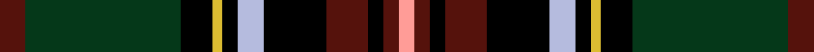

This is one **variant** — a specific cloth: this exact thread count and colourway, with its own
provenance below. It is one weaving of the [sett](/tartans/k/ki/king-george-3/) (the scale-free proportion — the
same cloth at any scale or shade), whose colour order is pattern [BGKYKWKBKBY](/stripes/bgkykwkbkby/).

Part of the [King George](/tartans/k/ki/king-george-3/) tartan — the named design grouping this sett with its other cloths.

Sourced from register-of-tartans.  It is a [11 stripe tartan](/stripes/stripes11/).

Original link [https://www.tartanregister.gov.uk/tartanDetails.aspx?ref=1982](https://www.tartanregister.gov.uk/tartanDetails.aspx?ref=1982)

Dataset <small>— provenance for this record, inherited from the source manifest</small>

<dl class="dataset-prov">
<dt>source</dt><dd><a href="/sources/register-of-tartans/">Scottish Register of Tartans</a></dd>
<dt>data captured from</dt><dd><a href="https://github.com/thetartan/tartan-database/blob/master/data/register-of-tartans/data.csv">https://github.com/thetartan/tartan-database/blob/master/data/register-of-tartans/data.csv</a></dd>
<dt>data date</dt><dd>1974 <small>(this record)</small></dd>
<dt>licence</dt><dd><a href="https://www.tartanregister.gov.uk/copyright">Crown copyright</a></dd>
</dl>

Capture chain <small>— the hands this data passed through, oldest first; each capture carries its own licence</small>

<ol class="capture-chain">
<li><a href="https://www.tartanregister.gov.uk/">Scottish Register of Tartans</a> · <a href="https://www.tartanregister.gov.uk/copyright">Crown copyright</a> <small>the living register — still published by National Records of Scotland</small></li>
<li><a href="https://github.com/thetartan/tartan-database">thetartan/tartan-database</a> <small>2016-2017</small> · <a href="https://creativecommons.org/licenses/by-nc-nd/4.0/">CC BY-NC-ND 4.0</a> <small>Levko Kravets's frozen compilation — the capture we vendored, and where its CC licence text came from</small></li>
<li>this dictionary <small>captured 2026-06-10 · commit 5bf86c7566</small> <small>each re-capture is a git commit to data/sources</small></li>
</ol>

## Register references

External register numbers recorded for this tartan.

- Scottish Register of Tartans: [1982](https://www.tartanregister.gov.uk/tartanDetails.aspx?ref=1982)
- Scottish Tartans Authority (ITI): 5352

## Thread count
DR/10 DG60 K12 LY4 K6 LB10 K24 DR16 K6 DR6 LR/6

One full sett is **304 threads**.

## Palette
<table><thead><tr><th>Colour</th><th>Shade</th><th>OKLCh</th></tr></thead><tbody><tr><td>LB</td><td><code style="background-color:#B5BBDE;">#B5BBDE</code> <small style="color:#888">#B5BBDE</small></td><td><small style="color:#888">oklch(79.9% 0.050 277.6)</small></td></tr><tr><td>DR</td><td><code style="background-color:#55120C;">#55120C</code> <small style="color:#888">#55120C</small></td><td><small style="color:#888">oklch(30.0% 0.099 29.3)</small></td></tr><tr><td>LY</td><td><code style="background-color:#DCBC32;">#DCBC32</code> <small style="color:#888">#DCBC32</small></td><td><small style="color:#888">oklch(80.0% 0.150 95.2)</small></td></tr><tr><td>DG</td><td><code style="background-color:#053819;">#053819</code> <small style="color:#888">#053819</small></td><td><small style="color:#888">oklch(30.0% 0.075 151.3)</small></td></tr><tr><td>K</td><td><code style="background-color:#000000;">#000000</code> <small style="color:#888">#000000</small></td><td><small style="color:#888">oklch(0.0% 0.000 0.0)</small></td></tr><tr><td>LR</td><td><code style="background-color:#FF9C97;">#FF9C97</code> <small style="color:#888">#FF9C97</small></td><td><small style="color:#888">oklch(79.3% 0.119 23.2)</small></td></tr></tbody></table>

# Sample pattern

## Nearest tartan variants

The nearest existing variants by ΔTartan distance, with this cloth at the top so the swatches line up against it.

ΔTartan

Threads

Variant

Sett

—

304

<a href="/variants/s11/dr5dg30k6ly2k3lb5k12dr8k3dr3lr3~x2/">King George (Nash)</a>

<a href="/ttd/edit/#slug=k2r2k15lb2k4lb2n9dt27w2~x2~n1800000-dt1200000&amp;base=dr5dg30k6ly2k3lb5k12dr8k3dr3lr3~x2" title="compare in the TTD">1.93</a>

252

<a href="/variants/s9/k2r2k15lb2k4lb2n9dt27w2~x2~n1800000-dt1200000/">Real Mary King's Close, The</a>

<a href="/ttd/edit/#slug=db24k6lo4k6lb4k6g24dr48db5dr6k5~x2&amp;base=dr5dg30k6ly2k3lb5k12dr8k3dr3lr3~x2" title="compare in the TTD">2.04</a>

494

<a href="/variants/s11/db24k6lo4k6lb4k6g24dr48db5dr6k5~x2/">Unidentified Furnishing</a>

<a href="/ttd/edit/#slug=dt10r3dt32y12k5y2k4y2k17o4k2lb2~x2~dt1600000-y2200000&amp;base=dr5dg30k6ly2k3lb5k12dr8k3dr3lr3~x2" title="compare in the TTD">2.10</a>

356

<a href="/variants/s12/dt10r3dt32y12k5y2k4y2k17o4k2lb2~x2~dt1600000-y2200000/">Scottish Spirit Fashion Tartan</a>

<a href="/ttd/edit/#slug=k8r2k6ly2k2lb2k2dy16dg24r2dg4k3~x2&amp;base=dr5dg30k6ly2k3lb5k12dr8k3dr3lr3~x2" title="compare in the TTD">2.11</a>

270

<a href="/variants/s12/k8r2k6ly2k2lb2k2dy16dg24r2dg4k3~x2/">Tara (District)</a>

<a href="/ttd/edit/#slug=g4lb3g18k14o2k2dp18ly1dp2ly3~x2~o2203076-ly2705081&amp;base=dr5dg30k6ly2k3lb5k12dr8k3dr3lr3~x2" title="compare in the TTD">2.12</a>

254

<a href="/variants/s10/g4lb3g18k14y2k2dp18ly1dp2ly3~x2~y2203076-ly2705081/">Caisteal Leòdhais</a>

<a href="/ttd/edit/#slug=r3dg4g2dg10k18dg2dp18dg3dp18dg2k18dg18w1r3~x2~dg1806142-g1903114&amp;base=dr5dg30k6ly2k3lb5k12dr8k3dr3lr3~x2" title="compare in the TTD">2.13</a>

468

<a href="/variants/s14/r3dg4g2dg10k18dg2dp18dg3dp18dg2k18dg18w1r3~x2~dg1806142-g1903114/">Paget (Personal)</a>

<a href="/ttd/edit/#slug=dt9r3dt32n12k5n2k4n2k17dp4k2lb2~x2~dt1700000&amp;base=dr5dg30k6ly2k3lb5k12dr8k3dr3lr3~x2" title="compare in the TTD">2.18</a>

354

<a href="/variants/s12/ni9r3ni32n12k5n2k4n2k17dp4k2lb2~x2~ni1700000/">Scottish Spirit</a>

<a href="/ttd/edit/#slug=r2y2t9k10dg12k1y1k1dy1~x4&amp;base=dr5dg30k6ly2k3lb5k12dr8k3dr3lr3~x2" title="compare in the TTD">2.18</a>

300

<a href="/variants/s9/r2y2t9k10dg12k1y1k1dy1~x4/">Trades House</a>

<a href="/ttd/edit/#slug=r3db3k2db13y2k25g20r2g3lb3~x2&amp;base=dr5dg30k6ly2k3lb5k12dr8k3dr3lr3~x2" title="compare in the TTD">2.20</a>

292

<a href="/variants/s10/r3db3k2db13y2k25g20r2g3lb3~x2/">Loch Freuchie</a>

<a href="/ttd/edit/#slug=dr10w1do1w2n10dr8do2k17do2dr7n19k3y1k1~x2&amp;base=dr5dg30k6ly2k3lb5k12dr8k3dr3lr3~x2" title="compare in the TTD">2.21</a>

314

<a href="/variants/s14/dr10w1do1w2n10dr8do2k17do2dr7n19k3y1k1~x2/">Scottish Wildcat</a>

## Neighbour map

Every grey dot is one of 13656 variants placed by the first two principal components of the ΔTartan feature space (42% of its variance). Red is this tartan; blue dots are its nearest — click one to open its page. The map is a flat projection of a many-dimensional space — [how to read it](/posts/neighbourhood-maps/).

<svg viewBox="0 0 640 380" role="img" style="max-width:100%;height:auto;border:1px solid #e0e0e0;border-radius:4px;display:block" xmlns="http://www.w3.org/2000/svg"><image href="/nn/cloud.v1.png" width="640" height="380"/><a href="/variants/s9/k2r2k15lb2k4lb2n9dt27w2~x2~n1800000-dt1200000/"><circle cx="167.8" cy="115.9" r="4" fill="#3465a4"><title>Real Mary King's Close, The</title></circle></a><a href="/variants/s11/db24k6lo4k6lb4k6g24dr48db5dr6k5~x2/"><circle cx="148.1" cy="124.7" r="4" fill="#3465a4"><title>Unidentified Furnishing</title></circle></a><a href="/variants/s12/dt10r3dt32y12k5y2k4y2k17o4k2lb2~x2~dt1600000-y2200000/"><circle cx="186.1" cy="104.8" r="4" fill="#3465a4"><title>Scottish Spirit Fashion Tartan</title></circle></a><a href="/variants/s12/k8r2k6ly2k2lb2k2dy16dg24r2dg4k3~x2/"><circle cx="161.3" cy="121.2" r="4" fill="#3465a4"><title>Tara (District)</title></circle></a><a href="/variants/s10/g4lb3g18k14y2k2dp18ly1dp2ly3~x2~y2203076-ly2705081/"><circle cx="117.3" cy="114.5" r="4" fill="#3465a4"><title>Caisteal Leòdhais</title></circle></a><a href="/variants/s14/r3dg4g2dg10k18dg2dp18dg3dp18dg2k18dg18w1r3~x2~dg1806142-g1903114/"><circle cx="129.4" cy="116.8" r="4" fill="#3465a4"><title>Paget (Personal)</title></circle></a><a href="/variants/s12/ni9r3ni32n12k5n2k4n2k17dp4k2lb2~x2~ni1700000/"><circle cx="197.1" cy="111.0" r="4" fill="#3465a4"><title>Scottish Spirit</title></circle></a><a href="/variants/s9/r2y2t9k10dg12k1y1k1dy1~x4/"><circle cx="110.8" cy="139.0" r="4" fill="#3465a4"><title>Trades House</title></circle></a><a href="/variants/s10/r3db3k2db13y2k25g20r2g3lb3~x2/"><circle cx="115.0" cy="121.2" r="4" fill="#3465a4"><title>Loch Freuchie</title></circle></a><a href="/variants/s14/dr10w1do1w2n10dr8do2k17do2dr7n19k3y1k1~x2/"><circle cx="145.6" cy="103.4" r="4" fill="#3465a4"><title>Scottish Wildcat</title></circle></a><circle cx="148.7" cy="115.6" r="5" fill="#c00000"/><text x="320" y="376" text-anchor="middle" font-size="11" fill="#999">ground</text><text x="11" y="190" text-anchor="middle" font-size="11" fill="#999" transform="rotate(-90 11 190)">complexity</text></svg>

ID: /variants/s11/dr5dg30k6ly2k3lb5k12dr8k3dr3lr3~x2/
