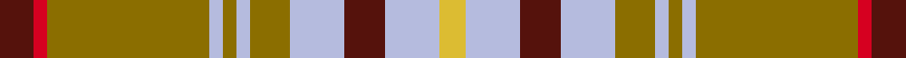

This is one **variant** — a specific cloth: this exact thread count and colourway, with its own
provenance below. It is one weaving of the [sett](/tartans/t/ta/tasmanian-2/) (the scale-free proportion — the
same cloth at any scale or shade), whose colour order is pattern [BRGWGWGWBWY](/stripes/brgwgwgwbwy/).

Part of the [Tasmanian](/tartans/t/ta/tasmanian-2/) tartan — the named design grouping this sett with its other cloths.

Sourced from register-of-tartans.  It is a [11 stripe tartan](/stripes/stripes11/).

Original link [https://www.tartanregister.gov.uk/tartanDetails.aspx?ref=4078](https://www.tartanregister.gov.uk/tartanDetails.aspx?ref=4078)

Dataset <small>— provenance for this record, inherited from the source manifest</small>

<dl class="dataset-prov">
<dt>source</dt><dd><a href="/sources/register-of-tartans/">Scottish Register of Tartans</a></dd>
<dt>data captured from</dt><dd><a href="https://github.com/thetartan/tartan-database/blob/master/data/register-of-tartans/data.csv">https://github.com/thetartan/tartan-database/blob/master/data/register-of-tartans/data.csv</a></dd>
<dt>data date</dt><dd>1988 <small>(this record)</small></dd>
<dt>licence</dt><dd><a href="https://www.tartanregister.gov.uk/copyright">Crown copyright</a></dd>
</dl>

Capture chain <small>— the hands this data passed through, oldest first; each capture carries its own licence</small>

<ol class="capture-chain">
<li><a href="https://www.tartanregister.gov.uk/">Scottish Register of Tartans</a> · <a href="https://www.tartanregister.gov.uk/copyright">Crown copyright</a> <small>the living register — still published by National Records of Scotland</small></li>
<li><a href="https://github.com/thetartan/tartan-database">thetartan/tartan-database</a> <small>2016-2017</small> · <a href="https://creativecommons.org/licenses/by-nc-nd/4.0/">CC BY-NC-ND 4.0</a> <small>Levko Kravets's frozen compilation — the capture we vendored, and where its CC licence text came from</small></li>
<li>this dictionary <small>captured 2026-06-10 · commit 5bf86c7566</small> <small>each re-capture is a git commit to data/sources</small></li>
</ol>

## Register references

External register numbers recorded for this tartan.

- Scottish Register of Tartans: [4078](https://www.tartanregister.gov.uk/tartanDetails.aspx?ref=4078)
- Scottish Tartans Authority (ITI): 2498
- Scottish Tartans World Register: 2498

## Thread count
DR/10 R4 Y48 LB4 Y4 LB4 Y12 LB16 DR12 LB16 LY/8

One full sett is **258 threads**.

## Palette
<table><thead><tr><th>Colour</th><th>Shade</th><th>OKLCh</th></tr></thead><tbody><tr><td>DR</td><td><code style="background-color:#55120C;">#55120C</code> <small style="color:#888">#55120C</small></td><td><small style="color:#888">oklch(30.0% 0.099 29.3)</small></td></tr><tr><td>LY</td><td><code style="background-color:#DCBC32;">#DCBC32</code> <small style="color:#888">#DCBC32</small></td><td><small style="color:#888">oklch(80.0% 0.150 95.2)</small></td></tr><tr><td>R</td><td><code style="background-color:#D60020;">#D60020</code> <small style="color:#888">#D60020</small></td><td><small style="color:#888">oklch(55.2% 0.224 25.5)</small></td></tr><tr><td>Y</td><td><code style="background-color:#8B6E00;">#8B6E00</code> <small style="color:#888">#8B6E00</small></td><td><small style="color:#888">oklch(55.1% 0.113 90.4)</small></td></tr><tr><td>LB</td><td><code style="background-color:#B5BBDE;">#B5BBDE</code> <small style="color:#888">#B5BBDE</small></td><td><small style="color:#888">oklch(79.9% 0.050 277.6)</small></td></tr></tbody></table>

# Sample pattern

## Nearest tartan variants

The nearest existing variants by ΔTartan distance, with this cloth at the top so the swatches line up against it.

ΔTartan

Threads

Variant

Sett

—

258

<a href="/variants/s11/dr5r2y24lb2y2lb2y6lb8dr6lb8ly4~x2/">Tasmanian</a>

<a href="/ttd/edit/#slug=g14r1g14r7w1r7w1r7db5dp3w1~x4&amp;base=dr5r2y24lb2y2lb2y6lb8dr6lb8ly4~x2" title="compare in the TTD">2.07</a>

428

<a href="/variants/s11/g14r1g14r7w1r7w1r7db5dp3w1~x4/">Hynde Artifact Tartan</a>

<a href="/ttd/edit/#slug=g6dg2g3dg2g6db8r20ly2r3g2~x2&amp;base=dr5r2y24lb2y2lb2y6lb8dr6lb8ly4~x2" title="compare in the TTD">2.19</a>

200

<a href="/variants/s10/g6dg2g3dg2g6db8r20ly2r3g2~x2/">Connolly Dress (Name)</a>

<a href="/ttd/edit/#slug=b3r4g3dp3r11g30r3dp7g3b2r4w2~x2&amp;base=dr5r2y24lb2y2lb2y6lb8dr6lb8ly4~x2" title="compare in the TTD">2.27</a>

290

<a href="/variants/s12/b3r4g3dp3r11g30r3dp7g3b2r4w2~x2/">MacKinnon 1</a>

<a href="/ttd/edit/#slug=r3ri4g3dp3ri11g30ri3dp7g3r2ri4w2~x2~r2208029-ri2209032&amp;base=dr5r2y24lb2y2lb2y6lb8dr6lb8ly4~x2" title="compare in the TTD">2.28</a>

290

<a href="/variants/s12/r3ri4g3dp3ri11g30ri3dp7g3r2ri4w2~x2~r2208029-ri2209032/">MacKinnon #7</a>

<a href="/ttd/edit/#slug=w2r4lb2g8r16g2db4r2g16r6db2g2r3lb2~x2&amp;base=dr5r2y24lb2y2lb2y6lb8dr6lb8ly4~x2" title="compare in the TTD">2.36</a>

276

<a href="/variants/s14/w2r4lb2g8r16g2db4r2g16r6db2g2r3lb2~x2/">MacKinnon #2</a>

<a href="/ttd/edit/#slug=w3r5g3dp3r14g36r3dp8g3r36g14b3r5w3~x2&amp;base=dr5r2y24lb2y2lb2y6lb8dr6lb8ly4~x2" title="compare in the TTD">2.47</a>

544

<a href="/variants/s14/w3r5g3dp3r14g36r3dp8g3r36g14b3r5w3~x2/">MacKinnon 3</a>

<a href="/ttd/edit/#slug=dr2r4g2db2r6g14r2db2g2r12g7dr2r5w1~x2&amp;base=dr5r2y24lb2y2lb2y6lb8dr6lb8ly4~x2" title="compare in the TTD">2.48</a>

246

<a href="/variants/s14/dr2r4g2db2r6g14r2db2g2r12g7dr2r5w1~x2/">MacDonald of Staffa #5</a>

<a href="/ttd/edit/#slug=dg2r3g2db2r6g16r2db4g2r16g8dg2r4w2&amp;base=dr5r2y24lb2y2lb2y6lb8dr6lb8ly4~x2" title="compare in the TTD">2.48</a>

138

<a href="/variants/s14/dg2r3g2db2r6g16r2db4g2r16g8dg2r4w2/">MacKinnon</a>

<a href="/ttd/edit/#slug=g28lo18db4lo18ri3r2ri3r2ri3r2ri3~x2~ri2109032-r2109013&amp;base=dr5r2y24lb2y2lb2y6lb8dr6lb8ly4~x2" title="compare in the TTD">2.49</a>

282

<a href="/variants/s11/g28lo18db4lo18ri3r2ri3r2ri3r2ri3~x2~ri2109032-r2109013/">Commonwealth Games - 2014</a>

<a href="/ttd/edit/#slug=dr4g20db2g2db2g3db6o26w3o2w2o4~x2&amp;base=dr5r2y24lb2y2lb2y6lb8dr6lb8ly4~x2" title="compare in the TTD">2.51</a>

288

<a href="/variants/s12/dr4g20db2g2db2g3db6o26w3o2w2o4~x2/">Dorcas (Fashion)</a>

## Neighbour map

Every grey dot is one of 13657 variants placed by the first two principal components of the ΔTartan feature space (42% of its variance). Red is this tartan; blue dots are its nearest — click one to open its page. The map is a flat projection of a many-dimensional space — [how to read it](/posts/neighbourhood-maps/).

<svg viewBox="0 0 640 380" role="img" style="max-width:100%;height:auto;border:1px solid #e0e0e0;border-radius:4px;display:block" xmlns="http://www.w3.org/2000/svg"><image href="/nn/cloud.v1.png" width="640" height="380"/><a href="/variants/s11/g14r1g14r7w1r7w1r7db5dp3w1~x4/"><circle cx="233.2" cy="163.2" r="4" fill="#3465a4"><title>Hynde Artifact Tartan</title></circle></a><a href="/variants/s10/g6dg2g3dg2g6db8r20ly2r3g2~x2/"><circle cx="216.2" cy="168.6" r="4" fill="#3465a4"><title>Connolly Dress (Name)</title></circle></a><a href="/variants/s12/b3r4g3dp3r11g30r3dp7g3b2r4w2~x2/"><circle cx="264.0" cy="134.1" r="4" fill="#3465a4"><title>MacKinnon 1</title></circle></a><a href="/variants/s12/r3ri4g3dp3ri11g30ri3dp7g3r2ri4w2~x2~r2208029-ri2209032/"><circle cx="265.0" cy="132.1" r="4" fill="#3465a4"><title>MacKinnon #7</title></circle></a><a href="/variants/s14/w2r4lb2g8r16g2db4r2g16r6db2g2r3lb2~x2/"><circle cx="218.3" cy="166.3" r="4" fill="#3465a4"><title>MacKinnon #2</title></circle></a><a href="/variants/s14/w3r5g3dp3r14g36r3dp8g3r36g14b3r5w3~x2/"><circle cx="257.7" cy="137.8" r="4" fill="#3465a4"><title>MacKinnon 3</title></circle></a><a href="/variants/s14/dr2r4g2db2r6g14r2db2g2r12g7dr2r5w1~x2/"><circle cx="253.4" cy="153.1" r="4" fill="#3465a4"><title>MacDonald of Staffa #5</title></circle></a><a href="/variants/s14/dg2r3g2db2r6g16r2db4g2r16g8dg2r4w2/"><circle cx="219.1" cy="166.8" r="4" fill="#3465a4"><title>MacKinnon</title></circle></a><a href="/variants/s11/g28lo18db4lo18ri3r2ri3r2ri3r2ri3~x2~ri2109032-r2109013/"><circle cx="236.7" cy="147.4" r="4" fill="#3465a4"><title>Commonwealth Games - 2014</title></circle></a><a href="/variants/s12/dr4g20db2g2db2g3db6o26w3o2w2o4~x2/"><circle cx="244.3" cy="149.6" r="4" fill="#3465a4"><title>Dorcas (Fashion)</title></circle></a><circle cx="254.7" cy="168.3" r="5" fill="#c00000"/><text x="320" y="376" text-anchor="middle" font-size="11" fill="#999">ground</text><text x="11" y="190" text-anchor="middle" font-size="11" fill="#999" transform="rotate(-90 11 190)">complexity</text></svg>

ID: /variants/s11/dr5r2y24lb2y2lb2y6lb8dr6lb8ly4~x2/
