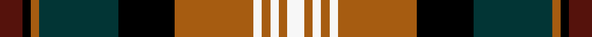

This page is one **sett** — a single exact thread-count. It belongs to the [tartan](/setts/dr8k3o3dt28k20o28w3o3w3o3w6/)
(the same proportion at any scale), whose colour order is pattern [BKRBKRWRWRW](/stripes/bkrbkrwrwrw/).

Sourced from register-of-tartans.  It is a [11 stripe tartan](/stripes/stripes11/).

Original link https://www.tartanregister.gov.uk/tartanDetails.aspx?ref=2186

2 attestations — the source records this cloth was collapsed from (oldest owns this page)

<ul>
<li>01/01/2002 — Logan #6 (register-of-tartans, <a href="https://www.tartanregister.gov.uk/tartanDetails.aspx?ref=2186">record</a>)  <em>A colour variation of Logan Clan tartan - #490 (original Scottish Tartans Authority reference).</em></li>
<li>pre 2002 — Logan (Fashion) (tartans-authority, <a href="http://www.tartansauthority.com/tartan-ferret/display/5477/">record</a>)  <em>A colour variation of Logan Clan tartan - #490.</em></li>
</ul>

## Register references

External register numbers recorded for this tartan.

- Scottish Register of Tartans: [2186](https://www.tartanregister.gov.uk/tartanDetails.aspx?ref=2186)
- Scottish Tartans Authority (ITI): 5477

## Thread count
DR/8 K3 O3 DT28 K20 O28 W3 O3 W3 O3 W/6

One full sett is **202 threads**.

## Palette
<table><thead><tr><th>Colour</th><th>Shade</th><th>OKLCh</th></tr></thead><tbody><tr><td>DR</td><td><code style="background-color:#55120C;">#55120C</code> <small style="color:#888">#55120C</small></td><td><small style="color:#888">oklch(30.0% 0.099 29.3)</small></td></tr><tr><td>DT</td><td><code style="background-color:#023535;">#023535</code> <small style="color:#888">#023535</small></td><td><small style="color:#888">oklch(29.8% 0.050 194.8)</small></td></tr><tr><td>K</td><td><code style="background-color:#000000;">#000000</code> <small style="color:#888">#000000</small></td><td><small style="color:#888">oklch(0.0% 0.000 0.0)</small></td></tr><tr><td>W</td><td><code style="background-color:#F7F7F7;">#F7F7F7</code> <small style="color:#888">#F7F7F7</small></td><td><small style="color:#888">oklch(97.6% 0.000 89.9)</small></td></tr><tr><td>O</td><td><code style="background-color:#A65C11;">#A65C11</code> <small style="color:#888">#A65C11</small></td><td><small style="color:#888">oklch(55.0% 0.125 58.3)</small></td></tr></tbody></table>

# Sample pattern

ID: /variants/s11/dr8k3o3dt28k20o28w3o3w3o3w6/
