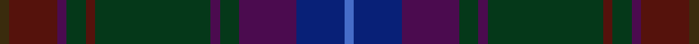

This page is one **sett** — a single exact thread-count. It belongs to the [tartan](/setts/dy1dr5dp1dg2dr1dg12dp1dg2dp6db5b1/)
(the same proportion at any scale), whose colour order is pattern [BBBGBGBGBBG](/stripes/bbbgbgbgbbg/).

Sourced from register-of-tartans.  It is a [11 stripe tartan](/stripes/stripes11/).

Original link https://www.tartanregister.gov.uk/tartanDetails.aspx?ref=10112

## Register references

External register numbers recorded for this tartan.

- Scottish Register of Tartans: [10112](https://www.tartanregister.gov.uk/tartanDetails.aspx?ref=10112)

## Thread count
DY/4 DR20 DP4 DG8 DR4 DG48 DP4 DG8 DP24 DB20 B/4

One full sett is **288 threads**.

## Palette
<table><thead><tr><th>Colour</th><th>Shade</th><th>OKLCh</th></tr></thead><tbody><tr><td>B</td><td><code style="background-color:#466CC8;">#466CC8</code> <small style="color:#888">#466CC8</small></td><td><small style="color:#888">oklch(55.1% 0.149 265.0)</small></td></tr><tr><td>DB</td><td><code style="background-color:#082077;">#082077</code> <small style="color:#888">#082077</small></td><td><small style="color:#888">oklch(30.0% 0.149 265.1)</small></td></tr><tr><td>DG</td><td><code style="background-color:#053819;">#053819</code> <small style="color:#888">#053819</small></td><td><small style="color:#888">oklch(30.0% 0.075 151.3)</small></td></tr><tr><td>DR</td><td><code style="background-color:#55120C;">#55120C</code> <small style="color:#888">#55120C</small></td><td><small style="color:#888">oklch(30.0% 0.099 29.3)</small></td></tr><tr><td>DY</td><td><code style="background-color:#3A2B0D;">#3A2B0D</code> <small style="color:#888">#3A2B0D</small></td><td><small style="color:#888">oklch(30.0% 0.049 82.0)</small></td></tr><tr><td>DP</td><td><code style="background-color:#4B0B4F;">#4B0B4F</code> <small style="color:#888">#4B0B4F</small></td><td><small style="color:#888">oklch(30.1% 0.125 325.4)</small></td></tr></tbody></table>

# Sample pattern

## Nearest tartan variants

The nearest existing variants by ΔTartan distance, with this cloth at the top so the swatches line up against it.

ΔTartan

Threads

Variant

Sett

—

288

<a href="/variants/s11/dy1dr5dp1dg2dr1dg12dp1dg2dp6db5b1~x4/">Telfer, Jamie of the Fair Dodhead</a>

<a href="/ttd/edit/#slug=b1db5dp6dg2dp1dg12dr1dg2dp1dr5ly1~x4&amp;base=dy1dr5dp1dg2dr1dg12dp1dg2dp6db5b1~x4" title="compare in the TTD">0.00</a>

288

<a href="/variants/s11/b1db5dp6dg2dp1dg12dr1dg2dp1dr5ly1~x4/">Telfer, Jamie (Name)</a>

## Neighbour map

Every grey dot is one of 13620 variants placed by the first two principal components of the ΔTartan feature space (42% of its variance). Red is this tartan; blue dots are its nearest — click one to open its page.

<svg viewBox="0 0 640 380" role="img" style="max-width:100%;height:auto;border:1px solid #e0e0e0;border-radius:4px;display:block" xmlns="http://www.w3.org/2000/svg"><image href="/nn/cloud.v1.png" width="640" height="380"/><a href="/variants/s11/b1db5dp6dg2dp1dg12dr1dg2dp1dr5ly1~x4/"><circle cx="315.9" cy="198.4" r="4" fill="#3465a4"><title>Telfer, Jamie (Name)</title></circle></a><circle cx="370.5" cy="217.5" r="5" fill="#c00000"/><text x="320" y="376" text-anchor="middle" font-size="11" fill="#999">ground</text><text x="11" y="190" text-anchor="middle" font-size="11" fill="#999" transform="rotate(-90 11 190)">complexity</text></svg>

ID: /variants/s11/dy1dr5dp1dg2dr1dg12dp1dg2dp6db5b1~x4/
