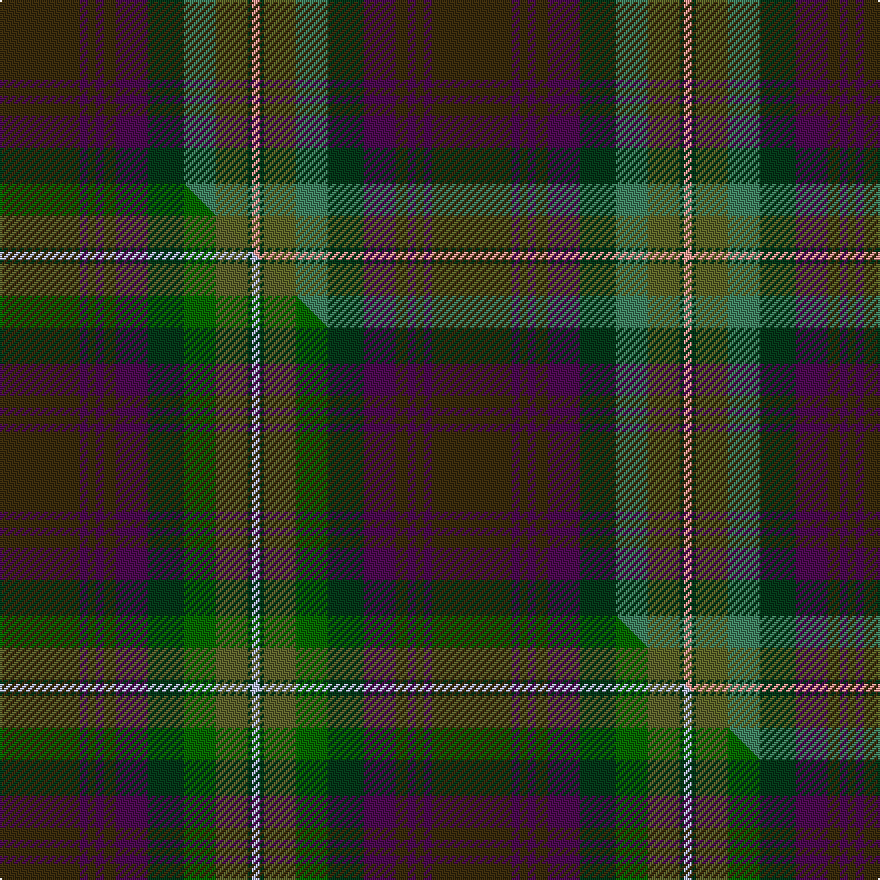

This page is one **sett** — a single exact thread-count. It belongs to the [tartan](/setts/dy20dp2dy2dp2dy3dp8dg9gi8g8dg1lr2/)
(the same proportion at any scale), whose colour order is pattern [GBGBGBGGGGY](/stripes/gbgbgbggggy/).

Part of the [Isle of Skye](/tartans/isle-of-skye/) tartan — the named design grouping this sett with its other cloths.

Sourced from house-of-tartan.  It is a [11 stripe tartan](/stripes/stripes11/).

Original link [http://www.house-of-tartan.scotland.net/house/TartanViewjs.asp?colr=Def&tnam=2155](http://www.house-of-tartan.scotland.net/house/TartanViewjs.asp?colr=Def&tnam=2155)

## Provenance

Earliest known date: 1993 The tartan was instigated and registered by Mrs Rosemary Nicolson Samios in 1992, an Australian of Skye descent, now living in Skye. It was selected through a worldwide competition won by Angus MacLeod from Lewis. Angus, a weaver by trade, produced the first commercial quantities in the traditional kilt weight in 1993 at Lochcarron Weavers in North Strome. The colours of the tartan depict those of the island, often called the 'Misty Isle'. Worn by the Torphican and Bathgate pipe band. (A patented design No. 0600930)

Dataset <small>— provenance for this record, inherited from the source manifest</small>

<dl class="dataset-prov">
<dt>source</dt><dd><a href="/sources/house-of-tartan/">House of Tartan</a></dd>
<dt>data captured from</dt><dd><a href="https://github.com/thetartan/tartan-database/blob/master/data/house-of-tartan/data.csv">https://github.com/thetartan/tartan-database/blob/master/data/house-of-tartan/data.csv</a></dd>
<dt>data date</dt><dd>2017-01-10 <small>(dataset default)</small></dd>
<dt>licence</dt><dd><a href="https://creativecommons.org/licenses/by-nc-nd/4.0/">CC BY-NC-ND 4.0</a></dd>
</dl>

Capture chain <small>— the hands this data passed through, oldest first; each capture carries its own licence</small>

<ol class="capture-chain">
<li><a href="http://www.house-of-tartan.scotland.net/">House of Tartan</a> <small>the weaver/retailer's database — the site is now offline; the URL is kept as the ultimate source's identity</small></li>
<li><a href="https://github.com/thetartan/tartan-database">thetartan/tartan-database</a> <small>2016-2017</small> · <a href="https://creativecommons.org/licenses/by-nc-nd/4.0/">CC BY-NC-ND 4.0</a> <small>Levko Kravets's frozen compilation — the capture we vendored, and where its CC licence text came from</small></li>
<li>this dictionary <small>captured 2026-06-10 · commit 5bf86c7566</small> <small>each re-capture is a git commit to data/sources</small></li>
</ol>

## Thread count
DY/40 DP4 DY4 DP4 DY6 DP16 DG18 Gi16 G16 DG2 LR/4

One full sett is **216 threads**.

## Palette
<table><thead><tr><th>Colour</th><th>Shade</th><th>OKLCh</th></tr></thead><tbody><tr><td>DG</td><td><code style="background-color:#053819;">#053819</code> <small style="color:#888">#053819</small></td><td><small style="color:#888">oklch(30.0% 0.075 151.3)</small></td></tr><tr><td>G</td><td><code style="background-color:#5C6428;">#5C6428</code> <small style="color:#888">#5C6428</small></td><td><small style="color:#888">oklch(48.3% 0.084 116.0)</small></td></tr><tr><td>G</td><td><code style="background-color:#408060;">#408060</code> <small style="color:#888">#408060</small></td><td><small style="color:#888">oklch(54.8% 0.084 160.1)</small></td></tr><tr><td>LR</td><td><code style="background-color:#FF9C97;">#FF9C97</code> <small style="color:#888">#FF9C97</small></td><td><small style="color:#888">oklch(79.3% 0.119 23.2)</small></td></tr><tr><td>DP</td><td><code style="background-color:#4B0B4F;">#4B0B4F</code> <small style="color:#888">#4B0B4F</small></td><td><small style="color:#888">oklch(30.1% 0.125 325.4)</small></td></tr><tr><td>DY</td><td><code style="background-color:#3A2B0D;">#3A2B0D</code> <small style="color:#888">#3A2B0D</small></td><td><small style="color:#888">oklch(30.0% 0.049 82.0)</small></td></tr></tbody></table>

# Sample pattern

## Compared to the master

This cloth is one sett of its design; the master sett (the exemplar the design is anchored on) is below for comparison.

Its **ΔTartan distance** from the master is **0.90** — the same measure the nearest-tartans table ranks by (0 is identical; a re-scale of the same cloth is near 0, a recolour or a different proportion further).

<figure class="master-compare" style="margin:0">

this sett
master sett ★

<figcaption style="color:#888;font-size:smaller">One weave of this sett against the <a href="/setts/dy20dp2dy2dp2dy3dp8dg9dgi8g8dg1lb2/">master sett ★</a>, split on the diagonal: a shared proportion runs seamlessly across it with only the shades shifting; a different proportion breaks on it.</figcaption>
</figure>

## Nearest tartan variants

The nearest existing variants by ΔTartan distance, with this cloth at the top so the swatches line up against it.

ΔTartan

Threads

Variant

Sett

—

216

<a href="/variants/s11/dy20dp2dy2dp2dy3dp8dg9gi8g8dg1lr2~x2~gi2203152-g1903114/">Isle of Skye District Tartan</a>

<a href="/ttd/edit/#slug=dy20dp2dy2dp2dy3dp8dg9dgi8g8dg1lb2~x2~dgi1806142-g1903114&amp;base=dy20dp2dy2dp2dy3dp8dg9gi8g8dg1lr2~x2~gi2203152-g1903114" title="compare in the TTD">0.90</a>

216

<a href="/variants/s11/dy20dp2dy2dp2dy3dp8dg9dgi8g8dg1lb2~x2~dgi1806142-g1903114/">Isle of Skye</a>

<a href="/ttd/edit/#slug=b1db5dp6dg2dp1dg12dr1dg2dp1dr5ly1~x4&amp;base=dy20dp2dy2dp2dy3dp8dg9gi8g8dg1lr2~x2~gi2203152-g1903114" title="compare in the TTD">2.78</a>

288

<a href="/variants/s11/b1db5dp6dg2dp1dg12dr1dg2dp1dr5ly1~x4/">Telfer, Jamie (Name)</a>

<a href="/ttd/edit/#slug=dy31y6n3db31dy8dg60y7t7~x2&amp;base=dy20dp2dy2dp2dy3dp8dg9gi8g8dg1lr2~x2~gi2203152-g1903114" title="compare in the TTD">2.97</a>

536

<a href="/variants/s8/dy31y6n3db31dy8dg60y7t7~x2/">Little-Dowse Wedding</a>

<a href="/ttd/edit/#slug=g7dy2g5dg37db6dr16db5b2~x2&amp;base=dy20dp2dy2dp2dy3dp8dg9gi8g8dg1lr2~x2~gi2203152-g1903114" title="compare in the TTD">3.30</a>

302

<a href="/variants/s8/g7dy2g5dg37db6dr16db5b2~x2/">Telfer Green</a>

<a href="/ttd/edit/#slug=dp3g10dp2db25dy3n4dy3dg10db3dp2n3dp1~x2~g1903114-dg1806142&amp;base=dy20dp2dy2dp2dy3dp8dg9gi8g8dg1lr2~x2~gi2203152-g1903114" title="compare in the TTD">3.49</a>

268

<a href="/variants/s12/dp3g10dp2db25dy3n4dy3dg10db3dp2n3dp1~x2~g1903114-dg1806142/">Bowhunter (Fashion)</a>

<a href="/ttd/edit/#slug=dy2gi2dy16gi2dp17dg10g10gi15dg1w2~x2~gi2203152-g2004173&amp;base=dy20dp2dy2dp2dy3dp8dg9gi8g8dg1lr2~x2~gi2203152-g1903114" title="compare in the TTD">3.66</a>

300

<a href="/variants/s10/dy2gi2dy16gi2dp17dg10g10gi15dg1w2~x2~gi2203152-g2004173/">Grewar</a>

<a href="/ttd/edit/#slug=dr3dy15g4db6w2dr30db6y3~x2&amp;base=dy20dp2dy2dp2dy3dp8dg9gi8g8dg1lr2~x2~gi2203152-g1903114" title="compare in the TTD">3.91</a>

264

<a href="/variants/s8/dr3dy15g4db6w2dr30db6y3~x2/">Round Table Sweden</a>

## Neighbour map

Every grey dot is one of 13621 variants placed by the first two principal components of the ΔTartan feature space (42% of its variance). Red is this tartan; blue dots are its nearest — click one to open its page.

<svg viewBox="0 0 640 380" role="img" style="max-width:100%;height:auto;border:1px solid #e0e0e0;border-radius:4px;display:block" xmlns="http://www.w3.org/2000/svg"><image href="/nn/cloud.v1.png" width="640" height="380"/><a href="/variants/s11/dy20dp2dy2dp2dy3dp8dg9dgi8g8dg1lb2~x2~dgi1806142-g1903114/"><circle cx="250.3" cy="177.6" r="4" fill="#3465a4"><title>Isle of Skye</title></circle></a><a href="/variants/s11/b1db5dp6dg2dp1dg12dr1dg2dp1dr5ly1~x4/"><circle cx="315.9" cy="198.4" r="4" fill="#3465a4"><title>Telfer, Jamie (Name)</title></circle></a><a href="/variants/s8/dy31y6n3db31dy8dg60y7t7~x2/"><circle cx="343.1" cy="203.3" r="4" fill="#3465a4"><title>Little-Dowse Wedding</title></circle></a><a href="/variants/s8/g7dy2g5dg37db6dr16db5b2~x2/"><circle cx="338.6" cy="181.8" r="4" fill="#3465a4"><title>Telfer Green</title></circle></a><a href="/variants/s12/dp3g10dp2db25dy3n4dy3dg10db3dp2n3dp1~x2~g1903114-dg1806142/"><circle cx="307.3" cy="155.3" r="4" fill="#3465a4"><title>Bowhunter (Fashion)</title></circle></a><a href="/variants/s10/dy2gi2dy16gi2dp17dg10g10gi15dg1w2~x2~gi2203152-g2004173/"><circle cx="191.6" cy="193.8" r="4" fill="#3465a4"><title>Grewar</title></circle></a><a href="/variants/s8/dr3dy15g4db6w2dr30db6y3~x2/"><circle cx="320.6" cy="179.9" r="4" fill="#3465a4"><title>Round Table Sweden</title></circle></a><circle cx="290.9" cy="183.9" r="5" fill="#c00000"/><text x="320" y="376" text-anchor="middle" font-size="11" fill="#999">ground</text><text x="11" y="190" text-anchor="middle" font-size="11" fill="#999" transform="rotate(-90 11 190)">complexity</text></svg>

ID: /variants/s11/dy20dp2dy2dp2dy3dp8dg9gi8g8dg1lr2~x2~gi2203152-g1903114/
