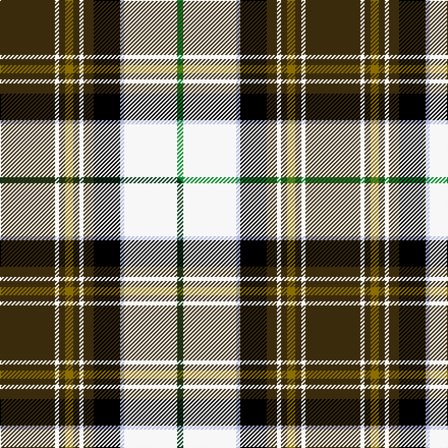

This is one **variant** — a specific cloth: this exact thread count and colourway, with its own
provenance below. It is one weaving of the [sett](/setts/dy27w2dy3y4dy3w2dy5k13lb2w26g3/) (the scale-free proportion — the
same cloth at any scale or shade), whose colour order is pattern [GWGGGWGKWWG](/stripes/gwgggwgkwwg/).

Part of the [MacKellar Dress](/tartans/m/ma/mackellar-dress/) tartan — the named design grouping this sett with its other cloths.

Sourced from house-of-tartan.  It is a [11 stripe tartan](/stripes/stripes11/).

Original link [http://www.house-of-tartan.scotland.net/house/TartanViewjs.asp?colr=Def&tnam=926](http://www.house-of-tartan.scotland.net/house/TartanViewjs.asp?colr=Def&tnam=926)

## Provenance

Earliest known date: 1976 As worn by Kenneth? - D.C.S.

Dataset <small>— provenance for this record, inherited from the source manifest</small>

<dl class="dataset-prov">
<dt>source</dt><dd><a href="/sources/house-of-tartan/">House of Tartan</a></dd>
<dt>data captured from</dt><dd><a href="https://github.com/thetartan/tartan-database/blob/master/data/house-of-tartan/data.csv">https://github.com/thetartan/tartan-database/blob/master/data/house-of-tartan/data.csv</a></dd>
<dt>data date</dt><dd>1976 <small>(this record)</small></dd>
<dt>licence</dt><dd><a href="https://creativecommons.org/licenses/by-nc-nd/4.0/">CC BY-NC-ND 4.0</a></dd>
</dl>

Capture chain <small>— the hands this data passed through, oldest first; each capture carries its own licence</small>

<ol class="capture-chain">
<li><a href="http://www.house-of-tartan.scotland.net/">House of Tartan</a> <small>the weaver/retailer's database — the site is now offline; the URL is kept as the ultimate source's identity</small></li>
<li><a href="https://github.com/thetartan/tartan-database">thetartan/tartan-database</a> <small>2016-2017</small> · <a href="https://creativecommons.org/licenses/by-nc-nd/4.0/">CC BY-NC-ND 4.0</a> <small>Levko Kravets's frozen compilation — the capture we vendored, and where its CC licence text came from</small></li>
<li>this dictionary <small>captured 2026-06-10 · commit 5bf86c7566</small> <small>each re-capture is a git commit to data/sources</small></li>
</ol>

## Thread count
DY/54 W4 DY6 Y8 DY6 W4 DY10 K26 LB4 W52 G/6

One full sett is **300 threads**.

## Palette
<table><thead><tr><th>Colour</th><th>Shade</th><th>OKLCh</th></tr></thead><tbody><tr><td>LB</td><td><code style="background-color:#B5BBDE;">#B5BBDE</code> <small style="color:#888">#B5BBDE</small></td><td><small style="color:#888">oklch(79.9% 0.050 277.6)</small></td></tr><tr><td>G</td><td><code style="background-color:#008B2A;">#008B2A</code> <small style="color:#888">#008B2A</small></td><td><small style="color:#888">oklch(55.4% 0.170 145.9)</small></td></tr><tr><td>K</td><td><code style="background-color:#000000;">#000000</code> <small style="color:#888">#000000</small></td><td><small style="color:#888">oklch(0.0% 0.000 0.0)</small></td></tr><tr><td>W</td><td><code style="background-color:#F7F7F7;">#F7F7F7</code> <small style="color:#888">#F7F7F7</small></td><td><small style="color:#888">oklch(97.6% 0.000 89.9)</small></td></tr><tr><td>DY</td><td><code style="background-color:#3A2B0D;">#3A2B0D</code> <small style="color:#888">#3A2B0D</small></td><td><small style="color:#888">oklch(30.0% 0.049 82.0)</small></td></tr><tr><td>Y</td><td><code style="background-color:#8B6E00;">#8B6E00</code> <small style="color:#888">#8B6E00</small></td><td><small style="color:#888">oklch(55.1% 0.113 90.4)</small></td></tr></tbody></table>

# Sample pattern

## Compared to the master

This cloth is one sett of its design; the master sett (the exemplar the design is anchored on) is below for comparison.

Its **ΔTartan distance** from the master is **0.02** — the same measure the nearest-tartans table ranks by (0 is identical; a re-scale of the same cloth is near 0, a recolour or a different proportion further).

<figure class="master-compare" style="margin:0">

this sett
master sett ★

<figcaption style="color:#888;font-size:smaller">One weave of this sett against the <a href="/setts/dy27w2dy3y4dy3w2dy5k13lb2w26dg3/">master sett ★</a>, split on the diagonal: a shared proportion runs seamlessly across it with only the shades shifting; a different proportion breaks on it.</figcaption>
</figure>

## Nearest tartan variants

The nearest existing variants by ΔTartan distance, with this cloth at the top so the swatches line up against it.

ΔTartan

Threads

Variant

Sett

—

300

<a href="/variants/s11/dy27w2dy3y4dy3w2dy5k13lb2w26g3~x2/">MacKellar Dress Clan Tartan</a>

<a href="/ttd/edit/#slug=dy27w2dy3y4dy3w2dy5k13lb2w26dg3~x2&amp;base=dy27w2dy3y4dy3w2dy5k13lb2w26g3~x2" title="compare in the TTD">0.02</a>

300

<a href="/variants/s11/dy27w2dy3y4dy3w2dy5k13lb2w26dg3~x2/">MacKellar Dress</a>

<a href="/ttd/edit/#slug=dy27w2dy3ly4dy3w2dy5k13n2w26n3~x2&amp;base=dy27w2dy3y4dy3w2dy5k13lb2w26g3~x2" title="compare in the TTD">1.80</a>

300

<a href="/variants/s11/dy27w2dy3ly4dy3w2dy5k13n2w26n3~x2/">MacKellar Dress, Maroon (Dance)</a>

<a href="/ttd/edit/#slug=lb29db3k10y2k2lb2k2g10r5k3r2lb2~x2&amp;base=dy27w2dy3y4dy3w2dy5k13lb2w26g3~x2" title="compare in the TTD">1.87</a>

226

<a href="/variants/s12/lb29db3k10y2k2lb2k2g10r5k3r2lb2~x2/">Stewart Blue Trade Tartan</a>

<a href="/ttd/edit/#slug=lb29db3k10lo2k2lb2k2g10dr5k3dr2lb2~x2&amp;base=dy27w2dy3y4dy3w2dy5k13lb2w26g3~x2" title="compare in the TTD">1.88</a>

226

<a href="/variants/s12/lb29db3k10lo2k2lb2k2g10dr5k3dr2lb2~x2/">Stuart/Stewart Blue</a>

<a href="/ttd/edit/#slug=lb10w18lb4lo6lb45k30lb4k4y4r4y4r4y4&amp;base=dy27w2dy3y4dy3w2dy5k13lb2w26g3~x2" title="compare in the TTD">2.29</a>

268

<a href="/variants/s13/lb10w18lb4lo6lb45k30lb4k4y4r4y4r4y4/">Les Coeurs de Lions en Bleu</a>

<a href="/ttd/edit/#slug=dg27w2dg3ly4dg3w2dg5k13lg2w26lg3~x2&amp;base=dy27w2dy3y4dy3w2dy5k13lb2w26g3~x2" title="compare in the TTD">2.33</a>

300

<a href="/variants/s11/dg27w2dg3ly4dg3w2dg5k13lg2w26lg3~x2/">MacKellar Dress, Green (Dance)</a>

<a href="/ttd/edit/#slug=dr4w4dr2w29k10dg3k10dg4g4dg3g3dg3~x2~dg1806142-g2408144&amp;base=dy27w2dy3y4dy3w2dy5k13lb2w26g3~x2" title="compare in the TTD">2.39</a>

302

<a href="/variants/s12/dr4w4dr2w29k10dg3k10dg4g4dg3g3dg3~x2~dg1806142-g2408144/">Ross Arisaid</a>

<a href="/ttd/edit/#slug=r4g1r1g5k1lo1k1lo1k6lb1k1lb15w1lb1w1~x4&amp;base=dy27w2dy3y4dy3w2dy5k13lb2w26g3~x2" title="compare in the TTD">2.41</a>

308

<a href="/variants/s15/r4g1r1g5k1lo1k1lo1k6lb1k1lb15w1lb1w1~x4/">Estes</a>

<a href="/ttd/edit/#slug=o4k12b2k2b2k2b2ly16dr3ly2lr2ly4~x2&amp;base=dy27w2dy3y4dy3w2dy5k13lb2w26g3~x2" title="compare in the TTD">2.44</a>

196

<a href="/variants/s12/o4k12b2k2b2k2b2ly16dr3ly2lr2ly4~x2/">Cailean #2 (Fashion)</a>

<a href="/ttd/edit/#slug=dy4k12db2k2db2k2db2ly16dr3ly2w2ly4~x2&amp;base=dy27w2dy3y4dy3w2dy5k13lb2w26g3~x2" title="compare in the TTD">2.44</a>

196

<a href="/variants/s12/dy4k12db2k2db2k2db2ly16dr3ly2w2ly4~x2/">Cailean (Pendleton)</a>

## Neighbour map

Every grey dot is one of 13621 variants placed by the first two principal components of the ΔTartan feature space (42% of its variance). Red is this tartan; blue dots are its nearest — click one to open its page. The map is a flat projection of a many-dimensional space — [how to read it](/posts/neighbourhood-maps/).

<svg viewBox="0 0 640 380" role="img" style="max-width:100%;height:auto;border:1px solid #e0e0e0;border-radius:4px;display:block" xmlns="http://www.w3.org/2000/svg"><image href="/nn/cloud.v1.png" width="640" height="380"/><a href="/variants/s11/dy27w2dy3y4dy3w2dy5k13lb2w26dg3~x2/"><circle cx="141.9" cy="105.9" r="4" fill="#3465a4"><title>MacKellar Dress</title></circle></a><a href="/variants/s11/dy27w2dy3ly4dy3w2dy5k13n2w26n3~x2/"><circle cx="158.8" cy="119.2" r="4" fill="#3465a4"><title>MacKellar Dress, Maroon (Dance)</title></circle></a><a href="/variants/s12/lb29db3k10y2k2lb2k2g10r5k3r2lb2~x2/"><circle cx="152.6" cy="88.7" r="4" fill="#3465a4"><title>Stewart Blue Trade Tartan</title></circle></a><a href="/variants/s12/lb29db3k10lo2k2lb2k2g10dr5k3dr2lb2~x2/"><circle cx="155.1" cy="91.8" r="4" fill="#3465a4"><title>Stuart/Stewart Blue</title></circle></a><a href="/variants/s13/lb10w18lb4lo6lb45k30lb4k4y4r4y4r4y4/"><circle cx="131.3" cy="102.3" r="4" fill="#3465a4"><title>Les Coeurs de Lions en Bleu</title></circle></a><a href="/variants/s11/dg27w2dg3ly4dg3w2dg5k13lg2w26lg3~x2/"><circle cx="154.4" cy="122.5" r="4" fill="#3465a4"><title>MacKellar Dress, Green (Dance)</title></circle></a><a href="/variants/s12/dr4w4dr2w29k10dg3k10dg4g4dg3g3dg3~x2~dg1806142-g2408144/"><circle cx="134.0" cy="114.3" r="4" fill="#3465a4"><title>Ross Arisaid</title></circle></a><a href="/variants/s15/r4g1r1g5k1lo1k1lo1k6lb1k1lb15w1lb1w1~x4/"><circle cx="130.0" cy="76.5" r="4" fill="#3465a4"><title>Estes</title></circle></a><a href="/variants/s12/o4k12b2k2b2k2b2ly16dr3ly2lr2ly4~x2/"><circle cx="103.3" cy="126.3" r="4" fill="#3465a4"><title>Cailean #2 (Fashion)</title></circle></a><a href="/variants/s12/dy4k12db2k2db2k2db2ly16dr3ly2w2ly4~x2/"><circle cx="104.6" cy="128.6" r="4" fill="#3465a4"><title>Cailean (Pendleton)</title></circle></a><circle cx="141.7" cy="106.1" r="5" fill="#c00000"/><text x="320" y="376" text-anchor="middle" font-size="11" fill="#999">ground</text><text x="11" y="190" text-anchor="middle" font-size="11" fill="#999" transform="rotate(-90 11 190)">complexity</text></svg>

ID: /variants/s11/dy27w2dy3y4dy3w2dy5k13lb2w26g3~x2/
