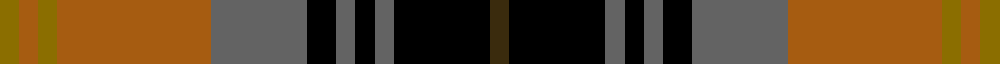

This is one **variant** — a specific cloth: this exact thread count and colourway, with its own
provenance below. It is one weaving of the [sett](/tartans/d/dr/dryburgh-2/) (the scale-free proportion — the
same cloth at any scale or shade), whose colour order is pattern [GKBKBKBRGRG](/stripes/gkbkbkbrgrg/).

Part of the [Dryburgh](/tartans/d/dr/dryburgh-2/) tartan — the named design grouping this sett with its other cloths.

Sourced from register-of-tartans.  It is a [11 stripe tartan](/stripes/stripes11/).

Original link [https://www.tartanregister.gov.uk/tartanDetails.aspx?ref=995](https://www.tartanregister.gov.uk/tartanDetails.aspx?ref=995)

2 attestations — the source records this cloth was collapsed from (oldest owns this page)

<ul>
<li>01/01/2004 — Dryburgh (register-of-tartans, <a href="https://www.tartanregister.gov.uk/tartanDetails.aspx?ref=995">record</a>)  <em>Based on Kerr and the colours of the Dryburgh coat of arms including the 3 martlet birds, matriculated for the tartan designer, William J. Dryburgh. Can be worn by all of the name. Woven samples.</em></li>
<li>2004 — Dryburgh (Name) (tartans-authority, <a href="https://web.archive.org/web/*/http://www.tartansauthority.com/tartan-ferret/display/6422/*">record</a>)  <em>Based on Kerr and the colours of the Dryburgh coat of arms including the 3 martlet birds, matriculated for the tartan designer, William J. Dryburgh. Can be worn by all of the name.Woven samples.</em></li>
</ul>

Dataset <small>— provenance for this record, inherited from the source manifest</small>

<dl class="dataset-prov">
<dt>source</dt><dd><a href="/sources/register-of-tartans/">Scottish Register of Tartans</a></dd>
<dt>data captured from</dt><dd><a href="https://github.com/thetartan/tartan-database/blob/master/data/register-of-tartans/data.csv">https://github.com/thetartan/tartan-database/blob/master/data/register-of-tartans/data.csv</a></dd>
<dt>data date</dt><dd>2004 <small>(this record)</small></dd>
<dt>licence</dt><dd><a href="https://www.tartanregister.gov.uk/copyright">Crown copyright</a></dd>
</dl>

Capture chain <small>— the hands this data passed through, oldest first; each capture carries its own licence</small>

<ol class="capture-chain">
<li><a href="https://www.tartanregister.gov.uk/">Scottish Register of Tartans</a> · <a href="https://www.tartanregister.gov.uk/copyright">Crown copyright</a> <small>the living register — still published by National Records of Scotland</small></li>
<li><a href="https://github.com/thetartan/tartan-database">thetartan/tartan-database</a> <small>2016-2017</small> · <a href="https://creativecommons.org/licenses/by-nc-nd/4.0/">CC BY-NC-ND 4.0</a> <small>Levko Kravets's frozen compilation — the capture we vendored, and where its CC licence text came from</small></li>
<li>this dictionary <small>captured 2026-06-10 · commit 5bf86c7566</small> <small>each re-capture is a git commit to data/sources</small></li>
</ol>

## Register references

External register numbers recorded for this tartan.

- Scottish Register of Tartans: [995](https://www.tartanregister.gov.uk/tartanDetails.aspx?ref=995)
- Scottish Tartans Authority (ITI): 6422

## Thread count
Y/4 O4 Y4 O32 N20 K6 N4 K4 N4 K20 DY/4

One full sett is **204 threads**.

## Palette
<table><thead><tr><th>Colour</th><th>Shade</th><th>OKLCh</th></tr></thead><tbody><tr><td>O</td><td><code style="background-color:#A65C11;">#A65C11</code> <small style="color:#888">#A65C11</small></td><td><small style="color:#888">oklch(55.0% 0.125 58.3)</small></td></tr><tr><td>K</td><td><code style="background-color:#000000;">#000000</code> <small style="color:#888">#000000</small></td><td><small style="color:#888">oklch(0.0% 0.000 0.0)</small></td></tr><tr><td>Y</td><td><code style="background-color:#8B6E00;">#8B6E00</code> <small style="color:#888">#8B6E00</small></td><td><small style="color:#888">oklch(55.1% 0.113 90.4)</small></td></tr><tr><td>N</td><td><code style="background-color:#636363;">#636363</code> <small style="color:#888">#636363</small></td><td><small style="color:#888">oklch(50.0% 0.000 89.9)</small></td></tr><tr><td>DY</td><td><code style="background-color:#3A2B0D;">#3A2B0D</code> <small style="color:#888">#3A2B0D</small></td><td><small style="color:#888">oklch(30.0% 0.049 82.0)</small></td></tr></tbody></table>

# Sample pattern

## Nearest tartan variants

The nearest existing variants by ΔTartan distance, with this cloth at the top so the swatches line up against it.

ΔTartan

Threads

Variant

Sett

—

204

<a href="/variants/s11/dy2k10n2k2n2k3n10o16y2o2y2~x2/">Dryburgh</a>

<a href="/ttd/edit/#slug=dr8k3o3dt28k20o28w3o3w3o3w6&amp;base=dy2k10n2k2n2k3n10o16y2o2y2~x2" title="compare in the TTD">1.70</a>

202

<a href="/variants/s11/dr8k3o3dt28k20o28w3o3w3o3w6/">Logan #6</a>

<a href="/ttd/edit/#slug=y4lr2y2lr3y20k6do4k2do2k2do16r3~x2&amp;base=dy2k10n2k2n2k3n10o16y2o2y2~x2" title="compare in the TTD">1.77</a>

250

<a href="/variants/s12/y4lr2y2lr3y20k6do4k2do2k2do16r3~x2/">Scotch House 'Dorcas' (Fashion)</a>

<a href="/ttd/edit/#slug=y4w2y2w3y20k6do4k2do2k2do16r3~x2&amp;base=dy2k10n2k2n2k3n10o16y2o2y2~x2" title="compare in the TTD">1.84</a>

250

<a href="/variants/s12/y4w2y2w3y20k6do4k2do2k2do16r3~x2/">Dorcas</a>

<a href="/ttd/edit/#slug=b1dy1o8k1b1k1dy8k1dy1k1dy1k8ly1~x4&amp;base=dy2k10n2k2n2k3n10o16y2o2y2~x2" title="compare in the TTD">2.05</a>

264

<a href="/variants/s13/b1dy1o8k1b1k1dy8k1dy1k1dy1k8ly1~x4/">Unidentified #63</a>

<a href="/ttd/edit/#slug=k2g2r3dp18r2g6r4y2dp6r3g18r3k2g2~x2&amp;base=dy2k10n2k2n2k3n10o16y2o2y2~x2" title="compare in the TTD">2.05</a>

284

<a href="/variants/s14/k2g2r3dp18r2g6r4y2dp6r3g18r3k2g2~x2/">MacIntyre and Glenorchy</a>

<a href="/ttd/edit/#slug=dy10dr4dy4dr4dy20k20dr3g20dr4g4ly4~x2~dy1402055-g2203152&amp;base=dy2k10n2k2n2k3n10o16y2o2y2~x2" title="compare in the TTD">2.16</a>

360

<a href="/variants/s11/do10dr4do4dr4do20k20dr3g20dr4g4ly4~x2~do1402055-g2203152/">Cameron of Erracht (WCWM)</a>

<a href="/ttd/edit/#slug=k1g8k4r1db8r1db1r8g1w1~x4&amp;base=dy2k10n2k2n2k3n10o16y2o2y2~x2" title="compare in the TTD">2.22</a>

264

<a href="/variants/s10/k1g8k4r1db8r1db1r8g1w1~x4/">Rattray of Lude</a>

<a href="/ttd/edit/#slug=lb3k1do12k1do1k2do1k6n12k1lo1~x4&amp;base=dy2k10n2k2n2k3n10o16y2o2y2~x2" title="compare in the TTD">2.31</a>

312

<a href="/variants/s11/lb3k1do12k1do1k2do1k6n12k1lo1~x4/">MacCandlish Dress Grey</a>

<a href="/ttd/edit/#slug=y8g2k4lo1k1lb1k1do8y3k1y1lb1~x4&amp;base=dy2k10n2k2n2k3n10o16y2o2y2~x2" title="compare in the TTD">2.32</a>

220

<a href="/variants/s12/y8g2k4lo1k1lb1k1do8y3k1y1lb1~x4/">Wcwm 9275-1258</a>

<a href="/ttd/edit/#slug=r4g6y3g12k14db5r20db5k4db2~x2&amp;base=dy2k10n2k2n2k3n10o16y2o2y2~x2" title="compare in the TTD">2.33</a>

288

<a href="/variants/s10/r4g6y3g12k14db5r20db5k4db2~x2/">Sir George Etienne-Cartier Canada Tartan</a>

## Neighbour map

Every grey dot is one of 13656 variants placed by the first two principal components of the ΔTartan feature space (42% of its variance). Red is this tartan; blue dots are its nearest — click one to open its page. The map is a flat projection of a many-dimensional space — [how to read it](/posts/neighbourhood-maps/).

<svg viewBox="0 0 640 380" role="img" style="max-width:100%;height:auto;border:1px solid #e0e0e0;border-radius:4px;display:block" xmlns="http://www.w3.org/2000/svg"><image href="/nn/cloud.v1.png" width="640" height="380"/><a href="/variants/s11/dr8k3o3dt28k20o28w3o3w3o3w6/"><circle cx="106.3" cy="141.3" r="4" fill="#3465a4"><title>Logan #6</title></circle></a><a href="/variants/s12/y4lr2y2lr3y20k6do4k2do2k2do16r3~x2/"><circle cx="173.1" cy="141.5" r="4" fill="#3465a4"><title>Scotch House 'Dorcas' (Fashion)</title></circle></a><a href="/variants/s12/y4w2y2w3y20k6do4k2do2k2do16r3~x2/"><circle cx="159.5" cy="138.3" r="4" fill="#3465a4"><title>Dorcas</title></circle></a><a href="/variants/s13/b1dy1o8k1b1k1dy8k1dy1k1dy1k8ly1~x4/"><circle cx="138.4" cy="135.8" r="4" fill="#3465a4"><title>Unidentified #63</title></circle></a><a href="/variants/s14/k2g2r3dp18r2g6r4y2dp6r3g18r3k2g2~x2/"><circle cx="160.9" cy="139.2" r="4" fill="#3465a4"><title>MacIntyre and Glenorchy</title></circle></a><a href="/variants/s11/do10dr4do4dr4do20k20dr3g20dr4g4ly4~x2~do1402055-g2203152/"><circle cx="132.2" cy="188.3" r="4" fill="#3465a4"><title>Cameron of Erracht (WCWM)</title></circle></a><a href="/variants/s10/k1g8k4r1db8r1db1r8g1w1~x4/"><circle cx="90.3" cy="159.3" r="4" fill="#3465a4"><title>Rattray of Lude</title></circle></a><a href="/variants/s11/lb3k1do12k1do1k2do1k6n12k1lo1~x4/"><circle cx="156.1" cy="134.5" r="4" fill="#3465a4"><title>MacCandlish Dress Grey</title></circle></a><a href="/variants/s12/y8g2k4lo1k1lb1k1do8y3k1y1lb1~x4/"><circle cx="109.9" cy="140.4" r="4" fill="#3465a4"><title>Wcwm 9275-1258</title></circle></a><a href="/variants/s10/r4g6y3g12k14db5r20db5k4db2~x2/"><circle cx="93.3" cy="166.3" r="4" fill="#3465a4"><title>Sir George Etienne-Cartier Canada Tartan</title></circle></a><circle cx="132.5" cy="158.5" r="5" fill="#c00000"/><text x="320" y="376" text-anchor="middle" font-size="11" fill="#999">ground</text><text x="11" y="190" text-anchor="middle" font-size="11" fill="#999" transform="rotate(-90 11 190)">complexity</text></svg>

ID: /variants/s11/dy2k10n2k2n2k3n10o16y2o2y2~x2/
