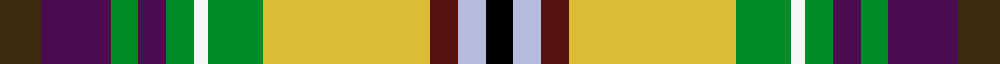

This is one **variant** — a specific cloth: this exact thread count and colourway, with its own
provenance below. It is one weaving of the [sett](/tartans/o/or/oregon-state-of/) (the scale-free proportion — the
same cloth at any scale or shade), whose colour order is pattern [GBGBGWGYBWK](/stripes/gbgbgwgybwk/).

Part of the [Oregon, State of](/tartans/o/or/oregon-state-of/) tartan — the named design grouping this sett with its other cloths.

Sourced from register-of-tartans.  It is a [11 stripe tartan](/stripes/stripes11/).

Original link [https://www.tartanregister.gov.uk/tartanDetails.aspx?ref=3261](https://www.tartanregister.gov.uk/tartanDetails.aspx?ref=3261)

2 attestations — the source records this cloth was collapsed from (oldest owns this page)

<ul>
<li>01/12/2002 — Oregon, State of (register-of-tartans, <a href="https://www.tartanregister.gov.uk/tartanDetails.aspx?ref=3261">record</a>)  <em>The official State of Oregon tartan. Designed in 2002 by Robert Harding of Oregon Highland Services Llc. Tartan adopted at the 72nd Oregon Legislative Assembly, Senate Joint Resolution 31 plus letter from State Governor Theodore R Kulongoski dated April 12th 2003. Sample in Scottish Tartans Authority's Collection. Blue is from the Oregon flag and its rivers and ocean. Gold is also from the flag and represents the various agricultural regions. White is for the snow-capped mountains. Taupe (light brown) is for the high desert and grasslands. Azure is for the streams, creeks, wetlands, shallow lakes and the wide sweep of the oregon skies. Black represents the obsidian buttes (hills of volcanic glass).</em></li>
<li>December 2002 — Oregon, State of (US State) (tartans-authority, <a href="https://web.archive.org/web/*/http://www.tartansauthority.com/tartan-ferret/display/5743/*">record</a>)  <em>The official State of Oregon tartan. Designed in 2002 by Robert Harding of Oregon Highland Services Llc. Tartan adopted at the 72nd Oregon Legislative Assembly, Senate Joint Resolution 31 plus letter from State Governor Theodore R Kulongoski dated April 12th 2003. Sample in STA Collection. Blue is from the Oregon flag and its rivers and ocean. Gold is also from the flag and represents the various agricultural regions. White is for the snow-cvapped mountains. Taupe (light brown) is for the high desert and grasslands. Azure is for the streams, creeks, wetlands, shallow lakes and the wide sweep of the oregon skies. Black represents the obsidian buttes (hills of volcanic glass).</em></li>
</ul>

Dataset <small>— provenance for this record, inherited from the source manifest</small>

<dl class="dataset-prov">
<dt>source</dt><dd><a href="/sources/register-of-tartans/">Scottish Register of Tartans</a></dd>
<dt>data captured from</dt><dd><a href="https://github.com/thetartan/tartan-database/blob/master/data/register-of-tartans/data.csv">https://github.com/thetartan/tartan-database/blob/master/data/register-of-tartans/data.csv</a></dd>
<dt>data date</dt><dd>01/12/2002 <small>(this record)</small></dd>
<dt>licence</dt><dd><a href="https://www.tartanregister.gov.uk/copyright">Crown copyright</a></dd>
</dl>

Capture chain <small>— the hands this data passed through, oldest first; each capture carries its own licence</small>

<ol class="capture-chain">
<li><a href="https://www.tartanregister.gov.uk/">Scottish Register of Tartans</a> · <a href="https://www.tartanregister.gov.uk/copyright">Crown copyright</a> <small>the living register — still published by National Records of Scotland</small></li>
<li><a href="https://github.com/thetartan/tartan-database">thetartan/tartan-database</a> <small>2016-2017</small> · <a href="https://creativecommons.org/licenses/by-nc-nd/4.0/">CC BY-NC-ND 4.0</a> <small>Levko Kravets's frozen compilation — the capture we vendored, and where its CC licence text came from</small></li>
<li>this dictionary <small>captured 2026-06-10 · commit 5bf86c7566</small> <small>each re-capture is a git commit to data/sources</small></li>
</ol>

## Register references

External register numbers recorded for this tartan.

- Scottish Register of Tartans: [3261](https://www.tartanregister.gov.uk/tartanDetails.aspx?ref=3261)
- Scottish Tartans Authority (ITI): 5743

## Thread count
DY/12 DP20 G8 DP8 G8 W4 G16 LY48 DR8 LB8 K/8

One full sett is **276 threads**.

## Palette
<table><thead><tr><th>Colour</th><th>Shade</th><th>OKLCh</th></tr></thead><tbody><tr><td>LB</td><td><code style="background-color:#B5BBDE;">#B5BBDE</code> <small style="color:#888">#B5BBDE</small></td><td><small style="color:#888">oklch(79.9% 0.050 277.6)</small></td></tr><tr><td>DB</td><td><code style="background-color:#082077;">#082077</code> <small style="color:#888">#082077</small></td><td><small style="color:#888">oklch(30.0% 0.149 265.1)</small></td></tr><tr><td>DG</td><td><code style="background-color:#053819;">#053819</code> <small style="color:#888">#053819</small></td><td><small style="color:#888">oklch(30.0% 0.075 151.3)</small></td></tr><tr><td>DR</td><td><code style="background-color:#55120C;">#55120C</code> <small style="color:#888">#55120C</small></td><td><small style="color:#888">oklch(30.0% 0.099 29.3)</small></td></tr><tr><td>G</td><td><code style="background-color:#008B2A;">#008B2A</code> <small style="color:#888">#008B2A</small></td><td><small style="color:#888">oklch(55.4% 0.170 145.9)</small></td></tr><tr><td>K</td><td><code style="background-color:#000000;">#000000</code> <small style="color:#888">#000000</small></td><td><small style="color:#888">oklch(0.0% 0.000 0.0)</small></td></tr><tr><td>LY</td><td><code style="background-color:#DCBC32;">#DCBC32</code> <small style="color:#888">#DCBC32</small></td><td><small style="color:#888">oklch(80.0% 0.150 95.2)</small></td></tr><tr><td>W</td><td><code style="background-color:#F7F7F7;">#F7F7F7</code> <small style="color:#888">#F7F7F7</small></td><td><small style="color:#888">oklch(97.6% 0.000 89.9)</small></td></tr><tr><td>DP</td><td><code style="background-color:#4B0B4F;">#4B0B4F</code> <small style="color:#888">#4B0B4F</small></td><td><small style="color:#888">oklch(30.1% 0.125 325.4)</small></td></tr><tr><td>DY</td><td><code style="background-color:#3A2B0D;">#3A2B0D</code> <small style="color:#888">#3A2B0D</small></td><td><small style="color:#888">oklch(30.0% 0.049 82.0)</small></td></tr></tbody></table>

# Sample pattern

## Nearest tartan variants

The nearest existing variants by ΔTartan distance, with this cloth at the top so the swatches line up against it.

ΔTartan

Threads

Variant

Sett

—

276

<a href="/variants/s11/dy3dp5g2dp2g2w1g4ly12dr2lb2k2~x4/">Oregon, State of</a>

<a href="/ttd/edit/#slug=y3db5dg2db2dg2w1dg4ly12r2lb2k2~x4&amp;base=dy3dp5g2dp2g2w1g4ly12dr2lb2k2~x4" title="compare in the TTD">2.22</a>

276

<a href="/variants/s11/y3db5dg2db2dg2w1dg4ly12r2lb2k2~x4/">Oregon American District Tartan</a>

<a href="/ttd/edit/#slug=dy5w1dy5w1g6y1k1y1lb8r1~x4&amp;base=dy3dp5g2dp2g2w1g4ly12dr2lb2k2~x4" title="compare in the TTD">2.66</a>

216

<a href="/variants/s10/dy5w1dy5w1g6y1k1y1lb8r1~x4/">Glendale</a>

<a href="/ttd/edit/#slug=y3k2lb3r14g19k3w3dp10lb3~x2&amp;base=dy3dp5g2dp2g2w1g4ly12dr2lb2k2~x4" title="compare in the TTD">2.70</a>

228

<a href="/variants/s9/y3k2lb3r14g19k3w3dp10lb3~x2/">Wilson's, No 110</a>

<a href="/ttd/edit/#slug=dr6w6r16k16g22w2dp2w2g22k16db13r2y4&amp;base=dy3dp5g2dp2g2w1g4ly12dr2lb2k2~x4" title="compare in the TTD">2.79</a>

248

<a href="/variants/s13/dr6w6r16k16g22w2dp2w2g22k16db13r2y4/">Colorado Rogues (Corporate)</a>

<a href="/ttd/edit/#slug=r24g22k2w6k2ly2k15y6ri6w2~x2~r5221030-ri6914021&amp;base=dy3dp5g2dp2g2w1g4ly12dr2lb2k2~x4" title="compare in the TTD">2.83</a>

296

<a href="/variants/s10/r24g22k2w6k2ly2k15y6ri6w2~x2~r5221030-ri6914021/">Bruce of Kinnaird</a>

<a href="/ttd/edit/#slug=r24g22k2w6k2y2k15lb6b6w2~x2&amp;base=dy3dp5g2dp2g2w1g4ly12dr2lb2k2~x4" title="compare in the TTD">2.84</a>

296

<a href="/variants/s10/r24g22k2w6k2y2k15lb6b6w2~x2/">Bruce of Kinnaird</a>

<a href="/ttd/edit/#slug=r24g22k2w6k2y2k15lb6ri6w2~x2~r5221030-ri6016021&amp;base=dy3dp5g2dp2g2w1g4ly12dr2lb2k2~x4" title="compare in the TTD">2.86</a>

296

<a href="/variants/s10/r24g22k2w6k2y2k15lb6ri6w2~x2~r5221030-ri6016021/">Bruce of Kinnaird Clan Tartan</a>

<a href="/ttd/edit/#slug=k3r18w2g21b2dp7lb5w2~x2&amp;base=dy3dp5g2dp2g2w1g4ly12dr2lb2k2~x4" title="compare in the TTD">3.03</a>

230

<a href="/variants/s8/k3r18w2g21b2dp7lb5w2~x2/">Wilson's, No 132</a>

<a href="/ttd/edit/#slug=dp10w3k3g19r14lb3k2ly3k2lb3r14g19k3w3dp10lb3~x2&amp;base=dy3dp5g2dp2g2w1g4ly12dr2lb2k2~x4" title="compare in the TTD">3.04</a>

430

<a href="/variants/s16/dp10w3k3g19r14lb3k2ly3k2lb3r14g19k3w3dp10lb3~x2/">Wilson's No.110</a>

<a href="/ttd/edit/#slug=k4n13ri3lb7w3ly25r2ly3dy4~x2~ri6914021-r5221030&amp;base=dy3dp5g2dp2g2w1g4ly12dr2lb2k2~x4" title="compare in the TTD">3.17</a>

240

<a href="/variants/s9/k4n13ri3lb7w3ly25r2ly3dy4~x2~ri6914021-r5221030/">Australian Donkey (Corporate)</a>

## Neighbour map

Every grey dot is one of 13662 variants placed by the first two principal components of the ΔTartan feature space (42% of its variance). Red is this tartan; blue dots are its nearest — click one to open its page. The map is a flat projection of a many-dimensional space — [how to read it](/posts/neighbourhood-maps/).

<svg viewBox="0 0 640 380" role="img" style="max-width:100%;height:auto;border:1px solid #e0e0e0;border-radius:4px;display:block" xmlns="http://www.w3.org/2000/svg"><image href="/nn/cloud.v1.png" width="640" height="380"/><a href="/variants/s11/y3db5dg2db2dg2w1dg4ly12r2lb2k2~x4/"><circle cx="38.3" cy="108.9" r="4" fill="#3465a4"><title>Oregon American District Tartan</title></circle></a><a href="/variants/s10/dy5w1dy5w1g6y1k1y1lb8r1~x4/"><circle cx="66.4" cy="146.3" r="4" fill="#3465a4"><title>Glendale</title></circle></a><a href="/variants/s9/y3k2lb3r14g19k3w3dp10lb3~x2/"><circle cx="60.5" cy="137.6" r="4" fill="#3465a4"><title>Wilson's, No 110</title></circle></a><a href="/variants/s13/dr6w6r16k16g22w2dp2w2g22k16db13r2y4/"><circle cx="23.9" cy="111.3" r="4" fill="#3465a4"><title>Colorado Rogues (Corporate)</title></circle></a><a href="/variants/s10/r24g22k2w6k2ly2k15y6ri6w2~x2~r5221030-ri6914021/"><circle cx="43.1" cy="116.0" r="4" fill="#3465a4"><title>Bruce of Kinnaird</title></circle></a><a href="/variants/s10/r24g22k2w6k2y2k15lb6b6w2~x2/"><circle cx="39.6" cy="115.5" r="4" fill="#3465a4"><title>Bruce of Kinnaird</title></circle></a><a href="/variants/s10/r24g22k2w6k2y2k15lb6ri6w2~x2~r5221030-ri6016021/"><circle cx="41.6" cy="115.2" r="4" fill="#3465a4"><title>Bruce of Kinnaird Clan Tartan</title></circle></a><a href="/variants/s8/k3r18w2g21b2dp7lb5w2~x2/"><circle cx="97.1" cy="131.8" r="4" fill="#3465a4"><title>Wilson's, No 132</title></circle></a><a href="/variants/s16/dp10w3k3g19r14lb3k2ly3k2lb3r14g19k3w3dp10lb3~x2/"><circle cx="52.1" cy="116.2" r="4" fill="#3465a4"><title>Wilson's No.110</title></circle></a><a href="/variants/s9/k4n13ri3lb7w3ly25r2ly3dy4~x2~ri6914021-r5221030/"><circle cx="121.0" cy="107.8" r="4" fill="#3465a4"><title>Australian Donkey (Corporate)</title></circle></a><circle cx="41.7" cy="110.2" r="5" fill="#c00000"/><text x="320" y="376" text-anchor="middle" font-size="11" fill="#999">ground</text><text x="11" y="190" text-anchor="middle" font-size="11" fill="#999" transform="rotate(-90 11 190)">complexity</text></svg>

ID: /variants/s11/dy3dp5g2dp2g2w1g4ly12dr2lb2k2~x4/
