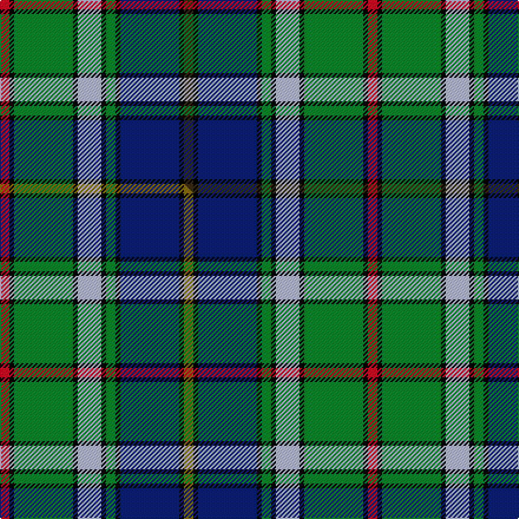

This is one **variant** — a specific cloth: this exact thread count and colourway, with its own
provenance below. It is one weaving of the [sett](/setts/dy4k2db25k2g4k2lb10k2g25k2r4/) (the scale-free proportion — the
same cloth at any scale or shade), whose colour order is pattern [GKBKGKWKGKR](/stripes/gkbkgkwkgkr/).

Part of the [Ayrton](/tartans/a/ay/ayrton/) tartan — the named design grouping this sett with its other cloths.

Sourced from tartans-authority.  It is a [11 stripe tartan](/stripes/stripes11/).

Original link [https://www.tartanregister.gov.uk/tartanDetails.aspx?ref=1584](https://www.tartanregister.gov.uk/tartanDetails.aspx?ref=1584)

Dataset <small>— provenance for this record, inherited from the source manifest</small>

<dl class="dataset-prov">
<dt>source</dt><dd><a href="/sources/tartans-authority/">Scottish Tartans Authority</a></dd>
<dt>data captured from</dt><dd><a href="https://github.com/thetartan/tartan-database/blob/master/data/tartans-authority/data.csv">https://github.com/thetartan/tartan-database/blob/master/data/tartans-authority/data.csv</a></dd>
<dt>data date</dt><dd>1979 <small>(this record)</small></dd>
<dt>licence</dt><dd><a href="https://creativecommons.org/licenses/by-nc-nd/4.0/">CC BY-NC-ND 4.0</a></dd>
</dl>

Capture chain <small>— the hands this data passed through, oldest first; each capture carries its own licence</small>

<ol class="capture-chain">
<li><a href="https://www.tartansauthority.com/">Scottish Tartans Authority</a> <small>the heritage body's archive — its tartan-ferret record browser is retired (links repaired to the SRT, above)</small></li>
<li><a href="https://github.com/thetartan/tartan-database">thetartan/tartan-database</a> <small>2016-2017</small> · <a href="https://creativecommons.org/licenses/by-nc-nd/4.0/">CC BY-NC-ND 4.0</a> <small>Levko Kravets's frozen compilation — the capture we vendored, and where its CC licence text came from</small></li>
<li>this dictionary <small>captured 2026-06-10 · commit 5bf86c7566</small> <small>each re-capture is a git commit to data/sources</small></li>
</ol>

## Register references

External register numbers recorded for this tartan.

- Scottish Tartans Authority (ITI): 1584

## Thread count
R/8 K4 G50 K4 LB20 K4 G8 K4 DB50 K4 DY/8

One full sett is **312 threads**.

## Palette
<table><thead><tr><th>Colour</th><th>Shade</th><th>OKLCh</th></tr></thead><tbody><tr><td>LB</td><td><code style="background-color:#B5BBDE;">#B5BBDE</code> <small style="color:#888">#B5BBDE</small></td><td><small style="color:#888">oklch(79.9% 0.050 277.6)</small></td></tr><tr><td>DB</td><td><code style="background-color:#082077;">#082077</code> <small style="color:#888">#082077</small></td><td><small style="color:#888">oklch(30.0% 0.149 265.1)</small></td></tr><tr><td>G</td><td><code style="background-color:#008B2A;">#008B2A</code> <small style="color:#888">#008B2A</small></td><td><small style="color:#888">oklch(55.4% 0.170 145.9)</small></td></tr><tr><td>K</td><td><code style="background-color:#000000;">#000000</code> <small style="color:#888">#000000</small></td><td><small style="color:#888">oklch(0.0% 0.000 0.0)</small></td></tr><tr><td>R</td><td><code style="background-color:#D60020;">#D60020</code> <small style="color:#888">#D60020</small></td><td><small style="color:#888">oklch(55.2% 0.224 25.5)</small></td></tr><tr><td>DY</td><td><code style="background-color:#3A2B0D;">#3A2B0D</code> <small style="color:#888">#3A2B0D</small></td><td><small style="color:#888">oklch(30.0% 0.049 82.0)</small></td></tr></tbody></table>

# Sample pattern

## Compared to the master

This cloth is one sett of its design; the master sett (the exemplar the design is anchored on) is below for comparison.

Its **ΔTartan distance** from the master is **0.03** — the same measure the nearest-tartans table ranks by (0 is identical; a re-scale of the same cloth is near 0, a recolour or a different proportion further).

<figure class="master-compare" style="margin:0">

this sett
master sett ★

<figcaption style="color:#888;font-size:smaller">One weave of this sett against the <a href="/setts/r4k2g25k2lb10k2g4k2db25k2y4/">master sett ★</a>, split on the diagonal: a shared proportion runs seamlessly across it with only the shades shifting; a different proportion breaks on it.</figcaption>
</figure>

## Nearest tartan variants

The nearest existing variants by ΔTartan distance, with this cloth at the top so the swatches line up against it.

ΔTartan

Threads

Variant

Sett

—

312

<a href="/variants/s11/dy4k2db25k2g4k2lb10k2g25k2r4~x2/">Ayrton (1979) (Personal)</a>

<a href="/ttd/edit/#slug=r4k2g25k2lb10k2g4k2db25k2y4~x2&amp;base=dy4k2db25k2g4k2lb10k2g25k2r4~x2" title="compare in the TTD">0.03</a>

312

<a href="/variants/s11/r4k2g25k2lb10k2g4k2db25k2y4~x2/">Ayrton Family Tartan</a>

<a href="/ttd/edit/#slug=r6g2r2g21k2w4k2db23y2db2y6~x2&amp;base=dy4k2db25k2g4k2lb10k2g25k2r4~x2" title="compare in the TTD">1.27</a>

264

<a href="/variants/s11/r6g2r2g21k2w4k2db23y2db2y6~x2/">Glasgow, City of Culture</a>

<a href="/ttd/edit/#slug=g9w9k2w2k2y2dg28g2db12g4~x2&amp;base=dy4k2db25k2g4k2lb10k2g25k2r4~x2" title="compare in the TTD">1.59</a>

262

<a href="/variants/s10/g9w9k2w2k2y2dg28g2db12g4~x2/">Order of Saint Lazarus</a>

<a href="/ttd/edit/#slug=db6r4db24w3k6g18y4g2y2g4~x2&amp;base=dy4k2db25k2g4k2lb10k2g25k2r4~x2" title="compare in the TTD">1.79</a>

272

<a href="/variants/s10/db6r4db24w3k6g18y4g2y2g4~x2/">Greene</a>

<a href="/ttd/edit/#slug=k3dt20db8dt4g20k2g2r2g3ly3~x2~dt1204274-db1406275&amp;base=dy4k2db25k2g4k2lb10k2g25k2r4~x2" title="compare in the TTD">1.92</a>

256

<a href="/variants/s10/k3db20dbi8db4g20k2g2r2g3ly3~x2~db1204274-dbi1406275/">Schmidt (2014)</a>

<a href="/ttd/edit/#slug=r2k1y2g3y4g3db12k1w2~x4&amp;base=dy4k2db25k2g4k2lb10k2g25k2r4~x2" title="compare in the TTD">1.93</a>

224

<a href="/variants/s9/r2k1y2g3y4g3db12k1w2~x4/">Federated Women's Institutes of</a>

<a href="/ttd/edit/#slug=lb6g13k12t3k3ly3t30k3n11ly3n5~x2&amp;base=dy4k2db25k2g4k2lb10k2g25k2r4~x2" title="compare in the TTD">1.99</a>

346

<a href="/variants/s11/lb6g13k12t3k3ly3t30k3n11ly3n5~x2/">State Seal of Kentucky (Fashion)</a>

<a href="/ttd/edit/#slug=r8g2k2ly2k2y2k2g18db2g2db29k3~x2&amp;base=dy4k2db25k2g4k2lb10k2g25k2r4~x2" title="compare in the TTD">2.02</a>

274

<a href="/variants/s12/r8g2k2ly2k2y2k2g18db2g2db29k3~x2/">Cats Winter (Fashion)</a>

<a href="/ttd/edit/#slug=k3ki20dt8ki4g20k2g2r2g3y3~x2~ki0705267-dt1204274&amp;base=dy4k2db25k2g4k2lb10k2g25k2r4~x2" title="compare in the TTD">2.12</a>

256

<a href="/variants/s10/k3db20dbi8db4g20k2g2r2g3y3~x2~db0705267-dbi1204274/">Schmidt (2014)</a>

<a href="/ttd/edit/#slug=w3db5lb2db9dp10k2dp5k2dg8g29w2~x2&amp;base=dy4k2db25k2g4k2lb10k2g25k2r4~x2" title="compare in the TTD">2.14</a>

298

<a href="/variants/s11/w3db5lb2db9dp10k2dp5k2dg8g29w2~x2/">Carnegie of Skibo (Corporate)</a>

## Neighbour map

Every grey dot is one of 13621 variants placed by the first two principal components of the ΔTartan feature space (42% of its variance). Red is this tartan; blue dots are its nearest — click one to open its page. The map is a flat projection of a many-dimensional space — [how to read it](/posts/neighbourhood-maps/).

<svg viewBox="0 0 640 380" role="img" style="max-width:100%;height:auto;border:1px solid #e0e0e0;border-radius:4px;display:block" xmlns="http://www.w3.org/2000/svg"><image href="/nn/cloud.v1.png" width="640" height="380"/><a href="/variants/s11/r4k2g25k2lb10k2g4k2db25k2y4~x2/"><circle cx="115.7" cy="116.3" r="4" fill="#3465a4"><title>Ayrton Family Tartan</title></circle></a><a href="/variants/s11/r6g2r2g21k2w4k2db23y2db2y6~x2/"><circle cx="121.2" cy="122.8" r="4" fill="#3465a4"><title>Glasgow, City of Culture</title></circle></a><a href="/variants/s10/g9w9k2w2k2y2dg28g2db12g4~x2/"><circle cx="125.7" cy="121.8" r="4" fill="#3465a4"><title>Order of Saint Lazarus</title></circle></a><a href="/variants/s10/db6r4db24w3k6g18y4g2y2g4~x2/"><circle cx="148.9" cy="136.2" r="4" fill="#3465a4"><title>Greene</title></circle></a><a href="/variants/s10/k3db20dbi8db4g20k2g2r2g3ly3~x2~db1204274-dbi1406275/"><circle cx="146.3" cy="144.2" r="4" fill="#3465a4"><title>Schmidt (2014)</title></circle></a><a href="/variants/s9/r2k1y2g3y4g3db12k1w2~x4/"><circle cx="130.4" cy="137.9" r="4" fill="#3465a4"><title>Federated Women's Institutes of</title></circle></a><a href="/variants/s11/lb6g13k12t3k3ly3t30k3n11ly3n5~x2/"><circle cx="98.2" cy="145.9" r="4" fill="#3465a4"><title>State Seal of Kentucky (Fashion)</title></circle></a><a href="/variants/s12/r8g2k2ly2k2y2k2g18db2g2db29k3~x2/"><circle cx="167.4" cy="94.9" r="4" fill="#3465a4"><title>Cats Winter (Fashion)</title></circle></a><a href="/variants/s10/k3db20dbi8db4g20k2g2r2g3y3~x2~db0705267-dbi1204274/"><circle cx="140.0" cy="142.6" r="4" fill="#3465a4"><title>Schmidt (2014)</title></circle></a><a href="/variants/s11/w3db5lb2db9dp10k2dp5k2dg8g29w2~x2/"><circle cx="110.7" cy="106.7" r="4" fill="#3465a4"><title>Carnegie of Skibo (Corporate)</title></circle></a><circle cx="115.9" cy="116.2" r="5" fill="#c00000"/><text x="320" y="376" text-anchor="middle" font-size="11" fill="#999">ground</text><text x="11" y="190" text-anchor="middle" font-size="11" fill="#999" transform="rotate(-90 11 190)">complexity</text></svg>

ID: /variants/s11/dy4k2db25k2g4k2lb10k2g25k2r4~x2/
