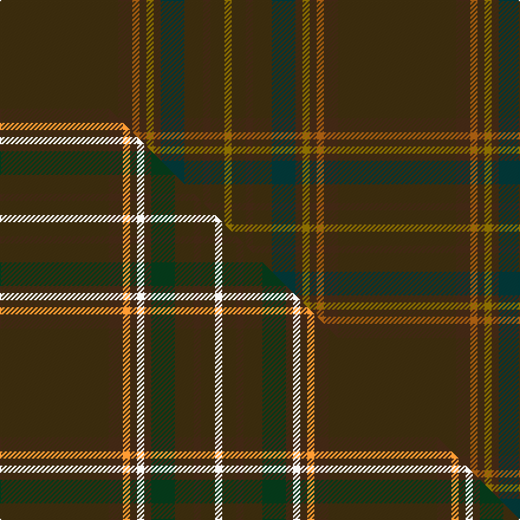

This page is one **sett** — a single exact thread-count. It belongs to the [tartan](/setts/dy50do6o3do3y3do3dt10dy8do3dy6y3/)
(the same proportion at any scale), whose colour order is pattern [GBRBGBBGBGG](/stripes/gbrbgbbgbgg/).

Part of the [Williams](/tartans/williams/) tartan — the named design grouping this sett with its other cloths.

Sourced from tartans-authority.  It is a [11 stripe tartan](/stripes/stripes11/).

Original link http://www.tartansauthority.com/tartan-ferret/display/4245/

## Register references

External register numbers recorded for this tartan.

- Scottish Tartans Authority (ITI): 4245

## Thread count
DY/100 DO12 O6 DO6 Y6 DO6 DT20 DY16 DO6 DY12 Y/6

One full sett is **286 threads**.

## Palette
<table><thead><tr><th>Colour</th><th>Shade</th><th>OKLCh</th></tr></thead><tbody><tr><td>DT</td><td><code style="background-color:#023535;">#023535</code> <small style="color:#888">#023535</small></td><td><small style="color:#888">oklch(29.8% 0.050 194.8)</small></td></tr><tr><td>DO</td><td><code style="background-color:#412714;">#412714</code> <small style="color:#888">#412714</small></td><td><small style="color:#888">oklch(30.1% 0.050 55.7)</small></td></tr><tr><td>Y</td><td><code style="background-color:#8B6E00;">#8B6E00</code> <small style="color:#888">#8B6E00</small></td><td><small style="color:#888">oklch(55.1% 0.113 90.4)</small></td></tr><tr><td>O</td><td><code style="background-color:#A65C11;">#A65C11</code> <small style="color:#888">#A65C11</small></td><td><small style="color:#888">oklch(55.0% 0.125 58.3)</small></td></tr><tr><td>DY</td><td><code style="background-color:#3A2B0D;">#3A2B0D</code> <small style="color:#888">#3A2B0D</small></td><td><small style="color:#888">oklch(30.0% 0.049 82.0)</small></td></tr></tbody></table>

# Sample pattern

## Compared to the master

This cloth is one sett of its design; the master sett (the exemplar the design is anchored on) is below for comparison.

Its **ΔTartan distance** from the master is **7.10** — the same measure the nearest-tartans table ranks by (0 is identical; a re-scale of the same cloth is near 0, a recolour or a different proportion further).

<figure class="master-compare" style="margin:0">

this sett
master sett ★

<figcaption style="color:#888;font-size:smaller">One weave of this sett against the <a href="/setts/dy46do6lo3do3w3do3dg10dy8do3dy6w3/">master sett ★</a>, split on the diagonal: a shared proportion runs seamlessly across it with only the shades shifting; a different proportion breaks on it.</figcaption>
</figure>

## Nearest tartan variants

The nearest existing variants by ΔTartan distance, with this cloth at the top so the swatches line up against it.

ΔTartan

Threads

Variant

Sett

—

286

<a href="/variants/s11/dy50do6o3do3y3do3dt10dy8do3dy6y3~x2/">Williams (Fashion)</a>

<a href="/ttd/edit/#slug=db4dy30do2dy2do14y2do2y1do6g3~x2&amp;base=dy50do6o3do3y3do3dt10dy8do3dy6y3~x2" title="compare in the TTD">2.89</a>

250

<a href="/variants/s10/db4dy30do2dy2do14y2do2y1do6g3~x2/">Hickory</a>

## Neighbour map

Every grey dot is one of 13620 variants placed by the first two principal components of the ΔTartan feature space (42% of its variance). Red is this tartan; blue dots are its nearest — click one to open its page.

<svg viewBox="0 0 640 380" role="img" style="max-width:100%;height:auto;border:1px solid #e0e0e0;border-radius:4px;display:block" xmlns="http://www.w3.org/2000/svg"><image href="/nn/cloud.v1.png" width="640" height="380"/><a href="/variants/s10/db4dy30do2dy2do14y2do2y1do6g3~x2/"><circle cx="573.5" cy="216.6" r="4" fill="#3465a4"><title>Hickory</title></circle></a><circle cx="626.0" cy="218.2" r="5" fill="#c00000"/><text x="320" y="376" text-anchor="middle" font-size="11" fill="#999">ground</text><text x="11" y="190" text-anchor="middle" font-size="11" fill="#999" transform="rotate(-90 11 190)">complexity</text></svg>

ID: /variants/s11/dy50do6o3do3y3do3dt10dy8do3dy6y3~x2/
