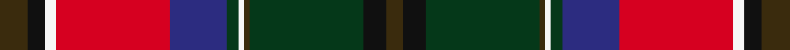
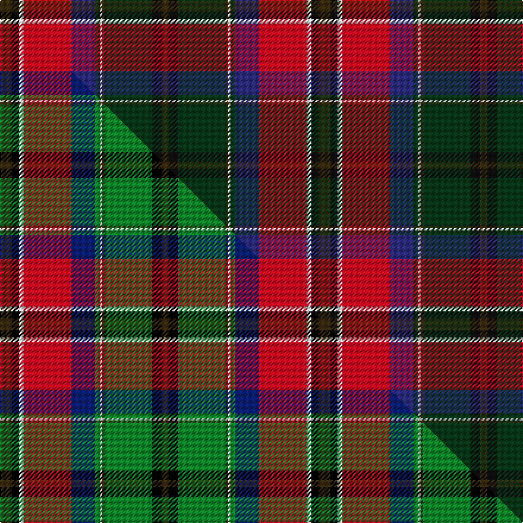

This is one **variant** — a specific cloth: this exact thread count and colourway, with its own
provenance below. It is one weaving of the [sett](/tartans/m/ma/macculloch/) (the scale-free proportion — the
same cloth at any scale or shade), whose colour order is pattern [GKGGWGBRWKG](/stripes/gkggwgbrwkg/).

Part of the [MacCulloch](/tartans/m/ma/macculloch/) tartan — the named design grouping this sett with its other cloths.

Sourced from tartans-authority.  It is a [11 stripe tartan](/stripes/stripes11/).

Original link <code>http://www.tartansauthority.com/tartan-ferret/display/3340/</code> — retired · [Internet Archive copy](https://web.archive.org/web/*/http://www.tartansauthority.com/tartan-ferret/display/3340/*)

Dataset <small>— provenance for this record, inherited from the source manifest</small>

<dl class="dataset-prov">
<dt>source</dt><dd><a href="/sources/tartans-authority/">Scottish Tartans Authority</a></dd>
<dt>data captured from</dt><dd><a href="https://github.com/thetartan/tartan-database/blob/master/data/tartans-authority/data.csv">https://github.com/thetartan/tartan-database/blob/master/data/tartans-authority/data.csv</a></dd>
<dt>data date</dt><dd>2000 <small>(this record)</small></dd>
<dt>licence</dt><dd><a href="https://creativecommons.org/licenses/by-nc-nd/4.0/">CC BY-NC-ND 4.0</a></dd>
</dl>

Capture chain <small>— the hands this data passed through, oldest first; each capture carries its own licence</small>

<ol class="capture-chain">
<li><a href="https://www.tartansauthority.com/">Scottish Tartans Authority</a> <small>the heritage body’s archive — its tartan-ferret record browser is retired; dead record links are shown unlinked, with an Internet Archive copy (ITI numbers are not SRT references)</small></li>
<li><a href="https://github.com/thetartan/tartan-database">thetartan/tartan-database</a> <small>2016-2017</small> · <a href="https://creativecommons.org/licenses/by-nc-nd/4.0/">CC BY-NC-ND 4.0</a> <small>Levko Kravets's frozen compilation — the capture we vendored, and where its CC licence text came from</small></li>
<li>this dictionary <small>captured 2026-06-10 · commit 5bf86c7566</small> <small>each re-capture is a git commit to data/sources</small></li>
</ol>

## Register references

External register numbers recorded for this tartan.

- Scottish Tartans Authority (ITI): 3340

## Thread count
DY/10 K6 W4 R40 DB20 DG4 W2 DY2 DG40 K8 DY/6

One full sett is **268 threads**.

## Palette
<table><thead><tr><th>Colour</th><th>Shade</th><th>OKLCh</th></tr></thead><tbody><tr><td>DB</td><td><code style="background-color:#2C2C80;">#2C2C80</code> <small style="color:#888">#2C2C80</small></td><td><small style="color:#888">oklch(35.0% 0.138 276.6)</small></td></tr><tr><td>DG</td><td><code style="background-color:#053819;">#053819</code> <small style="color:#888">#053819</small></td><td><small style="color:#888">oklch(30.0% 0.075 151.3)</small></td></tr><tr><td>K</td><td><code style="background-color:#101010;">#101010</code> <small style="color:#888">#101010</small></td><td><small style="color:#888">oklch(17.3% 0.000 89.9)</small></td></tr><tr><td>W</td><td><code style="background-color:#F7F7F7;">#F7F7F7</code> <small style="color:#888">#F7F7F7</small></td><td><small style="color:#888">oklch(97.6% 0.000 89.9)</small></td></tr><tr><td>R</td><td><code style="background-color:#D60020;">#D60020</code> <small style="color:#888">#D60020</small></td><td><small style="color:#888">oklch(55.2% 0.224 25.5)</small></td></tr><tr><td>DY</td><td><code style="background-color:#3A2B0D;">#3A2B0D</code> <small style="color:#888">#3A2B0D</small></td><td><small style="color:#888">oklch(30.0% 0.049 82.0)</small></td></tr></tbody></table>

# Sample pattern

## Compared to the master

This cloth is one sett of its design; the master sett (the exemplar the design is anchored on) is below for comparison.

Its **ΔTartan distance** from the master is **0.17** — the same measure the nearest-tartans table ranks by (0 is identical; a re-scale of the same cloth is near 0, a recolour or a different proportion further).

<figure class="master-compare" style="margin:0">

this sett
master sett ★

<figcaption style="color:#888;font-size:smaller">One weave of this sett against the <a href="/setts/dy5k3w2r20db10g2w1dy1g20k4dy3/">master sett ★</a>, split on the diagonal: a shared proportion runs seamlessly across it with only the shades shifting; a different proportion breaks on it.</figcaption>
</figure>

## Nearest tartan variants

The nearest existing variants by ΔTartan distance, with this cloth at the top so the swatches line up against it.

ΔTartan

Threads

Variant

Sett

—

268

<a href="/variants/s11/dy5k3w2r20db10dg2w1dy1dg20k4dy3~x2~k0700000-db1406275/">MacCulloch (Name)</a>

<a href="/ttd/edit/#slug=dy5k3w2r20db10g2w1dy1g20k4dy3~x2&amp;base=dy5k3w2r20db10dg2w1dy1dg20k4dy3~x2~k0700000-db1406275" title="compare in the TTD">0.17</a>

268

<a href="/variants/s11/dy5k3w2r20db10g2w1dy1g20k4dy3~x2/">MacCulloch</a>

<a href="/ttd/edit/#slug=o5k3w2r20db10g2w1r1g20k4o3~x2&amp;base=dy5k3w2r20db10dg2w1dy1dg20k4dy3~x2~k0700000-db1406275" title="compare in the TTD">1.62</a>

268

<a href="/variants/s11/o5k3w2r20db10g2w1r1g20k4o3~x2/">MacCullough Family Tartan</a>

<a href="/ttd/edit/#slug=ly2k1r30db8g24o5g5dp11k1ly2~x2~ly3104101-o2503076&amp;base=dy5k3w2r20db10dg2w1dy1dg20k4dy3~x2~k0700000-db1406275" title="compare in the TTD">2.13</a>

348

<a href="/variants/s10/lyi2k1r30db8g24ly5g5dp11k1lyi2~x2~lyi3104101-ly2503076/">Guardian of Scotland, Wthd (Fashion)</a>

<a href="/ttd/edit/#slug=dr9r5dg2r4dg2r5n38k5dg2k4dg2k5dr8lb4~x2&amp;base=dy5k3w2r20db10dg2w1dy1dg20k4dy3~x2~k0700000-db1406275" title="compare in the TTD">2.33</a>

354

<a href="/variants/s14/dr9r5dg2r4dg2r5n38k5dg2k4dg2k5dr8lb4~x2/">Berwick-upon-Tweed (symmetric)</a>

<a href="/ttd/edit/#slug=dr10w1do1w2n10dr8do2k17do2dr7n19k3y1k1~x2&amp;base=dy5k3w2r20db10dg2w1dy1dg20k4dy3~x2~k0700000-db1406275" title="compare in the TTD">2.34</a>

314

<a href="/variants/s14/dr10w1do1w2n10dr8do2k17do2dr7n19k3y1k1~x2/">Scottish Wildcat</a>

<a href="/ttd/edit/#slug=g19ri3g19db7r26k3db7k3dp42k3db7k3~x2~ri2806019-r1807008&amp;base=dy5k3w2r20db10dg2w1dy1dg20k4dy3~x2~k0700000-db1406275" title="compare in the TTD">2.39</a>

524

<a href="/variants/s12/g19ri3g19db7r26k3db7k3dp42k3db7k3~x2~ri2806019-r1807008/">Tartan Spirit</a>

<a href="/ttd/edit/#slug=dr27g20k7w3dy3dr2dy3w3dy6dp6k2dr3dy4dp3~x2&amp;base=dy5k3w2r20db10dg2w1dy1dg20k4dy3~x2~k0700000-db1406275" title="compare in the TTD">2.44</a>

308

<a href="/variants/s14/dr27g20k7w3dy3dr2dy3w3dy6dp6k2dr3dy4dp3~x2/">Roman Family Tribute (Personal)</a>

<a href="/ttd/edit/#slug=dg15r25dg4k2ly1db1ly1k2dg4db12w1~x2&amp;base=dy5k3w2r20db10dg2w1dy1dg20k4dy3~x2~k0700000-db1406275" title="compare in the TTD">2.47</a>

240

<a href="/variants/s11/dg15r25dg4k2ly1db1ly1k2dg4db12w1~x2/">Livingstone - Australia (Personal)</a>

<a href="/ttd/edit/#slug=y3k2r9k1do8k1r2k1dp8k1n2k1dp16k1n12k4dp2~x2~dp1602305-n2001240&amp;base=dy5k3w2r20db10dg2w1dy1dg20k4dy3~x2~k0700000-db1406275" title="compare in the TTD">2.55</a>

286

<a href="/variants/s17/y3k2r9k1do8k1r2k1n8k1ni2k1n16k1ni12k4n2~x2~n1602305-ni2001240/">Golden Glow</a>

<a href="/ttd/edit/#slug=dr4lb2dr6k2dr6do16ly2k12n10k2n1~x2&amp;base=dy5k3w2r20db10dg2w1dy1dg20k4dy3~x2~k0700000-db1406275" title="compare in the TTD">2.56</a>

242

<a href="/variants/s11/dr4lb2dr6k2dr6do16ly2k12n10k2n1~x2/">Caledonian (WCWM)</a>

## Neighbour map

Every grey dot is one of 13657 variants placed by the first two principal components of the ΔTartan feature space (42% of its variance). Red is this tartan; blue dots are its nearest — click one to open its page. The map is a flat projection of a many-dimensional space — [how to read it](/posts/neighbourhood-maps/).

<svg viewBox="0 0 640 380" role="img" style="max-width:100%;height:auto;border:1px solid #e0e0e0;border-radius:4px;display:block" xmlns="http://www.w3.org/2000/svg"><image href="/nn/cloud.v1.png" width="640" height="380"/><a href="/variants/s11/dy5k3w2r20db10g2w1dy1g20k4dy3~x2/"><circle cx="111.4" cy="103.3" r="4" fill="#3465a4"><title>MacCulloch</title></circle></a><a href="/variants/s11/o5k3w2r20db10g2w1r1g20k4o3~x2/"><circle cx="111.7" cy="100.8" r="4" fill="#3465a4"><title>MacCullough Family Tartan</title></circle></a><a href="/variants/s10/lyi2k1r30db8g24ly5g5dp11k1lyi2~x2~lyi3104101-ly2503076/"><circle cx="150.3" cy="80.9" r="4" fill="#3465a4"><title>Guardian of Scotland, Wthd (Fashion)</title></circle></a><a href="/variants/s14/dr9r5dg2r4dg2r5n38k5dg2k4dg2k5dr8lb4~x2/"><circle cx="178.4" cy="83.7" r="4" fill="#3465a4"><title>Berwick-upon-Tweed (symmetric)</title></circle></a><a href="/variants/s14/dr10w1do1w2n10dr8do2k17do2dr7n19k3y1k1~x2/"><circle cx="145.6" cy="103.4" r="4" fill="#3465a4"><title>Scottish Wildcat</title></circle></a><a href="/variants/s12/g19ri3g19db7r26k3db7k3dp42k3db7k3~x2~ri2806019-r1807008/"><circle cx="115.9" cy="123.2" r="4" fill="#3465a4"><title>Tartan Spirit</title></circle></a><a href="/variants/s14/dr27g20k7w3dy3dr2dy3w3dy6dp6k2dr3dy4dp3~x2/"><circle cx="123.8" cy="111.1" r="4" fill="#3465a4"><title>Roman Family Tribute (Personal)</title></circle></a><a href="/variants/s11/dg15r25dg4k2ly1db1ly1k2dg4db12w1~x2/"><circle cx="182.6" cy="84.1" r="4" fill="#3465a4"><title>Livingstone - Australia (Personal)</title></circle></a><a href="/variants/s17/y3k2r9k1do8k1r2k1n8k1ni2k1n16k1ni12k4n2~x2~n1602305-ni2001240/"><circle cx="144.1" cy="106.2" r="4" fill="#3465a4"><title>Golden Glow</title></circle></a><a href="/variants/s11/dr4lb2dr6k2dr6do16ly2k12n10k2n1~x2/"><circle cx="110.1" cy="141.1" r="4" fill="#3465a4"><title>Caledonian (WCWM)</title></circle></a><circle cx="144.9" cy="111.6" r="5" fill="#c00000"/><text x="320" y="376" text-anchor="middle" font-size="11" fill="#999">ground</text><text x="11" y="190" text-anchor="middle" font-size="11" fill="#999" transform="rotate(-90 11 190)">complexity</text></svg>

ID: /variants/s11/dy5k3w2r20db10dg2w1dy1dg20k4dy3~x2~k0700000-db1406275/
