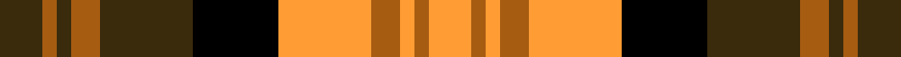

This page is one **sett** — a single exact thread-count. It belongs to the [tartan](/setts/dy6o2dy2o4dy13k12lo13o4lo2o2lo6/)
(the same proportion at any scale), whose colour order is pattern [GRGRGKYRYRY](/stripes/grgrgkyryry/).

Sourced from tartans-authority.  It is a [11 stripe tartan](/stripes/stripes11/).

Original link http://www.tartansauthority.com/tartan-ferret/display/5981/

2 attestations — the source records this cloth was collapsed from (oldest owns this page)

<ul>
<li>1999 — Glenmorangie (Corporate) (tartans-authority, <a href="http://www.tartansauthority.com/tartan-ferret/display/5981/">record</a>)  <em>STWR Notes: "Created circa 1999. Base on the MacDonald sett because the company producing the whisky was called "MacDonald and Muir" who were the original owners of Glenmorangie. The colours are those of the labelling and logo of the Glenmorangie brand name. "</em></li>
<li>01/01/2003 — Glenmorangie (register-of-tartans, <a href="https://www.tartanregister.gov.uk/tartanDetails.aspx?ref=4868">record</a>)  <em>None</em></li>
</ul>

## Register references

External register numbers recorded for this tartan.

- Scottish Register of Tartans: [4868](https://www.tartanregister.gov.uk/tartanDetails.aspx?ref=4868)
- Scottish Tartans Authority (ITI): 5981

## Thread count
DY/12 O4 DY4 O8 DY26 K24 LO26 O8 LO4 O4 LO/12

One full sett is **240 threads**.

## Palette
<table><thead><tr><th>Colour</th><th>Shade</th><th>OKLCh</th></tr></thead><tbody><tr><td>K</td><td><code style="background-color:#000000;">#000000</code> <small style="color:#888">#000000</small></td><td><small style="color:#888">oklch(0.0% 0.000 0.0)</small></td></tr><tr><td>O</td><td><code style="background-color:#A65C11;">#A65C11</code> <small style="color:#888">#A65C11</small></td><td><small style="color:#888">oklch(55.0% 0.125 58.3)</small></td></tr><tr><td>LO</td><td><code style="background-color:#FF9C34;">#FF9C34</code> <small style="color:#888">#FF9C34</small></td><td><small style="color:#888">oklch(77.9% 0.161 61.8)</small></td></tr><tr><td>DY</td><td><code style="background-color:#3A2B0D;">#3A2B0D</code> <small style="color:#888">#3A2B0D</small></td><td><small style="color:#888">oklch(30.0% 0.049 82.0)</small></td></tr></tbody></table>

# Sample pattern

ID: /variants/s11/dy6o2dy2o4dy13k12lo13o4lo2o2lo6~x2/
