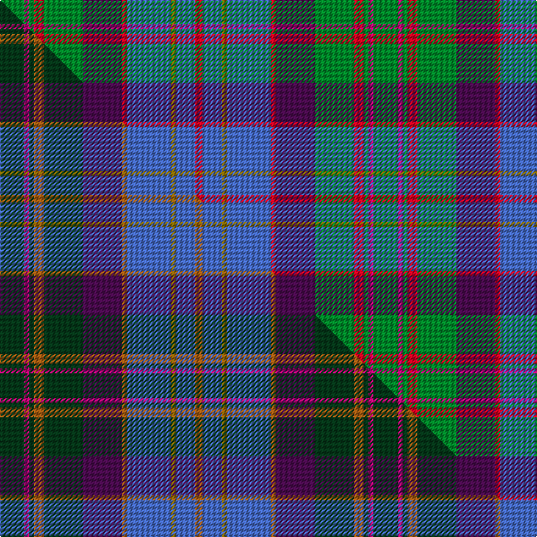

This is one **variant** — a specific cloth: this exact thread count and colourway, with its own
provenance below. It is one weaving of the [sett](/tartans/c/co/commonwealth-games-1998/) (the scale-free proportion — the
same cloth at any scale or shade), whose colour order is pattern [GRGRGBRBGBR](/stripes/grgrgbrbgbr/).

Part of the [Commonwealth Games 1998](/tartans/c/co/commonwealth-games-1998/) tartan — the named design grouping this sett with its other cloths.

Sourced from tartans-authority.  It is a [11 stripe tartan](/stripes/stripes11/).

Original link <code>http://www.tartansauthority.com/tartan-ferret/display/3080/</code> — retired · [Internet Archive copy](https://web.archive.org/web/*/http://www.tartansauthority.com/tartan-ferret/display/3080/*)

Dataset <small>— provenance for this record, inherited from the source manifest</small>

<dl class="dataset-prov">
<dt>source</dt><dd><a href="/sources/tartans-authority/">Scottish Tartans Authority</a></dd>
<dt>data captured from</dt><dd><a href="https://github.com/thetartan/tartan-database/blob/master/data/tartans-authority/data.csv">https://github.com/thetartan/tartan-database/blob/master/data/tartans-authority/data.csv</a></dd>
<dt>data date</dt><dd>pre 2002 <small>(this record)</small></dd>
<dt>licence</dt><dd><a href="https://creativecommons.org/licenses/by-nc-nd/4.0/">CC BY-NC-ND 4.0</a></dd>
</dl>

Capture chain <small>— the hands this data passed through, oldest first; each capture carries its own licence</small>

<ol class="capture-chain">
<li><a href="https://www.tartansauthority.com/">Scottish Tartans Authority</a> <small>the heritage body’s archive — its tartan-ferret record browser is retired; dead record links are shown unlinked, with an Internet Archive copy (ITI numbers are not SRT references)</small></li>
<li><a href="https://github.com/thetartan/tartan-database">thetartan/tartan-database</a> <small>2016-2017</small> · <a href="https://creativecommons.org/licenses/by-nc-nd/4.0/">CC BY-NC-ND 4.0</a> <small>Levko Kravets's frozen compilation — the capture we vendored, and where its CC licence text came from</small></li>
<li>this dictionary <small>captured 2026-06-10 · commit 5bf86c7566</small> <small>each re-capture is a git commit to data/sources</small></li>
</ol>

## Register references

External register numbers recorded for this tartan.

- Scottish Tartans Authority (ITI): 3080

## Thread count
G/20 M4 G4 R8 G32 DP32 R4 B36 Y4 B16 R/6

One full sett is **306 threads**.

## Palette
<table><thead><tr><th>Colour</th><th>Shade</th><th>OKLCh</th></tr></thead><tbody><tr><td>B</td><td><code style="background-color:#466CC8;">#466CC8</code> <small style="color:#888">#466CC8</small></td><td><small style="color:#888">oklch(55.1% 0.149 265.0)</small></td></tr><tr><td>Y</td><td><code style="background-color:#8B6E00;">#8B6E00</code> <small style="color:#888">#8B6E00</small></td><td><small style="color:#888">oklch(55.1% 0.113 90.4)</small></td></tr><tr><td>G</td><td><code style="background-color:#008B2A;">#008B2A</code> <small style="color:#888">#008B2A</small></td><td><small style="color:#888">oklch(55.4% 0.170 145.9)</small></td></tr><tr><td>DP</td><td><code style="background-color:#4B0B4F;">#4B0B4F</code> <small style="color:#888">#4B0B4F</small></td><td><small style="color:#888">oklch(30.1% 0.125 325.4)</small></td></tr><tr><td>M</td><td><code style="background-color:#CA047B;">#CA047B</code> <small style="color:#888">#CA047B</small></td><td><small style="color:#888">oklch(55.0% 0.225 353.8)</small></td></tr><tr><td>R</td><td><code style="background-color:#D60020;">#D60020</code> <small style="color:#888">#D60020</small></td><td><small style="color:#888">oklch(55.2% 0.224 25.5)</small></td></tr></tbody></table>

# Sample pattern

## Compared to the master

This cloth is one sett of its design; the master sett (the exemplar the design is anchored on) is below for comparison.

Its **ΔTartan distance** from the master is **0.92** — the same measure the nearest-tartans table ranks by (0 is identical; a re-scale of the same cloth is near 0, a recolour or a different proportion further).

<figure class="master-compare" style="margin:0">

this sett
master sett ★

<figcaption style="color:#888;font-size:smaller">One weave of this sett against the <a href="/setts/dg10m2dg2o4dg16dp16o2b18y2b8o3/">master sett ★</a>, split on the diagonal: a shared proportion runs seamlessly across it with only the shades shifting; a different proportion breaks on it.</figcaption>
</figure>

## Nearest tartan variants

The nearest existing variants by ΔTartan distance, with this cloth at the top so the swatches line up against it.

ΔTartan

Threads

Variant

Sett

—

306

<a href="/variants/s11/g10m2g2r4g16dp16r2b18y2b8r3~x2/">Commonwealth Games 1998 (Corporate)</a>

<a href="/ttd/edit/#slug=dg10m2dg2o4dg16dp16o2b18y2b8o3~x2&amp;base=g10m2g2r4g16dp16r2b18y2b8r3~x2" title="compare in the TTD">0.92</a>

306

<a href="/variants/s11/dg10m2dg2o4dg16dp16o2b18y2b8o3~x2/">Commonwealth Games 1998</a>

<a href="/ttd/edit/#slug=db9n3db2w2db9n6db3w3db3g18dg8r2~x2~db4215273-g4808117&amp;base=g10m2g2r4g16dp16r2b18y2b8r3~x2" title="compare in the TTD">1.74</a>

250

<a href="/variants/s12/db9n3db2w2db9n6db3w3db3g18dg8r2~x2~db4215273-g4808117/">Patterson, William J.M. American Personal Tartan</a>

<a href="/ttd/edit/#slug=dg18ri4dg4r6dg28dp28r4lb3y4lb13r6~ri6914021-r5221030&amp;base=g10m2g2r4g16dp16r2b18y2b8r3~x2" title="compare in the TTD">1.78</a>

212

<a href="/variants/s11/dg18ri4dg4r6dg28dp28r4lb3y4lb13r6~ri6914021-r5221030/">Unidentified (Woven sample)</a>

<a href="/ttd/edit/#slug=db9n3db2lr2db9n6db3lr3db3g18dg8r2~x2&amp;base=g10m2g2r4g16dp16r2b18y2b8r3~x2" title="compare in the TTD">2.00</a>

250

<a href="/variants/s12/db9n3db2lr2db9n6db3lr3db3g18dg8r2~x2/">Patterson, William John Magee (Personal)</a>

<a href="/ttd/edit/#slug=r12db22dg5db3y3db3dg17lb9do7r2~x2&amp;base=g10m2g2r4g16dp16r2b18y2b8r3~x2" title="compare in the TTD">2.30</a>

304

<a href="/variants/s10/r12db22dg5db3y3db3dg17lb9do7r2~x2/">Royal Dornoch Golf Club, The</a>

<a href="/ttd/edit/#slug=db11r1db2r3db1do8g11w1g11do8db8y1r1y1~x2&amp;base=g10m2g2r4g16dp16r2b18y2b8r3~x2" title="compare in the TTD">2.33</a>

248

<a href="/variants/s14/db11r1db2r3db1do8g11w1g11do8db8y1r1y1~x2/">Allen Northumbrian Family Tartan</a>

<a href="/ttd/edit/#slug=r6t24r2db12r8db12y3g8y3g8db3~x2&amp;base=g10m2g2r4g16dp16r2b18y2b8r3~x2" title="compare in the TTD">2.36</a>

338

<a href="/variants/s11/r6t24r2db12r8db12y3g8y3g8db3~x2/">South Australia (Disputed)</a>

<a href="/ttd/edit/#slug=t30r6dy16lp6g10lp14g24y4dy10lp3dy28&amp;base=g10m2g2r4g16dp16r2b18y2b8r3~x2" title="compare in the TTD">2.49</a>

244

<a href="/variants/s11/t30r6dy16lp6g10lp14g24y4dy10lp3dy28/">Greyfriars (District)</a>

<a href="/ttd/edit/#slug=lb24dp3lb3dp3lb3dp10o12dpi12g12o2n3~x2~o5111075-dpi2712327&amp;base=g10m2g2r4g16dp16r2b18y2b8r3~x2" title="compare in the TTD">2.56</a>

294

<a href="/variants/s11/lb24dp3lb3dp3lb3dp10o12dpi12g12o2n3~x2~o5111075-dpi2712327/">Isle of Skye (District)</a>

<a href="/ttd/edit/#slug=db9n3db2w2db9n6db3w3db3g18dg8r2~x2&amp;base=g10m2g2r4g16dp16r2b18y2b8r3~x2" title="compare in the TTD">2.58</a>

250

<a href="/variants/s12/db9n3db2w2db9n6db3w3db3g18dg8r2~x2/">Patterson, William J.M. (Personal)</a>

## Neighbour map

Every grey dot is one of 13662 variants placed by the first two principal components of the ΔTartan feature space (42% of its variance). Red is this tartan; blue dots are its nearest — click one to open its page. The map is a flat projection of a many-dimensional space — [how to read it](/posts/neighbourhood-maps/).

<svg viewBox="0 0 640 380" role="img" style="max-width:100%;height:auto;border:1px solid #e0e0e0;border-radius:4px;display:block" xmlns="http://www.w3.org/2000/svg"><image href="/nn/cloud.v1.png" width="640" height="380"/><a href="/variants/s11/dg10m2dg2o4dg16dp16o2b18y2b8o3~x2/"><circle cx="179.3" cy="187.7" r="4" fill="#3465a4"><title>Commonwealth Games 1998</title></circle></a><a href="/variants/s12/db9n3db2w2db9n6db3w3db3g18dg8r2~x2~db4215273-g4808117/"><circle cx="179.0" cy="184.9" r="4" fill="#3465a4"><title>Patterson, William J.M. American Personal Tartan</title></circle></a><a href="/variants/s11/dg18ri4dg4r6dg28dp28r4lb3y4lb13r6~ri6914021-r5221030/"><circle cx="175.3" cy="163.8" r="4" fill="#3465a4"><title>Unidentified (Woven sample)</title></circle></a><a href="/variants/s12/db9n3db2lr2db9n6db3lr3db3g18dg8r2~x2/"><circle cx="155.2" cy="178.8" r="4" fill="#3465a4"><title>Patterson, William John Magee (Personal)</title></circle></a><a href="/variants/s10/r12db22dg5db3y3db3dg17lb9do7r2~x2/"><circle cx="136.0" cy="172.2" r="4" fill="#3465a4"><title>Royal Dornoch Golf Club, The</title></circle></a><a href="/variants/s14/db11r1db2r3db1do8g11w1g11do8db8y1r1y1~x2/"><circle cx="150.7" cy="161.0" r="4" fill="#3465a4"><title>Allen Northumbrian Family Tartan</title></circle></a><a href="/variants/s11/r6t24r2db12r8db12y3g8y3g8db3~x2/"><circle cx="157.8" cy="194.1" r="4" fill="#3465a4"><title>South Australia (Disputed)</title></circle></a><a href="/variants/s11/t30r6dy16lp6g10lp14g24y4dy10lp3dy28/"><circle cx="139.2" cy="190.7" r="4" fill="#3465a4"><title>Greyfriars (District)</title></circle></a><a href="/variants/s11/lb24dp3lb3dp3lb3dp10o12dpi12g12o2n3~x2~o5111075-dpi2712327/"><circle cx="127.6" cy="159.0" r="4" fill="#3465a4"><title>Isle of Skye (District)</title></circle></a><a href="/variants/s12/db9n3db2w2db9n6db3w3db3g18dg8r2~x2/"><circle cx="138.1" cy="174.2" r="4" fill="#3465a4"><title>Patterson, William J.M. (Personal)</title></circle></a><circle cx="157.5" cy="182.0" r="5" fill="#c00000"/><text x="320" y="376" text-anchor="middle" font-size="11" fill="#999">ground</text><text x="11" y="190" text-anchor="middle" font-size="11" fill="#999" transform="rotate(-90 11 190)">complexity</text></svg>

ID: /variants/s11/g10m2g2r4g16dp16r2b18y2b8r3~x2/
